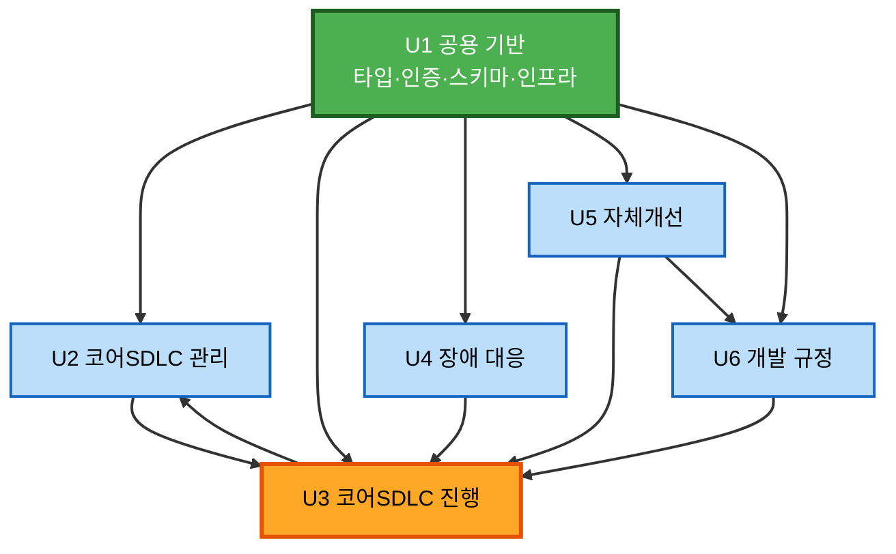
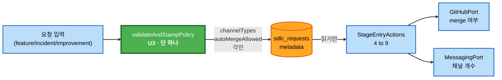

# 컴포넌트 의존 관계 — AIways-On

> **AD-6에 따라** 경계별 규약을 여기에 명문화한다. 타입으로 표현되지 않는 규약
> (호출 순서, 멱등성 책임, 금지 사항)은 코드 리뷰 시 이 문서와 대조한다.

---

## 1. 유닛 의존 그래프 — 순환 없음 (S-1 해소 확인)



### 텍스트 대안

```
U1 (공용) -> U2, U3, U4, U5, U6      모두 U1에 의존 (차단 유닛)
U2 -> U3   RequestIntake -> SdlcRequestFactory, PodOrchestrator
U3 -> U2   StageEntryActions -> GitHubPort (인터페이스, 구현은 U2)
U4 -> U3   IncidentPromotion -> SdlcRequestFactory
U5 -> U3   FindingPromotion -> SdlcRequestFactory
U5 -> U6   FindingPromotion -> MemoryRegistry
U6 -> U3   MemoryMcpServer <- PodOrchestrator 가 주입 (실제 방향은 U3 -> ConfigMap)
```

### ⚠️ U2 ↔ U3 양방향은 순환인가? — **아니다** (AD-1)

```
[해소 전]  U2.RequestIntake ────────> U3.SdlcRequestFactory     (구현 의존)
           U3.StageEntryActions ────> U2.GitHubAdapter          (구현 의존)  ← 순환

[해소 후]  U2.RequestIntake ────────> U3.SdlcRequestFactory     (구현 의존)
           U3.StageEntryActions ────> U1.GitHubPort             (타입 의존)
                                          ^
                                          | implements
                                      U2.GitHubAdapter
```

**컴파일 시점 의존**은 `U3 → U1`뿐이다. `U2.GitHubAdapter`는 런타임에 주입된다.
따라서 **U3 담당자는 U2의 구현을 기다리지 않고 착수할 수 있다.**

---

## 2. 컴포넌트 의존 매트릭스

행이 열을 호출한다. `T` = 타입(인터페이스)만 의존, `I` = 구현 의존.

| 호출자 \ 피호출 | AuthGuard | SharedTypes | SdlcReqFactory | StateMachine | GitHubPort | MessagingPort | PodPort | MemoryRegistry |
|---|:---:|:---:|:---:|:---:|:---:|:---:|:---:|:---:|
| **C-2.1** RequestIntake | I | T | **I** | | | | I | |
| **C-2.2** RequestQuery | I | T | | I | | | | |
| **C-2.3** GitHubAdapter | I | T | | | *impl* | | | |
| **C-2.5** ImageProxy | I | T | | | | | | |
| **C-3.1** SdlcReqFactory | | T | *self* | | | | | |
| **C-3.2** StateMachine | | T | | *self* | | | | |
| **C-3.3** StageEntryActions | | T | | I | **T** | **T** | **T** | |
| **C-3.4** Compensation | | T | | I | T | T | T | |
| **C-3.5** PodOrchestrator | I | T | | | | | *impl* | |
| **C-3.6** SlackAdapter | | T | | | | *impl* | | |
| **C-4.2** IncidentPromotion | I | T | **I** | | | | | |
| **C-5.3** FindingPromotion | I | T | **I** | | | | | **I** |
| **C-6.2** MemoryMcpServer | I | T | | | | | | I |
| **C-6.3** MemoryTokenAdmin | I | T | | | | | | |

**읽는 법**
- **T(타입 의존)만 있는 칸**이 병렬 착수를 가능하게 한다 — C-3.3이 대표적
- `SdlcRequestFactory`를 **I**로 호출하는 셋(C-2.1·C-4.2·C-5.3)이 AD-3의 3분기 통합 지점
- `AuthGuard`는 거의 모든 컴포넌트가 의존 → U1이 소유해야 하는 이유 (AD-2)

---

## 3. 경계 규약 (AD-6) — 리뷰 시 대조할 것

> Q6=C(코드 리뷰 규약)를 선택했으므로, **타입으로 표현되지 않는 규약**을 아래에 명문화한다.
> 경계 파일을 수정하는 PR은 이 표의 해당 항목을 만족하는지 리뷰에서 확인한다.

### B-1 · U2 → U3 : SR 접수
| 항목 | 규약 |
|------|------|
| **소유자** | C-3.1 인터페이스 = U3 / 호출 = U2 |
| 호출 순서 | `validateAndStampPolicy()` → `createSdlcRequest()` → `provision()` |
| 멱등 책임 | **호출자(U2)** 가 dedupKey를 생성해 전달. Factory는 중복 시 기존 SR 반환 |
| 금지 | Factory를 우회한 직접 INSERT |
| 실패 처리 | 프로비저닝 실패 시 대기 상태로 두지 않고 즉시 보상 (`03-state-machine.md` §1.2) |

### B-2 · U3 → U2 : PR 생성·머지
| 항목 | 규약 |
|------|------|
| **소유자** | `GitHubPort` 인터페이스 = **U1** / 구현 = U2 |
| 호출 방식 | **인터페이스 타입으로만** 호출. `GitHubAdapter`를 직접 import 금지 |
| 멱등 책임 | **피호출자(U2)** — `ensure*` 접두 메서드가 멱등을 보장 |
| 자동머지 판정 | **U3는 `metadata.autoMergeAllowed`를 읽기만.** 프로파일 재판정 금지 (AD-3) |
| 특수 케이스 | commit 이력 없으면 `ensurePullRequest`가 `null` 반환 → U3는 Issue close + branch 삭제로 분기 |

### B-3 · U2 ↔ U3 : 상태·substage 조회 (중복 계약 통합)
| 항목 | 규약 |
|------|------|
| **소유자** | **U3 단독** (US-U2-03과 US-U3-06은 같은 계약) |
| 제공 | `StateMachine.getSubStage()` / `setSubStage()` / `getTransitions()` |
| 소비 | U2의 RequestQuery는 **읽기 전용**. `setSubStage` 호출 금지 |
| 권한 | 조회 시 `requireOwnership` 통과 필수 (NFR-12) |

### B-4 · U2 ↔ U3 : 목업 이미지
| 항목 | 규약 |
|------|------|
| **소유자** | U2 (ImageProxy) |
| 업로드 주체 | Pod 내 Claude Code가 curl multipart로 직접 호출 |
| 인증 | 업로드=`requireMasterKey` / 서빙=`verifyImageToken` |
| 금지 | 인증 없는 이미지 서빙 |

### B-5 · U1 ↔ U5 : 스캔 트리거 (중복 계약 통합)
| 항목 | 규약 |
|------|------|
| **소유자** | **U5 단독** (엔드포인트 정의). U1은 CronJob에서 호출만 |
| 경로 | `POST /api/internal/sdlc/improvement-scan` |
| 인증 | `requireMasterKey` |
| fail-closed | `SDLC_IMPROVEMENT_ENABLED=false`면 접수 자체 거부 |

### B-6 · U5 → U6 : finding → 규정 승격
| 항목 | 규약 |
|------|------|
| **소유자** | U6 (`MemoryRegistry.createRule`) |
| 호출 시점 | **가장 늦게 필요한 경계.** 양쪽이 각자 완성 후 마지막에 연결 가능 |
| 권한 | 승격은 `requireAdmin` |
| 멱등 | 이미 승격된 finding 재승격 시 중복 생성 금지 |

### B-7 · U1 + U3 + U6 : MCP 주입 (3자, AD-5)
| 항목 | 규약 |
|------|------|
| **합의 지점** | ConfigMap `sdlc-endpoints` 의 키 `memoryMcpUrl` **하나** |
| U1 책임 | ConfigMap 정의 + MCP Service 배포 |
| U3 책임 | Pod spec에서 그 키를 참조해 `mcp_servers` 주입 |
| U6 책임 | 해당 Service DNS로 :58002 서빙 |
| 실패 허용 | **MCP 미응답 시에도 Pod 실행은 실패하지 않는다** (보조 기능, US-U6-07) |

---

## 4. 통신 패턴

| 패턴 | 사용처 | 근거 |
|------|--------|------|
| **동기 함수 호출** | Portal 내부 컴포넌트 간 (SVC-1 안) | 같은 프로세스 |
| **HTTP (인증 필요)** | Portal ↔ Pod Runner, Portal ↔ n8n, Gateway → Portal | 서비스 경계 |
| **Webhook (비동기)** | Pod → n8n (`run.completed`/`run.failed`), CronJob → Portal | 장시간 작업 |
| **WebSocket (장수명)** | Slack → SlackGateway (Socket Mode) | **SVC-4에만 허용** |
| **Port/Adapter (DI)** | StageEntryActions → GitHubPort·MessagingPort·PodPort | AD-1, NFR-25 |
| **ConfigMap 참조** | U1 → U3 → U6 (MCP 주소) | AD-5 |

### 왜 Socket Mode를 별도 서비스로 뺐는가

```
[금지] Portal(replicas 2+) 안에 Socket Mode
       -> replica 수만큼 중복 수신 -> 같은 피드백이 2번 처리됨

[채택] SlackGateway(replicas 1) 전용 Pod
       -> 단일 수신 -> HTTP로 Portal에 릴레이 -> Portal은 stateless 유지
```

---

## 5. 데이터 흐름 — AD-3 정책 각인의 전파



### 텍스트 대안

```
요청 입력 (3종 프로파일)
    |
    v
validateAndStampPolicy()          <- U3 소유, 시스템에 단 하나
    |  입력 검증 + 정책 결정
    v
sdlc_requests.metadata            <- channelTypes, autoMergeAllowed 각인
    |
    | (읽기만, 재판정 없음)
    v
StageEntryActions (4->9)
    +-> GitHubPort   : autoMergeAllowed 값으로 merge 여부 결정
    +-> MessagingPort: channelTypes 값으로 채널 생성 개수 결정
```

**이 흐름이 보장하는 것**: incident 자동머지 금지 규칙이 U3 코드의 조건문이 아니라
**데이터에 각인된 값**이므로, U4 담당자가 그 조항의 존재를 몰라도 규칙이 지켜진다.

---

## 6. 착수 순서에 미치는 영향

```
Day 1 오전   U1: SharedTypes -> SchemaRegistry -> AuthGuard -> 스캐폴딩
              (여기에 GitHubPort/MessagingPort/PodPort 인터페이스 선언 포함)
                        |
                        v  차단 해제
Day 1 오후   U2 | U3 | U4 | U5 | U6  병렬
              U3는 Port 인터페이스만 있으면 StageEntryActions 착수 가능
              (U2의 GitHubAdapter 구현 완료를 기다리지 않음)
                        |
Day 2        경계 연결 -> 통합 -> Build and Test
```

| 시점 | 필요한 것 |
|------|----------|
| U3 착수 | `SharedTypes`의 Port 인터페이스 선언만 (구현 불필요) |
| U2·U3 통합 | `GitHubAdapter`가 `GitHubPort`를 implements 하는지 typecheck |
| U4·U5 착수 | `SdlcRequestFactory` 시그니처 확정 (구현은 진행 중이어도 됨) |
| B-6 연결 | 가장 늦어도 됨 — U5·U6 각자 완성 후 마지막에 |
