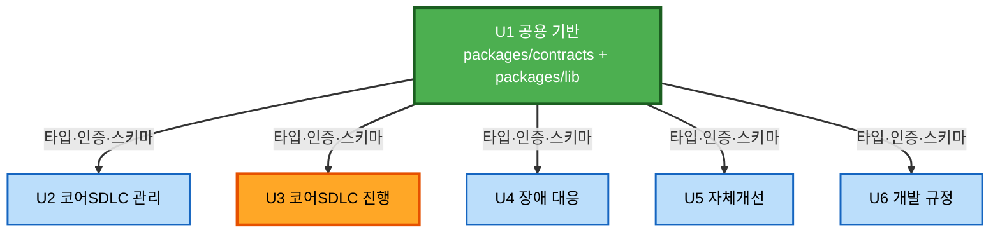

# 유닛 의존 매트릭스 — AIways-On

> **단계**: INCEPTION / Units Generation — Part 2
> **핵심**: 의존을 **컴파일 타임**과 **통합 시점** 두 층으로 나눠 본다. 착수를 막는 것은
> 컴파일 타임 의존뿐이며, AD-1·UOW-6 적용 후 그 그래프는 **U1을 유일한 선행으로 갖는 DAG**다.

---

## 1. 두 층으로 나눠 보는 이유

`component-dependency.md`는 U2↔U3 양방향 화살표를 보여준다. 그것을 그대로 유닛 착수 순서로
읽으면 두 유닛이 서로를 기다리는 것처럼 보인다. 실제로는 그렇지 않다.

```
[컴파일 타임]  코드가 import 하는 것 — 이것이 없으면 빌드가 안 되고 착수가 불가능
[통합 시점]    런타임에 주입되는 것 — 인터페이스만 있으면 stub으로 대체 가능
```

AD-1(Port 인터페이스를 U1으로)과 UOW-6(Factory 시그니처를 U1으로)이 한 일은
**모든 유닛 간 구현 의존을 통합 시점으로 밀어낸 것**이다.

---

## 2. 컴파일 타임 의존 — 착수를 막는 그래프



### 텍스트 대안

```
U1 ──> U2, U3, U4, U5, U6      (5개 간선. 방향은 U1에서만 나감)
U2, U3, U4, U5, U6 사이        간선 없음

위상 정렬:  [U1] → [U2, U3, U4, U5, U6]   (2계층, 순환 0)
```

**팀 제약 충족**: `aidlc-state.md`가 요구한 "공용 유닛이 유일한 공통 선행인 의존 그래프"가
문자 그대로 성립한다. U1 인터페이스 PR 머지 후 **5명이 서로를 전혀 기다리지 않는다.**

---

## 3. 통합 시점 의존 — 나중에 연결되는 것

```
U2.RequestIntake        ──> U3.SdlcRequestFactory (구현)     B-1
U2.RequestIntake        ──> U3.PodOrchestrator    (구현)     B-1
U3.StageEntryActions    ──> U2.GitHubAdapter      (구현)     B-2
U2.RequestQuery         ──> U3.StateMachine       (구현)     B-3
U2.ImageProxy           <── Pod 내 Claude Code (curl)        B-4
U1.CronJob              ──> U5.ImprovementScanTrigger        B-5
U5.FindingPromotion     ──> U3.SdlcRequestFactory (구현)     B-1
U5.FindingPromotion     ──> U6.MemoryRegistry     (구현)     B-6
U4.IncidentPromotion    ──> U3.SdlcRequestFactory (구현)     B-1
U1.ConfigMap ─ U3.Pod spec ─ U6.MCP Service                  B-7 (3자)
```

> 이 층에 **U2↔U3 양방향이 남아 있지만 순환이 아니다.** 양쪽 모두 `packages/contracts`의
> 인터페이스에 대고 코딩하고, 실제 객체는 런타임에 주입되기 때문이다.

---

## 4. 유닛 의존 매트릭스

행이 열에 의존한다. **C** = 컴파일 타임(착수 차단) · **R** = 런타임 주입(통합 시점) · **–** = 없음

| 의존 주체 \ 대상 | U1 | U2 | U3 | U4 | U5 | U6 |
|---|:--:|:--:|:--:|:--:|:--:|:--:|
| **U1** | — | – | – | – | R¹ | – |
| **U2** | **C** | — | R | – | – | – |
| **U3** | **C** | R | — | – | – | – |
| **U4** | **C** | – | R | — | – | – |
| **U5** | **C** | – | R | – | — | R |
| **U6** | **C** | – | R² | – | – | — |

¹ U1의 CronJob이 U5 엔드포인트를 **호출**한다. 엔드포인트 정의 소유는 U5(B-5)
² 코드 의존 아님 — ConfigMap 키를 통한 간접 연결(B-7). U6는 서빙만 한다

**C 열이 U1 하나뿐**이라는 것이 이 표의 결론이다.

---

## 5. 인터페이스 동결 목록 — UOW-3의 PR 내용

**이 PR이 머지되는 순간 5유닛이 동시에 착수한다.** 따라서 내용을 여기서 확정한다.
구현은 들어가지 않는다(시그니처와 타입만). 스캐폴딩은 예외로 실제 파일이 들어간다.

### PR #1 — `feat(u1): freeze shared contracts`

| # | 파일 | 내용 | 이것을 기다리는 유닛 |
|---|------|------|-------------------|
| 1 | `packages/contracts/stage.ts` | `Stage`(1·2·3·4·9만) · `ChannelType` · `PipelineProfile` | **전부** |
| 2 | `packages/contracts/dto.ts` | 요청·응답 DTO | 전부 |
| 3 | `packages/contracts/ports.ts` | `GitHubPort` · `MessagingPort` · `PodPort` | U2(구현) · U3(소비·구현) |
| 4 | `packages/contracts/factory.ts` | `validateAndStampPolicy()` · `createSdlcRequest()` 시그니처 | **U2 · U4 · U5** (UOW-6) |
| 5 | `packages/contracts/state.ts` | `getSubStage` · `setSubStage` · `getTransitions` 시그니처 (B-3) | U2 |
| 6 | `packages/lib/auth/` | `AuthGuard` 7함수 시그니처 (`requireUser`·`requireAdmin`·`requireOwnership`·`requireMasterKey`·`requirePodToken`·`requireMemoryToken`·`signImageUrl`/`verifyImageToken`) | 전부 |
| 7 | `packages/lib/db/schema/*` | 6파일 + 배럴. 공유 테이블(`users`·`sessions`·`audit_events`·`secret_refs`·`sdlc_requests`) 확정 | 전부 |
| 8 | `packages/lib/ui/` | 디자인 토큰 (다크·라이트) | UI를 가진 U2·U4·U5·U6 |
| 9 | 스캐폴딩 | `pnpm-workspace.yaml` · tsconfig base · `CODEOWNERS` · `.github/workflows/` | 전부 |

**동결의 의미**: 머지 후 이 파일들을 바꾸려면 U1 승인이 필요하고, 변경은 5유닛 전체에 영향을
주므로 PR 설명에 영향 범위를 적는다. 동결은 "수정 금지"가 아니라 "**단독 수정 금지**"다.

### 동결에서 제외되는 것 (구현이므로 이 PR에 없음)

`AuthGuard` 실제 검증 로직 · Drizzle 마이그레이션 실행 · 디자인 토큰의 컴포넌트 적용 ·
Helm chart · `GitHubAdapter`·`SlackAdapter`·`PodOrchestrator` 구현체

---

## 6. 테스트 더블 목록 — UOW-4

각 유닛이 착수 시점에 손으로 만들 최소 stub이다. **고정값을 반환하는 수준**이면 충분하며,
별도의 계약 테스트 스위트는 만들지 않는다(CQ1=A).

| 유닛 | 필요한 stub | 대체 대상 | 최소 동작 | 교체 시점 |
|:----:|------------|----------|----------|----------|
| **U2** | `SdlcRequestFactoryStub` | C-3.1 | 고정 SR 객체 반환 (`metadata`에 `channelTypes`·`autoMergeAllowed` 포함) | U3 T1 완료 후 |
| | `PodPortStub` | C-3.5 | `provision()` 성공 · 고정 Pod 이름 | U3 T2 완료 후 |
| | `StateMachineStub` | C-3.2 | 고정 stage·substage 반환 | U3 T1 완료 후 |
| **U3** | `GitHubPortStub` | C-2.3 | `ensureIssue`·`ensurePullRequest` 고정 URL 반환, **`null` 반환 경로 1건 포함** | U2 완료 후 |
| | `MessagingPortStub` | C-3.6 (T3) | 채널 생성 고정 ID — T1·T2가 T3를 기다리지 않게 함 | U3 T3 완료 후 |
| **U4** | `SdlcRequestFactoryStub` | C-3.1 | `profile='incident'` 호출 시 `autoMergeAllowed=false`가 각인된 객체 반환 | U3 T1 완료 후 |
| **U5** | `SdlcRequestFactoryStub` | C-3.1 | `profile='improvement'` 각인 객체 | U3 T1 완료 후 |
| | `MemoryRegistryStub` | C-6.1 | `createRule()` 성공 + 고정 ID | U6 완료 후 (B-6, 가장 늦어도 됨) |
| **U6** | **없음** | — | 다른 유닛 구현에 의존하지 않음 | — |
| **U1** | **없음** | — | 선행 유닛 | — |

> **stub에 반드시 넣어야 하는 두 가지**
> ① `GitHubPortStub`의 `null` 반환 경로 — commit 이력이 없으면 PR을 만들지 않는다는 B-2 특수
> 케이스는 stub이 그 경로를 재현하지 않으면 통합 때까지 아무도 구현하지 않는다.
> ② `SdlcRequestFactoryStub`의 **정책 각인 필드** — 각인된 `metadata`를 반환하지 않으면 U4가
> 자기도 모르게 정책을 재판정하는 코드를 쓰게 되어 AD-3이 무력화된다.

---

## 7. 착수 타임라인

```
[선행]      D1 · U1 인터페이스 PR #1
             packages/contracts + packages/lib + 스캐폴딩
             └─ 머지 = 착수 신호
                    │
      ┌─────────────┼─────────────┬─────────────┬─────────────┐
      ▼             ▼             ▼             ▼             ▼
[병렬] D2·U2     D3·U3 T1      D4·U4        D5·U5        D6·U6
       (stub 3종) (최우선)      (stub 1종)   (stub 2종)   (stub 없음)
                      │
                      ▼  T1 완료 = U2·U4·U5의 Factory stub 교체 가능
                   D3·U3 T2  (Pod·Runner)
                      │
                      ▼  n8n 배포 후 (D-18)
                   D3·U3 T3  (Slack·n8n)
                    │
[통합]        경계 연결 B-1 → B-2 → B-3 → B-4 → B-5 → B-7 → B-6
                    │
[마무리]      Build and Test
```

### 경계 연결 순서 — 이른 것부터

| 순서 | 경계 | 연결 조건 | 늦어질 때의 영향 |
|:---:|------|----------|----------------|
| 1 | **B-1** U2·U4·U5 → U3 Factory | U3 T1 완료 | **3유닛이 동시에 대기** — 가장 이른 임계점 |
| 2 | **B-2** U3 → U2 GitHubPort | U2 GitHubAdapter 완료 | `4→9` 전이 검증 불가 |
| 3 | **B-3** U2 → U3 StateMachine | U3 T1 완료 | SR 상세 화면이 고정값 표시 |
| 4 | **B-4** U2 ImageProxy ← Pod | U3 T2 완료 | 목업 이미지 확인 불가 (배치2) |
| 5 | **B-5** U1 CronJob → U5 | U5 엔드포인트 완료 | 주기 스캔 미동작 (배치2 성격) |
| 6 | **B-7** U1·U3·U6 MCP 3자 | ConfigMap + Pod spec + MCP 서빙 | **Pod 실행은 실패하지 않음**(설계상 보조 기능) |
| 7 | **B-6** U5 → U6 규정 승격 | 양쪽 완성 후 | 가장 늦어도 됨 |

---

## 8. 검증

| 항목 | 방법 | 결과 |
|------|------|------|
| 순환 의존 | 컴파일 타임 그래프 위상 정렬 | **0건** — 2계층 DAG ✅ |
| 공통 선행 | U1을 제거했을 때 나머지 5유닛 간 간선 | **0개** — U1이 유일한 공통 선행 ✅ |
| Mermaid 문법 | 노드·간선·style 참조 검사 | 6노드 · 5간선 · dangling 0 · 미스타일 0 ✅ |
| 경계 커버리지 | B-1~B-7 ↔ §3 통합 의존 목록 | **7/7** ✅ |
| stub 커버리지 | §3의 런타임 의존 ↔ §6 stub 목록 | 코드 의존 전건 대응 ✅ (B-4는 외부 curl, B-7은 ConfigMap이라 stub 불필요) |
