# 실행 계획 (Execution Plan) — AIways-On

**작성**: 2026-09-08 | **단계**: INCEPTION / Workflow Planning

---

## 1. 상세 분석 요약

### 1.1 변경 영향 평가

| 영역 | 해당 | 내용 |
|------|:----:|------|
| **사용자 대면 변경** | ✅ | 신규 라우트 18개, 페르소나 4종, 권한 매트릭스 |
| **구조적 변경** | ✅ | 6개 배포 단위 신규 (Portal · Pod Runner · MCP · Slack Gateway · n8n · K8s) |
| **데이터 모델 변경** | ✅ | 신규 스키마 전체 — 인증 4 + 코어·메시징·GitHub·Pod·Repo셋업·공통 |
| **API 변경** | ✅ | Portal `/api/v1/sdlc/*` 약 30개 + Pod Runner 11개 + MCP |
| **NFR 영향** | ✅ | OWASP 15규칙 blocking, RTO 4h/RPO 24h, Stateless, 멱등성, TDD |

### 1.2 리스크 평가

- **리스크 수준**: **High**
- **롤백 복잡도**: Easy — Greenfield이므로 되돌릴 기존 시스템이 없음. `rollout undo`(D-27)
- **테스트 복잡도**: Complex — 분산 상태머신 + 비동기 콜백 + AI 에이전트 비결정성

**High 판정 근거**
1. **일정 압박** — 12 person-day로 명세 15,033줄 (D-02·D-04, R-01)
2. **U2 ↔ U3 순환 의존** — §1.3 참조. 병렬 개발에서 교착 가능
3. **서버간 인증의 소유자 부재** — §1.3 참조. OWASP 전체 강제(D-21) 하에서 보안 결함 위험
4. **U3 과부하** — 스토리 18건(32%), 명세 27% (R-03)

### 1.3 Application Design으로 넘길 미해결 구조 문제

> User Stories 검증 과정에서 식별된 항목이다. **Application Design 단계의 입력**으로 사용한다.
> (사용자 질의 응답 시점에는 문서화하지 않았으나, 실행 계획이 이를 반영해야 하므로 여기에 기록한다.)

| # | 문제 | 근거 | 해소 방안 후보 |
|---|------|------|--------------|
| **S-1** | **U2 ↔ U3 순환 의존** | `/intake`(U2) → 프로비저닝(U3), 그리고 `4→9` 진입작업(U3) → `_finalizeRepositoriesForRequest` → GitHub PR 생성(U2). `03-state-machine.md` §4.4 확인 | GitHub 어댑터 **인터페이스**를 U1로 승격, 구현은 U2 유지 |
| **S-2** | **서버간 인증 소유자 없음** | `SDLC_MASTER_KEY` · `POD_AUTH_TOKEN` · 이미지 서빙 토큰 · `sdlcmem_*` 4종이 경계마다 다르게 등장하나, US-U1-02는 user/admin 권한만 다룸 | 인증 미들웨어 전체를 U1 단독 소유로 지정 |
| **S-3** | **SR 생성 경로 3분기** | `feature`(U2) · `incident`(U4) · `improvement`(U5)가 각각 SR을 만듦. 특히 `03-state-machine.md` §4.4의 **incident 자동머지 금지 예외**가 U3 코드에 있으나 그 필요성은 U4에서 옴 | SR 생성을 단일 함수로 강제하고 `pipelineProfile`을 파라미터로 |
| **S-4** | **중복 계약 2쌍** | US-U2-03 ≡ US-U3-06 (substage API), US-U1-09 ≡ US-U5-01 (스캔 트리거). 경계 9건의 실체는 **7개 인터페이스** | 인터페이스별 소유자 1명 지정 |
| **S-5** | **U6↔U3가 실제로는 3자** | MCP 서버(U6) + Pod spec·이미지(U3) + Helm 배포(U1) | 3자 조율 지점 명시 |

---

## 2. 핵심 판단 — Construction 설계 4단계는 기존 명세로 충족됨

`requirements/` 문서를 실제로 열어 확인한 결과, **AI-DLC의 Construction 설계 단계가 산출하려는 것을
사용자가 이미 작성해 두었다.**

| AI-DLC 단계 | 산출하려는 것 | 이미 존재하는 곳 | 확인 내용 |
|------------|-------------|----------------|----------|
| Functional Design | 데이터 모델·비즈니스 로직 상세 | `04-db-schema.md` (723줄)<br>`03-state-machine.md` (571줄) | **실제 Drizzle 스키마 코드**(컬럼·타입·인덱스·FK)와 `Stage` enum·전이표·CAS 의사코드 |
| NFR Requirements | NFR 도출 + 기술스택 선정 | `requirements.md` §4 (NFR 27건)<br>D-07~D-13 | 기술스택은 D-07~D-13으로 **확정 완료**. NFR은 27건 도출 완료 |
| NFR Design | NFR 패턴 반영 | `03-state-machine.md` §3·§6<br>`02-messaging-adapter.md` | 멱등성·CAS·보상 트랜잭션·어댑터 추상화 패턴이 명시됨 |
| Infrastructure Design | 인프라 서비스 매핑 | `10-k8s-infrastructure.md` (1,073줄) | RBAC YAML, Pod spec, ConfigMap, Secret 키 목록, 환경변수 전체 목록 |
| Application Design | **컴포넌트 경계·의존성** | **없음** | ⚠️ 유일하게 비어 있는 부분. §1.3의 S-1~S-5가 여기서 나온 문제 |

**결론 (사용자 확정 2026-09-08)**: 위 4개 단계는 **SKIP이 아니라 SATISFIED**로 처리한다.

- **SKIP**이면 "그 설계는 존재하지 않는다"는 뜻이 되어, Code Generation 단계에서 설계 근거를 찾을 곳이 없다.
- **SATISFIED**는 "그 단계의 산출물이 이미 존재하되, AI-DLC가 아니라 사용자가 `requirements/`에 작성했다"는 뜻이다.
  따라서 Code Generation은 아래 표의 **원본 문서를 해당 단계의 설계 산출물로 직접 참조**한다.

남은 진짜 설계 공백은 **컴포넌트 경계와 의존성** 하나뿐이며, 이는 Application Design에서 다룬다.

### 2.1 승인 게이트 산술

| 시나리오 | 게이트 수 | 2일 내 가능? |
|---------|:--------:|:-----------:|
| 4단계를 AI-DLC로 재수행 (6유닛 × 5단계 + 통합) | **32** | ❌ 게이트만으로 일정 소진 |
| **확정안** — 4단계 SATISFIED 처리 (AppDesign + UnitsGen + 6×CodeGen + BuildTest) | **9** | ✅ |

### 2.2 SATISFIED 단계의 설계 산출물 참조표

Code Generation 시 각 유닛은 아래 문서를 **그 단계의 설계 산출물로 간주하고 직접 참조**한다.
별도의 `aidlc-docs/construction/{unit}/functional-design/` 등은 생성하지 않는다.

| Construction 단계 | 설계 산출물로 사용할 문서 | 해당 유닛 |
|------------------|------------------------|----------|
| Functional Design | `requirements/04-db-schema.md` (723줄) — Drizzle 스키마 전체 | U1 |
| Functional Design | `requirements/03-state-machine.md` (571줄) — 상태 전이·CAS·보상·DevSubStage | U3 |
| Functional Design | `requirements/11·12·13-*.md` — 각 Agent 도메인 로직 | U4·U5·U6 |
| NFR Requirements | `aidlc-docs/inception/requirements/requirements.md` §4 (NFR 27건) + D-07~D-13 | 전 유닛 |
| NFR Design | `requirements/03-state-machine.md` §3·§6, `02-messaging-adapter.md` — 멱등성·CAS·보상·어댑터 | U3 |
| Infrastructure Design | `requirements/10-k8s-infrastructure.md` (1,073줄) — RBAC·Pod spec·ConfigMap·Secret·env | U1·U3 |
| Infrastructure Design | `requirements/06-pod-runner-api.md` §4 — Pod Runner 환경변수 | U3 |

---

## 3. 워크플로우 시각화

```mermaid
flowchart TD
    Start(["User Request"])
    End(["Complete"])

    subgraph INCEPTION["INCEPTION PHASE"]
        WD["Workspace Detection<br/><b>COMPLETED</b>"]
        RE["Reverse Engineering<br/><b>SKIPPED</b>"]
        RA["Requirements Analysis<br/><b>COMPLETED</b>"]
        US["User Stories<br/><b>COMPLETED</b>"]
        WP["Workflow Planning<br/><b>IN PROGRESS</b>"]
        AD["Application Design<br/><b>EXECUTE</b>"]
        UG["Units Generation<br/><b>EXECUTE</b>"]
    end

    subgraph CONSTRUCTION["CONSTRUCTION PHASE"]
        FD["Functional Design<br/><b>SATISFIED</b>"]
        NFRA["NFR Requirements<br/><b>SATISFIED</b>"]
        NFRD["NFR Design<br/><b>SATISFIED</b>"]
        ID["Infrastructure Design<br/><b>SATISFIED</b>"]
        CG["Code Generation<br/>per-unit x6<br/><b>EXECUTE</b>"]
        BT["Build and Test<br/><b>EXECUTE</b>"]
    end

    subgraph OPERATIONS["OPERATIONS PHASE"]
        OPS["Operations<br/><b>PLACEHOLDER</b>"]
    end

    Start --> WD
    WD --> RE
    RE --> RA
    RA --> US
    US --> WP
    WP --> AD
    AD --> UG
    UG --> FD
    FD --> NFRA
    NFRA --> NFRD
    NFRD --> ID
    ID --> CG
    CG --> BT
    BT --> OPS
    BT --> End

    style WD fill:#4CAF50,stroke:#1B5E20,stroke-width:3px,color:#fff
    style RA fill:#4CAF50,stroke:#1B5E20,stroke-width:3px,color:#fff
    style US fill:#4CAF50,stroke:#1B5E20,stroke-width:3px,color:#fff
    style WP fill:#4CAF50,stroke:#1B5E20,stroke-width:3px,color:#fff
    style CG fill:#4CAF50,stroke:#1B5E20,stroke-width:3px,color:#fff
    style BT fill:#4CAF50,stroke:#1B5E20,stroke-width:3px,color:#fff
    style AD fill:#FFA726,stroke:#E65100,stroke-width:3px,stroke-dasharray: 5 5,color:#000
    style UG fill:#FFA726,stroke:#E65100,stroke-width:3px,stroke-dasharray: 5 5,color:#000
    style RE fill:#BDBDBD,stroke:#424242,stroke-width:2px,stroke-dasharray: 5 5,color:#000
    style FD fill:#A5D6A7,stroke:#2E7D32,stroke-width:3px,stroke-dasharray: 5 5,color:#000
    style NFRA fill:#A5D6A7,stroke:#2E7D32,stroke-width:3px,stroke-dasharray: 5 5,color:#000
    style NFRD fill:#A5D6A7,stroke:#2E7D32,stroke-width:3px,stroke-dasharray: 5 5,color:#000
    style ID fill:#A5D6A7,stroke:#2E7D32,stroke-width:3px,stroke-dasharray: 5 5,color:#000
    style OPS fill:#BDBDBD,stroke:#424242,stroke-width:2px,stroke-dasharray: 5 5,color:#000
    style INCEPTION fill:#BBDEFB,stroke:#1565C0,stroke-width:3px,color:#000
    style CONSTRUCTION fill:#C8E6C9,stroke:#2E7D32,stroke-width:3px,color:#000
    style OPERATIONS fill:#FFF59D,stroke:#F57F17,stroke-width:3px,color:#000
    style Start fill:#CE93D8,stroke:#6A1B9A,stroke-width:3px,color:#000
    style End fill:#CE93D8,stroke:#6A1B9A,stroke-width:3px,color:#000

    linkStyle default stroke:#333,stroke-width:2px
```



### 텍스트 대안

```
INCEPTION
  [완료] Workspace Detection
  [생략] Reverse Engineering       <- Greenfield
  [완료] Requirements Analysis
  [완료] User Stories
  [진행] Workflow Planning
  [수행] Application Design         <- 유일한 설계 공백. S-1~S-5 해소
  [수행] Units Generation           <- 6유닛 확정 (D-14 필수)

CONSTRUCTION
  [충족] Functional Design          <- 04-db-schema.md + 03-state-machine.md를 설계서로 사용
  [충족] NFR Requirements           <- requirements.md 4절 + D-07~D-13을 설계서로 사용
  [충족] NFR Design                 <- 03-state-machine.md 3절/6절을 설계서로 사용
  [충족] Infrastructure Design      <- 10-k8s-infrastructure.md를 설계서로 사용
  [수행] Code Generation x6         <- 유닛별
  [수행] Build and Test

OPERATIONS
  [보류] Operations                 <- placeholder
```

---

## 4. 수행할 단계

### INCEPTION PHASE
- [x] Workspace Detection — COMPLETED
- [x] Reverse Engineering — SKIPPED (Greenfield)
- [x] Requirements Analysis — COMPLETED (D-01~D-29, FR 45, NFR 27)
- [x] User Stories — COMPLETED (스토리 56, 페르소나 7)
- [x] Workflow Planning — IN PROGRESS
- [ ] **Application Design — EXECUTE**
  - **근거**: 명세가 유일하게 비워 둔 영역이 컴포넌트 경계·의존성이다.
    §1.3의 S-1(순환 의존)·S-2(인증 소유자)·S-3(SR 생성 3분기)·S-4(중복 계약)·S-5(3자 조율)가
    전부 여기서 해소된다. **이 단계를 건너뛰면 6명이 서로 다른 계약을 가정하고 병렬 착수한다.**
  - **깊이**: Standard — 컴포넌트 경계·의존성·인터페이스 소유자에 집중. 메서드 시그니처는 명세에 이미 있음
- [ ] **Units Generation — EXECUTE**
  - **근거**: D-14가 6유닛 분할을 요구. 사용자 지정 분할(공용/관리/진행/장애/개선/규정)을
    Application Design 결과로 검증·조정하고 의존 그래프와 착수 순서를 확정한다.
  - **깊이**: Comprehensive — 2일 병렬의 성패가 여기서 갈린다

### CONSTRUCTION PHASE
- [x] **Functional Design — ✅ SATISFIED** (기존 명세로 충족, 사용자 확정 2026-09-08)
  - **충족 근거**: `04-db-schema.md`가 실제 Drizzle 스키마 코드를(컬럼·타입·인덱스·FK까지),
    `03-state-machine.md`가 상태 전이표·CAS 로직·보상 트랜잭션·DevSubStage를 담고 있다.
  - **Code Generation에서의 취급**: 위 문서를 해당 유닛의 기능 설계서로 직접 참조한다.
- [x] **NFR Requirements — ✅ SATISFIED** (기존 명세로 충족)
  - **충족 근거**: 기술스택 D-07~D-13 확정, NFR 27건 `requirements.md` §4 도출 완료,
    Extension 규칙(SECURITY 15 / RESILIENCY 15 / PBT 10) 로드·매핑 완료.
- [x] **NFR Design — ✅ SATISFIED** (기존 명세로 충족)
  - **충족 근거**: 멱등성(`ensure-*`)·CAS·보상 트랜잭션·어댑터 추상화 패턴이
    `03-state-machine.md` §3·§6 및 `02-messaging-adapter.md`에 설계 수준으로 명시됨.
- [x] **Infrastructure Design — ✅ SATISFIED** (기존 명세로 충족)
  - **충족 근거**: `10-k8s-infrastructure.md` 1,073줄이 RBAC Role YAML·Pod spec·PVC spec·
    ConfigMap·Secret 키 목록·환경변수 전체를 매니페스트 수준으로 정의함.
- [ ] **Code Generation — EXECUTE (유닛별 6회, ALWAYS)**
  - **근거**: 필수 단계. 각 유닛에서 Part 1(계획) → Part 2(생성) 수행.
    스토리의 인수 조건이 TDD 첫 테스트가 된다(D-20).
- [ ] **Build and Test — EXECUTE (ALWAYS)**
  - **근거**: 6유닛 통합 검증. 특히 U2↔U3 경계와 시스템 액터 흐름의 통합 테스트가 핵심.

### OPERATIONS PHASE
- [ ] Operations — PLACEHOLDER

> ⚠️ **SATISFIED 판정의 조건**: 각 유닛의 Code Generation Part 1(계획)에서
> 참조표(§2.2)의 문서가 그 유닛에 실제로 충분한지 확인한다.
> 부족한 부분이 발견되면 **그 유닛에 한해** 해당 설계 단계를 추가 수행한다.
> 특히 U3(상태머신 + Pod Runner + Slack Gateway + n8n)는 복잡도가 가장 높아 가능성이 있다.

---

## 5. 유닛 착수 순서 (Units Generation 입력)

```
 Day 1 오전   U1: 인터페이스 우선 4건
              US-U1-04 공유 타입 -> US-U1-03 스키마 -> US-U1-02 권한 -> US-U1-06 스캐폴딩
                    |
                    +-- 여기서 U2~U6 착수 가능 (차단 해제)
                    |
 Day 1 오후   U1 잔여 | U2 | U3 | U4 | U5 | U6  (병렬)
 Day 2        통합 -> Build and Test
```

| 순서 | 대상 | 이유 |
|:---:|------|------|
| 1 | **U1 인터페이스 4건** | 나머지 5유닛 전원의 차단 해제 (R-02) |
| 2 | U1 잔여 6건 + U2~U6 병렬 | 차단 해제 후 동시 진행 |
| 3 | 경계 인터페이스 7개 합의 | Application Design 산출물을 계약으로 사용 |
| 4 | Build and Test | 통합 검증 |

**후행 항목** (D-18): n8n 워크플로우 3건(US-U3-14~16)은 n8n 배포 이후 착수 → U3 부하를 시간축에서 분산

---

## 6. 일정 추정

| 구간 | 게이트 | 비고 |
|------|:-----:|------|
| Application Design | 1 | S-1~S-5 해소 |
| Units Generation | 1 | 6유닛 + 의존그래프 확정 |
| Code Generation × 6 | 6 | 유닛별 Part1+Part2 (승인은 유닛당 1회) |
| Build and Test | 1 | |
| **합계** | **9** | 2일 = 12 person-day |

> **일정 가정**: A-01(개발자 6명 전원 바이브코딩 가속). 이 가정이 어긋나면 D-01 범위 조정이 필요하며
> 그 판단은 사용자 몫이다(R-01). Should 10건이 유일한 사전 합의된 축소 후보다.

---

## 7. 성공 기준

**주 목표**: AIways-On을 명세 `requirements/` 01~13 전 범위로 구현하고, PR 생성까지의 SDLC 파이프라인이 동작한다.

**핵심 산출물**

| # | 산출물 | 검증 방법 |
|---|--------|----------|
| 1 | Portal (Next.js 16) — 라우트 18개 + API 약 30개 | 화면 접근 + 권한 매트릭스 검증 |
| 2 | sdlc-pod-runner (FastAPI) — 엔드포인트 11개 | `GET /health` 200 + `POST /clone` 멱등 |
| 3 | sdlc-memory-mcp — Streamable HTTP :58002 | 로컬 Claude Code 연결 |
| 4 | sdlc-slack-gateway — replicas 1 | Socket Mode 수신 → Portal 릴레이 |
| 5 | n8n Workflow A/B/C | stage 번호가 명세 체계(1·2·3·4·9)와 일치 |
| 6 | K8s 매니페스트 + Helm + Skaffold | `skaffold dev` 원클릭 기동 |

**품질 게이트**

| 게이트 | 기준 | 근거 |
|--------|------|------|
| TDD | 테스트 선작성 + CI 커버리지 게이트 통과 | D-20 |
| 보안 | SECURITY-01~15 전부 준수 (blocking) | D-21 |
| 상태 체계 | Stage enum에 5·6·7·8 값 없음 | D-05, R-04 |
| 인증 | 전 라우트 deny-by-default, IDOR 방지 | NFR-12 |
| Secret | DB 평문 저장 0건 | NFR-10 |
| 복원력 | RESILIENCY 적용. 단 14·15는 승인 예외 | D-22, §5.2 |

**통합 기준**
- E2E: SR 등록 → 요구사항 인터뷰 → 설계 → 개발 4-substage → PR 생성까지 1건 완주
- 파이프라인 프로파일 3종(`feature`/`incident`/`improvement`)이 같은 상태머신에서 각각 동작
- 실패 시나리오: 보상 트랜잭션 실행 후 채널이 아카이브되지 않고 실패 사유가 게시됨
