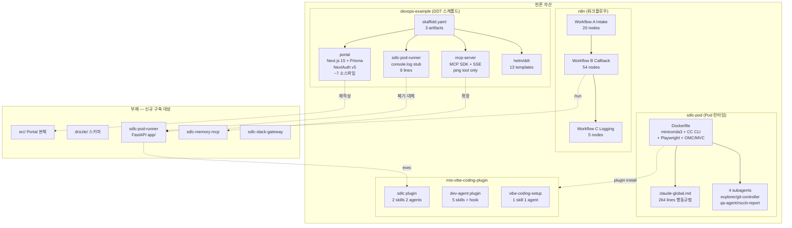
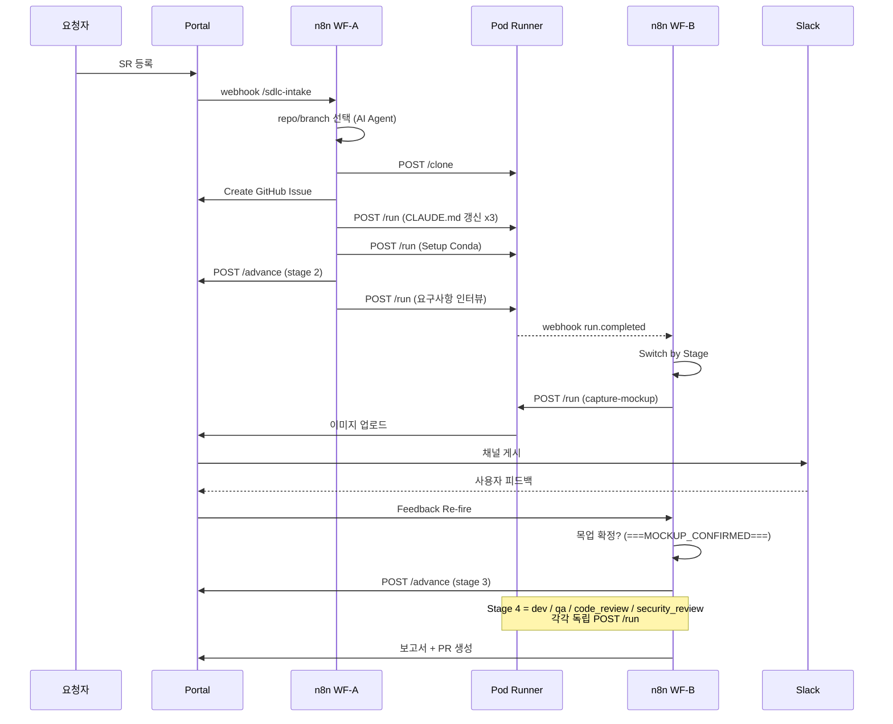

# System Architecture

> **분석 범위**: 현존 참조/스캐폴드 자산. 타깃 AIways-On 애플리케이션 코드는 미존재.

## System Overview

현존 자산은 **두 개의 서로 다른 성숙도 계층**으로 나뉜다.

| 계층 | 자산 | 성숙도 | 타깃 적합성 |
|------|------|--------|------------|
| **인프라/개발환경** | `devops-example/` | 동작하는 스캐폴드 | 높음 — 구조 재사용 |
| **SDLC 실행 엔진** | `sdlc-pod/`, `n8n/`, `mis-vibe-coding-plugin/` | 운영 수준 산출물 | 매우 높음 — 로직 재사용 |
| **애플리케이션(Portal)** | `devops-example/portal/` | Hello-world 수준 | **낮음 — 재작성 필요** |

핵심 통찰: **가장 어려운 부분(n8n 54노드 워크플로우, Pod 이미지, 에이전트 행동규범)은 이미 존재하고,
가장 쉬운 부분(Portal CRUD/UI)이 비어 있다.**

## Architecture Diagram



### Text Alternative (Mermaid 실패 시)

```
현존 자산 (4 그룹)
+-- devops-example : portal(Next15/Prisma) + mcp-server(stub) + pod-runner(stub) + helm(13) + skaffold
+-- sdlc-pod       : Dockerfile(완성) + claude-global.md(264줄) + subagents(4)
+-- n8n            : Workflow A(20) + B(54) + C(5)
+-- mis-vibe-*     : sdlc(2skill/2agent) + dev-agent(5skill) + vibe-coding-setup(1skill/1agent)

부재 (신규 구축)
+-- src/                : Portal 본체        <- portal 재작성
+-- drizzle/            : DB 스키마          <- Prisma 대체
+-- sdlc-pod-runner/app : FastAPI            <- stub 폐기
+-- sdlc-memory-mcp/    : 규정 MCP           <- mcp-server 확장
+-- sdlc-slack-gateway/ : Socket Mode 릴레이 <- 전무
```

## Component Descriptions

### `devops-example/portal`
- **Purpose**: Next.js 애플리케이션 스캐폴드
- **Responsibilities**: GitHub OAuth 로그인, Prisma DB 접속, 기본 레이아웃
- **Dependencies**: `next@15.3`, `next-auth@5.0.0-beta.25`, `@prisma/client@6`, `react@19`, `tailwindcss@4`
- **Type**: Application
- **실제 구현 규모**: 소스 7개 파일 — `auth.ts`(11줄), `prisma.ts`(9줄), `route.ts`(3줄), `layout.tsx`, `page.tsx`, `globals.css`, `utils.ts`
- **판정**: **골격만 존재. 비즈니스 로직 0.**

### `devops-example/mcp-server`
- **Purpose**: MCP 서버 스캐폴드
- **Responsibilities**: `ping` tool 1개, `/health`, `/sse` 엔드포인트
- **Dependencies**: `@modelcontextprotocol/sdk@^1.0.0`
- **Type**: Application
- **판정**: **전송 방식이 SSE. 명세는 Streamable HTTP(:58002) 요구 → 전송 계층 교체 필요.**

### `devops-example/sdlc-pod-runner`
- **Purpose**: Pod 런너 스텁
- **실제 내용**: `console.log` 후 5초 뒤 `process.exit(0)` — **8줄**
- **Type**: Application
- **판정**: **폐기 대상.** 명세는 FastAPI(Python) + 11개 엔드포인트 요구.

### `devops-example/helm/ddt`
- **Purpose**: 로컬 K8s 스택 umbrella 차트
- **Responsibilities**: app / postgres / n8n / mcp / minio 5개 서비스 Deployment·Service·PVC·ConfigMap
- **Type**: Infrastructure
- **판정**: **구조 재사용 가치 높음.** 단, Secret 관리가 없고 env가 values.yaml 평문 → 명세의 `secret_refs`·`sdlc-secrets` 원칙과 충돌.

### `sdlc-pod/Dockerfile`
- **Purpose**: Pod 런타임 이미지
- **Responsibilities**: miniconda3 기반, 사내 미러(`repository.domain.net`) 경유 air-gapped 설치,
  git/gh/jq/chromium/noto-cjk/imagemagick, nodejs 20, `@anthropic-ai/claude-code`, `@playwright/mcp`,
  OMC + MVC 플러그인, `claude-dsassistant`(LiteLLM wrapper), 비루트 `runner` 사용자, 포트 58001, healthcheck
- **Dependencies**: `continuumio/miniconda3:26.3.2`
- **Type**: Infrastructure
- **⚠️ 빌드 불가 상태**: `COPY`가 참조하는 다음 파일이 **모두 부재** —
  `pyproject.toml`, `README.md`, `app/`, `claude-settings.json`, `claude.json`, `claude-dsassistant`, `init-workspace.sh`

### `sdlc-pod/claude-global.md`
- **Purpose**: Pod 내 Claude Code의 전역 행동 규범 (264줄)
- **Responsibilities**: stage 진행 권한은 n8n 단독 소유 원칙, 단계 확정 신호 규약(`===MOCKUP_CONFIRMED===`),
  Stage 4의 4-substage 분리, OOM 방지 프로세스 정리 규칙, 보고서 생성 단일 지점 원칙, Skill/Subagent 혼동 방지
- **Type**: Configuration / Governance
- **판정**: **운영 중 축적된 시행착오가 명문화된 고가치 자산.** (autopilot 조기종료, ralph state 하이재킹, `Agent type not found` 등 실제 장애 이력 기반)

### `n8n/` Workflows
- **Workflow A (Intake, 20노드)**: `sdlc-intake` webhook → repo/branch 선택 AI Agent → SR 문서 생성 →
  `POST /clone` → GitHub Issue 생성 → `CLAUDE.md` 3회 갱신 → Conda 셋업 → `advance to 2`
- **Workflow B (Run Callback, 54노드)**: `sdlc-run-complete` + `sdlc-stage-resume` 2개 webhook →
  Stage/Substage 스위치 → 요구사항 AI Agent · 설계 AI Agent · 목업 확정 판정 → dev/qa/code_review/security_review
  4-substage 순차 발화 → 보고서 생성 → PR/merge → 고아 세션 resume + budget claim
- **Workflow C (Logging, 5노드)**: `sdlc-pod-event` → requestNo→id 조회 → `POST /audit`
- **Type**: Orchestration
- **판정**: **최고 가치 자산.** 특히 Workflow B의 resume/budget 로직은 재구현 난이도가 매우 높다.

## Data Flow



## Integration Points

- **External APIs**
  | 대상 | 용도 | 현존 구현 |
  |------|------|----------|
  | GitHub API | Repo/Issue/PR/merge | Portal(부재) + `gh` CLI(Pod에 설치됨) |
  | Slack API | 채널 생성·게시·초대·history | **전무** |
  | Slack Socket Mode | 이벤트 수신 | **전무** |
  | Anthropic / LiteLLM | Claude Code 실행 | `claude-dsassistant` wrapper(파일 부재) |
  | Kubernetes API | Pod lifecycle | Portal orchestrator(부재) |
  | S3 / MinIO | 목업 이미지 저장 | MinIO Deployment 존재, 앱 연동 부재 |

- **Databases**: PostgreSQL 16 (Helm Deployment 존재). DB 2개 — `ddt`(앱), `n8n`(워크플로우 상태)
- **Third-party Services**: n8n(오케스트레이션), MinIO(S3 호환 스토리지)

## Infrastructure Components

- **Deployment Model**: Helm umbrella chart + Skaffold dev loop. 로컬은 Docker Desktop K8s 또는 k3d.
- **Networking**: ClusterIP Service + Skaffold `portForward` (3000/5432/5678/3001/9000/9001)
- **Storage**: PVC 2개 — postgres 1Gi, minio 5Gi
- **⚠️ 부재**: Secret 리소스, Ingress, NetworkPolicy, RBAC/ServiceAccount(Pod 동적 생성에 필수),
  CronJob 2종(`portal-sdlc-reconcile`, `portal-sdlc-improve-scan`), HPA
