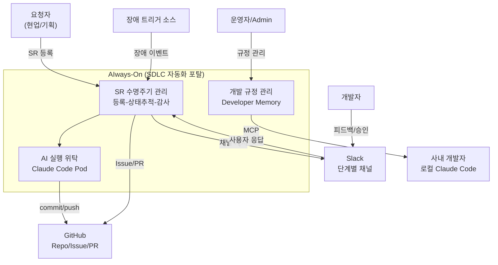

# Business Overview

> **분석 대상 범위 (중요)**
> 본 문서는 워크스페이스에 **현존하는 참조/스캐폴드 자산**을 리버스 엔지니어링한 결과다.
> AIways-On의 **타깃 애플리케이션 코드는 아직 존재하지 않는다** (greenfield).
> 비즈니스 맥락은 `requirements/` 14개 문서(13,102줄)가 SSOT이며, 본 문서는 그 맥락 위에서
> "현존 자산이 무엇을 이미 제공하는가"를 정리한 것이다.

## Business Context Diagram

## Business Description

- **Business Description**
  AIways-On은 **요구사항 접수부터 코드 작성·검토·PR 생성까지의 SDLC를 AI 에이전트에게 위탁 실행**시키는
  사내 자동화 포탈이다. 사람은 Slack 채널에서 단계별로 검토·승인만 하고, 실제 인터뷰·설계·구현·QA·리뷰는
  격리된 Kubernetes Pod 안의 Claude Code CLI가 수행한다. 시스템 책임 범위는 **Git Push · PR 생성까지**이며
  배포·배포검증은 시스템 외부다.

- **Business Transactions**

  | # | 트랜잭션 | 설명 | 상태 경로 |
  |---|---------|------|----------|
  | BT-1 | **기능개발 SR** | 요청 접수 → 요구사항 인터뷰 → 설계 인터뷰 → 개발(dev/qa/code_review/security_review) → PR | `1 → 2 → 3 → 4 → 9_COMPLETE` |
  | BT-2 | **장애 대응** | 장애 트리거 수집 → incident SR 자동 승격 → 원인분석·대응가이드·코드수정 | 5단계 상태 레일 |
  | BT-3 | **자체개선** | repo 주기 스캔 → finding 발굴·추천 → SR 승격 또는 개발규정 승격 | 5단계 스캔 플로우 |
  | BT-4 | **개발 규정 관리** | 규정 5종 CRUD → MCP 서버로 사내 개발자 로컬 Claude Code에 주입 | - |
  | BT-5 | **목업 확정** | UI Before/After 캡처 → S3 저장 → 채널 게시 → 사용자 확정 | BT-1의 Stage 2 내부 |
  | BT-6 | **보상 트랜잭션** | 실패 시 단계별 보상 + 운영자 개입 지점 확보 | `X_STOPPED` / `X_FAILED` |

- **Business Dictionary**

  | 용어 | 의미 |
  |------|------|
  | **SR** | Service Request. SDLC 파이프라인의 실행 단위. Issue·채널·PR과 1:1 대응 |
  | **Stage** | SR 상태 머신의 단계. 정상 `1`~`4` + `9_COMPLETE` + `X_STOPPED`/`X_FAILED`. `5`~`8`은 미사용 예약 |
  | **DevSubStage** | Stage 4 내부의 4개 독립 substage: `dev` → `qa` → `code_review` → `security_review` |
  | **Pod / Session** | SR 1건당 생성되는 격리 K8s Pod. 워크스페이스 `/workspaces/session` |
  | **CAS 전이** | Compare-And-Swap 상태 전환. 현재 상태 불일치 시 `StaleFromError`(409) |
  | **멱등성 키** | `idempotency_key = request_id + step_name`. 모든 외부 연동은 `ensure-*` 패턴 |
  | **secret_refs** | DB에 평문 대신 암호화 참조만 저장하는 Secret 분리 메커니즘 |
  | **finding** | 자체개선 스캔이 발굴한 개선점 단위. SR 또는 개발규정으로 승격 가능 |
  | **RSCCB 보고서** | 외부 노출용 공식 보고서 4종. `rsccb-report` 에이전트만 생성 가능 |
  | **`.mvc/` / `.omc/`** | 스킬 내부 작업 파일(intermediate). **보고서가 아니며 외부 노출 금지** |

## Component Level Business Descriptions

### `devops-example/` — DDT 개발환경 툴킷 (참조 스캐폴드)
- **Purpose**: OS 무관(Mac/Win/Linux) 통일 개발환경을 Conda + Docker + Skaffold로 제공
- **Responsibilities**: 로컬 K8s 스택 원클릭 기동(Portal/Postgres/n8n/MCP/MinIO), GitHub OAuth 골격,
  Helm 차트 골격, husky/commitlint 품질 게이트
- **AIways-On 관점 가치**: **인프라·로컬 개발환경 계층을 거의 그대로 재사용 가능**. 단, 앱 계층(ORM/Framework)은 교체 필요

### `sdlc-pod/` — Pod 런타임 자산 (참조)
- **Purpose**: Claude Code CLI가 실행되는 격리 Pod의 컨테이너 이미지 정의 + 에이전트 행동 규범
- **Responsibilities**: 사내 미러 레지스트리 기반 air-gapped 빌드, conda/Playwright/Chromium 프로비저닝,
  OMC·MVC 플러그인 설치, `claude-global.md`로 SDLC 단계별 에이전트 행동 규정
- **AIways-On 관점 가치**: **Pod 이미지 정의는 사실상 완성품**. 단, `app/`(FastAPI) 본체가 없음

### `n8n/` — 워크플로우 오케스트레이션 (참조)
- **Purpose**: Portal ↔ Pod 사이의 단계별 실행·판정·라우팅
- **Responsibilities**: Workflow A(intake, 20노드) / B(run-callback, 54노드) / C(logging, 5노드)
- **AIways-On 관점 가치**: **가장 복잡한 로직이 이미 구현되어 있음**. 단, stage 번호 체계가 명세와 불일치

### `mis-vibe-coding-plugin/` — Claude Code 플러그인 마켓플레이스 (참조)
- **Purpose**: Pod 안의 Claude Code가 호출하는 SDLC 전용 스킬·에이전트 제공
- **Responsibilities**: `sdlc:user-deep-interview`(소크라테스식 요구사항 인터뷰),
  `sdlc:capture-mockup`(Before/After 목업 캡처), `vibe-coding-setup:setup`(repo 최소 문서 보완),
  `dev-agent:*`(경량 CI 5종)
- **AIways-On 관점 가치**: **Stage 2 요구사항 인터뷰와 목업 캡처의 핵심 구현체**. 그대로 재사용
