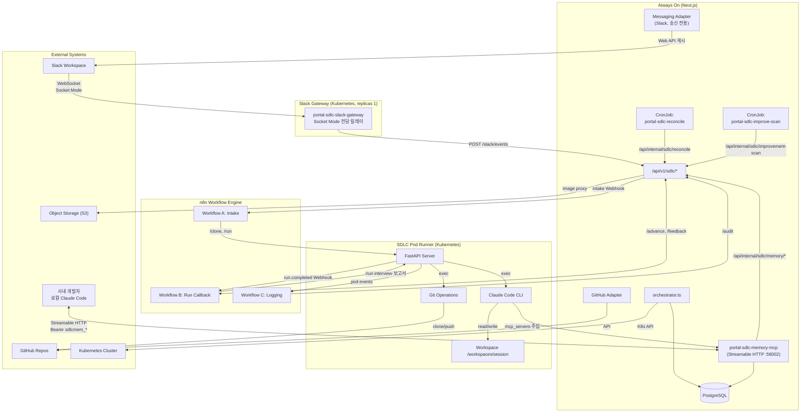

# AIways On — 아키텍처 개요

> **AI 기반 개발 워크플로우 자동화(SDLC) 시스템**을 처음부터 설계하는 독립 포탈의 설계 문서다.
> 3-tier 아키텍처(Portal + n8n + sdlc-pod-runner)로 구성하되, SDLC 코어에 집중하고 불필요한 Legacy/Eco 시스템 관리 기능은 배제한다.

## 1. 설계 배경 및 범위

### 1.1 목표

- **AI 기반 개발 워크플로우 자동화(SDLC)** 기능을 처음부터 설계하는 독립 신규 포탈 구축
- 검증된 3-tier 아키텍처와 상태 머신, 멱등성/보상 트랜잭션 패턴을 핵심 설계로 채택
- 외부 의존성을 최소화하여 단순하고 유지보수 가능한 코드베이스 확보

### 1.2 포함 범위 (In Scope)

| 영역 | 내용 |
|------|------|
| SDLC 요청 관리 | SR 등록·조회·상태 추적·감사 로그 |
| 상태 머신 | 정상 4단계(`1`~`4`) + `9_COMPLETE` + `X_STOPPED`/`X_FAILED`, CAS 전이, 보상 트랜잭션 |
| Pod lifecycle | K8s Pod 생성·삭제·resume, Claude Code 실행 위탁 |
| GitHub 연동 | Issue 생성, PR 생성·merge, Repo/Org/Credential 관리 |
| 메시징 | 단계별 채널(요구사항/설계/DEV), 사용자 피드백 수집 |
| 목업 이미지 | UI Before/After 캡처 → S3 저장 → 채널 게시·프록시 서빙 |
| 인증 | GitHub OAuth (Auth.js v5) |
| 장애 대응 | 장애 트리거 수집 → incident SR 자동 승격 → Pod agent 원인분석·대응가이드·코드수정 |
| 자체개선 | repo 주기 스캔 → 개선점(finding) 발굴·추천 → SR 또는 개발 규정으로 승격 |
| 개발 규정 | 규정 5종 관리 + MCP 서버로 사내 개발자 로컬 Claude Code 연동 |

### 1.3 제외 범위 (Out of Scope)

설계 범위에서 **제외**한 영역이다.

| 제외 항목 | 사유 |
|-----------|------|
| Legacy/Eco 시스템 관리 | SDLC와 무관 (Langfuse, Qdrant, OpenWebUI 프로비저닝) |
| 복잡한 System 추상화 | `{LEGACY_SYSTEM_ID}` 기준축·다중 시스템 관리 불필요 |
| SWP 연동 | `docs/sdlc/swp-integration.md` 흐름 제거 |
| OpenWebUI | Slack(또는 Discord)으로 대체 |
| OIDC SSO (mail 필드) | GitHub OAuth로 단순화 |
| AD/LDAP 연동 | `src/lib/sdlc/ad-ldap.ts` 제거 |

> **참고**: Stage `5`·`6`·`7`·`8`은 **미사용 예약** 구간이다. 시스템 책임 범위가 Git Push·PR 생성까지이고 그 이후 배포·배포검증은 시스템 외부이므로, 정상 경로는 `1 → 2 → 3 → 4 → 9_COMPLETE`로 단순화한다. 번호만 비워 두었으므로 향후 배포/검증 단계를 재도입할 때 기존 값을 재해석할 필요가 없다.

## 2. 3-Tier 아키텍처



### 2.1 구성 요소별 역할

#### Portal (Next.js)

SDLC 요청의 상태 관리, 외부 시스템 orchestration, 감사 로그 저장을 담당한다.

| 컴포넌트 | 설명 |
|---------|------|
| `/api/v1/sdlc/intake` | SR 등록 엔드포인트 (n8n Workflow A에서 호출) |
| `/api/v1/sdlc/advance` | 단계 전환 엔드포인트 (n8n Workflow B에서 호출) |
| `/api/v1/sdlc/requests/{id}/*` | 요청별 상세 액션 (audit, issues, channel, confirm-requirements 등) |
| `/api/v1/sdlc/incidents/*` | 장애 수집·조회·승격·종결, 장애 템플릿 관리 ([11-incident-response-agent.md](./11-incident-response-agent.md) 9절) |
| `/api/v1/sdlc/improvements/*` | 자체개선 스캔 회차 조회·발화, finding 검토·승격 ([12-self-improvement-agent.md](./12-self-improvement-agent.md) 8절) |
| `/api/v1/sdlc/memory/*` | 개발 규정·MCP 접근 토큰 관리 ([13-developer-memory-agent.md](./13-developer-memory-agent.md) 5절) |
| `orchestrator.ts` | Pod lifecycle, 채널 관리, PR 생성·merge 등 단계별 작업 |
| `state-machine.ts` | SDLC 상태 머신 정의 |
| `advance.ts` | CAS 기반 상태 전환 로직 |

#### n8n Workflow Engine

AI 에이전트 orchestration, 단계별 Claude Code 실행, 피드백 라우팅을 담당한다.

| 워크플로우 | 설명 |
|-----------|------|
| **Workflow A (Intake)** | 초기 요청 처리, repo 선택, GitHub Issue 생성, Pod clone |
| **Workflow B (Run Callback)** | 단계별 피드백 처리, AI interview 실행, 보고서 생성 |
| **Workflow C (Logging)** | Pod 이벤트 수신, 감사 로그 기록 |

#### SDLC Pod Runner

격리된 K8s Pod에서 Claude Code를 실행하고 Git 작업을 수행한다. Base URL: `http://{pod-name}.{namespace}.svc.cluster.local:58001`

| API 엔드포인트 | 설명 |
|---------------|------|
| `POST /clone` | repo clone 및 세션 초기화 (멱등) |
| `POST /run` | Claude Code 실행 (동기/비동기, resume 지원) |
| `POST /git/commit-push` | 작업 내용 commit 및 push |
| `DELETE /session` | 세션 정리 및 삭제 |
| `GET /health` | K8s liveness/readiness probe |

## 3. 기술 스택

AIways On의 기술 스택은 다음과 같다.

| 분류 | 기술 | 비고 |
|------|------|------|
| Framework | Next.js 16 (App Router, Server Actions, API Routes) | Stateless, 수평 확장 |
| Language | TypeScript (strict mode) | |
| Styling | Tailwind CSS v4 + CSS Custom Properties (`@theme`) | |
| UI Components | shadcn/ui (Radix UI primitives + Tailwind) | |
| ORM | Drizzle ORM | PostgreSQL |
| Database | PostgreSQL | |
| 인증 | Auth.js v5 (`next-auth@5.0.0-beta`) | **GitHub OAuth** (OIDC → GitHub 전환) |
| 배포 | Kubernetes | stateless, 수평확장 |
| 메시징 | Slack API (어댑터 추상화) | OpenWebUI → Slack |
| AI 실행 | Claude Code CLI | Pod Runner 내부 |
| 오케스트레이션 | n8n | Workflow A/B/C |
| Pod 환경 | Conda + conda-pack | per-session conda env (S3 캐시) |
| UI 테스트 | Playwright (headless Chromium) | 목업 캡처, QA 검수 |

## 4. 설계 결정 요약

### 4.1 핵심 설계 결정 (Key Decisions)

| 영역 | 설계 결정 | 근거 |
|------|----------|------|
| 인증 | **GitHub OAuth** (표준 `email` claim) | SDLC는 GitHub Repo/Issue/PR 연동이 핵심이므로 GitHub 계정 기반이 가장 자연스러움 |
| 메시징 | **Slack** (MessageChannelAdapter 추상화, Discord·Knox Teams 확장 가능) | 채널 기반 단계별 협업 + 사용자 피드백 수집에 최적. Knox Teams는 사내 개발, 구조만 제공 |
| 채널 네이밍 | feature=`sr-{no}-requirements`/`-design`/`-dev` 3개, incident=`inc-{no}-dev`, improvement=`imp-{no}-dev` 각 1개 | prefix 분기로 Slack 채널 목록에서 장애 대응·자체개선 채널을 구분. `ChannelType` enum은 불변 |
| 멤버 초대 | Slack 채널 초대 (`conversations.invite`) | 이메일 → Slack user ID 변환으로 자연스러운 초대 흐름 |
| 채널 스냅샷 | Slack `conversations.history` → DB 저장 (`3` 진입 시 requirements, `4` 진입 시 design, `9` 진입 시 dev) | 단계 종료 시점의 논의 이력을 DB에 고정 |
| 완료 단계 | Stage `5`·`6`·`7`·`8` **미사용 예약** (`4 → 9_COMPLETE` 직접 전이) | Git Push·PR까지가 시스템 범위이고 배포는 외부. 성공 terminal은 `9_COMPLETE` 단일 |
| 역방향 전이 | **0개** (단방향 DAG) | 재작업이 필요하면 기존 SR을 되돌리지 않고 신규 SR을 등록해 이력·채널·PR의 SR 단위 1:1 대응을 유지 |
| 서버간 인증 | **`SDLC_MASTER_KEY` 단일 키** (Secret `sdlc-secrets` 키 `master-key`) | 호출 주체가 동일 운영 조직이므로 토큰 분리는 관리 비용만 크다. 단, 토큰 발급 권한만은 `SDLC_MEMORY_TOKEN_ISSUER_TOKEN`으로 분리 유지 |

### 4.2 배제한 영역 (Excluded)

- Legacy/Eco 시스템 관리 (Langfuse, Qdrant, OpenWebUI 프로비저닝 전체)
- System 추상화 (`{LEGACY_SYSTEM_ID}` 기준축, 다중 시스템 관리) — 13번 문서의 `sdlc_memory_systems` 테이블도 제거되어 전역 규정 단일 집합으로 일치
- SWP 연동 (intake/개발대기 전환)
- AD/LDAP 연동 (`ad-ldap.ts`)
- 대시보드, 공지사항, Eco Viewer 등 비SDLC 페이지

### 4.3 채택한 핵심 메커니즘 (Core Mechanisms)

- 3-tier 아키텍처 (Portal + n8n + sdlc-pod-runner)
- 상태 머신 (정상 4단계 + `9_COMPLETE` + `X_*`) + CAS 전이 (`advance.ts`, `state-machine.ts`)
- 멱등성 (dedupKey, idempotencyKey, ensure-* 패턴)
- 보상 트랜잭션 (`compensateFailedSdlc`)
- Secret 분리 (`secret_refs` 암호화 참조)
- UI 목업 캡처 → S3 → 프록시 서빙
- PR 생성·merge (Portal 직접 GitHub API)

## 5. 디렉토리 구조 (예정)

```
aiways-on/
├── src/
│   ├── app/                      # Next.js App Router
│   │   ├── (auth)/login/         # GitHub OAuth 로그인
│   │   ├── (dashboard)/          # SR 목록·대시보드
│   │   ├── requests/[id]/        # SR 상세 (단계별 채널·상태)
│   │   ├── register/             # SR 신규 등록 UI
│   │   └── api/v1/sdlc/          # SDLC API Routes
│   ├── lib/
│   │   ├── sdlc/                 # 상태머신·orchestrator·advance·resume
│   │   └── adapters/
│   │       ├── github.ts         # GitHub API 클라이언트
│   │       ├── messaging/        # MessageChannelAdapter
│   │       │   ├── index.ts      # 인터페이스 + 팩토리
│   │       │   └── slack.ts      # Slack 구현체
│   │       └── pod.ts            # Pod Runner API 클라이언트
│   ├── db/
│   │   └── schema/               # Drizzle 스키마 (SDLC 코어만)
│   └── auth.ts                   # Auth.js v5 GitHub Provider
├── drizzle/                      # 마이그레이션
├── n8n/                          # 워크플로우 A/B/C JSON
├── sdlc-pod-runner/              # FastAPI Pod Runner
├── sdlc-memory-mcp/              # 독립 MCP 서버 (Node 20 + @modelcontextprotocol/sdk)
├── sdlc-slack-gateway/           # Slack Socket Mode 릴레이 (Node 20 + @slack/socket-mode)
│   ├── Dockerfile
│   ├── package.json
│   └── src/index.ts              # 소켓 연결 + ack + Portal 릴레이 + /health
└── docs/                         # 정적 설계 문서
```

> `sdlc-slack-gateway`는 Portal과 코드를 공유하지 않는 독립 서비스다. Slack 원본 `event_callback` 봉투를 가공 없이 전달하므로 공유 타입이 필요 없다 ([02-messaging-adapter.md](./02-messaging-adapter.md) 6.3절).

## 6. 핵심 설계 원칙

AIways On의 아키텍처 원칙은 다음과 같다.

1. **Stateless 설계** — 서버 컴포넌트는 세션 상태를 메모리에 보관하지 않는다. 모든 상태는 PostgreSQL 또는 클라이언트에 저장. 장수명 연결(Slack Socket Mode 등)이 불가피한 기능은 Portal에 두지 않고 **단일 replica 전용 Pod로 분리**해 이 원칙을 지킨다 — Portal은 `replicas: 2+`이므로 소켓을 내장하면 replica 수만큼 중복 수신된다 ([02-messaging-adapter.md](./02-messaging-adapter.md) 6.3절).
2. **멱등성 보장** — 모든 외부 연동은 `ensure-*` 패턴. `idempotency_key = request_id + step_name`.
3. **Secret 분리** — DB에 실제 API Key/JWT/비밀번호 평문 저장 금지. `secret_refs`에 참조만.
4. **보상 트랜잭션** — 실패 시 전체 즉시 삭제가 아닌 단계별 보상 + 운영자 개입 지점. 실패한 채널은 아카이브하지 않고 실패 결과를 게시해 담당자가 원인을 확인하고 후속 논의를 이어갈 창구로 남긴다.
5. **CAS 상태 전이** — `advance()`는 Compare-And-Swap으로 원자성 보장. 현재 상태가 예상과 다르면 `StaleFromError`(409).
6. **어댑터 추상화** — 메시징 플랫폼(Slack/Discord/Knox Teams)을 인터페이스로 추상화. 설정 기반 전환. **송신은 `MessageChannelAdapter` 인터페이스로, 수신은 릴레이 Pod → Portal HTTP webhook 단일 진입점으로** 추상화해 양방향 모두 플랫폼 교체가 가능하다.

## 7. 문서 목차

| 문서 | 내용 |
|------|------|
| [00-overview.md](./00-overview.md) | 본 문서 — 전체 개요 |
| [01-auth-github.md](./01-auth-github.md) | GitHub OAuth 인증 설계 |
| [02-messaging-adapter.md](./02-messaging-adapter.md) | MessageChannelAdapter 추상화 + Slack 구현체 |
| [03-state-machine.md](./03-state-machine.md) | 상태 머신·CAS 전이·보상 트랜잭션·Pod resume |
| [04-db-schema.md](./04-db-schema.md) | PostgreSQL + Drizzle 스키마 |
| [05-portal-api.md](./05-portal-api.md) | Portal `/api/v1/sdlc/*` 엔드포인트 명세 |
| [06-pod-runner-api.md](./06-pod-runner-api.md) | sdlc-pod-runner FastAPI 명세 |
| [07-n8n-workflows.md](./07-n8n-workflows.md) | n8n Workflow A/B/C |
| [08-sr-registration-ui.md](./08-sr-registration-ui.md) | SR 신규 등록 UI 설계 |
| [09-data-flow.md](./09-data-flow.md) | 엔드투엔드 데이터 흐름 시퀀스 |
| [10-k8s-infrastructure.md](./10-k8s-infrastructure.md) | K8s 매니페스트·Pod 생성·환경 변수 |
| [11-incident-response-agent.md](./11-incident-response-agent.md) | 장애 대응 Agent — 트리거 수집·incident SR 승격·원인분석·대응가이드 |
| [12-self-improvement-agent.md](./12-self-improvement-agent.md) | repo 기반 자체개선 Agent — 주기 스캔·개선점 발굴·finding 승격 |
| [13-developer-memory-agent.md](./13-developer-memory-agent.md) | Developer Memory Agent — 규정 관리·MCP 서버·로컬 Claude Code 연동 |
