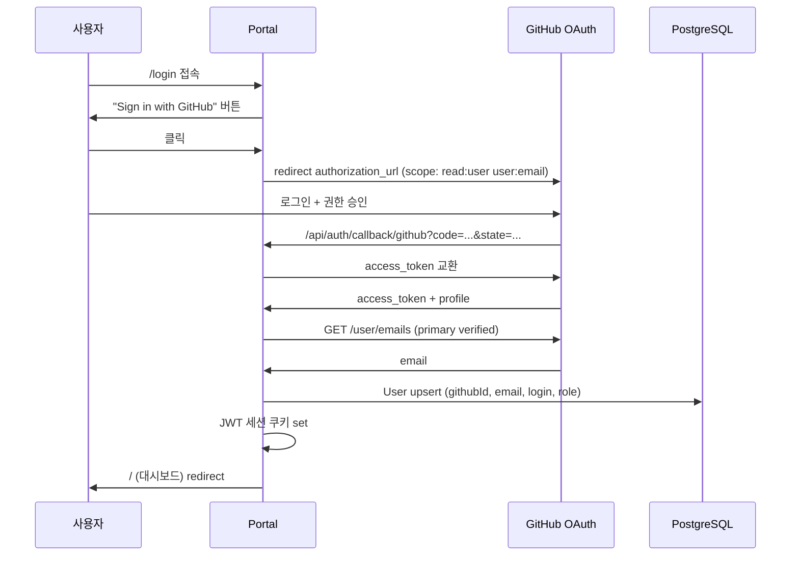

# 인증 설계 — GitHub OAuth

> **GitHub OAuth**를 처음부터 채택한다.
> SDLC는 GitHub Repo/Issue/PR 연동이 핵심이므로, GitHub 계정 기반 인증이 가장 자연스럽다.

## 1. 개요

### 1.1 인증 방식

- **Provider**: GitHub OAuth (Auth.js v5 `next-auth@5.0.0-beta`)
- **세션**: JWT 기반 (쿠키 저장, 서버 메모리 미사용 — Stateless 원칙 유지)
- **계정 연동**: GitHub 사용자 ID(`githubId`) 기준. 동일 GitHub 계정 재로그인 시 User 레코드 매칭.
- **토큰 관리**: GitHub Access Token은 DB에 평문 저장하지 않고 `secret_refs`에 암호화 참조로 저장 (사용자별 GitHub API 호출 시 사용).

### 1.2 설계 결정

| 항목 | 설계 결정 | 근거 |
|------|----------|------|
| Provider | `@auth/core/providers/github` (표준) | SDLC 코어가 GitHub 연동이므로 표준 GitHub OAuth가 가장 자연스러움 |
| 이메일 claim | `profile.email` (표준) + `primary email` API | private 이메일 대비해 `/user/emails` API로 primary verified email 보강 |
| 부서/그룹 | GitHub Org membership / Team (선택) | GitHub 조직 구조를 권한 그룹으로 활용 |
| RBAC | 단순 2단계 (User / Admin) | 복잡한 그룹 기반 RBAC 대신 직관적인 역할 체계 |
| AD/LDAP | 미도입 | GitHub OAuth가 사용자 식별을 담당하므로 별도 디렉토리 연동 불필요 |

## 2. 환경 변수

```bash
# Auth.js 필수
AUTH_SECRET=<random-32+chars>          # JWT 암호화 키
AUTH_GITHUB_ID=<oauth-app-client-id>    # GitHub OAuth App Client ID
AUTH_GITHUB_SECRET=<oauth-app-secret>   # GitHub OAuth App Client Secret

# Portal
AUTH_TRUST_HOST=true                   # 프록시/도메인 신뢰
PORTAL_BASE_URL=https://aiways-on.example.com

# GitHub OAuth App 설정 (GitHub UI)
# Homepage URL:   ${PORTAL_BASE_URL}
# Callback URL:   ${PORTAL_BASE_URL}/api/auth/callback/github
# Scopes: read:user, user:email, repo, workflow (선택)
```

> `NEXT_PUBLIC_` 환경 변수는 사용하지 않는다 (CLAUDE.md 규칙 준수). 클라이언트 필요 값은 Context 패턴으로 런타임 주입.

## 3. Auth.js v5 설정

### 3.1 `src/auth.ts`

```typescript
import NextAuth from 'next-auth';
import GitHub from 'next-auth/providers/github';
import { DrizzleAdapter } from '@auth/drizzle-adapter';
import { db } from '@/db';
import {
  users, accounts, sessions, verificationTokens,
} from '@/db/schema/auth';

export const { handlers, auth, signIn, signOut } = NextAuth({
  adapter: DrizzleAdapter(db, {
    usersTable: users,
    accountsTable: accounts,
    sessionsTable: sessions,
    verificationTokensTable: verificationTokens,
  }),
  session: { strategy: 'jwt' }, // Stateless: 서버 메모리 세션 미사용
  providers: [
    GitHub({
      clientId: process.env.AUTH_GITHUB_ID!,
      clientSecret: process.env.AUTH_GITHUB_SECRET!,
      authorization: {
        params: {
          // repo: private repo clone/commit (Pod용 PAT은 별도 관리, 사용자 세션은 조회용)
          scope: 'read:user user:email',
        },
      },
    }),
  ],
  callbacks: {
    /**
     * JWT 콜백: GitHub primary email + githubId + role 주입.
     * GitHub는 profile.email이 private인 경우 비어있을 수 있어
     * /user/emails API로 primary verified email을 보강한다.
     */
    async jwt({ token, profile, account }) {
      if (account?.access_token) {
        token.githubAccessToken = account.access_token; // 서버 전용, 클라이언트 미노출
      }
      if (profile) {
        token.githubId = String(profile.id);
        token.login = profile.login;       // GitHub username
        token.avatarUrl = profile.avatar_url;
        token.name = profile.name ?? profile.login;
      }
      return token;
    },
    /**
     * Session 콜백: 클라이언트에 노출할 세션 정보.
     * accessToken은 절대 클라이언트에 내보내지 않는다.
     */
    async session({ session, token }) {
      if (token.sub) {
        session.user.id = token.sub;          // DB User.id
        session.user.githubId = token.githubId as string;
        session.user.login = token.login as string;
        session.user.avatarUrl = token.avatarUrl as string;
        session.user.role = token.role as UserRole;
      }
      return session;
    },
  },
});
```

### 3.2 Primary Email 보강

GitHub는 이메일이 private인 경우 `profile.email`이 `null`이다. 로그인 시 primary verified email을 GitHub API로 조회해 User 레코드에 저장한다.

```typescript
// src/lib/auth/github-email.ts
export async function fetchPrimaryEmail(accessToken: string): Promise<string | null> {
  const res = await fetch('https://api.github.com/user/emails', {
    headers: { Authorization: `Bearer ${accessToken}`, Accept: 'application/vnd.github+json' },
  });
  if (!res.ok) return null;
  const emails = await res.json() as Array<{ email: string; primary: boolean; verified: boolean }>;
  return emails.find((e) => e.primary && e.verified)?.email ?? emails[0]?.email ?? null;
}
```

> `signIn` 이벤트 훅(`events.createUser` / `events.linkAccount`)에서 호출해 User.email을 채운다.

## 4. DB 스키마 (인증)

Auth.js Drizzle Adapter가 요구하는 테이블 + 커스텀 컬럼.

```typescript
// src/db/schema/auth.ts
import { pgTable, text, timestamp, primaryKey, integer, varchar } from 'drizzle-orm/pg-core';

export const users = pgTable('users', {
  id: text('id').primaryKey().$defaultFn(() => crypto.randomUUID()),
  name: text('name'),
  email: text('email').notNull().unique(),
  emailVerified: timestamp('email_verified', { mode: 'date' }),
  image: text('image'),
  // --- 커스텀: GitHub 전용 ---
  githubId: text('github_id').unique(),        // GitHub 사용자 고유 ID
  githubLogin: text('github_login'),            // GitHub username
  role: varchar('role', { length: 16 }).notNull().default('user'), // 'user' | 'admin'
  createdAt: timestamp('created_at', { mode: 'date' }).notNull().defaultNow(),
});

export const accounts = pgTable('accounts', {
  userId: text('user_id').notNull().references(() => users.id, { onDelete: 'cascade' }),
  type: text('type').notNull(),
  provider: text('provider').notNull(),
  providerAccountId: text('provider_account_id').notNull(),
  refresh_token: text('refresh_token'),
  access_token: text('access_token'),  // ⚠️ 평문 저장 주의 → 별도 암호화 검토 (아래 6절)
  expires_at: integer('expires_at'),
  token_type: text('token_type'),
  scope: text('scope'),
  id_token: text('id_token'),
}, (t) => ({ pk: primaryKey({ columns: [t.provider, t.providerAccountId] }) }));

export const sessions = pgTable('sessions', {
  sessionToken: text('session_token').primaryKey(),
  userId: text('user_id').notNull().references(() => users.id, { onDelete: 'cascade' }),
  expires: timestamp('expires', { mode: 'date' }).notNull(),
});

export const verificationTokens = pgTable('verification_tokens', {
  identifier: text('identifier').notNull(),
  token: text('token').notNull(),
  expires: timestamp('expires', { mode: 'date' }).notNull(),
}, (t) => ({ pk: primaryKey({ columns: [t.identifier, t.token] }) }));
```

> JWT 세션 전략을 사용하므로 `sessions` 테이블은 실제로 사용되지 않지만, Adapter 호환성을 위해 정의만 유지한다.

## 5. RBAC (단순 2단계)

단순 2단계 RBAC를 채택한다.

| Role | 권한 |
|------|------|
| `user` (기본) | SR 등록, 본인 SR 조회, 피드백 입력 |
| `admin` | 전체 SR 조회, Org/Repo/Credential 관리, 수동 merge 승인, 강제 중지/재개 |

### 5.1 Role 부여

- 최초 가입 시 기본 `user`
- `admin`은 환경 변수 `INITIAL_ADMIN_GITHUB_LOGINS` (콤마 구분)에 등록된 GitHub username에 한해 최초 부여
- 이후 admin이 다른 사용자를 admin으로 승격 (별도 API)

```bash
INITIAL_ADMIN_GITHUB_LOGINS=suntae88-kim,team-lead
```

### 5.2 권한 체크 헬퍼

```typescript
// src/lib/auth/guards.ts
import { auth } from '@/auth';

export async function requireUser() {
  const session = await auth();
  if (!session?.user) throw new Response('Unauthorized', { status: 401 });
  return session;
}

export async function requireAdmin() {
  const session = await requireUser();
  if (session.user.role !== 'admin') throw new Response('Forbidden', { status: 403 });
  return session;
}
```

## 6. GitHub Access Token 보안

### 6.1 문제

GitHub OAuth Access Token은 사용자 권한으로 GitHub API를 호출할 때 필요하지만, DB에 **평문 저장 시 유출 위험**이 있다.

### 6.2 방안

- **사용자 세션 토큰**(read:user, user:email scope): 만료 짧음. JWT에만 보관, DB 평문 저장 X. 필요 시 refresh.
- **Pod용 PAT**(repo, workflow scope): SDLC 작업용. `sdlc_github_credentials` 테이블의 `pat` 컬럼은 `secret_refs`에 AES-256-GCM 암호화 저장 (보안 패턴 적용). 사용자 OAuth 토큰과 분리.
- 운영 로그에 토큰/이메일 대신 sha256 fingerprint만 기록 (보안 원칙 적용).

> GitHub OAuth App 대신 **GitHub App**을 사용하면 만료 짧은 토큰 + 세분화된 권한 + per-repo access로 더 안전하다. 장기적으로는 GitHub App 마이그레이션을 권장하되, 1차는 OAuth App으로 시작.

## 7. 미들웨어 (인증 예외)

```typescript
// src/middleware.ts
import { auth } from '@/auth';

export default auth((req) => {
  const { pathname } = req.nextUrl;
  // 인증 예외 경로
  const publicPaths = [
    '/api/auth',        // Auth.js 콜백/로그아웃
    '/api/health',      // 헬스체크
    '/_next',           // Next.js 정적 자산
    '/login',           // 로그인 페이지
    '/api/v1/sdlc/images', // 이미지 프록시 (signed token 별도 인증)
  ];
  if (publicPaths.some((p) => pathname.startsWith(p))) return;

  // 미인증 시 /login으로 리다이렉트 (페이지) / 401 (API)
  if (!req.auth) {
    if (pathname.startsWith('/api/')) {
      return Response.json({ code: 'UNAUTHORIZED', message: 'Login required' }, { status: 401 });
    }
    return Response.redirect(new URL('/login', req.nextUrl));
  }
});

export const config = {
  matcher: ['/((?!api/auth|api/health|_next|login|favicon).*)'],
};
```

### 인증 예외 엔드포인트 정리

| 엔드포인트 | 인증 방식 | 비고 |
|-----------|----------|------|
| `/api/auth/*` | 없음 | Auth.js 처리 |
| `/api/health` | 없음 | 헬스체크 |
| `/api/v1/sdlc/images/{id}` | Query signed token (HMAC) | 미들웨어 예외, 라우트 내부 검증 |
| `/api/v1/sdlc/intake` | Bearer `SDLC_MASTER_KEY` | n8n 호출 |
| `/api/v1/sdlc/advance`, `/audit` 등 콜백 전체 | Bearer `SDLC_MASTER_KEY` | n8n/Pod 콜백 |
| `/api/v1/sdlc/incidents/ingest` | Bearer `SDLC_MASTER_KEY` | 외부 모니터링 발신 ([11-incident-response-agent.md](./11-incident-response-agent.md) 참조) |
| `/api/internal/sdlc/improvement-scan` | Bearer `SDLC_MASTER_KEY` | CronJob `portal-sdlc-improve-scan` 호출 ([12-self-improvement-agent.md](./12-self-improvement-agent.md) 참조) |
| `/api/internal/sdlc/memory/rules` | Bearer `SDLC_MASTER_KEY` | MCP 서버 → Portal 쓰기 경로 ([13-developer-memory-agent.md](./13-developer-memory-agent.md) 참조) |
| `/api/internal/sdlc/memory/tokens/issue-scoped` | Bearer `SDLC_MEMORY_TOKEN_ISSUER_TOKEN` | per-SR agent 토큰 발급. **Portal orchestrator 전용** — MCP 서버 Deployment에는 이 토큰을 마운트하지 않는다 |
| `/api/v1/sdlc/requests/{id}/confirm-requirements` 등 | 세션 (로그인 사용자) | UI 버튼 |
| `/api/v1/sdlc/orgs`, `/repos`, `/credentials` | 세션 (admin) | 관리 기능 |

> **서버간 인증은 `SDLC_MASTER_KEY` 단일 키**: 호출 주체가 모두 동일 운영 조직이므로 토큰을 분리해도 관리 비용만 커진다. 저장 위치는 Secret `sdlc-secrets`의 `master-key` 키다. 잔존 위험은 키 1개 유출 시 전 경로가 노출되고 회전 시 전 컴포넌트를 동시 갱신해야 한다는 점이다 ([05-portal-api.md](./05-portal-api.md) 인증 토큰 종류 참조).
>
> **단, 토큰 발급 권한만은 분리 유지**: `/api/internal/sdlc/memory/tokens/issue-scoped`는 임의 규정에 대한 `read_write` agent 토큰을 발급할 수 있다. 이 엔드포인트까지 `SDLC_MASTER_KEY`로 인증하면 그 키를 가진 모든 컴포넌트(MCP 서버 포함)가 토큰 발급 권한을 얻고, MCP 서버가 침해될 때 침해자가 전 규정을 재작성할 토큰을 스스로 발급할 수 있다. 따라서 발급 권한은 `SDLC_MEMORY_TOKEN_ISSUER_TOKEN`으로 남긴다.
>
> **미들웨어 공개 접두 아님**: 위 Bearer 인증 엔드포인트들은 `publicPaths`에 추가하지 **않는다**. 미들웨어의 보호 대상으로 남겨두고, 라우트 핸들러 내부에서 `Authorization: Bearer` 헤더를 상수 시간 비교로 검증한다. 세션 쿠키가 없는 서버 간 호출이므로 미들웨어가 `/login` 리다이렉트를 시도하지 않도록 `pathname.startsWith('/api/')` 분기에서 401 JSON을 반환하는 동작에 의존하며, 토큰이 유효하면 라우트가 정상 처리한다. 이 검증 패턴은 모든 서버간 인증 엔드포인트의 레퍼런스다.

> **Memory MCP 서버는 미들웨어 밖**: `portal-sdlc-memory-mcp`는 Portal과 별개의 K8s Deployment이므로 Next.js 미들웨어를 거치지 않는다. 이 서버는 자체 `sdlcmem_*` 토큰을 `sdlc_memory_access_tokens` 테이블의 sha256 해시 조회로 직접 검증하고, 쓰기 경로만 `/api/internal/sdlc/memory/rules`로 `SDLC_MASTER_KEY` Bearer 인증을 붙여 세션 쿠키 없이 서버 간 호출한다. 토큰 발급 엔드포인트(`/tokens/issue-scoped`)는 호출하지 않으며 해당 토큰도 보유하지 않는다. Auth.js 세션·GitHub OAuth와 무관한 독립 인증 계층이다 ([13-developer-memory-agent.md](./13-developer-memory-agent.md) 6절 참조).

## 8. 로그인 UI 흐름



## 9. SR 제출자 연동

SR 등록 시 `session.user`를 `submitter`로 사용한다. `submitterId`/`approverId` 패턴을 그대로 적용.

```typescript
// SR 등록 시
const session = await requireUser();
await db.insert(sdlcRequests).values({
  // ...
  submitter: session.user.name ?? session.user.login,
  submitterId: session.user.id,        // User.id (FK)
  submitterEmail: session.user.email,
  submitterGithubLogin: session.user.login, // GitHub @mention용
  // ...
});
```

> 채널 멤버 초대 시 `submitterGithubLogin`을 사용해 Slack에서 GitHub username과 매핑하거나, 등록 폼에서 Slack member ID를 별도 수집한다 (02-messaging-adapter.md 참조).
