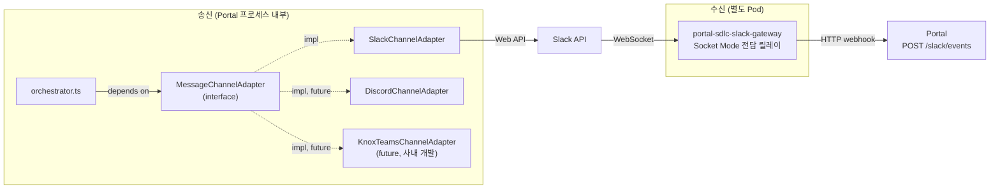
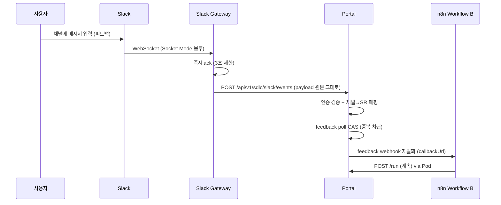

# 메시징 어댑터 설계 — MessageChannelAdapter + Slack

> SDLC orchestrator의 메시징 연동을 **인터페이스로 추상화**한다.
> 1차 구현체는 **Slack**, 인터페이스만 맞추면 Discord 등 다른 플랫폼으로 교체 가능하다.

## 1. 개요

### 1.1 설계 배경

메시징 플랫폼에 직접 결합하면 플랫폼 교체 시 orchestrator 전면 수정이 필요하다. 이를 방지하기 위해 인터페이스 추상화를 도입한다.

### 1.2 해결 방안

SDLC가 필요한 메시징 기능을 `MessageChannelAdapter` 인터페이스로 정의하고, orchestrator는 인터페이스에만 의존한다. 구현체는 환경 변수(`MESSAGING_PROVIDER`)로 선택하고 팩토리가 주입한다.



> **송신과 수신은 서로 다른 컴포넌트다.** `MessageChannelAdapter`는 **송신 전용**이며 인바운드 메서드를 갖지 않는다. 수신은 Slack Socket Mode 연결만 전담하는 별도 Pod(`portal-sdlc-slack-gateway`)가 Portal의 HTTP webhook으로 릴레이한다(6절). 이 분리 덕분에 추후 Slack HTTP Events API로 전환할 때 Portal 코드가 바뀌지 않는다.

### 1.3 SDLC가 사용하는 메시징 기능

SDLC orchestrator가 메시징 플랫폼에 요구하는 기능은 아래 7개로 정리된다.

| 기능 | 인터페이스 메서드 |
|------|-------------------|
| 채널 생성 (멱등) | `ensureChannel(opts)` |
| 채널 삭제/아카이브 | `deleteChannel(channelId)` |
| 멤버 초대 | `inviteMembers(channelId, identifiers)` |
| 메시지 게시 | `postMessage(channelId, message)` |
| 메시지 이력 조회 (스냅샷) | `listMessages(channelId, limit)` |
| 사용자 조회 (이메일→ID) | `resolveUser(identifier)` |
| 채널 멤버 조회 | `owGetChannelMembers(channelId)` | `getMembers(channelId)` |

> **목업 이미지 게시**는 별도 Portal API(`POST /channel-image` → S3 → 프록시 URL)로 처리되므로 메시징 어댑터 범위가 아니다. 어댑터는 `postMessage`로 마크다운 이미지(``) 텍스트만 게시한다.

## 2. 인터페이스 정의

```typescript
// src/lib/adapters/messaging/types.ts

/** 채널 타입 — SDLC 3단계 채널. */
export type ChannelType = 'requirements' | 'design' | 'dev';

/** 메시징 플랫폼 중립 채널. */
export interface Channel {
  /** 플랫폼 고유 채널 ID (Slack channel ID, Discord channel ID 등). */
  id: string;
  /** 채널 이름 (플랫폼 표시명). */
  name: string;
  /** 채널 타입. */
  type: ChannelType;
}

/** 채널 생성 옵션. */
export interface CreateChannelOptions {
  type: ChannelType;
  /** 채널 설명. 채널 이름에는 반영되지 않고 플랫폼 topic/설명 필드에만 쓰인다. */
  description?: string;
  /**
   * 채널명 prefix. 파이프라인 프로파일에 따라 호출자가 결정한다
   * (feature=`sr-{requestNo}`, incident=`inc-{requestNo}`, improvement=`imp-{requestNo}`).
   * 최종 채널명은 `{srPrefix}-{type}`이다 (5.2절 참조).
   */
  srPrefix: string;
}

/** 게시할 메시지. 마크다운 지원. */
export interface ChannelMessage {
  /** 마크다운 본문. */
  content: string;
  /** 첨부 파일 경로 (Pod 워크스페이스 내). 플랫폼에서 파일 업로드 미지원 시 본문에 경로 텍스트로 첨부. */
  filePaths?: string[];
  /** 메일 발송 여부 (플랫폼 연동 불가 시 Portal이 직접 메일 발송). */
  sendMail?: boolean;
}

/** 스냅샷용 메시지 이력. */
export interface ChannelMessageRecord {
  /** 플랫폼 메시지 고유 ID. */
  id: string;
  /** 작성자 식별자. */
  authorId: string;
  authorName: string;
  /** 마크다운 본문. */
  content: string;
  /** 생성 시각 (ISO 8601). */
  createdAt: string;
}

/** 사용자 조회 결과. */
export interface MessagingUser {
  /** 플랫폼 고유 사용자 ID. */
  id: string;
  /** 표시명. */
  name: string;
  /** 이메일 (가능한 경우). */
  email?: string;
}

/** 메시징 어댑터 인터페이스. 모든 메서드는 멱등·실패 격리 원칙을 따른다. */
export interface MessageChannelAdapter {
  /** 플랫폼명 (로깅/감사용). */
  readonly platform: 'slack' | 'discord' | 'knox-teams';

  /**
   * 채널 생성 (멱등). 이미 같은 이름의 채널이 있으면 재사용.
   * 채널 이름은 `opts.srPrefix` + `opts.type`으로만 결정된다 (별도 name 인자 없음).
   * SDLC intake 시 프로파일에 따라 1~3개 채널을 한 번에 생성한다.
   */
  ensureChannel(opts: CreateChannelOptions): Promise<Channel>;

  /** 채널 삭제 또는 아카이브. "이미 없음"도 성공 (ensure-delete semantics). */
  deleteChannel(channelId: string): Promise<void>;

  /**
   * 멤버 초대. identifiers는 이메일 또는 플랫폼 사용자 ID/username.
   * 못 찾은 멤버는 skip하고 경고 로그만 (`_resolveOwUserIds` 동작).
   */
  inviteMembers(channelId: string, identifiers: string[]): Promise<{ invited: number; skipped: string[] }>;

  /** 메시지 게시. 마크다운 이미지(``)는 본문에 포함. */
  postMessage(channelId: string, message: ChannelMessage): Promise<{ messageId: string }>;

  /** 메시지 이력 조회 (채널 스냅샷용, 최대 limit개). */
  listMessages(channelId: string, limit?: number): Promise<ChannelMessageRecord[]>;

  /** 채널 멤버 조회. */
  getMembers(channelId: string): Promise<MessagingUser[]>;

  /** 식별자(이메일/username)로 사용자 조회. 없으면 null. */
  resolveUser(identifier: string): Promise<MessagingUser | null>;
}
```

## 3. 팩토리 및 환경 변수

```typescript
// src/lib/adapters/messaging/index.ts
import type { MessageChannelAdapter } from './types';
import { SlackChannelAdapter } from './slack';
import { env } from '@/env';

let _instance: MessageChannelAdapter | null = null;

/** 환경 변수 MESSAGING_PROVIDER로 구현체 선택. */
export function getMessagingAdapter(): MessageChannelAdapter {
  if (_instance) return _instance;
  switch (env.MESSAGING_PROVIDER) {
    case 'slack':
      _instance = new SlackChannelAdapter();
      break;
    case 'discord':
      throw new Error('Discord adapter not implemented yet');
    default:
      throw new Error(`Unknown MESSAGING_PROVIDER: ${env.MESSAGING_PROVIDER}`);
  }
  return _instance;
}

// 테스트용 인스턴스 주입
export function _setMessagingAdapterForTest(a: MessageChannelAdapter) { _instance = a; }
```

### 환경 변수

```bash
# ── Portal (송신 + 수신 webhook 처리) ──────────────────────────
# 메시징 플랫폼 선택
MESSAGING_PROVIDER=slack                    # 'slack' | 'discord'

# Slack (봇 토큰 — xoxb-)
SLACK_BOT_TOKEN=xoxb-...
SLACK_DEFAULT_WORKSPACE=your-workspace       # 채널 이름 prefix용
# 채널 가시성: private(기본, SDLC SR 격리) | public
SLACK_CHANNEL_VISIBILITY=private

# 수신 모드 — 어느 인증기를 활성화할지 결정 (6.1절)
SLACK_INBOUND_MODE=gateway                  # 'gateway'(기본) | 'events-api'
SLACK_SIGNING_SECRET=...                    # events-api 모드에서 필수

# ── Gateway Pod 전용 (Portal에 주입하지 않는다) ────────────────
SLACK_APP_TOKEN=xapp-...                    # Socket Mode 연결용
PORTAL_URL=https://aiways-on.example.com    # 릴레이 대상
SDLC_MASTER_KEY=...                         # 릴레이 시 Bearer 인증
SLACK_GATEWAY_STALE_SECONDS=90              # /health 소켓 정지 판정 임계
```

> **`SLACK_APP_TOKEN`은 Portal이 아니라 Gateway Deployment에만 주입한다.** Portal은 어느 모드에서도 WebSocket을 열지 않으므로 app token이 필요 없다. 마찬가지로 Gateway에는 `SLACK_BOT_TOKEN`을 주입하지 않는다 — Gateway는 Slack Web API를 호출하지 않는 순수 릴레이다(6.3절).

## 4. Slack 구현체

### 4.1 Slack 채널 모델 매핑

| SDLC 개념 | Slack 매핑 |
|-----------|-----------|
| 요구사항/설계/DEV 3개 채널 | feature SR당 3개 private channel 생성 (incident/improvement은 dev 1개) |
| 채널명 | `{srPrefix}-{type}` — feature `sr-20260629-001-requirements`, incident `inc-20260629-001-dev`, improvement `imp-20260629-001-dev` |
| 멤버 초대 | `conversations.invite` (이메일→userID는 `users.lookupByEmail`) |
| 메시지 게시 | `chat.postMessage` (mrkdwn 서브셋) |
| 스냅샷 | `conversations.history` + `conversations.replies` (thread) |
| 채널 삭제 | Slack은 채널 삭제 불가 → **아카이브** (`conversations.archive`) |

> Slack은 채널 "삭제"를 지원하지 않으므로 `deleteChannel`은 `conversations.archive`로 구현한다. 아카이브된 채널에 다시 `conversations.unarchive` 가능하므로 멱등성 유지.

### 4.2 SlackChannelAdapter 구현

```typescript
// src/lib/adapters/messaging/slack.ts
import { WebClient } from '@slack/web-api';
import type {
  MessageChannelAdapter, Channel, CreateChannelOptions,
  ChannelMessage, ChannelMessageRecord, MessagingUser,
} from './types';
import { env } from '@/env';
import { logger } from '@/lib/logger';

export class SlackChannelAdapter implements MessageChannelAdapter {
  readonly platform = 'slack' as const;
  private client: WebClient;

  constructor() {
    this.client = new WebClient(env.SLACK_BOT_TOKEN);
  }

  async ensureChannel(opts: CreateChannelOptions): Promise<Channel> {
    // Slack 채널명: 소문자, 하이픈, 80자 이하. srPrefix + type만으로 결정.
    // opts.description은 이름에 반영하지 않고 conversations.setTopic에만 쓴다.
    const slackName = this.sanitizeChannelName(`${opts.srPrefix}-${opts.type}`);
    try {
      // 멱등: 같은 이름 채널이 있으면 재사용 (Bot이 already_in_channel 또는 조회 가능)
      const existing = await this.client.conversations.list({
        types: env.SLACK_CHANNEL_VISIBILITY === 'public' ? 'public_channel' : 'private_channel',
        limit: 200,
      });
      const found = existing.channels?.find((c) => c.name === slackName && !c.is_archived);
      if (found) {
        return { id: found.id!, name: found.name!, type: opts.type };
      }
    } catch (e) {
      logger.warn('[Slack] conversations.list failed, will try create', { e });
    }

    const isPrivate = env.SLACK_CHANNEL_VISIBILITY !== 'public';
    const res = await this.client.conversations.create({
      name: slackName,
      is_private: isPrivate,
    });
    if (opts.description) {
      await this.client.conversations.setTopic({ channel: res.channel_id!, topic: opts.description });
    }
    return { id: res.channel_id!, name: slackName, type: opts.type };
  }

  async deleteChannel(channelId: string): Promise<void> {
    try {
      await this.client.conversations.archive({ channel: channelId });
    } catch (e: any) {
      // ensure-delete: 이미 아카이브됨도 성공
      if (e?.data?.error !== 'already_archived') {
        logger.warn('[Slack] archive failed (non-fatal)', { channelId, error: e?.data?.error });
      }
    }
  }

  async inviteMembers(channelId: string, identifiers: string[]): Promise<{ invited: number; skipped: string[] }> {
    const userIds: string[] = [];
    const skipped: string[] = [];
    for (const id of identifiers) {
      const user = await this.resolveUser(id);
      if (user) userIds.push(user.id);
      else skipped.push(id);
    }
    if (userIds.length === 0) return { invited: 0, skipped };

    try {
      await this.client.conversations.invite({ channel: channelId, users: userIds.join(',') });
    } catch (e: any) {
      // 일부 멤버가 이미 초대된 경우는 무시
      if (e?.data?.error === 'already_in_channel' || e?.data?.error === 'cant_invite_self') {
        logger.warn('[Slack] invite partial — some already in channel', { channelId });
      } else {
        logger.warn('[Slack] invite failed (non-fatal)', { channelId, error: e?.data?.error });
      }
    }
    return { invited: userIds.length, skipped };
  }

  async postMessage(channelId: string, message: ChannelMessage): Promise<{ messageId: string }> {
    // Slack mrkdwn 서브셋으로 마크다운 변환 (## → *, 이미지  유지)
    const text = this.toSlackMrkdwn(message.content);
    const res = await this.client.chat.postMessage({
      channel: channelId,
      text,
      unfurl_links: false,
    });
    // filePaths: Slack files.upload로 첨부 (선택 구현)
    if (message.filePaths?.length) {
      logger.info('[Slack] filePaths attach not yet supported, listed in text', { count: message.filePaths.length });
    }
    return { messageId: res.ts! };
  }

  async listMessages(channelId: string, limit = 1000): Promise<ChannelMessageRecord[]> {
    const all: ChannelMessageRecord[] = [];
    let cursor: string | undefined;
    // conversations.history는 1000개 cap. 페이지네이션으로 최대 limit까지.
    while (all.length < limit) {
      const res = await this.client.conversations.history({
        channel: channelId,
        limit: Math.min(200, limit - all.length),
        cursor,
      });
      for (const m of res.messages ?? []) {
        if (m.subtype && m.subtype !== 'bot_message') continue; // 시스템 메시지 제외
        all.push({
          id: m.ts!,
          authorId: m.user ?? m.bot_id ?? 'unknown',
          authorName: m.user ?? m.username ?? 'bot',
          content: m.text ?? '',
          createdAt: new Date(parseFloat(m.ts!) * 1000).toISOString(),
        });
      }
      if (!res.has_more || !res.response_metadata?.next_cursor) break;
      cursor = res.response_metadata.next_cursor;
    }
    return all;
  }

  async getMembers(channelId: string): Promise<MessagingUser[]> {
    const res = await this.client.conversations.members({ channel: channelId, limit: 200 });
    return (res.members ?? []).map((id) => ({ id, name: id })); // name 보강은 users.info 별도
  }

  async resolveUser(identifier: string): Promise<MessagingUser | null> {
    // 이메일이면 users.lookupByEmail, 아니면 username으로 간주
    if (identifier.includes('@')) {
      try {
        const res = await this.client.users.lookupByEmail({ email: identifier });
        if (res.user) return { id: res.user.id!, name: res.user.real_name ?? res.user.name!, email: identifier };
      } catch { /* not found → null */ }
    }
    // Slack username은 직접 lookup API가 없으므로, 등록 폼에서 Slack user ID를 직접 수집 권장
    logger.warn('[Slack] resolveUser: email recommended for reliable lookup', { identifier });
    return null;
  }

  private sanitizeChannelName(name: string): string {
    return name.toLowerCase().replace(/[^a-z0-9-]/g, '-').slice(0, 80);
  }

  private toSlackMrkdwn(md: string): string {
    // GitHub-flavored 마크다운 → Slack mrkdwn 대략 변환
    return md
      .replace(/^###\s+/gm, '*')      // h3 → bold
      .replace(/^##\s+/gm, '*')       // h2 → bold
      .replace(/^#\s+/gm, '*')       // h1 → bold
      .replace(/\*\*/g, '*');        // **bold** → *bold*
  }
}
```

## 5. orchestrator 연동

orchestrator는 어댑터 호출을 통해 메시징 플랫폼과 통신한다. 로직(어떤 단계에서 어떤 채널에 무슨 작업)은 동일.

### 5.1 어댑터 호출 매핑

| 어댑터 메서드 | 호출 시점 |
|--------------|----------|
| `adapter.ensureChannel({type, srPrefix, description})` | 단계 진입 시 채널 생성 |
| `adapter.deleteChannel(channelId)` | orchestrator 상시 호출 없음 — 수동 아카이브 등 운영 조치 시에만 사용 |
| `adapter.inviteMembers(channelId, emails)` | 단계 진입 시 멤버 초대 |
| `adapter.postMessage(channelId, {content})` | 단계 완료 알림, 피드백 요청, 보상 트랜잭션 시 실패 결과 게시 |
| `adapter.listMessages(channelId, 1000)` | 채널 스냅샷 저장 |
| `owSearchUser(email)` | `adapter.resolveUser(email)` |

### 5.2 채널 생성 흐름 (intake)

```typescript
// orchestrator.ts (변경 후)
import { getMessagingAdapter } from '@/lib/adapters/messaging';

async function _createSdlcChannels(requestId, requestNo, req): Promise<Record<ChannelType, string>> {
  const adapter = getMessagingAdapter();
  const channelIds: Record<ChannelType, string> = {};
  const profile = req.metadata?.pipelineProfile ?? 'feature';
  // 프로파일별 채널명 prefix. Slack 채널 목록에서 장애 대응·자체개선 SR을
  // 기능 개발 SR과 즉시 구분하기 위해 prefix를 분기한다.
  const PREFIX_BY_PROFILE: Record<string, string> = {
    feature: 'sr',
    incident: 'inc',
    improvement: 'imp',
  };
  const srPrefix = `${PREFIX_BY_PROFILE[profile] ?? 'sr'}-${requestNo}`;
  const allDefs: { type: ChannelType; label: string }[] = [
    { type: 'requirements', label: '요구사항정의' },
    { type: 'design', label: '설계' },
    { type: 'dev', label: 'DEV' },
  ];
  // pipelineProfile !== 'feature'이면 dev 채널만 생성한다.
  // incident/improvement는 1_REGISTERED → 4_DEV_IN_PROGRESS 조건부 전이로
  // 요구사항 정의(2)·설계(3) 단계를 건너뛰므로 해당 채널이 쓰이지 않는다.
  const channelDefs = profile === 'feature'
    ? allDefs
    : allDefs.filter((d) => d.type === 'dev');
  for (const def of channelDefs) {
    // def.label(한글)은 채널명에 쓰이지 않는다. 채널명은 srPrefix + type으로만
    // 결정되며(4.2절 `ensureChannel`), 한글 라벨은 description(=Slack topic) 전용이다.
    const ch = await adapter.ensureChannel(
      { type: def.type, srPrefix, description: `SDLC ${requestNo} ${def.label}` },
    );
    channelIds[def.type] = ch.id;
    // DB에 채널 매핑 저장 (sdlc_messaging_channels)
    await db.insert(sdlcMessagingChannels).values({
      requestId, channelId: ch.id, channelName: ch.name, type: def.type,
    });
  }
  return channelIds;
}
```

| `pipelineProfile` | `srPrefix` | 생성 채널 (채널명) | 개수 | 근거 |
|------------------|-----------|-------------------|------|------|
| `feature` (기본) | `sr-{requestNo}` | `sr-{no}-requirements`, `sr-{no}-design`, `sr-{no}-dev` | 3 | 1→2→3→4→9 전체 경로 |
| `incident` | `inc-{requestNo}` | `inc-{no}-dev` | 1 | 1→4 조건부 전이 — 요구사항·설계 단계 부재 |
| `improvement` | `imp-{requestNo}` | `imp-{no}-dev` | 1 | 1→4 조건부 전이 — 요구사항·설계 단계 부재 |

> **`ChannelType` 정의는 불변이다**: `requirements | design | dev` 3종을 유지한다. 장애·개선 파이프라인은 신규 채널 타입을 만들지 않고 `dev` 채널을 재사용한다. 어댑터 인터페이스(2절), Slack 매핑(4.1절), `sdlc_messaging_channels.type` 컬럼 제약 모두 동일하다. 프로파일별 차이는 "몇 개를 만드는가"와 "채널명 prefix가 무엇인가"에만 존재하며 "어떤 타입이 있는가"는 불변이다. `srPrefix` 분기(`sr` / `inc` / `imp`)는 채널명 문자열에만 영향을 주고 `ChannelType` 값 집합이나 `sdlc_messaging_channels.type` 컬럼 값에는 영향을 주지 않는다 ([11-incident-response-agent.md](./11-incident-response-agent.md) 4.2절, [12-self-improvement-agent.md](./12-self-improvement-agent.md) 3.2절 참조).

### 5.3 멤버 초대 흐름

```typescript
// _inviteMembersToChannel → 어댑터 사용
async function _inviteMembersToChannel(requestId, label, req, channelType) {
  const adapter = getMessagingAdapter();
  const [channelRow] = await db.select().from(sdlcMessagingChannels)
    .where(eq(sdlcMessagingChannels.type, channelType));
  if (!channelRow) { logger.warn('channel not found', { channelType }); return; }

  // 초대 대상: SR metadata.members + 제출자 + 포털 운영 계정
  const emails = [
    ...(req.metadata?.members ?? []),
    req.submitterEmail,
    ...env.SDLC_PORTAL_OPERATOR_EMAILS.split(',').filter(Boolean),
  ].filter(Boolean);

  const { invited, skipped } = await adapter.inviteMembers(channelRow.channelId, emails);
  // Slack username 매핑 실패한 멤버 로깅
  if (skipped.length) logger.warn('invite skipped (Slack user not found)', { skipped });
}
```

## 6. 사용자 피드백 수신 (Slack Gateway → Webhook)

Slack 채널의 사용자 메시지를 n8n으로 재전달하는 흐름. **Portal은 어느 모드에서도 HTTP webhook만 받는다.** WebSocket 연결 유지는 별도 Pod `portal-sdlc-slack-gateway`가 전담한다.



### 6.0 두 가지 수신 모드

Gateway는 Slack이 Events API로 보낼 **원본 `event_callback` 봉투를 가공 없이** 그대로 릴레이한다. 따라서 두 모드의 엔드포인트·요청 본문·핸들러가 완전히 동일하며, 차이는 **인증 헤더뿐**이다.

| | `gateway` (기본, 사내망) | `events-api` (추후 전환) |
|---|---|---|
| Slack → Portal 경로 | Slack →(WebSocket)→ Gateway Pod →(HTTP)→ Portal | Slack →(HTTP)→ Portal |
| 인증 | `Authorization: Bearer {SDLC_MASTER_KEY}` | `X-Slack-Signature` + signing secret |
| 퍼블릭 엔드포인트 | **불필요** | 필요 (Portal Ingress 노출) |
| Gateway Deployment | `replicas: 1` | `replicas: 0` (또는 매니페스트 삭제) |
| Slack App 설정 | Socket Mode ON | Event Subscriptions Request URL 등록 |
| Portal 코드 | — | **변경 없음** |

> **전환 시 바꾸는 것은 4가지뿐이다**: `SLACK_INBOUND_MODE`, Gateway replicas, Slack App 설정, Portal Ingress 노출. 엔드포인트 경로·페이로드 스키마·`routeSlackFeedback` 로직은 그대로다. 이 4가지 외에 코드 변경이 필요해진다면 추상화가 새는 것이므로 재검토한다.

### 6.1 Slack Events 수신 엔드포인트

`SLACK_INBOUND_MODE`에 따라 **한 가지 인증기만** 활성화한다(fail-closed). 두 검증기를 동시에 열어두면 Bearer 경로가 퍼블릭 엔드포인트에 노출된다.

```typescript
// src/app/api/v1/sdlc/slack/events/route.ts
export async function POST(req: Request) {
  const body = await req.text();

  // 1. 인증 — 모드별로 하나만 허용 (fail-closed)
  if (env.SLACK_INBOUND_MODE === 'gateway') {
    // Gateway Pod 릴레이 — 클러스터 내부 호출, 서버간 단일 키
    if (!verifyBearer(req.headers, env.SDLC_MASTER_KEY)) {  // 상수 시간 비교
      return Response.json({ error: 'unauthorized' }, { status: 401 });
    }
  } else {
    // Slack 직접 호출 — signing secret + timestamp 검증 (replay 방지)
    if (!verifySlackSignature(req.headers, body, env.SLACK_SIGNING_SECRET)) {
      return Response.json({ error: 'invalid signature' }, { status: 401 });
    }
  }
  const event = JSON.parse(body);

  // 2. URL verification challenge (events-api 모드에서만 도달)
  if (event.type === 'url_verification') {
    return Response.json({ challenge: event.challenge });
  }

  // 3. message 이벤트 처리 (bot 메시지 무시 — Gateway 필터의 이중 방어)
  if (event.type === 'event_callback' && event.event?.type === 'message'
      && !event.event.bot_id) {
    const { channel, text, user, ts } = event.event;
    await routeSlackFeedback(channel, text, user, ts);
  }
  return Response.json({ ok: true });
}
```

### 6.2 피드백 라우팅 (중복 차단 포함)

Slack Events API 재시도(`X-Slack-Retry-Num`)와 Socket Mode 재연결 리플레이로 **같은 메시지가 두 번 도착할 수 있다**. Slack `ts`는 채널 내에서 단조 증가하므로, `sdlc_feedback_polls.lastMessageId`를 dedup 커서로 삼아 `advance()`([03-state-machine.md](./03-state-machine.md) 3절)와 동일한 **CAS 패턴**으로 차단한다. 별도 테이블을 만들지 않는다.

```typescript
async function routeSlackFeedback(channelId, text, userId, ts) {
  // 채널 → SR 매핑 조회
  const [channelRow] = await db.select().from(sdlcMessagingChannels)
    .where(eq(sdlcMessagingChannels.channelId, channelId));
  if (!channelRow) return; // SDLC 채널 아님

  // active poll 확인 + dedup 커서 전진을 한 번의 CAS UPDATE로 처리.
  // 이미 처리한 ts(<=)면 0 rows → 중복이므로 드롭.
  const rows = await db.update(sdlcFeedbackPolls)
    .set({ lastMessageId: ts, updatedAt: new Date() })
    .where(and(
      eq(sdlcFeedbackPolls.requestId, channelRow.requestId),
      eq(sdlcFeedbackPolls.active, true),
      or(isNull(sdlcFeedbackPolls.lastMessageId),
         lt(sdlcFeedbackPolls.lastMessageId, ts)),
    )).returning();
  if (rows.length === 0) return; // 중복이거나 active poll 없음

  // n8n feedback webhook 재발화
  await fetch(rows[0].callbackUrl, {
    method: 'POST',
    headers: { 'Content-Type': 'application/json', Authorization: `Bearer ${env.SDLC_CALLBACK_BEARER}` },
    body: JSON.stringify({
      requestNo: channelRow.requestNo, channelType: channelRow.type,
      userFeedback: text, userId, messageId: ts,
    }),
  });
}
```

> **커밋 후 발화 순서**이므로 n8n 재발화가 실패해도 커서는 이미 전진해 재시도되지 않는다. 9절 "실패 격리" 원칙에 따라 warn 로그만 남기고 단계 전이를 블로킹하지 않는다.

### 6.3 Gateway Pod 책임 범위

`portal-sdlc-slack-gateway`는 **무상태 순수 릴레이**다. 매니페스트는 [10-k8s-infrastructure.md](./10-k8s-infrastructure.md) 4절 참조.

| 하는 일 | 하지 않는 일 |
|---------|-------------|
| `SLACK_APP_TOKEN`으로 Socket Mode 연결 유지 + 자동 재연결 | DB 조회 (채널→SR 매핑) |
| 봉투 수신 시 **즉시 ack** (Slack 3초 제한) | feedback poll 확인 |
| `envelope.payload`를 가공 없이 Portal로 POST | n8n 직접 호출 |
| `type !== 'message'` / `bot_id` 존재 시 드롭 (로컬 필터) | Slack Web API 호출 (`SLACK_BOT_TOKEN` 미주입) |
| `:58003/health` 소켓 상태 노출 (livenessProbe용) | SR·상태머신 지식 보유 |

Socket Mode 봉투는 `{ envelope_id, type: 'events_api', payload: {...} }` 형태이고 `payload`가 곧 Events API HTTP body다. Gateway는 이 `payload`만 꺼내 그대로 전달한다:

```
POST {PORTAL_URL}/api/v1/sdlc/slack/events
Authorization: Bearer {SDLC_MASTER_KEY}
X-Slack-Relay: gateway
Content-Type: application/json

{ "type": "event_callback",
  "event": { "type": "message", "channel": "C12345",
             "text": "피드백 내용", "user": "U12345", "ts": "1693567800.000123" },
  "team_id": "T...", "event_id": "Ev...", "event_time": 1693567800 }
```

**유실 방지**: ack를 먼저 보낸 뒤 릴레이하며, 릴레이 실패 시 최대 3회 지수 백오프(1s/2s/4s)로 재시도한다. *조용히 끊긴 WebSocket*(프로세스는 살아 있으나 이벤트가 오지 않는 상태)이 이 구조의 주된 실패 모드이므로, 마지막 이벤트/ping 수신이 `SLACK_GATEWAY_STALE_SECONDS`를 넘으면 `/health`가 503을 반환해 kubelet이 Pod를 재시작한다.

> **수용한 리스크**: Gateway가 다운된 구간의 사용자 메시지는 유실된다(폴링 백스톱 제거). `sdlc_feedback_polls`의 `nudgeMailSent`·`lastMailSentAt` 독촉 메일이 사용자 재입력을 유도하는 간접 완충 역할을 한다.

> **왜 별도 Pod인가**: Socket Mode는 장수명 상태 연결이라 [00-overview.md](./00-overview.md) 6절 원칙 1(Stateless)과 충돌하며, Portal은 `replicas: 2+`로 수평 확장되므로 Portal 프로세스에 두면 replica 수만큼 **중복 수신**이 발생한다. 단일 replica 전용 Pod로 분리해야 정확히 한 번 수신된다. 롤링 업데이트 중 소켓 2개가 동시에 열리는 것을 막기 위해 Deployment `strategy: Recreate`를 쓴다.

## 7. DB 스키마 변경

`sdlc_openwebui_channels` → `sdlc_messaging_channels`로 이름 변경 + 플랫폼 중립 컬럼.

```typescript
// src/db/schema/sdlc-messaging.ts
export const sdlcMessagingChannels = pgTable('sdlc_messaging_channels', {
  id: uuid('id').primaryKey().defaultRandom(),
  requestId: uuid('request_id').notNull().references(() => sdlcRequests.id, { onDelete: 'cascade' }),
  channelId: text('channel_id').notNull(),        // 플랫폼 고유 ID
  channelName: text('channel_name').notNull(),
  type: varchar('type', { length: 32 }).notNull(), // requirements | design | dev
  platform: varchar('platform', { length: 16 }).notNull().default('slack'),
  archived: boolean('archived').default(false),
  createdAt: timestamp('created_at', { mode: 'date' }).notNull().defaultNow(),
}, (t) => ({
  channelIdIdx: uniqueIndex('idx_messaging_channels_channel_id').on(t.channelId),
  reqTypeIdx: index('idx_messaging_channels_req_type').on(t.requestId, t.type),
}));

// 스냅샷 테이블도 동일하게 rename: sdlc_request_channel_messages (유지, 컬럼 동일)
```

## 8. 플랫폼 확장 가이드

인터페이스만 구현하면 Discord 추가 가능. 주요 차이:

| 기능 | Slack | Discord |
|------|-------|---------|
| 채널 생성 | `conversations.create` | Guild 내 Channel 생성 (`POST /guilds/{id}/channels`) |
| 멤버 초대 | 초대 (private channel) | Role 부여 또는 사용자 추가 불가 (서버 멤버여야 함) → Discord 서버 가입 별도 필요 |
| 메시지 | `chat.postMessage` | `POST /channels/{id}/messages` |
| 이력 | `conversations.history` | `GET /channels/{id}/messages` |
| 삭제 | 아카이브 | **삭제 가능** (`DELETE /channels/{id}`) |
| 피드백 수신 | Gateway Pod(Socket Mode) → Portal webhook | Gateway Pod(Discord Gateway + Message Intent) → Portal webhook |

> Discord는 "사용자 초대" 모델이 Slack과 달라, SR 등록 시 Discord 서버 가입 링크를 제공하는 별도 흐름이 필요하다. 1차는 Slack으로 확정.

> **수신 Gateway는 플랫폼별로 교체한다.** Discord Gateway도 Slack Socket Mode와 마찬가지로 장수명 WebSocket이므로, `portal-sdlc-slack-gateway`와 동일한 패턴(단일 replica Deployment + `strategy: Recreate` + `/health` livenessProbe + Portal webhook 릴레이)의 Pod를 하나 더 두면 된다. Portal의 수신 라우트는 플랫폼마다 별도 경로를 갖되 6.2절 `routeSlackFeedback`의 채널→SR 매핑·CAS dedup 로직은 공유한다.

### 8.1 Knox Teams 이식 (company 사내 메신저 — 사내 개발)

company 사내 메신저 **Knox Teams** 이식 구조. `MessageChannelAdapter` 인터페이스만 구현하면 이식 가능하며, 구현은 사내 개발로 진행한다.

| 기능 | Slack | Knox Teams (사내 규격) |
|------|-------|------------------------|
| 채널 생성 | `conversations.create` | Knox Teams 채널 생성 API (사내 규격) — **사내 개발, 인터페이스만 제공** |
| 멤버 초대 | `conversations.invite` | Knox Teams 멤버 추가 (사내 규격) — **사내 개발, 인터페이스만 제공** |
| 메시지 게시 | `chat.postMessage` | Knox Teams 메시지 API (사내 규격) — **사내 개발, 인터페이스만 제공** |
| 이력 | `conversations.history` | Knox Teams 메시지 이력 API (사내 규격) — **사내 개발, 인터페이스만 제공** |
| 이벤트 수신 | Gateway Pod(Socket Mode) → Portal webhook | Knox Teams webhook/Socket (사내 규격) — **사내 개발, 인터페이스만 제공** |

> Knox Teams는 사내 규격이므로 상기 매핑은 구조만 정의한다. `KnoxTeamsChannelAdapter` 클래스가 `MessageChannelAdapter` 인터페이스 7개 메서드를 구현하는 것을 전제로 하며, API 엔드포인트·인증 방식·이벤트 수신 채널은 사내 개발에서 결정한다. 팩토리(`MESSAGING_PROVIDER=knox-teams`) 분기만 예비로 둔다.

> **수신 이식 지침**: Knox Teams가 **webhook을 제공하면** Gateway Pod 없이 Portal 수신 라우트만 추가하면 된다(6.1절 `events-api` 모드와 동일 구조). **Socket 방식만 제공하면** `portal-sdlc-slack-gateway`와 같은 패턴의 릴레이 Pod를 하나 더 둔다. 어느 쪽이든 Portal은 HTTP webhook만 받으므로 채널→SR 매핑·CAS dedup·n8n 재발화 로직(6.2절)은 재사용된다.

## 9. 멱등성·실패 격리 원칙

AIways On의 핵심 설계 원칙이다.

| 작업 | 멱등성 메커니즘 |
|------|----------------|
| `ensureChannel` | 채널명 기준 조회 후 재사용 또는 생성 |
| `deleteChannel` | already_archived → 성공 (ensure-delete) |
| `inviteMembers` | already_in_channel → 성공 (non-fatal) |
| `postMessage` | 플랫폼 메시지 ID 고유 (중복 게시는 호출자 책임 — idempotencyKey로 사전 차단) |
| `listMessages` | 읽기 전용, 멱등 |
| 사용자 메시지 수신 | `sdlc_feedback_polls.lastMessageId` CAS — 이미 처리한 Slack `ts` 이하는 0 rows로 드롭 (6.2절) |

**실패 격리**: 채널 생성/초대/스냅샷 실패는 단계 전이를 블로킹하지 않는다 (warn 로그만). `snapshotChannelOnStageComplete`의 "실패해도 계속 진행" 원칙.

> **비-feature 프로파일의 스냅샷 no-op**: `pipelineProfile ∈ {incident, improvement}`는 `1_REGISTERED → 4_DEV_IN_PROGRESS` 조건부 전이로 2·3단계를 건너뛴다. 따라서 4단계 진입 시 스냅샷할 직전 단계 채널(`requirements` / `design`)이 존재하지 않으며, `snapshotChannelOnStageComplete`는 `sdlc_messaging_channels` 조회 결과가 비어 있어 warn 로그만 남기고 no-op으로 종료한다. 위 실패 격리 정책과 동일하게 전이를 블로킹하지 않으므로 별도 분기 코드를 추가하지 않는다.
