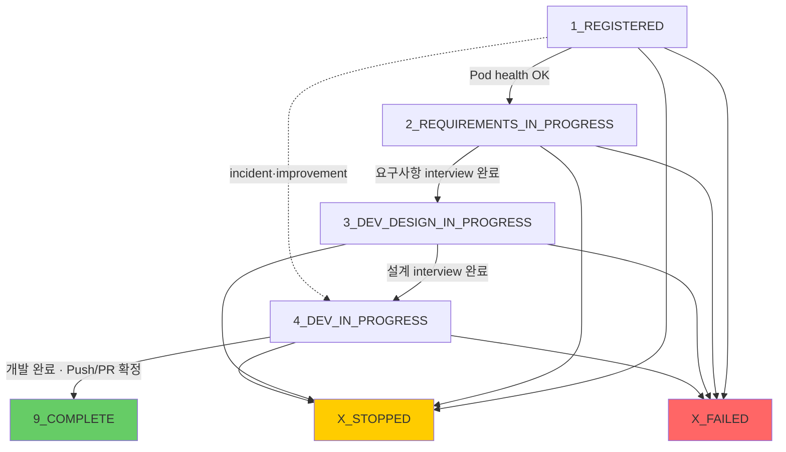
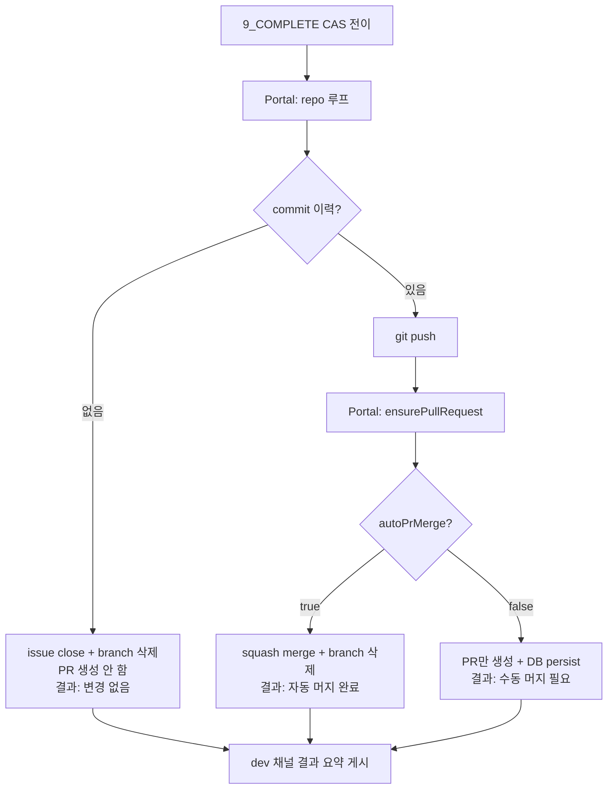
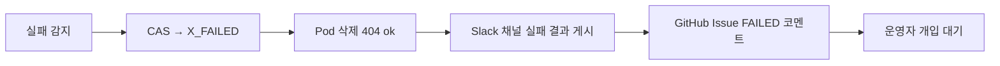
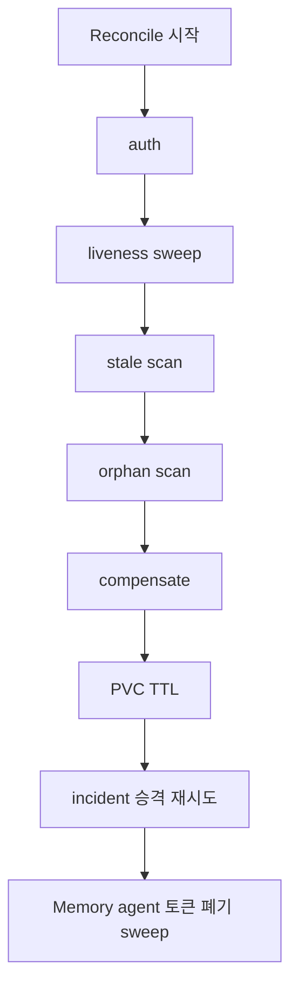

# SDLC 상태 머신 — 상태 전이·CAS·보상·Pod 프로비저닝

> AIways On의 상태 머신은 `5`~`8`을 예약만 하고 `9_COMPLETE`를 유일한 성공 terminal로 두며, Slack 채널 연동을 기본으로 한다.
> CAS 기반 전이, 멱등성, 보상 트랜잭션, 단방향 전이 그래프 등 검증된 메커니즘을 핵심 설계로 채택한다.

## 1. 상태 정의

AIways On은 **Git Push·PR 생성까지가 시스템 책임 범위이며 그 이후 배포는 시스템 외부다**. 정상 4단계 + 완료 1개 + 예외 2개.

```typescript
export enum Stage {
  REGISTERED = '1_REGISTERED',                    // 요청 등록 완료
  REQUIREMENTS_IN_PROGRESS = '2_REQUIREMENTS_IN_PROGRESS', // 요구사항 정의 중
  DEV_DESIGN_IN_PROGRESS = '3_DEV_DESIGN_IN_PROGRESS',     // 설계 중
  DEV_IN_PROGRESS = '4_DEV_IN_PROGRESS',          // 개발 중
  // 5, 6, 7, 8 — 향후 배포/검증 단계용 예약 (미사용, enum 값 없음)
  COMPLETE = '9_COMPLETE',                        // 완료 (Git Push·PR까지 확정)
  STOPPED = 'X_STOPPED',                          // 사용자 중지 (예외)
  FAILED = 'X_FAILED',                            // 실패 (보상 완료, 예외)
}

export const TERMINAL_STAGES: readonly Stage[] = [
  Stage.COMPLETE,
  Stage.STOPPED,
  Stage.FAILED,
];
```

> `5`·`6`·`7`·`8`은 배포·검증 단계를 재도입할 때 쓰도록 **번호만 예약**한다. enum에 값을 두지 않으므로 지금 이 번호로 전이하려는 요청은 전부 불법이다.

### 1.1 파이프라인 프로파일 (`metadata.pipelineProfile`)

장애 대응 agent와 자체개선 agent가 추가되어도 **`Stage` enum 자체는 한 값도 늘거나 줄지 않는다**. 파이프라인 종류는 상태가 아니라 `sdlc_requests.metadata.pipelineProfile` 문자열 하나로 구분한다.

| 프로파일 | 값 | 진입 경로 | 채널 | 특징 |
|---------|-----|----------|------|------|
| 기능 개발 | `feature` (기본값·미지정 시) | 사용자 SR 등록 UI / `POST /intake` | `requirements` + `design` + `dev` 3개 | `1 → 2 → 3 → 4 → 9` 전체 경로 |
| 장애 대응 | `incident` | incident 자동 승격 (`POST /incidents/ingest`) | **`dev` 1개만** | 요구사항·설계 스킵, 자동 머지 금지 |
| 자체개선 | `improvement` | `portal-sdlc-improve-scan` CronJob | **`dev` 1개만** | 요구사항·설계 스킵, 읽기 전용 실행 |

- `ChannelType` enum(`requirements` \| `design` \| `dev`)도 불변이다. `incident`/`improvement` 프로파일은 그 중 `dev` 채널만 **생성**하며, 쓰지 않는 채널을 만들지 않을 뿐 enum 값을 추가·제거하지 않는다.
- 프로파일이 없거나 `feature`인 SR은 기본 동작과 완전히 동일하다. 판정은 Portal이 `metadata.pipelineProfile`을 읽어 수행하며, n8n·Pod은 프로파일을 몰라도 된다.

> 프로파일별 상세는 [11-incident-response-agent.md](./11-incident-response-agent.md) 4절, [12-self-improvement-agent.md](./12-self-improvement-agent.md) 3절 참조.

### 1.2 접수 프로비저닝 (단일 흐름)

접수는 자원 게이트나 대기 큐를 거치지 않는다. `POST /intake`는 SR 등록 직후 채널·Pod 생성까지 **한 흐름으로** 처리하고 `201 { requestNo, status: "1_REGISTERED" }`를 반환한다.

```typescript
// SR 등록 → 즉시 프로비저닝 (게이트/큐 없음)
const requestId = await registerSdlcRequest(input);   // sdlc_requests INSERT (dedupKey 멱등)
await provisionSdlcRequest(requestId);                // 채널 생성 + Pod 생성 + n8n webhook
```

- 프로비저닝 단계가 실패하면 대기 상태로 남기지 않고 **보상 트랜잭션**(§6)으로 `X_FAILED` 처리한다.
- `SDLC_IMPROVEMENT_ENABLED` / `SDLC_INCIDENT_ENABLED` fail-closed 플래그는 접수 자체를 막는 스위치로 유지된다 (자원 여유와 무관).

## 2. 상태 전이 규칙

### 2.1 LEGAL_TRANSITIONS

| 현재 상태 | 허용된 다음 상태 |
|----------|-----------------|
| `1_REGISTERED` | `2_REQUIREMENTS_IN_PROGRESS`, `X_STOPPED`, `X_FAILED` |
| `2_REQUIREMENTS_IN_PROGRESS` | `3_DEV_DESIGN_IN_PROGRESS`, `X_STOPPED`, `X_FAILED` |
| `3_DEV_DESIGN_IN_PROGRESS` | `4_DEV_IN_PROGRESS`, `X_STOPPED`, `X_FAILED` |
| `4_DEV_IN_PROGRESS` | `9_COMPLETE`, `X_STOPPED`, `X_FAILED` |
| `9_COMPLETE` | (없음 - terminal) |
| `X_STOPPED` | (없음 - terminal) |
| `X_FAILED` | (없음 - terminal) |

**조건부 전이 1개** — 아래 전이는 `metadata.pipelineProfile !== 'feature'`일 때만 합법이다.

| 현재 상태 | 조건부 다음 상태 | 조건 |
|----------|-----------------|------|
| `1_REGISTERED` | `4_DEV_IN_PROGRESS` ※ | `pipelineProfile ∈ {incident, improvement}` — 요구사항·설계 단계 스킵 |

`4_DEV_IN_PROGRESS → 9_COMPLETE`는 **전 프로파일 공통**이므로 조건부가 아니다. 코드 수정이 있었는지(incident의 `PATCH_PROPOSED`, improvement의 리포트 전용 종결 등)는 전이 목적지를 바꾸지 않고, `4 → 9` 진입 작업(§4.4) 안의 "commit 이력 있음/없음" 분기가 흡수한다.

```typescript
// src/lib/sdlc/state-machine.ts
export function isLegalTransition(
  from: Stage,
  to: Stage,
  profile: PipelineProfile = 'feature',
): boolean {
  if (LEGAL_TRANSITIONS[from]?.includes(to)) return true;
  if (profile === 'feature') return false;
  // ※ incident / improvement 전용 조건부 전이 1개
  if (from === Stage.REGISTERED && to === Stage.DEV_IN_PROGRESS) return true;
  return false;
}
```

> ※ `LEGAL_TRANSITIONS` 테이블 자체에는 추가하지 않는다. `feature` SR이 `1 → 4`를 요청하면 `INVALID_TRANSITION` 422로 차단된다. 상세는 [11-incident-response-agent.md](./11-incident-response-agent.md) 4.3절, [12-self-improvement-agent.md](./12-self-improvement-agent.md) 3.3절 참조.

> **설계 결정: 역방향 전이 0개.** 상태 그래프는 단방향 DAG이며 "뒤로" 가는 전이는 하나도 없다. 개발 결과가 불만족스러워 다시 작업해야 하면 기존 SR을 되돌리지 않고 **신규 SR을 등록**해 처리한다. 이력·채널·PR이 SR 단위로 1:1 대응해야 감사 추적이 끊기지 않기 때문이다.

### 2.2 전이 다이어그램



> 점선 1개가 조건부 전이다. `incident`/`improvement` 프로파일에서만 활성화되며, 실선 경로(`feature`)는 기본 동작과 동일하다. 되돌아오는 화살표가 없다는 점이 이 그래프의 불변 조건이다.

### 2.3 전이 조건 및 트리거

| 현재 → 다음 | 트리거 | 진입 작업 |
|------------|--------|-----------|
| `1 → 2` | Pod health check 완료 (n8n WF-A) | 요구사항 채널 멤버 초대 + Pod 단계 알림 |
| `2 → 3` | 요구사항 interview 완료 (n8n WF-B) | 설계 채널 멤버 초대 + **요구사항 채널 스냅샷** |
| `3 → 4` | 설계 interview 완료 (n8n WF-B) | DEV 채널 멤버 초대 + **설계 채널 스냅샷** |
| `4 → 9` | 개발 완료 (n8n WF-B) — feature는 개발 서브스테이지 전부 완료, incident는 `sdlc_incidents.status ∈ {GUIDE_READY, PATCH_PROPOSED}`, improvement는 `sdlc_improvement_scans.status === 'completed'`. `idempotencyKey = {requestNo}->9_COMPLETE` | **Portal 직접 Git Push·PR 생성** + `autoPrMerge` 분기 + **DEV 채널 스냅샷** + **dev 채널 결과 요약 게시** + Pod 종료 + feedback poll 비활성화 |
| `1 → 4` ※ | Pod health check 완료 (n8n WF-A) — `pipelineProfile ∈ {incident, improvement}`일 때만. actor `n8n-wf-a`(incident) / `n8n-agent-improve`(improvement), `idempotencyKey = {requestNo}->4_DEV_IN_PROGRESS` | DEV 채널 멤버 초대 + Pod 단계 알림 + `devSubStage.current = 'dev'` (요구사항·설계 채널 없으므로 스냅샷 없음) |
| `* → X_STOPPED` | 사용자/관리자 중지 | Pod 종료 + feedback poll 비활성화 |
| `* → X_FAILED` | 실패 감지 | **보상 트랜잭션** 실행 |

## 3. CAS (Compare-And-Swap) 상태 전이

상태 전이는 원자성 보장을 위해 CAS 패턴을 사용한다. `advance.ts` 로직이 이를 담당한다.

```typescript
// src/lib/sdlc/advance.ts
export async function advance(input: AdvanceInput): Promise<AdvanceResult> {
  const { requestNo, from, to, actor, idempotencyKey } = input;

  // 1. CAS update: current status === from 일 때만 to로 변경
  const rows = await db
    .update(sdlcRequests)
    .set({ status: to, updatedAt: new Date() })
    .where(and(
      eq(sdlcRequests.requestNo, requestNo),
      eq(sdlcRequests.status, from),  // CAS 조건
    ))
    .returning({ id: sdlcRequests.id, status: sdlcRequests.status });

  // 2. CAS 실패 처리
  if (rows.length === 0) {
    const [current] = await db.select({ status: sdlcRequests.status })
      .from(sdlcRequests).where(eq(sdlcRequests.requestNo, requestNo));
    if (!current) throw new NotFoundError(requestNo);
    if (current.status === to) return { idempotent: true };  // 이미 목표 상태
    throw new StaleFromError(requestNo, from, current.status);
  }

  // 3. 전이 이력 + 감사 로그 기록 (idempotencyKey 멱등성)
  await db.insert(sdlcStageTransitions).values({
    requestId: rows[0].id, fromStatus: from, toStatus: to,
    actor, idempotencyKey,
  }).onConflictDoNothing({ target: sdlcStageTransitions.idempotencyKey });

  await db.insert(auditEvents).values({
    correlationId: requestNo, actorId: actor,
    action: 'sdlc.advance', resourceType: 'sdlc_request',
    resourceId: requestNo, beforeState: { status: from }, afterState: { status: to },
  });

  // 4. 단계 진입 작업 실행 (orchestrator)
  await runStageEntryActions(rows[0].id, to, requestNo);

  return { id: rows[0].id, requestNo, from, to, idempotent: false };
}
```

### 3.1 오류 처리

| 오류 클래스 | 상황 | HTTP 상태 |
|-------------|------|-----------|
| `StaleFromError` | 현재 상태가 예상과 다름 | 409 Conflict |
| `InvalidTransitionError` | LEGAL_TRANSITIONS에 없는 전이 | 422 Unprocessable Entity |
| `NotFoundError` | 요청 미존재 | 404 Not Found |

### 3.2 멱등성 보장

```sql
-- sdlc_requests: 중복 요청 방지
CREATE UNIQUE INDEX idx_sdlc_requests_dedupkey ON sdlc_requests(dedupKey);

-- sdlc_stage_transitions: 중복 전이 방지
CREATE UNIQUE INDEX idx_sdlc_stage_transitions_idemkey ON sdlc_stage_transitions(idempotencyKey);
```

동일 `idempotencyKey`의 전이 요청은 첫 번째만 처리되고, 이후는 멱등(true) 응답.

## 4. 단계별 진입 작업 (Entry Actions)

`orchestrator.ts`의 `runStageEntryActions`가 각 상태 진입 시 실행하는 작업. **Slack 채널** 기준.

### 4.1 `1_REGISTERED → 2_REQUIREMENTS_IN_PROGRESS`

```typescript
case Stage.REQUIREMENTS_IN_PROGRESS:
  await _inviteMembersToChannel(requestId, '요구사항정의', req, 'requirements');
  await _notifyPodStageChange(requestId, stage);
```

1. 요구사항 Slack 채널에 멤버 초대 (`adapter.inviteMembers`)
2. Pod에게 단계 전환 알림 (`POST /stage`)

### 4.2 `2 → 3_DEV_DESIGN_IN_PROGRESS`

```typescript
case Stage.DEV_DESIGN_IN_PROGRESS:
  await _inviteMembersToChannel(requestId, '설계', req, 'design');
  await _notifyPodStageChange(requestId, stage);
  await _snapshotChannel(requestId, 'requirements'); // 이전 단계 스냅샷
```

1. 설계 Slack 채널에 멤버 초대
2. Pod 단계 알림
3. 요구사항 채널 메시지 스냅샷 (Slack `conversations.history` → DB 저장)

### 4.3 `3 → 4_DEV_IN_PROGRESS`

```typescript
case Stage.DEV_IN_PROGRESS:
  await _inviteMembersToChannel(requestId, 'DEV', req, 'dev');
  await _notifyPodStageChange(requestId, stage);
  await _snapshotChannel(requestId, 'design');
```

### 4.4 `4 → 9_COMPLETE`

```typescript
case Stage.COMPLETE:
  await _finalizeRepositoriesForRequest(requestId, req);  // repo 루프: push → PR 생성 → autoPrMerge 분기
  await _snapshotChannel(requestId, 'dev');
  await _postCompletionSummary(requestId, req);           // dev 채널 결과 요약 게시
  await _terminatePodForRequest(requestId, stage);
  await _notifyPodStageChange(requestId, stage);
  await _deactivateAllFeedbackPolls(requestId);
```

**Portal이 직접 GitHub API로 Git Push·PR 생성·merge를 확정한다** (Pod 관여 X). 배포는 시스템 범위 밖이므로 이 단계가 성공 terminal이다.



**incident 예외** — `pipelineProfile === 'incident'`인 SR은 repo 설정이 `autoPrMerge=true`여도 **자동 머지하지 않는다**. PR만 생성하고 결과를 `수동 머지 필요(장애 대응 정책)`로 표기한다. 장애 패치는 사람이 반드시 눈으로 확인해야 하기 때문이다 ([11-incident-response-agent.md](./11-incident-response-agent.md) 참조).

#### dev 채널 결과 공유 메시지

전 repo 처리가 끝나면 **한 메시지에 집계해** dev 채널에 게시한다 (`adapter.postMessage`). 수동 merge 안내와 feedback poll 등록을 대체하는 단일 창구다.

```markdown
## ✅ SDLC 요청 완료 — SR-20260629-001

⚠️ **담당자 액션 필요** — 수동 머지가 필요한 PR이 1건 있습니다.

| Repo | PR | 머지 상태 |
|---|---|---|
| `acme/portal` | [#412](https://github.com/acme/portal/pull/412) | 자동 머지 완료 |
| `acme/api` | [#87](https://github.com/acme/api/pull/87) | 수동 머지 필요 |
| `acme/infra` | — | 변경 없음 — PR 미생성 |

- 상태: `9_COMPLETE`
- 배포는 시스템 범위 밖입니다. 머지 이후 배포는 각 repo 정책에 따라 진행하세요.

<!-- SDLC-COMPLETE:SR-20260629-001 -->
```

- 머지 상태 값은 `자동 머지 완료` / `수동 머지 필요` / `수동 머지 필요(장애 대응 정책)` / `변경 없음 — PR 미생성` 4종.
- 수동 머지 필요 건이 **1개 이상**이면 헤더에 담당자 액션 요구 문구를 붙인다. 0건이면 이 줄을 생략한다.
- `<!-- SDLC-COMPLETE:{requestNo} -->` dedup 마커로 재시도 시 중복 게시를 막는다.
- 게시 실패는 non-fatal이다 (상태는 이미 `9_COMPLETE`로 확정됨).

### 4.5 예외 종료 (`X_STOPPED` / `X_FAILED`)

```typescript
case Stage.STOPPED:
case Stage.FAILED:
  await _terminatePodForRequest(requestId, stage);
  await _notifyPodStageChange(requestId, stage);
  await _deactivateAllFeedbackPolls(requestId);
```

1. Pod 종료 (self-terminate API 호출)
2. Pod 단계 알림
3. 모든 feedback poll 비활성화

> `X_FAILED` 진입 시는 보상 트랜잭션(`compensateFailedSdlc`)이 별도 수행 (아래 6절).

## 5. 채널 스냅샷 메커니즘

단계 완료 시 이전 단계 Slack 채널 메시지를 Portal DB에 저장한다. 채널 메시지가 회전·삭제된 뒤에도 이력 유지.

```typescript
export async function snapshotChannelOnStageComplete(
  sdlcRequestId: string, enteringStage: Stage,
): Promise<void> {
  let channelType: ChannelType | null = null;
  switch (enteringStage) {
    case Stage.DEV_DESIGN_IN_PROGRESS: channelType = 'requirements'; break;
    case Stage.DEV_IN_PROGRESS:        channelType = 'design';      break;
    case Stage.COMPLETE:               channelType = 'dev';         break;
    default: return;
  }
  await snapshotChannel(sdlcRequestId, channelType);
}

async function snapshotChannel(requestId, channelType) {
  const adapter = getMessagingAdapter();
  const [channelRow] = await db.select().from(sdlcMessagingChannels)
    .where(and(eq(sdlcMessagingChannels.requestId, requestId),
               eq(sdlcMessagingChannels.type, channelType)));
  if (!channelRow) { logger.warn('snapshot: channel not found'); return; }

  const messages = await adapter.listMessages(channelRow.channelId, 1000);
  if (!messages.length) return;

  // 하드 캡 1000개 초과 시 가장 오래된 것 삭제
  const capped = messages.slice(0, 1000);
  await db.insert(sdlcRequestChannelMessages).values(
    capped.map((m) => ({
      requestId, channelId: channelRow.channelId, channelType,
      messageId: m.id, authorId: m.authorId, authorName: m.authorName,
      content: m.content, createdAt: new Date(m.createdAt),
    })),
  );
}
```

### 제한 사항 (유지)

- **하드 캡**: 채널당 최대 1000개 메시지 (초과 시 가장 오래된 것 삭제)
- **실패 격리**: 스냅샷 실패는 단계 전이를 블로킹하지 않음 (warn 로그만)

## 6. 보상 트랜잭션 (X_FAILED)

실패 시 즉시 전체 삭제하지 않고, 단계별 보상 트랜잭션을 수행한다.



```typescript
export async function compensateFailedSdlc(requestNo: string): Promise<void> {
  const adapter = getMessagingAdapter();

  // 1. CAS → X_FAILED
  await advance({ requestNo, from: currentStage, to: Stage.FAILED,
    actor: 'compensator', idempotencyKey: `compensate:${requestNo}` });

  // 2. Pod 삭제 (404 ok — ensure-delete)
  await ensureDeletePod(podName, namespace);

  // 3. 모든 채널 스냅샷 (이력 보존)
  await snapshotAllChannelsForRequest(requestId);

  // 4. 각 채널에 실패 결과 게시 (아카이브하지 않음 — 후속 논의 창구 유지)
  for (const channel of channels) {
    await ensureChannelMessage(
      adapter, channel.channelId, FAILED_CHANNEL_BODY, dedupMarker,
    );
  }

  // 5. GitHub Issue에 FAILED 코멘트 (close 하지 않음)
  await ensureIssueComment(pat, repo, issueNumber, FAILED_BODY, dedupMarker);
}
```

### 실패 결과 채널 메시지 형식

```markdown
## ❌ SDLC 요청 실패 — SR-20260629-001

자동 보상 트랜잭션이 실행되었습니다.

- 실패 단계: `4_DEV_IN_PROGRESS`
- 실패 원인: `PodRunTimeout — /autopilot run이 1800s를 초과했습니다`
- 삭제된 Pod: `sdlc-pod-sr-20260629-001`
- GitHub Issue: [#128](https://github.com/acme/portal/issues/128)
- 생성된 PR: [#412](https://github.com/acme/portal/pull/412) (미머지)
- 상태: `X_FAILED`

이 채널은 유지됩니다. 운영자 개입이 필요하며, 후속 논의는 이 채널에서 계속하세요.

<!-- SDLC-FAILED:SR-20260629-001 -->
```

- `<!-- SDLC-FAILED:{requestNo} -->` dedup 마커를 **채널 메시지에도 동일하게 적용**한다. `ensureChannelMessage`는 최근 메시지에서 마커를 조회해 이미 있으면 건너뛰므로, Reconcile이 보상을 재시도해도 중복 게시되지 않는다.
- PR이 없으면 해당 줄을 생략한다.
- **게시 실패는 non-fatal**이다.

### FAILED 코멘트 형식

```markdown
## ❌ SDLC 요청 실패 — SR-20260629-001

자동 보상 트랜잭션이 실행되었습니다.

- Pod 삭제 완료
- Slack 채널에 실패 결과 게시 완료
- 상태: `X_FAILED`

운영자 개입이 필요합니다.

<!-- SDLC-FAILED:SR-20260629-001 -->
```

> 각 보상 단계는 실패해도(non-fatal) 계속 진행한다. 이는 보상 트랜잭션의 핵심 원칙이다.

## 7. DevSubStage (개발 서브스테이지 추적)

`4_DEV_IN_PROGRESS` 단계는 내부적으로 4개 서브스테이지로 세분화된다. 각 서브스테이지는 n8n Workflow B가 순차 실행하며, 진행 상태는 `sdlc_requests.metadata.devSubStage`에 저장된다.

### 7.1 서브스테이지 순서

```typescript
const DEV_SUBSTAGE_ORDER = ['dev', 'qa', 'code_review', 'security_review'] as const;
type DevSubstage = (typeof DEV_SUBSTAGE_ORDER)[number];
```

| 서브스테이지 | 순서 | n8n 노드 | Pod 실행 내용 |
|-------------|------|----------|--------------|
| `dev` | 1 | `POST Substage: dev` → `Send Dev run(sdlc-pod)1` | `/autopilot` 개발 (구현·테스트·commit·push) |
| `qa` | 2 | `POST Substage: qa` → `Send QA run(sdlc-pod)` | qa-agent 실행 (Playwright QA 검수, `playwright_enabled` + `dev_server_url` repo만) |
| `code_review` | 3 | `POST Substage: code_review` → `Send CodeReview run(sdlc-pod)` | 코드 리뷰 (정적 분석) |
| `security_review` | 4 | `POST Substage: security_review` → `Send SecurityReview run(sdlc-pod)` | 보안 리뷰 |

### 7.2 서브스테이지 전이 흐름

```mermaid
flowchart LR
    A[4_DEV_IN_PROGRESS 진입] --> S1[POST Substage: dev]
    S1 --> R1[Send Dev run - autopilot]
    R1 --> CB1{run.completed}
    CB1 --> S2[POST Substage: qa]
    S2 --> R2[Send QA run]
    R2 --> CB2{run.completed}
    CB2 --> S3[POST Substage: code_review]
    S3 --> R3[Send CodeReview run]
    R3 --> CB3{run.completed}
    CB3 --> S4[POST Substage: security_review]
    S4 --> R4[Send SecurityReview run]
    R4 --> CB4{run.completed}
    CB4 --> ADV[Advance to 9]
```



### 7.3 metadata 구조

```json
{
  "devSubStage": {
    "current": "qa",
    "history": [
      { "stage": "dev", "completedAt": "2026-09-01T10:00:00Z" },
      { "stage": "qa", "startedAt": "2026-09-01T12:00:00Z" }
    ]
  }
}
```

### 7.4 서브스테이지 갱신 API

**`POST /api/v1/sdlc/requests/{id}/dev-substage`** — 인증: `Bearer {SDLC_MASTER_KEY}`

n8n이 각 서브스테이지 시작/완료 시 호출. `metadata.devSubStage.current` 갱신 + audit 로그.

**요청 본문**:

```json
{
  "substage": "qa",
  "action": "start"
}
```

> `action`: `start` | `complete`. `complete` 시 `history` 배열에 완료 시각 기록.

### 7.5 UI 갱신

SR 상세 페이지(`08-sr-registration-ui.md` 6.1절)에서 `4_DEV_IN_PROGRESS` 단계일 때 10초마다 상세 재조회하여 devSubStage 진행 상태 갱신. 각 서브스테이지를 스텝 표시로 렌더링.

> **설계 결정**: `stageKey` = `${status}:${devSubStage.current}` 규칙은 resume 예산용이었으나 **resume 기능 미도입으로 stageKey 규칙 자체 제거**. devSubStage는 순수 진행 표시용으로만 사용.

## 8. Reconcile (5분 CronJob)

Reconcile은 SDLC 요청의 stale/orphaned 상태를 주기적으로 점검하고 보상 트랜잭션을 실행한다. 5분마다 K8s CronJob이 `POST /api/internal/sdlc/reconcile`을 호출한다.

### 8.1 Reconcile 순서



| 단계 | 동작 | 환경 변수 |
|------|------|----------|
| **auth** | 인증 토큰 검증 | `SDLC_RECONCILE_TOKEN` |
| **liveness sweep** | `sdlc_pod_sessions.status`를 K8s 실제 Pod 상태와 동기화 (Running/Pending/Failed) | — |
| **stale scan** | `SDLC_RECONCILE_STALENESS_SECONDS`(기본 2100s = 최장 pod run 1800s + 여유) 초과 활성 SR 검출 → 보상 | `SDLC_RECONCILE_STALENESS_SECONDS` |
| **orphan scan** | `SDLC_RECONCILE_POD_MISSING_SECONDS`(기본 600s) 초과 Pod 부재 감지 → 보상 | `SDLC_RECONCILE_POD_MISSING_SECONDS` |
| **compensate** | stale/orphan 감지 시 `compensateFailedSdlc()` 실행 → `X_FAILED` 전이 | — |
| **PVC TTL** | `SDLC_PVC_RETENTION_DAYS`(기본 7일) 초과 PVC 삭제 | `SDLC_PVC_RETENTION_DAYS` |
| **incident 승격 재시도** | `status='DETECTED' AND requestId IS NULL AND promotionAttempts > 0 AND updatedAt < now() - SDLC_INCIDENT_PROMOTE_STALE_MINUTES` 인 `sdlc_incidents` 행의 SR 승격 재시도 → `promotionAttempts += 1`, `updatedAt` 갱신. `promotionAttempts >= 3`이면 incident를 `X_FAILED`로 전이 | `SDLC_INCIDENT_PROMOTE_STALE_MINUTES` |
| **Memory 토큰 sweep** | `sdlc_memory_access_tokens` 중 `subjectType='agent'`이고 연결된 SR이 종결 상태(`9_COMPLETE`/`X_STOPPED`/`X_FAILED`)이거나 `expiresAt`이 경과한 행(`revokedAt IS NULL`)에 `revokedAt = now()` 설정 | `SDLC_MEMORY_AGENT_TOKEN_TTL_MINUTES` |

> **`sdlc_incidents`에는 `promoting` 상태가 없다.** 도메인은 `DETECTED | TRIAGING | SR_PROMOTED | GUIDE_READY | PATCH_PROPOSED | RESOLVED | X_FAILED | ARCHIVED`이며 ([11-incident-response-agent.md](./11-incident-response-agent.md) 8.1절), 승격 실패 시 `status`는 `DETECTED`로 **유지**되고 `promotionAttempts`만 증가한다. 따라서 재시도 대상은 "`DETECTED`인데 `requestId`가 아직 없고 이미 1회 이상 시도했으며 stale한 행"으로 식별한다.

> 7·8단계는 각각 [11-incident-response-agent.md](./11-incident-response-agent.md) 3절, [13-developer-memory-agent.md](./13-developer-memory-agent.md) 8.2절이 정의한다. 두 단계 모두 실패해도 non-fatal이며, 다음 reconcile 회차에서 재시도한다 (보상 트랜잭션 원칙).

> **설계 결정**: resume sweep 단계는 미도입. liveness sweep → stale scan → orphan scan → compensate → PVC TTL → incident 승격 재시도 → Memory 토큰 sweep 순서로 구성.

### 8.2 Reconcile 환경 변수

| 변수 | 기본값 | 용도 |
|------|--------|------|
| `SDLC_RECONCILE_TOKEN` | — | reconcile CronJob 인증 Bearer 토큰 |
| `SDLC_RECONCILE_STALENESS_SECONDS` | 2100 | stale 판정 기준 (최장 pod run 1800s + 여유) |
| `SDLC_RECONCILE_POD_MISSING_SECONDS` | 600 | Pod 부재 감지 cutoff |
| `SDLC_PVC_RETENTION_DAYS` | 7 | PVC 보존 기간 (초과 시 삭제) |
| `SDLC_POD_STORAGE_SIZE` | 20Gi | Pod PVC 요청 storage |
| `SDLC_INCIDENT_PROMOTE_STALE_MINUTES` | 30 | 승격 미완료(`DETECTED` + `requestId IS NULL` + `promotionAttempts > 0`) incident의 재시도 stale 임계 |
| `SDLC_MEMORY_AGENT_TOKEN_TTL_MINUTES` | 240 | agent용 Memory MCP 토큰 TTL (Pod `activeDeadlineSeconds` 4시간과 정렬) |

> **K8s 인프라 상세** (CronJob manifest, RBAC 등)는 [10-k8s-infrastructure.md](./10-k8s-infrastructure.md) 참조.

## 9. 핵심 파일 구성

```
src/lib/sdlc/
├── state-machine.ts    # Stage enum, LEGAL_TRANSITIONS, isLegalTransition
├── advance.ts          # CAS advance(), StaleFromError, InvalidTransitionError
├── orchestrator.ts     # runStageEntryActions, 보상 트랜잭션, PR 생성·merge, 프로비저닝
├── repo-secrets.ts     # GitHub PAT 관리 (secret_refs AES-256-GCM 암호화)
├── repo-setup.ts       # Repo 등록 시 1회 초기 셋업 파이프라인
├── request-no.ts       # SR-YYYYMMDD-NNN 요청 번호 생성
└── image-url.ts        # 이미지 프록시 서빙 URL 서명 (HMAC-SHA256)
```

> **설계 결정**: `resume.ts`는 미도입 (resume 기능 전체 미도입). `capacity.ts`·`queue.ts`도 미도입 — 자원 게이트와 대기 큐를 두지 않고 접수 즉시 프로비저닝한다(§1.2). `repo-setup.ts`, `request-no.ts`, `image-url.ts` 명시.
