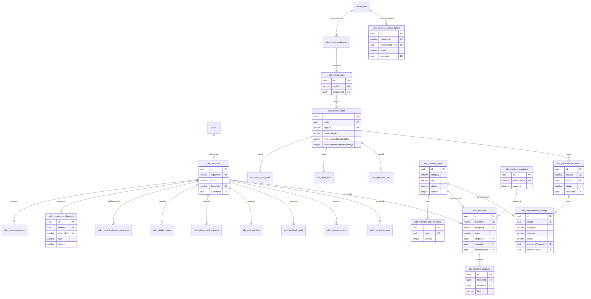

# DB 스키마 설계 — PostgreSQL + Drizzle ORM

> AIways On의 스키마는 **SDLC 코어 테이블**로 구성하며, System 추상화 의존성을 두지 않는다.
> Slack 중립 `sdlc_messaging_channels`을 채널 테이블로 사용하고, 인증 테이블을 포함한다.

## 1. 개요

### 1.1 설계 원칙

- **PostgreSQL + Drizzle ORM** (기술 스택)
- `pgSchema` 분리 (`sdlc` 스키마)
- **Secret 분리**: 실제 비밀값은 `secret_refs`에 AES-256-GCM 암호화 저장, 본 테이블은 참조만
- **멱등성 인덱스**: `dedupKey`, `idempotencyKey` 고유 인덱스
- **FK cascade 정책**: 부모 삭제 시 자식 cascade

### 1.2 설계 결정

| 항목 | 설계 결정 | 근거 |
|------|----------|------|
| System 추상화 | **미도입** — GitHub Org가 최상위 엔티티 | 다중 시스템 관리 불필요, GitHub 조직 구조가 최상위 기준 |
| `systemId` FK | 미도입 (org가 최상위) | System 추상화 미도입에 따른 연쇄. 13번 문서의 `sdlc_memory_systems` 테이블도 제거되어 전역 규정 단일 집합으로 일치 |
| 채널 테이블 | `sdlc_messaging_channels` (플랫폼 중립) | Slack 기반이나 어댑터 추상화로 Discord 등 확장 가능 |
| 인증 | Auth.js 테이블 추가 (`users`, `accounts`, `sessions`) | GitHub OAuth 기반 인증 |
| AD 계정 | 미도입 (목업 캡처 로그인은 별도 설정) | GitHub OAuth가 사용자 식별을 담당 |
| Stage `5`·`6`·`7`·`8` | **미사용 예약** — 향후 배포/검증 단계 재도입용. 성공 terminal은 `9_COMPLETE` 단일 | 시스템 책임 범위가 Git Push·PR까지이고 그 이후 배포는 시스템 외부. 번호만 비워 두면 재도입 시 기존 값 재해석이 불필요 |
| 서버간 인증 토큰 | **`SDLC_MASTER_KEY` 환경변수 단일 키** — per-SR `callbackToken` 발급 및 `callbackTokenRef` FK 체인 미도입 | 호출 주체가 동일 운영 조직이므로 토큰 분리의 관리 비용만 크다. per-SR 토큰 발급이 없어져 `sdlc_requests`·`sdlc_repo_setup_jobs`의 `callback_token_ref` 컬럼이 불필요 |
| `secret_refs` | **유지** (GitHub PAT, repo 파일/환경변수 등) | callbackToken 용도만 사라지고 다른 비밀값 암호화 참조는 그대로 필요 |
| Conda 캐시 | `sdlc_conda_cache_versions` 도입 (Pod 환경 캐시, 6장 참조) | Pod 시작 시간 단축 |

### 1.3 테이블 목록

| 그룹 | 테이블 | 용도 |
|------|--------|------|
| 인증 | `users`, `accounts`, `sessions`, `verification_tokens` | Auth.js v5 GitHub OAuth |
| 코어 | `sdlc_requests` | SR 요청 기본 정보 |
| 전이 | `sdlc_stage_transitions` | 상태 전이 이력 |
| 캐시 | `sdlc_conda_cache_versions` | Conda 환경 캐시 (Pod 시작 시간 단축) |
| 메시징 | `sdlc_messaging_channels`, `sdlc_request_channel_messages` | Slack 채널 + 메시지 스냅샷 |
| GitHub | `sdlc_github_orgs`, `sdlc_github_repos`, `sdlc_github_credentials`, `sdlc_github_issues`, `sdlc_github_pull_requests` | GitHub 연동 |
| Pod | `sdlc_pod_sessions` | K8s Pod 세션 |
| 피드백 | `sdlc_feedback_polls` | 사용자 피드백 대기 |
| 보고서 | `sdlc_request_reports` | 단계별 보고서 markdown |
| 이미지 | `sdlc_request_images` | UI 목업 S3 메타데이터 |
| Repo 셋업 | `sdlc_repo_setup_jobs`, `sdlc_repo_files`, `sdlc_repo_env_vars` | Repo 등록 시 초기 셋업 |
| 공통 | `secret_refs`, `audit_events` | Secret 참조 + 감사 로그 |
| 장애 | `sdlc_incidents`, `sdlc_incident_templates`, `sdlc_incident_analyses` | 장애 레코드·템플릿·분석 산출물 ([11-incident-response-agent.md](./11-incident-response-agent.md) 8절 참조) |
| 개선 | `sdlc_improvement_scans`, `sdlc_improvement_findings` | 자체개선 스캔 회차 + 발굴 항목 ([12-self-improvement-agent.md](./12-self-improvement-agent.md) 7절 참조) |
| 규정 | `sdlc_memory_rules`, `sdlc_memory_rule_revisions`, `sdlc_memory_access_tokens` | 개발 규정 본체·개정 이력·MCP 접근 토큰 ([13-developer-memory-agent.md](./13-developer-memory-agent.md) 3절 참조) |

## 2. 인증 테이블 (Auth.js v5)

> 상세는 [01-auth-github.md](./01-auth-github.md) 참조. 여기서는 스키마만 정의.

```typescript
// src/db/schema/auth.ts
export const users = pgTable('users', {
  id: text('id').primaryKey().$defaultFn(() => crypto.randomUUID()),
  name: text('name'),
  email: text('email').notNull().unique(),
  emailVerified: timestamp('email_verified', { mode: 'date' }),
  image: text('image'),
  githubId: text('github_id').unique(),        // GitHub 사용자 고유 ID
  githubLogin: text('github_login'),            // GitHub username
  role: varchar('role', { length: 16 }).notNull().default('user'), // 'user' | 'admin'
  createdAt: timestamp('created_at').notNull().defaultNow(),
});

export const accounts = pgTable('accounts', {
  userId: text('user_id').notNull().references(() => users.id, { onDelete: 'cascade' }),
  type: text('type').notNull(),
  provider: text('provider').notNull(),
  providerAccountId: text('provider_account_id').notNull(),
  refresh_token: text('refresh_token'),
  access_token: text('access_token'),
  expires_at: integer('expires_at'),
  token_type: text('token_type'),
  scope: text('scope'),
  id_token: text('id_token'),
}, (t) => ({ pk: primaryKey({ columns: [t.provider, t.providerAccountId] }) }));

export const sessions = pgTable('sessions', {
  sessionToken: text('session_token').primaryKey(),
  userId: text('user_id').notNull().references(() => users.id, { onDelete: 'cascade' }),
  expires: timestamp('expires', { mode: 'date' }).notNull(),
});

export const verificationTokens = pgTable('verification_tokens', {
  identifier: text('identifier').notNull(),
  token: text('token').notNull(),
  expires: timestamp('expires', { mode: 'date' }).notNull(),
}, (t) => ({ pk: primaryKey({ columns: [t.identifier, t.token] }) }));
```

## 3. 코어 테이블

### 3.1 `sdlc_requests` — SR 요청

```typescript
export const sdlcRequests = mySchema.table('sdlc_requests', {
  id: uuid('id').primaryKey().defaultRandom(),
  requestNo: varchar('request_no', { length: 100 }).notNull(),
  submitter: varchar('submitter', { length: 255 }).notNull(),
  // 신규: GitHub 인증 연동
  submitterId: text('submitter_id').references(() => users.id),  // User.id (FK)
  submitterEmail: varchar('submitter_email', { length: 255 }),
  submitterGithubLogin: varchar('submitter_github_login', { length: 255 }),
  requestSite: varchar('request_site', { length: 50 }).notNull(),
  devType: varchar('dev_type', { length: 50 }).notNull(),
  requestSystem: varchar('request_system', { length: 255 }).notNull(),
  module: varchar('module', { length: 255 }),
  status: varchar('status', { length: 50 }).notNull().default('1_REGISTERED'),
  // systemId FK 미도입 (System 추상화 미도입)
  dedupKey: varchar('dedup_key', { length: 255 }).notNull(),
  metadata: jsonb('metadata').$type<Record<string, unknown>>(),
  createdAt: timestamp('created_at').notNull().defaultNow(),
  updatedAt: timestamp('updated_at').notNull().defaultNow(),
}, (t) => [
  uniqueIndex('sdlc_requests_request_no_idx').on(t.requestNo),
  uniqueIndex('sdlc_requests_dedup_key_idx').on(t.dedupKey),
]);
```

| 컬럼 | 타입 | 설명 |
|------|------|------|
| `id` | UUID PK | 기본 키 |
| `requestNo` | VARCHAR(100) | 요청 번호 (SR-YYYYMMDD-NNN), unique |
| `submitter` | VARCHAR(255) | 제출자명 |
| `submitterId` | TEXT FK→users | 제출자 User.id (신규, GitHub 인증 연동) |
| `submitterEmail` | VARCHAR(255) | 제출자 이메일 (신규) |
| `submitterGithubLogin` | VARCHAR(255) | GitHub username (Slack 멤버 매핑용, 신규) |
| `requestSite` | VARCHAR(50) | 요청 사이트 |
| `devType` | VARCHAR(50) | 개발 타입 (feature/bugfix 등) |
| `requestSystem` | VARCHAR(255) | 요청 시스템명 |
| `module` | VARCHAR(255) | 메뉴 경로 |
| `status` | VARCHAR(50) | 상태 (Stage enum: `1_REGISTERED`, `2_REQUIREMENTS_IN_PROGRESS`, `3_DEV_DESIGN_IN_PROGRESS`, `4_DEV_IN_PROGRESS`, `9_COMPLETE`, `X_STOPPED`, `X_FAILED`), 기본 `1_REGISTERED` |
| `dedupKey` | VARCHAR(255) | 멱등성 키, unique |
| `metadata` | JSONB | 추가 메타데이터 (members, dueDate 등) |

> `status`의 컬럼 타입은 VARCHAR(50)이므로 Stage enum 값 집합이 바뀌어도 **스키마 마이그레이션은 불필요**하다. default 값 `'1_REGISTERED'`도 그대로 유지된다.

### 3.2 `sdlc_stage_transitions` — 상태 전이 이력

```typescript
export const sdlcStageTransitions = mySchema.table('sdlc_stage_transitions', {
  id: uuid('id').primaryKey().defaultRandom(),
  requestId: uuid('request_id').notNull()
    .references(() => sdlcRequests.id, { onDelete: 'cascade' }),
  fromStatus: varchar('from_status', { length: 50 }).notNull(),
  toStatus: varchar('to_status', { length: 50 }).notNull(),
  idempotencyKey: varchar('idempotency_key', { length: 255 }).notNull(),
  actor: varchar('actor', { length: 255 }).notNull(),
  createdAt: timestamp('created_at').notNull().defaultNow(),
}, (t) => [
  uniqueIndex('sdlc_stage_transitions_idem_idx').on(t.idempotencyKey),
]);
```

### 3.3 `sdlc_conda_cache_versions` — Conda 환경 캐시 (Pod 시작 시간 단축)

> Pod Runner의 conda 환경 캐시. SDLC 코어 동작에는 필수 아니지만, Pod 시작 시간 단축용.
> `vibe-coding-setup` 출력을 포함한 **HEAD 기반 캐시 키** 사용.

```typescript
export const sdlcCondaCacheVersions = mySchema.table('sdlc_conda_cache_versions', {
  id: uuid('id').primaryKey().defaultRandom(),
  cacheKey: varchar('cache_key', { length: 64 }).notNull(),   // system_id + repo HEAD 해시
  envHash: varchar('env_hash', { length: 64 }),               // 실제 설치된 (name, version) 세트 해시
  objectKey: text('object_key').notNull(),                     // S3 tarball 객체 키
  sizeBytes: bigint('size_bytes', { mode: 'number' }),
  sourceRequestId: uuid('source_request_id').references(() => sdlcRequests.id, { onDelete: 'set null' }),
  createdAt: timestamp('created_at').notNull().defaultNow(),
}, (t) => [
  uniqueIndex('sdlc_conda_cache_key_idx').on(t.cacheKey, t.envHash),
]);
```

| 컬럼 | 타입 | 설명 |
|------|------|------|
| `id` | UUID PK | 기본 키 |
| `cacheKey` | VARCHAR(64) | 결정론적 캐시 키 (`manifest_hash.compute_cache_key(system_id, repos)` — repo HEAD 기반) |
| `envHash` | VARCHAR(64) | 빌드 후 conda 환경 핑거프린트 (같은 캐시키/다른 환경 구분용, best-effort) |
| `objectKey` | TEXT | S3 tarball 객체 키 (`sdlc/{systemId}/conda-cache/{cacheKey}[-{envHash}].tar.gz`) |
| `sizeBytes` | BIGINT | tarball 크기 (바이트) |
| `sourceRequestId` | UUID FK→sdlc_requests | 캐시를 생성한 SR (캐시 부작용 추적용, SET NULL on delete) |

> **캐시 워크플로우**: Pod clone 직후 `POST /conda/ensure-env` → cache_key로 S3 조회 → hit 시 다운로드+언팩, miss 시 `Setup Conda` 노드가 conda env 생성 → `POST /conda/pack-and-upload`로 S3 업로드. 상세는 [06-pod-runner-api.md](./06-pod-runner-api.md) 참조.

## 4. 메시징 테이블

### 4.1 `sdlc_messaging_channels` — Slack 채널 매핑

> 플랫폼 중립 컬럼으로 구성. Slack 기반이나 어댑터 추상화로 확장 가능.

```typescript
export const sdlcMessagingChannels = mySchema.table('sdlc_messaging_channels', {
  id: uuid('id').primaryKey().defaultRandom(),
  requestId: uuid('request_id').notNull()
    .references(() => sdlcRequests.id, { onDelete: 'cascade' }),
  channelId: varchar('channel_id', { length: 255 }).notNull(),  // Slack channel ID
  channelName: varchar('channel_name', { length: 255 }).notNull(),
  type: varchar('type', { length: 32 }).notNull(),              // requirements | design | dev
  stage: varchar('stage', { length: 50 }).notNull(),            // 생성 시점 Stage
  platform: varchar('platform', { length: 16 }).notNull().default('slack'),
  archived: boolean('archived').notNull().default(false),   // 향후 수동 아카이브용 (보상 트랜잭션은 세팅하지 않음)
  members: jsonb('members').$type<string[]>().notNull().default([]),
  createdAt: timestamp('created_at').notNull().defaultNow(),
}, (t) => [
  uniqueIndex('sdlc_messaging_channels_channel_id_idx').on(t.channelId),
  index('sdlc_messaging_channels_req_type_idx').on(t.requestId, t.type),
]);
```

### 4.2 `sdlc_request_channel_messages` — 채널 메시지 스냅샷

```typescript
export const sdlcRequestChannelMessages = mySchema.table('sdlc_request_channel_messages', {
  id: uuid('id').primaryKey().defaultRandom(),
  sdlcRequestId: uuid('sdlc_request_id').notNull()
    .references(() => sdlcRequests.id, { onDelete: 'cascade' }),
  channelId: varchar('channel_id', { length: 255 }).notNull(),
  channelType: varchar('channel_type', { length: 50 }).notNull(),
  messageId: varchar('message_id', { length: 255 }).notNull(),  // Slack ts
  sender: varchar('sender', { length: 255 }).notNull(),
  senderName: varchar('sender_name', { length: 255 }),
  senderId: varchar('sender_id', { length: 255 }),
  content: text('content').notNull(),
  sentAt: timestamp('sent_at', { withTimezone: true }).notNull(),
  snapshotAt: timestamp('snapshot_at', { withTimezone: true }).notNull().defaultNow(),
}, (t) => [
  uniqueIndex('sdlc_req_channel_msg_unique_idx').on(t.sdlcRequestId, t.channelId, t.messageId),
  index('sdlc_req_channel_msg_cursor_idx').on(t.sdlcRequestId, t.channelType, t.sentAt),
]);
```

## 5. GitHub 테이블

### 5.1 `sdlc_github_orgs` — GitHub Org (최상위 엔티티)

> `systemId` FK는 미도입. Org가 최상위.

```typescript
export const sdlcGithubOrgs = mySchema.table('sdlc_github_orgs', {
  id: uuid('id').primaryKey().defaultRandom(),
  orgUrl: varchar('org_url', { length: 1024 }).notNull(),    // https://github.com/{org}
  orgName: varchar('org_name', { length: 255 }).notNull(),   // 신규: 표시명
  credentialId: uuid('credential_id').references(() => sdlcGithubCredentials.id), // 신규: 1:1
  createdAt: timestamp('created_at').notNull().defaultNow(),
  updatedAt: timestamp('updated_at').notNull().defaultNow(),
}, (t) => [
  uniqueIndex('sdlc_github_orgs_url_idx').on(t.orgUrl),
]);
```

### 5.2 `sdlc_github_credentials` — GitHub PAT

```typescript
export const sdlcGithubCredentials = mySchema.table('sdlc_github_credentials', {
  id: uuid('id').primaryKey().defaultRandom(),
  // systemId FK 미도입 → orgId 또는 독립
  patSecretRefId: uuid('pat_secret_ref_id').notNull()
    .references(() => secretRefs.id),
  gitUserName: varchar('git_user_name', { length: 255 }).notNull().default('SDLC Bot'),
  gitUserEmail: varchar('git_user_email', { length: 255 }).notNull().default('sdlc-bot@example.local'),
  createdAt: timestamp('created_at').notNull().defaultNow(),
  updatedAt: timestamp('updated_at').notNull().defaultNow(),
});
```

> `pat` 평문은 `secret_refs`에 AES-256-GCM 암호화 저장. 본 테이블은 `patSecretRefId` 참조만.

### 5.3 `sdlc_github_repos` — GitHub Repo

```typescript
export const sdlcGithubRepos = mySchema.table('sdlc_github_repos', {
  id: uuid('id').primaryKey().defaultRandom(),
  orgId: uuid('org_id').notNull()
    .references(() => sdlcGithubOrgs.id, { onDelete: 'cascade' }),
  repoUrl: varchar('repo_url', { length: 1024 }).notNull(),
  repoName: varchar('repo_name', { length: 255 }).notNull(),  // 신규: 표시명
  description: text('description'),
  defaultBranch: varchar('default_branch', { length: 255 }).notNull().default('main'),
  autoPrMerge: boolean('auto_pr_merge').notNull().default(false),
  // Run/Clone/UI/Playwright options
  forcedClone: boolean('forced_clone').notNull().default(false),
  runnable: boolean('runnable').notNull().default(false),
  isUi: boolean('is_ui').notNull().default(false),
  playwrightEnabled: boolean('playwright_enabled').notNull().default(false),
  devServerUrl: varchar('dev_server_url', { length: 1024 }),
  // 자체개선 스캔 옵션
  improvementScanEnabled: boolean('improvement_scan_enabled').notNull().default(false),
  improvementScanIntervalDays: integer('improvement_scan_interval_days').notNull().default(14),
  // AD 계정 컬럼 미도입 (ad_env, ad_id_secret_ref, ad_pw_secret_ref)
  // → 목업 캡처 로그인이 필요한 경우 별도 secret_refs 참조로 도입 가능
  createdAt: timestamp('created_at').notNull().defaultNow(),
  updatedAt: timestamp('updated_at').notNull().defaultNow(),
}, (t) => [
  uniqueIndex('sdlc_github_repos_org_repo_idx').on(t.orgId, t.repoUrl),
]);
```

| 컬럼 | 타입 | 기본값 | 설명 |
|------|------|--------|------|
| `improvementScanEnabled` | boolean | `false` | 자체개선 스캔 대상 여부. opt-in ([12-self-improvement-agent.md](./12-self-improvement-agent.md) 7.3절 참조) |
| `improvementScanIntervalDays` | integer | `14` | 스캔 주기(일). `SDLC_IMPROVEMENT_DEFAULT_INTERVAL_DAYS`와 동일값 |

> `runnable` / `isUi` / `playwrightEnabled`와 동일한 boolean opt-in 플래그 패턴이다. 기본값이 `false`이므로 opt-in하지 않는 한 동작에 영향이 없다.

### 5.4 `sdlc_github_issues` — GitHub Issue 연결

```typescript
export const sdlcGithubIssues = mySchema.table('sdlc_github_issues', {
  id: uuid('id').primaryKey().defaultRandom(),
  requestId: uuid('request_id').notNull()
    .references(() => sdlcRequests.id, { onDelete: 'cascade' }),
  issueNumber: integer('issue_number').notNull(),
  repo: varchar('repo', { length: 512 }).notNull(),           // owner/repo
  state: varchar('state', { length: 50 }).notNull().default('open'),
  htmlUrl: varchar('html_url', { length: 1024 }),
  workBranch: varchar('work_branch', { length: 255 }),        // n8n이 전달한 실제 work branch (PR head)
  createdAt: timestamp('created_at').notNull().defaultNow(),
  updatedAt: timestamp('updated_at').notNull().defaultNow(),
}, (t) => [
  uniqueIndex('sdlc_github_issues_repo_number_idx').on(t.repo, t.issueNumber),
  index('sdlc_github_issues_request_id_idx').on(t.requestId),
]);
```

### 5.5 `sdlc_github_pull_requests` — GitHub PR 연결

```typescript
export const sdlcGithubPullRequests = mySchema.table('sdlc_github_pull_requests', {
  id: uuid('id').primaryKey().defaultRandom(),
  requestId: uuid('request_id').notNull()
    .references(() => sdlcRequests.id, { onDelete: 'cascade' }),
  prNumber: integer('pr_number').notNull(),
  repo: varchar('repo', { length: 512 }).notNull(),
  state: varchar('state', { length: 50 }).notNull().default('open'),
  head: varchar('head', { length: 255 }).notNull(),   // PR 소스 브랜치
  base: varchar('base', { length: 255 }).notNull(),   // PR 타겟 브랜치
  htmlUrl: varchar('html_url', { length: 1024 }),
  createdAt: timestamp('created_at').notNull().defaultNow(),
  updatedAt: timestamp('updated_at').notNull().defaultNow(),
}, (t) => [
  uniqueIndex('sdlc_github_pull_requests_repo_number_idx').on(t.repo, t.prNumber),
  index('sdlc_github_pull_requests_request_id_idx').on(t.requestId),
]);
```

## 6. Pod / 피드백 / 보고서 / 이미지 테이블

### 6.1 `sdlc_pod_sessions` — K8s Pod 세션

```typescript
export const sdlcPodSessions = mySchema.table('sdlc_pod_sessions', {
  id: uuid('id').primaryKey().defaultRandom(),
  requestId: uuid('request_id').notNull()
    .references(() => sdlcRequests.id, { onDelete: 'cascade' }),
  podName: varchar('pod_name', { length: 255 }).notNull(),
  endpoint: varchar('endpoint', { length: 1024 }),
  sessionId: varchar('session_id', { length: 255 }),
  status: varchar('status', { length: 50 }).notNull().default('PENDING'),
  // PENDING | RUNNING | FAILED | UNKNOWN
  gitRepo: varchar('git_repo', { length: 1024 }),
  branch: varchar('branch', { length: 255 }),
  createdAt: timestamp('created_at').notNull().defaultNow(),
  updatedAt: timestamp('updated_at').notNull().defaultNow(),
}, (t) => [
  uniqueIndex('sdlc_pod_sessions_request_id_idx').on(t.requestId),
]);
```

### 6.2 `sdlc_feedback_polls` — 피드백 대기

```typescript
export const sdlcFeedbackPolls = mySchema.table('sdlc_feedback_polls', {
  id: uuid('id').primaryKey().defaultRandom(),
  requestId: uuid('request_id').notNull()
    .references(() => sdlcRequests.id, { onDelete: 'cascade' }),
  channelId: varchar('channel_id', { length: 255 }).notNull(),
  channelType: varchar('channel_type', { length: 50 }).notNull(),
  callbackUrl: text('callback_url').notNull(),
  lastMessageId: varchar('last_message_id', { length: 255 }),  // Slack ts — 중복 수신 차단 커서(CAS)
  lastMailSentAt: timestamp('last_mail_sent_at', { withTimezone: true }),
  nudgeMailSent: boolean('nudge_mail_sent').notNull().default(false),
  active: boolean('active').notNull().default(true),
  createdAt: timestamp('created_at', { withTimezone: true }).notNull().defaultNow(),
  updatedAt: timestamp('updated_at', { withTimezone: true }).notNull().defaultNow(),
}, (t) => [
  index('sdlc_feedback_polls_request_idx').on(t.requestId, t.active),
]);
```

> **`lastMessageId`는 폴링 커서가 아니라 dedup 커서다.** Slack 메시지 폴링(`conversations.history`)이 폐지되면서 이 컬럼의 의미가 바뀌었다. 이제 `POST /slack/events` 수신 시 `active=true AND (last_message_id IS NULL OR last_message_id < :ts)` 조건의 **CAS UPDATE** 대상이 되며, 0 rows면 이미 처리한 메시지(Slack Events API 재시도·Socket Mode 재연결 리플레이)이므로 드롭한다. Slack `ts`가 채널 내에서 단조 증가하는 성질에 의존하므로 별도 dedup 테이블을 두지 않는다 ([02-messaging-adapter.md](./02-messaging-adapter.md) 6.2절, [05-portal-api.md](./05-portal-api.md) 2.12절 참조). 컬럼·인덱스 구조는 변경 없다.

### 6.3 `sdlc_request_reports` — 단계별 보고서

```typescript
export const sdlcRequestReports = mySchema.table('sdlc_request_reports', {
  id: uuid('id').primaryKey().defaultRandom(),
  requestId: uuid('request_id').notNull()
    .references(() => sdlcRequests.id, { onDelete: 'cascade' }),
  channelType: varchar('channel_type', { length: 50 }).notNull(), // requirements | design | dev
  content: text('content').notNull(),
  designPrompt: text('design_prompt'),
  designPromptOptions: jsonb('design_prompt_options').$type<{
    call_webhook?: boolean; resume?: boolean; timeout_seconds?: number;
  }>(),
  createdAt: timestamp('created_at', { withTimezone: true }).notNull().defaultNow(),
  updatedAt: timestamp('updated_at', { withTimezone: true }).notNull().defaultNow(),
}, (t) => [
  uniqueIndex('sdlc_request_reports_request_channel_idx').on(t.requestId, t.channelType),
]);
```

### 6.4 `sdlc_request_images` — UI 목업 이미지

```typescript
export const sdlcRequestImages = mySchema.table('sdlc_request_images', {
  id: uuid('id').primaryKey().defaultRandom(),
  requestId: uuid('request_id').notNull()
    .references(() => sdlcRequests.id, { onDelete: 'cascade' }),
  kind: text('kind').notNull(),             // before | after | verify | merged
  screenName: text('screen_name'),
  mimeType: text('mime_type').notNull().default('image/png'),
  objectKey: text('object_key').notNull(),  // S3 객체 키
  createdAt: timestamp('created_at').notNull().defaultNow(),
}, (t) => [index('sdlc_request_images_request_id_idx').on(t.requestId)]);
```

## 7. Repo 셋업 테이블 (유지)

Repo 등록 시 1회 자동 실행되는 초기 셋업 파이프라인. SDLC 상태머신과 무관.

### 7.1 `sdlc_repo_setup_jobs`

```typescript
export const sdlcRepoSetupJobs = mySchema.table('sdlc_repo_setup_jobs', {
  id: uuid('id').primaryKey().defaultRandom(),
  repoId: uuid('repo_id').notNull()
    .references(() => sdlcGithubRepos.id, { onDelete: 'cascade' }),
  podName: varchar('pod_name', { length: 255 }).notNull(),
  namespace: varchar('namespace', { length: 255 }).notNull(),
  endpoint: varchar('endpoint', { length: 1024 }),
  status: varchar('status', { length: 50 }).notNull().default('pending'),
  // pending | running | completed | failed
  errorMessage: text('error_message'),
  requestedBy: varchar('requested_by', { length: 255 }),
  createdAt: timestamp('created_at').notNull().defaultNow(),
  completedAt: timestamp('completed_at'),
}, (t) => [uniqueIndex('sdlc_repo_setup_jobs_repo_id_idx').on(t.repoId)]);
```

### 7.2 `sdlc_repo_files` / `sdlc_repo_env_vars`

```typescript
// Repo 등록 시 함께 등록하는 파일 (.env.local 등). 내용은 secretRefs 암호화.
export const sdlcRepoFiles = mySchema.table('sdlc_repo_files', {
  id: uuid('id').primaryKey().defaultRandom(),
  repoId: uuid('repo_id').notNull().references(() => sdlcGithubRepos.id, { onDelete: 'cascade' }),
  relativePath: varchar('relative_path', { length: 512 }).notNull(),
  contentSecretRefId: uuid('content_secret_ref_id').notNull().references(() => secretRefs.id),
  createdAt: timestamp('created_at').notNull().defaultNow(),
  updatedAt: timestamp('updated_at').notNull().defaultNow(),
}, (t) => [uniqueIndex('sdlc_repo_files_repo_path_idx').on(t.repoId, t.relativePath)]);

// Repo 등록 시 함께 등록하는 환경변수. 값은 secretRefs 암호화.
export const sdlcRepoEnvVars = mySchema.table('sdlc_repo_env_vars', {
  id: uuid('id').primaryKey().defaultRandom(),
  repoId: uuid('repo_id').notNull().references(() => sdlcGithubRepos.id, { onDelete: 'cascade' }),
  key: varchar('key', { length: 256 }).notNull(),
  valueSecretRefId: uuid('value_secret_ref_id').notNull().references(() => secretRefs.id),
  createdAt: timestamp('created_at').notNull().defaultNow(),
  updatedAt: timestamp('updated_at').notNull().defaultNow(),
}, (t) => [uniqueIndex('sdlc_repo_env_vars_repo_key_idx').on(t.repoId, t.key)]);
```

## 8. 공통 테이블

### 8.1 `secret_refs` — 암호화 참조

```typescript
export const secretRefs = mySchema.table('secret_refs', {
  id: uuid('id').primaryKey().defaultRandom(),
  // AES-256-GCM 암호화된 비밀값 (GitHub PAT, repo 파일/환경변수, MCP 접근 토큰 등)
  ciphertext: text('ciphertext').notNull(),
  iv: varchar('iv', { length: 64 }).notNull(),
  hint: varchar('hint', { length: 255 }),   // 종류 힌트 (로그용, 실제값 아님)
  createdAt: timestamp('created_at').notNull().defaultNow(),
});
```

> 운영 로그에는 실제 이메일/토큰 대신 sha256 fingerprint만 기록 (보안 원칙).

### 8.2 `audit_events` — 감사 로그

```typescript
export const auditEvents = mySchema.table('audit_events', {
  id: uuid('id').primaryKey().defaultRandom(),
  correlationId: varchar('correlation_id', { length: 100 }),   // requestNo
  actorId: varchar('actor_id', { length: 255 }),
  action: varchar('action', { length: 100 }).notNull(),         // sdlc.advance, pod.clone 등
  resourceType: varchar('resource_type', { length: 50 }),       // sdlc_request, pod 등
  resourceId: varchar('resource_id', { length: 255 }),
  beforeState: jsonb('before_state'),
  afterState: jsonb('after_state'),
  metadata: jsonb('metadata'),
  createdAt: timestamp('created_at').notNull().defaultNow(),
});
```

## 9. ERD (주요 테이블 관계)



## 10. `sdlc_conda_cache_versions` (3.3절로 이동)

> `sdlc_conda_cache_versions` 테이블은 3.3절로 이동했습니다. Pod 환경 캐시로 HEAD 기반 캐시 키를 사용하며, S3 tarball로 conda 환경을 캐싱합니다.

## 11. 스키마 생성 (신규 구축 — 마이그레이션 파일 없음)

> **전제**: 신규 구축이므로 마이그레이션 SQL 파일이 존재하지 않는다.
> Drizzle ORM 스키마 정의(`src/db/schema/*.ts`)만 작성하고, 아래 두 방식 중 하나로 초기 DB를 생성한다.

### 11.1 초기 DB 생성 방식

| 방식 | 명령 | 용도 |
|------|------|------|
| **`db:push`** | `drizzle-kit push` | 스키마 정의를 DB에 직접 반영 (마이그레이션 파일 생성 없이). **해커톤 신규 구축 권장** — 빠르고 단순. |
| **`db:generate` → `db:migrate`** | `drizzle-kit generate` → `drizzle-kit migrate` | 마이그레이션 SQL 파일을 생성한 후 적용. 버전 관리가 필요한 운영 환경용. |

> `db:push`는 스키마 정의 파일(`src/db/schema/*.ts`)을 읽어 DB에 직접 `CREATE TABLE` / `ALTER TABLE`을 실행한다. 마이그레이션 파일이 없어도 된다.

### 11.2 스키마 생성 순서 (외래키 의존성 기준)

`db:push`는 Drizzle이 의존성을 자동 해결하지만, 수동으로 SQL을 실행하거나 스키마를 나누는 경우 아래 순서를 따른다.

```
1. 공통       — secret_refs, audit_events
2. 인증       — users, accounts, sessions, verification_tokens
3. 코어       — sdlc_requests (users FK)
4. 전이       — sdlc_stage_transitions (sdlc_requests FK)
5. 캐시       — sdlc_conda_cache_versions (sdlc_requests FK)
6. 메시징     — sdlc_messaging_channels, sdlc_request_channel_messages (sdlc_requests FK)
7. GitHub     — sdlc_github_credentials (secret_refs FK)
               sdlc_github_orgs (sdlc_github_credentials FK)
               sdlc_github_repos (sdlc_github_orgs FK)
               sdlc_github_issues, sdlc_github_pull_requests (sdlc_requests FK)
8. Pod/피드백 — sdlc_pod_sessions, sdlc_feedback_polls (sdlc_requests FK)
9. 보고서/이미지 — sdlc_request_reports, sdlc_request_images (sdlc_requests FK)
10. Repo 셋업 — sdlc_repo_setup_jobs (sdlc_github_repos FK)
               sdlc_repo_files, sdlc_repo_env_vars (sdlc_github_repos, secret_refs FK)
11. 규정      — sdlc_memory_rules
               → sdlc_memory_rule_revisions (sdlc_memory_rules FK)
               → sdlc_memory_access_tokens (secret_refs, users, sdlc_requests FK)
12. 장애      — sdlc_incident_templates (sdlc_github_repos FK)
               → sdlc_incidents (sdlc_incident_templates, sdlc_requests, sdlc_memory_rules FK)
               → sdlc_incident_analyses (sdlc_incidents, sdlc_requests FK)
13. 개선      — sdlc_improvement_scans (sdlc_github_repos, sdlc_requests FK)
               → sdlc_improvement_findings (sdlc_improvement_scans, sdlc_requests, sdlc_memory_rules FK)
```

> ⚠️ **순서 제약**: 규정 테이블(11)이 장애(12)·개선(13)보다 **먼저** 생성되어야 한다 — `sdlc_incidents.memoryRuleId`와 `sdlc_improvement_findings.memoryRuleId`가 `sdlc_memory_rules`를 FK 참조한다. [13-developer-memory-agent.md](./13-developer-memory-agent.md) 3.6절 참조.

### 11.3 pgSchema 분리

AIways On은 인증 테이블(`users`, `accounts`, `sessions`, `verification_tokens`)을 **Auth.js Drizzle Adapter 호환을 위해 `public` 스키마**에 두고, SDLC 비즈니스 테이블은 별도 스키마(예: `sdlc`)에 두는 것을 권장한다.

```typescript
// 인증 테이블 — public 스키마 (Auth.js Adapter 호환)
export const users = pgTable('users', { /* ... */ });

// SDLC 비즈니스 테이블 — sdlc 스키마
const sdlcSchema = pgSchema('sdlc');
export const sdlcRequests = sdlcSchema.table('sdlc_requests', { /* ... */ });
```

> `DATABASE_URL`의 `search_path`에 따라 스키마를 지정하거나, Drizzle 스키마 정의에서 `pgSchema`로 명시한다.

## 12. 인덱스 설계 요약

| 테이블 | 인덱스 | 용도 |
|--------|--------|------|
| `sdlc_requests` | `request_no` UK, `dedup_key` UK | 멱등성 |
| `sdlc_stage_transitions` | `idempotency_key` UK | 전이 멱등성 |
| `sdlc_messaging_channels` | `channel_id` UK, `(request_id, type)` | 채널 조회 |
| `sdlc_github_issues` | `(repo, issue_number)` UK, `request_id` | Issue 중복 방지 |
| `sdlc_github_repos` | `(org_id, repo_url)` UK | Repo 중복 방지 |
| `sdlc_pod_sessions` | `request_id` UK | 1:1 매핑 |
| `sdlc_request_channel_messages` | `(request_id, channel_id, message_id)` UK | 스냅샷 멱등성 |
| `sdlc_memory_rules` | `sdlc_memory_rules_slug_idx` `(category, slug)` UK | upsert 멱등 축, `RULE_DUPLICATE` 검출 |
| `sdlc_memory_rules` | `sdlc_memory_rules_category_status_idx` `(category, status)` | UI Tabs 조회, MCP category 필터 검색 |
| `sdlc_memory_rules` | `sdlc_memory_rules_status_idx` `(status)` | archived 제외 전역 스캔 |
| `sdlc_memory_rules` | `sdlc_memory_rules_source_idx` `(source_type, source_ref_id)` | 장애·개선 원본 → 규정 정방향 조회 |
| `sdlc_memory_rule_revisions` | `sdlc_memory_rule_revisions_version_idx` `(rule_id, version)` UK | 개정 이력 중복 방지 |
| `sdlc_memory_access_tokens` | `sdlc_memory_access_tokens_hash_idx` `(token_hash)` UK | MCP 인증 O(1) |
| `sdlc_memory_access_tokens` | `sdlc_memory_access_tokens_owner_idx` `(owner_user_id, revoked_at)` | 개발자별 유효 토큰 목록 |
| `sdlc_memory_access_tokens` | `sdlc_memory_access_tokens_request_idx` `(request_id)` | SR 종료 훅의 일괄 폐기 |
| `sdlc_incidents` | `sdlc_incidents_incident_no_idx` `(incident_no)` UK | 번호 조회·중복 방지 |
| `sdlc_incidents` | `sdlc_incidents_dedup_key_idx` `(dedup_key)` UK | 멱등 수집 |
| `sdlc_incidents` | `sdlc_incidents_status_idx` `(status)` | 목록 상태 필터 |
| `sdlc_incidents` | `sdlc_incidents_request_idx` `(request_id)` | SR ↔ incident 역참조 |
| `sdlc_incident_templates` | `sdlc_incident_templates_key_idx` `(template_key)` UK | 템플릿 키 조회 |
| `sdlc_incident_analyses` | `sdlc_incident_analyses_incident_idx` `(incident_id)` | 상세 페이지 `analyses[]` 로딩 |
| `sdlc_improvement_scans` | `sdlc_improvement_scans_scan_no_idx` `(scan_no)` UK | `scanNo` 멱등 조회 |
| `sdlc_improvement_scans` | `sdlc_improvement_scans_repo_idx` `(repo_id)` | repo별 이력 |
| `sdlc_improvement_scans` | `sdlc_improvement_scans_status_idx` `(status)` | 진행 중 스캔 상한 검사 |
| `sdlc_improvement_scans` | `sdlc_improvement_scans_repo_completed_idx` `(repo_id, completed_at)` | 스캔 대상 선별 쿼리 |
| `sdlc_improvement_findings` | `sdlc_improvement_findings_scan_idx` `(scan_id)` | 상세 페이지 조회 |
| `sdlc_improvement_findings` | `sdlc_improvement_findings_fingerprint_idx` `(fingerprint)` | upsert 및 쿨다운 검사 |
| `sdlc_improvement_findings` | `sdlc_improvement_findings_scan_fingerprint_idx` `(scan_id, fingerprint)` **UK** | 동일 스캔 회차 내 fingerprint 중복 차단 — `recurrenceCount`가 회차당 최대 1회만 증가함을 DB가 보장 ([12-self-improvement-agent.md](./12-self-improvement-agent.md) 참조) |
| `sdlc_improvement_findings` | `sdlc_improvement_findings_status_idx` `(status)` | 미검토 건수 스탯 카드 |
| `sdlc_improvement_findings` | `sdlc_improvement_findings_category_severity_idx` `(category, severity)` | category Tabs + severity 정렬 |
