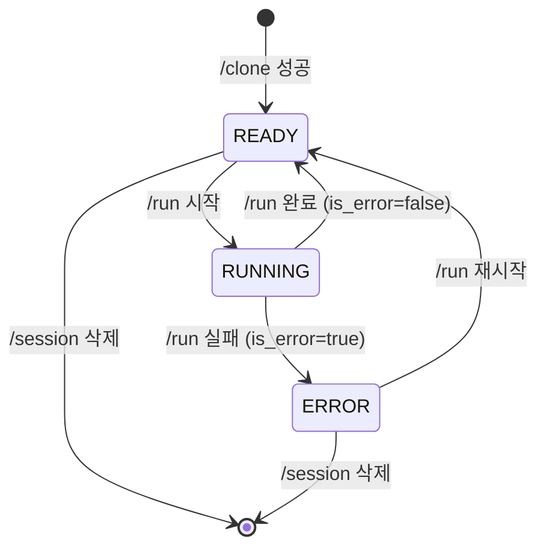

# SDLC Pod Runner API 명세

> K8s Pod 내에서 실행되는 FastAPI 기반 서버로, Claude Code를 통한 AI 기반 개발 작업을 관리한다.
> AIways On의 sdlc-pod-runner API 설계다. Pod Runner 자체는 메시징 플랫폼에 독립적이며, `channel_ids`는 Portal이 주입하는 값(Slack channel ID)을 그대로 사용한다.

## 1. 개요

### 기본 정보

- **Base URL**: `http://{pod-name}.{namespace}.svc.cluster.local:58001`
- **인증**: Bearer token (`POD_AUTH_TOKEN` 또는 `SDLC_MASTER_KEY`)
- **Health Check**: `/health` (인증 불필요)

### 인증 방식

| 엔드포인트 | 필요 토큰 |
|-----------|-----------|
| `GET /health` | 없음 |
| `POST /clone` | `POD_AUTH_TOKEN` |
| `GET /status` | `POD_AUTH_TOKEN` |
| `POST /run` | `POD_AUTH_TOKEN` |
| `POST /git/commit-push` | `POD_AUTH_TOKEN` |
| `DELETE /session` | `POD_AUTH_TOKEN` |
| `POST /notify-channel` | `SDLC_MASTER_KEY` |
| `POST /context` | `POD_AUTH_TOKEN` |
| `GET /context` | `POD_AUTH_TOKEN` |
| `POST /stage` | `POD_AUTH_TOKEN` |
| `GET /stage` | `POD_AUTH_TOKEN` |

> Pod Runner는 메시징 플랫폼에 직접 연동하지 않는다. 채널 알림은 `POST /notify-channel`로 Pod가 Portal에 중계 전달하고, **실제 Slack 메시지 전송은 Portal route 내부**에서 `MessageChannelAdapter`가 수행한다 (2-hop: n8n → Pod `/notify-channel` → Portal `/channel-notification`).

## 2. API 엔드포인트

### 2.1 Health Check

**`GET /health`** — 인증: 불필요

K8s liveness/readiness probe.

**응답**:

```json
{ "status": "ok" }
```

---

### 2.2 Session Clone (워크스페이스 초기화)

**`POST /clone`** — 인증: `POD_AUTH_TOKEN`

워크스페이스 생성 및 여러 repo 동시 clone (All-or-Nothing). 멱등 — 동일 파라미터 재호출 시 `already_cloned` 응답.

**요청 본문**:

```json
{
  "repos": [
    {
      "url": "https://github.com/org/portal",
      "branch": "main",
      "description": "AIways On repo",
      "pat": "ghp_..."
    }
  ],
  "request_no": "SR-20260901-001",
  "workspace_claude_md": "# Job Context\n..."
}
```

**응답 (성공 - 첫 clone)**:

```json
{
  "status": "success",
  "cloned": true,
  "fingerprint": "sha256:...",
  "cloned_repos": [
    {
      "url": "https://github.com/org/portal",
      "branch": "main",
      "dest_dir": "/workspaces/session/portal",
      "commit_sha": "abc123def",
      "description": "AIways On repo"
    }
  ],
  "workspace_root": "/workspaces/session"
}
```

**응답 (멱등 - 이미 clone 됨)**:

```json
{
  "status": "already_cloned",
  "cloned": false,
  "fingerprint": "sha256:...",
  "reason": "already_cloned"
}
```

**응답 (충돌 - 다른 파라미터)**:

```json
{
  "status": "failed",
  "cloned": false,
  "error": {
    "reason": "different_repo_cloned",
    "differing_fields": ["repos[0].url"],
    "existing_fingerprint": "...",
    "requested_fingerprint": "..."
  }
}
```

**응답 (실패)**:

```json
{
  "status": "failed",
  "cloned": false,
  "error": { "reason": "clone_failed", "message": "..." },
  "rolled_back": true
}
```

**비동기 이벤트**:

- 성공 시: `session.ready` → n8n 웹훅
- 실패 시: `run.failed` → n8n 웹훅 (기존 `stage.failed`는 alias, 5절 참조)

---

### 2.3 Session Status

**`GET /status`** — 인증: `POD_AUTH_TOKEN`

현재 세션 상태 조회.

**응답**:

```json
{
  "repo_url": "https://github.com/org/portal",
  "branch": "main",
  "workspace": "/workspaces/session",
  "state": "ready",
  "request_no": "SR-20260901-001",
  "clone_fingerprint": "sha256:...",
  "clone_repos": [],
  "claude_session_id": "abc-123",
  "last_run": {
    "started_at": "2026-09-01T10:00:00Z",
    "duration_ms": 15000,
    "is_error": false,
    "exit_code": 0
  },
  "sdlc_context": {
    "request_id": "...",
    "request_no": "SR-20260901-001",
    "master_key": "...",
    "pod_endpoint": "...",
    "channel_ids": {
      "requirements": "C001",
      "design": "C002",
      "dev": "C003"
    },
    "portal_base_url": "https://aiways-on.example.com",
    "current_stage": "2_REQUIREMENTS_IN_PROGRESS"
  }
}
```

> `channel_ids`는 Portal이 주입한 **Slack channel ID**. Pod Runner는 이 값을 해석하지 않고 Portal로 중계 전달할 때 그대로 사용.

**상태 값**: `ready` | `running` | `error`

**오류** (404):

```json
{ "detail": "no session initialized" }
```

---

### 2.4 Run Claude Code

**`POST /run`** — 인증: `POD_AUTH_TOKEN`

Claude Code 실행. 동기(`call_webhook=false`) 또는 비동기(`call_webhook=true`) 선택.

**요청 본문**:

```json
{
  "prompt": "/sdlc:user-deep-interview ...",
  "resume": false,
  "call_webhook": true,
  "stage": "2_REQUIREMENTS_IN_PROGRESS",
  "timeout_seconds": 1800
}
```

**동기 응답** (`call_webhook=false`):

```json
{
  "result": "...",
  "is_error": false,
  "exit_code": 0,
  "duration_ms": 15000,
  "claude_session_id": "abc-123",
  "events": []
}
```

**비동기 응답** (`call_webhook=true`):

```
HTTP 202 Accepted
{ "accepted": true, "stage": "2_REQUIREMENTS_IN_PROGRESS" }
```

**비동기 콜백** (n8n으로 POST):

```json
{
  "request_id": "...",
  "request_no": "SR-20260901-001",
  "event": "run.completed",
  "data": {
    "result": "...",
    "is_error": false,
    "exit_code": 0,
    "duration_ms": 15000,
    "claude_session_id": "abc-123",
    "pod_endpoint": "...",
    "master_key": "...",
    "portal_base_url": "...",
    "current_stage": "2_REQUIREMENTS_IN_PROGRESS"
  }
}
```

**오류 응답**:

```json
{ "result": "", "is_error": true, "exit_code": 1, "duration_ms": 100, "error": "..." }
```

#### 요구사항 단계 목업 캡처 (`sdlc:capture-mockup`)

- 요구사항 단계에서 n8n은 별도 엔드포인트 없이 이 `POST /run`으로 `sdlc:capture-mockup` skill 실행을 지시한다.
- Pod 내부 Claude가 `is_ui` repo의 dev server(`dev_server_url`)를 대상으로 Playwright(headless Chromium, playwright-mcp)로 `before.png` / `after.png` 목업을 캡처한다.
- Pod 이미지(Dockerfile)에 `sdlc@mvc` 플러그인(capture-mockup skill + screen-capturer subagent) + `@playwright/mcp` + headless Chromium이 설치되어 있어 **Pod 코드/엔드포인트 변경은 없다.** 기존 `POST /run`만으로 처리된다.
- 캡처한 이미지는 Pod의 Claude가 curl(multipart)로 Portal `POST /api/v1/sdlc/requests/{id}/channel-image`에 직접 업로드 (Pod에 `portal_base_url` / `master_key`가 주입되어 있음).
- 관련 repo 옵션: `is_ui`, `dev_server_url`, `runnable`, `playwright_enabled`.

#### 장애 대응 / 자체개선 agent 실행

- 두 agent 모두 Pod 이미지에 이미 설치된 `sdlc@mvc` 플러그인의 skill(`sdlc:incident-response`, `sdlc:repo-improvement`)로 동작한다. 위 `sdlc:capture-mockup`과 완전히 동일한 선례이므로 **Pod 코드·엔드포인트 변경은 없다. 기존 `POST /run`만으로 처리된다.**
- n8n Workflow B가 `4_DEV_IN_PROGRESS` 진입 후 `prompt`에 skill 호출을 담아 `POST /run`을 호출하고, 완료 시 기존 `run.completed` / `run.failed` 콜백으로 회수한다. 신규 엔드포인트·신규 필드 추가는 없다.

| 항목 | `sdlc:incident-response` | `sdlc:repo-improvement` |
|------|-------------------------|------------------------|
| `permission_mode` | `acceptEdits` (코드 수정 허용, PR 자동 머지는 금지) | `plan` (**읽기 전용** — `Write`/`Edit` 미포함) |
| `timeout_seconds` | `3600` (`SDLC_INCIDENT_RUN_TIMEOUT_SECONDS`) | `5400` (`SDLC_IMPROVEMENT_RUN_TIMEOUT_SECONDS`) |
| `allowed_tools` | `Read,Grep,Glob,Edit,Write,Bash,Task,mcp__sdlc-memory__*` | `Read,Grep,Glob,Bash,Task,mcp__sdlc-memory__*` |
| `mcp_servers` | `sdlc-memory` 주입 (9절 참조) | `sdlc-memory` 주입 (9절 참조) |
| `data.agent` (콜백) | `incident-response` | `repo-improvement` |

> 페이로드 전문은 [11-incident-response-agent.md](./11-incident-response-agent.md) 5절, [12-self-improvement-agent.md](./12-self-improvement-agent.md) 4절 참조.

---

### 2.5 Git Commit & Push

**`POST /git/commit-push`** — 인증: `POD_AUTH_TOKEN`

작업 내용 commit 및 remote에 push.

**요청 본문**:

```json
{
  "message": "[SDLC SR-20260901-001] 요구사항 정의서 추가",
  "branch": "sdlc/SR-20260901-001",
  "create_branch": false
}
```

**응답 (성공 - push 함)**:

```json
{
  "committed": true,
  "pushed": true,
  "noop": false,
  "commit_sha": "abc123def",
  "branch": "sdlc/SR-20260901-001",
  "stderr_tail": "..."
}
```

**응답 (성공 - 변경 없음)**:

```json
{
  "committed": false,
  "pushed": false,
  "noop": true,
  "commit_sha": null,
  "branch": "main",
  "stderr_tail": ""
}
```

**비동기 이벤트**:

```json
{ "event": "git.pushed", "data": { "branch": "sdlc/SR-20260901-001", "commit_sha": "abc123def", "noop": false } }
```

**오류** (502): `{ "detail": "..." }`

---

### 2.6 Delete Session

**`DELETE /session`** — 인증: `POD_AUTH_TOKEN`

워크스페이스 정리 및 세션 삭제.

**응답**: HTTP 204 No Content

**비동기 이벤트**: `{ "event": "session.closed" }`

---

### 2.7 SDLC Context 설정/조회

**`POST /context`** / **`GET /context`** — 인증: `POD_AUTH_TOKEN`

SDLC 컨텍스트 설정/업데이트 및 조회.

**요청 본문 (POST)**:

```json
{
  "request_id": "...",
  "request_no": "SR-20260901-001",
  "master_key": "...",
  "pod_endpoint": "...",
  "channel_ids": {
    "requirements": "C001",
    "design": "C002",
    "dev": "C003"
  },
  "portal_base_url": "https://aiways-on.example.com",
  "current_stage": "2_REQUIREMENTS_IN_PROGRESS"
}
```

**응답**: 위 요청 본문과 동일 구조 echo

> `channel_ids`는 Slack channel ID. Portal이 `/clone` 이후 `/context`로 주입한다.

---

### 2.8 Stage 설정/조회

**`POST /stage`** / **`GET /stage`** — 인증: `POD_AUTH_TOKEN`

SDLC 단계 명시적 업데이트/조회.

**요청 본문 (POST)**:

```json
{ "stage": "4_DEV_IN_PROGRESS" }
```

**응답**:

```json
{ "currentStage": "4_DEV_IN_PROGRESS" }
```

---

### 2.9 Notify Channel (Portal 알림 중계)

**`POST /notify-channel`** — 인증: `SDLC_MASTER_KEY`

n8n이 명시 호출하면 Pod가 Portal `/api/v1/sdlc/requests/{requestId}/channel-notification` API로 중계 전달. **실제 Slack 메시지 전송·메일 발송은 Portal route 내부**에서 `MessageChannelAdapter`가 처리한다 (2-hop).

**요청 본문**:

```json
{
  "channelType": "2_REQUIREMENTS_IN_PROGRESS",
  "message": "## ✅ 요구사항 분석 완료\n\n핵심 요구사항 요약:\n- ...",
  "callbackUrl": "https://n8n.example.com/webhook/portal-feedback",
  "filePaths": ["/workspaces/session/.mvc/requirement/requirements.md"],
  "sendMail": true
}
```

**응답 (성공)**:

```json
{
  "success": true,
  "message": "Channel notification sent to 2_REQUIREMENTS_IN_PROGRESS",
  "files_attached": 1
}
```

**응답 (실패, 502)**:

```json
{ "detail": "Portal notification failed: ..." }
```

**채널 매핑** (Stage → Channel):

| Stage | Channel |
|-------|---------|
| `2_REQUIREMENTS_IN_PROGRESS` | `requirements` |
| `3_DEV_DESIGN_IN_PROGRESS` | `design` |
| `4_DEV_IN_PROGRESS` | `dev` |
| `9_COMPLETE` | `dev` |
| `X_STOPPED` | `dev` |
| `X_FAILED` | `dev` |

> Stage `5`·`6`·`7`·`8`은 **미사용 예약**(향후 배포/검증 단계 재도입용)이므로 채널 매핑을 두지 않는다. 성공 terminal은 `9_COMPLETE` 단일이다.

---

## 3. 세션 상태 머신



## 4. 환경 변수

Pod Runner는 K8s ConfigMap/Secret에서 환경 변수를 주입받는다.

| 변수명 | 설명 | 예시 |
|--------|------|------|
| `POD_AUTH_TOKEN` | API 인증용 Bearer 토큰 | `sdlc-pod-auth-...` |
| `SDLC_MASTER_KEY` | 서버간 인증 마스터 키 (Portal 콜백 포함) | `mk-...` |
| `GITHUB_PAT` | GitHub Personal Access Token | `ghp_...` |
| `REQUEST_NO` | SDLC 요청 번호 | `SR-20260901-001` |
| `REQUEST_ID` | SDLC 요청 UUID | `...` |
| `PORTAL_BASE_URL` | Portal 베이스 URL | `https://aiways-on...` |
| `N8N_WEBHOOK_TOKEN` | n8n 웹훅 토큰 | `...` |
| `N8N_RUN_CALLBACK_URL` | n8n run 완료 콜백 URL | `https://n8n.../webhook/...` |
| `GIT_USER_NAME` | Git 사용자 이름 | `sdlc-runner` |
| `GIT_USER_EMAIL` | Git 사용자 이메일 | `sdlc-runner@...` |
| `GIT_HOSTNAME` | GitHub 호스트명 | `github.com` |
| `CLAUDE_BIN` | Claude Code 실행 파일 경로 | `/usr/bin/claude` |
| `CONDA_BIN` | Conda 실행 파일 경로 | `/opt/conda/bin/conda` |
| `WORKSPACE_ROOT` | 워크스페이스 루트 | `/workspaces` |
| `RUN_TIMEOUT_SECONDS` | Claude Code 실행 타임아웃 | `1800` |
| `LOG_LEVEL` | 로그 레벨 | `INFO` |

## 5. 비동기 이벤트 (Webhook)

Pod Runner는 특정 이벤트 발생 시 n8n 웹훅으로 콜백을 발송한다.

| 이벤트 | 트리거 | 데이터 |
|--------|--------|--------|
| `session.ready` | `/clone` 성공 | `{branch: "main"}` |
| `session.closed` | `/session` 삭제 | `{}` |
| `run.completed` ※ | `/run` 완료 (성공) | `{exit_code, duration_ms, claude_session_id, result, agent, ...}` |
| `run.failed` ※ | `/run` 실패 또는 `/clone` 실패 | `{phase, reason, error, agent, ...}` |
| `git.pushed` | `/git/commit-push` 완료 | `{branch, commit_sha, noop}` |

> ※ 이벤트명을 `run.completed` / `run.failed`로 표준화한다. 기존 `stage.completed` / `stage.failed`는 **하위 호환 alias로 계속 수신·처리**되지만, 신규 문서·워크플로우는 `run.*`만 사용한다. 이것으로 [07-n8n-workflows.md](./07-n8n-workflows.md) 4절과의 이벤트명 불일치가 해소된다.

**`data` 공통 필드**:

| 필드 | 타입 | 설명 |
|------|------|------|
| `result` | string | Claude Code 최종 출력 |
| `is_error` | boolean | 실행 오류 여부 |
| `exit_code` | int | subprocess 종료 코드 |
| `duration_ms` | int | 실행 소요 시간 |
| `claude_session_id` | string | resume용 세션 ID |
| `pod_endpoint` | string | 이 Pod의 Service URL |
| `master_key` | string | 서버간 인증 마스터 키 (`SDLC_MASTER_KEY`) |
| `portal_base_url` | string | Portal origin URL |
| `current_stage` | string | 콜백 시점의 SDLC stage |
| `agent` | string \| null | **신규** — 실행된 agent 식별자. `incident-response` \| `repo-improvement` \| `null`(feature 기본 흐름) |
| `error` | string \| null | `run.failed`일 때만 채워짐 |

> `agent`는 기존 envelope `{request_id, request_no, event, data{...}}`를 깨지 않는 순수 추가 필드다. `agent`가 없거나 `null`인 콜백은 기존 feature 흐름으로 처리된다.

### 이벤트 페이로드 예시

```json
{
  "request_id": "...",
  "request_no": "SR-20260901-001",
  "event": "run.completed",
  "data": {
    "result": "...",
    "is_error": false,
    "exit_code": 0,
    "duration_ms": 15000,
    "claude_session_id": "abc-123",
    "pod_endpoint": "http://sdlc-...:58001",
    "master_key": "...",
    "portal_base_url": "https://aiways-on...",
    "current_stage": "2_REQUIREMENTS_IN_PROGRESS",
    "agent": null
  }
}
```

> **정정**: 이 예시는 기존에 `data` 키를 camelCase(`podEndpoint`, `portalBaseUrl`, `currentStage`)로 적고 있었으나, 2.4절 `/status`·`/context` 응답은 snake_case를 쓰고 있었다. Pod Runner는 Python(FastAPI) 구현이므로 **콜백 `data` 키를 snake_case로 표준화**한다 (마스터 키 필드도 `master_key`). [07-n8n-workflows.md](./07-n8n-workflows.md) 3.2절의 camelCase 필드는 n8n `Extract Feedback Payload` 노드가 자체적으로 재명명한 워크플로우 내부 변수이며, Pod가 보내는 원본 키는 여기 정의한 snake_case다.

## 6. 오류 처리

### HTTP 상태 코드

| 상태 코드 | 설명 |
|----------|------|
| `200 OK` | 성공 |
| `202 Accepted` | 비동기 실행 (`/run` with `call_webhook=true`) |
| `204 No Content` | 성공적 삭제 (`/session`) |
| `401 Unauthorized` | 인증 실패 (Bearer token 누락/불일치) |
| `404 Not Found` | 세션이 초기화되지 않음 |
| `409 Conflict` | 세션 파라미터 충돌 |
| `502 Bad Gateway` | Portal/n8n 연동 실패 |
| `503 Service Unavailable` | Pod 종료 중 또는 설정 누락 |

### 오류 응답 형식

```json
{ "detail": "오류 메시지" }
```

clone 실패 시:

```json
{
  "status": "failed",
  "cloned": false,
  "error": { "reason": "...", "message": "..." },
  "rolled_back": true
}
```

## 7. 추가 엔드포인트

### 7.1 Admin Terminate (Pod 자가 종료)

**`POST /admin/terminate`** — 인증: `POD_AUTH_TOKEN`

Pod 자가 종료 (graceful shutdown). 멱등 — 첫 호출 시 SIGTERM 예약, 재호출 시 이미 진행 중 응답.

**응답 (202, 첫 호출)**:

```json
{
  "shutdown_in_progress": true,
  "started_at": "2026-09-01T10:00:00Z"
}
```

**응답 (202, 재호출)**:

```json
{
  "shutdown_in_progress": true,
  "started_at": "2026-09-01T10:00:00Z"
}
```

> 0.5초 후 `SIGTERM` 전송. Pod Runner는 종료 중 플래그를 설정해 `/clone` 요청에 503 반환.

---

### 7.2 Conda 환경 캐시 조회/언팩

**`POST /conda/ensure-env`** — 인증: `POD_AUTH_TOKEN`

결정론적 캐시 조회 (AI 텍스트 생성 없음). clone 완료 후 `vibe-coding-setup` 전에 n8n이 호출. cache_key로 Portal S3 캐시를 조회하고, hit 시 다운로드+언팩하여 session-level conda env 준비.

**요청 본문**:

```json
{
  "system_id": "portal",
  "repos": ["/workspaces/session/portal"]
}
```

**응답 (200, 캐시 hit)**:

```json
{
  "cache_hit": true,
  "env_ready": true,
  "cache_key": "sha256abc..."
}
```

**응답 (200, 캐시 miss — Setup Conda 필요)**:

```json
{
  "cache_hit": false,
  "env_ready": false,
  "cache_key": "sha256abc..."
}
```

**수행 작업**:

1. `manifest_hash.compute_cache_key(system_id, repos)` — repo HEAD 기반 캐시 키 계산
2. 이미 conda env가 프로비저닝된 경우 → `env_ready=true` (skip)
3. Portal `/requests/{id}/conda-cache?cacheKey=...`로 캐시 조회
4. hit 시 S3 tarball 다운로드 + `conda-pack` 언팩
5. **Integrity gate**: 언팩한 env가 repo manifest가 pin한 런타임 버전을 충족하는지 검증. 불일치 시 miss로 degrade (bad build 재사용 방지)

> 캐시 키는 `vibe-coding-setup` 출력을 포함한 **HEAD 기반**. 같은 system+repo 조합이면 캐시 재사용.

---

### 7.3 Conda 환경 팩/업로드

**`POST /conda/pack-and-upload`** — 인증: `POD_AUTH_TOKEN`

빌드한 conda 환경을 Portal S3 캐시에 업로드. best-effort — 모든 실패 경로는 `uploaded=false`와 reason 반환 (SR 실행에 영향 없음).

**요청 본문**:

```json
{ "cache_key": "sha256abc..." }
```

**응답 (200, 성공)**:

```json
{
  "uploaded": true,
  "cache_key": "sha256abc...",
  "env_hash": "def456..."
}
```

**응답 (200, 실패 — non-fatal)**:

```json
{
  "uploaded": false,
  "cache_key": "sha256abc...",
  "reason": "env_not_provisioned"
}
```

**수행 작업**:

1. conda env 존재 확인 (없으면 `env_not_provisioned`)
2. **Integrity gate (write side)**: env가 pin된 런타임을 충족하는지 검증. 불일치 시 업로드 skip (캐시 오염 방지)
3. `conda-pack`으로 tarball 생성
4. Portal `/requests/{id}/conda-cache/upload-url`로 presigned PUT URL 요청
5. S3에 tarball 업로드
6. Portal `/requests/{id}/conda-cache/complete`로 캐시 메타데이터 등록

---

### 7.4 Vibe-coding Readiness Check

**`POST /ensure-vibe-ready`** — 인증: `POD_AUTH_TOKEN`

clone 직후 repo의 vibe-coding 준비 상태를 점검 (결정론적, AI 텍스트 생성 없음). baseline 파일 누락, 언어 매니페스트 감지, docs/ gap 분석, staleness 검사.

**요청 본문**:

```json
{
  "repos": [
    { "name": "portal", "path": "/workspaces/session/portal" }
  ]
}
```

**응답 (200)**:

```json
{
  "results": [
    {
      "repo": "portal",
      "path": "/workspaces/session/portal",
      "needsSetup": false,
      "missingFiles": [],
      "detectedLanguageManifests": ["package.json"],
      "needsDocsRescan": false,
      "docsGaps": [],
      "commitsSinceLastScan": 5,
      "daysSinceLastScan": 3.2
    }
  ]
}
```

**점검 항목**:

| 항목 | 검사 내용 |
|------|----------|
| **Baseline files** | `CLAUDE.md` or `AGENTS.md` (any-of), `README.md`, `plans/todo.md`, `.env.example`, `.gitignore` (all) |
| **Language manifests** | `package.json`(JS/TS), `pyproject.toml`/`requirements.txt`(Python), `Cargo.toml`(Rust), `go.mod`(Go), `pom.xml`/`build.gradle`(Java) 등 |
| **Docs gaps (core-4)** | `docs/architecture.md`, `docs/db-schema.md`, `docs/api-spec.md`, `docs/coding-conventions.md` — 항상 필요 |
| **Docs gaps (conditional)** | `docs/db-schema.md`(migrations 감지 시), `docs/auth-oidc.md`(next-auth/oidc 감지 시), `docs/design-system.md`(frontend 감지 시), `docs/testing.md`(test framework 감지 시) |
| **Staleness** | `.sdlc/vibe-meta.json`의 `lastScanAt`/`lastScanCommit` 기준 — `vibe_stale_commit_threshold`(50) 초과 또는 `vibe_stale_days_threshold`(30일) 초과 시 rescan 필요 |

> 결과는 n8n이 `/run` 프롬프트에 주입하여 Claude가 실제 파일을 작성하도록 함. 이 엔드포인트 자체는 AI 호출/파일 생성 없음.

---

## 8. RepoCloneSpec 상세 (POST /clone)

`POST /clone`의 `repos` 배열 원소 하나당 아래 필드를 가진다.

| 필드 | 타입 | 기본값 | 설명 |
|------|------|--------|------|
| `url` | string | (필수) | HTTPS clone URL (credential 미포함) |
| `branch` | string | `"main"` | 체크아웃할 브랜치 |
| `pat` | string | (필수) | 이 repo용 GitHub PAT |
| `description` | string | `""` | Claude 컨텍스트용 repo 설명 |
| `git_user_name` | string \| null | env `GIT_USER_NAME` | git user.name (없으면 env fallback) |
| `git_user_email` | string \| null | env `GIT_USER_EMAIL` | git user.email (없으면 env fallback) |
| `base_branch` | string | `"dev"` | 원격 브랜치 생성 시 분기 기준 브랜치 |
| `forced_clone` | boolean | `false` | 다른 게이트 무시하고 항상 clone |
| `runnable` | boolean | `false` | 실행 가능한 서버가 있음 (Claude가 install+start 가능) |
| `is_ui` | boolean | `false` | UI repo (요구사항 단계 목업 캡처 대상) |
| `playwright_enabled` | boolean | `false` | `dev_server_url` 대상 Playwright 구동 허용 (요구사항 단계 목업 캡처용) |
| `dev_server_url` | string \| null | `null` | 목업 캡처 대상 dev server URL |
| `files` | `RepoFileSpec[]` | `[]` | clone 후 repo root에 작성할 파일 (`.env.local` 등) |
| `env_vars` | `RepoEnvVarSpec[]` | `[]` | repo 런타임에 주입할 환경 변수 |

**`RepoFileSpec`**:

```typescript
{ "relative_path": ".env.local", "content": "DATABASE_URL=..." }
```

**`RepoEnvVarSpec`**:

```typescript
{ "key": "DATABASE_URL", "value": "postgresql://..." }
```

> `files`/`env_vars`는 Portal이 `secret_refs`에서 복호화하여 전달. Pod Runner는 이를 session에 보관하고 `/run` 실행 시 subprocess env로 주입.

---

## 9. RunRequest 상세 (POST /run)

`POST /run`의 요청 본문 전체 필드:

| 필드 | 타입 | 기본값 | 설명 |
|------|------|--------|------|
| `prompt` | string | (필수) | Claude Code `-p` 프롬프트 |
| `resume` | boolean | `true` | 기존 `claude_session_id`로 대화 이어가기 (`-r` 플래그) |
| `timeout_seconds` | int \| null | env `RUN_TIMEOUT_SECONDS` | 실행 타임아웃 (초) |
| `system_prompt` | string \| null | `null` | system prompt 오버라이드 (`--system-prompt`) |
| `append_system_prompt` | string \| null | `null` | system prompt 추가 (`--append-system-prompt`) |
| `allowed_tools` | string[] \| null | `null` | 도구 허용 목록 (`--allowedTools <csv>`) |
| `permission_mode` | string \| null | `null` | `plan` \| `acceptEdits` \| `bypassPermissions` \| `default` (`--permission-mode`) |
| `mcp_servers` | dict \| null | `null` | MCP 서버 설정 (`--mcp-config`로 직렬화). 원격 HTTP MCP도 요청마다 주입 가능 — Memory MCP 주입 예: `{"sdlc-memory": {"type":"http","url":"https://sdlc-memory-mcp.example.com/mcp","headers":{"Authorization":"Bearer sdlcmem_..."}}}`. URL은 환경 변수 `SDLC_MEMORY_MCP_URL`에서 오며, Memory MCP는 **독립 Deployment**이고 Portal 라우트가 아니다 ([13-developer-memory-agent.md](./13-developer-memory-agent.md) 6절). 토큰은 SR마다 다르게 발급되므로 이미지에 굽지 않고 이 필드로 전달한다 ([13-developer-memory-agent.md](./13-developer-memory-agent.md) 8절 참조) |
| `output_format` | string | `"stream-json"` | `stream-json` (실시간 이벤트) \| `json` |
| `call_webhook` | boolean | `false` | true 시 202 반환 + 완료 시 n8n 콜백 (비동기) |
| `stage` | string \| null | `null` | 현재 SDLC stage (session 업데이트) |

> `resume=true`는 Pod가 살아있는 동안 같은 단계 내에서 Claude Code 대화를 이어가는 기본 기능. Pod 사망 후 자동 resume은 지원하지 않는다.

---

## 10. Dockerfile 요구사항

Pod Runner 컨테이너 이미지의 요구사항 (해커톤 재개발 기준):

### 10.1 Base Image & 런타임

| 항목 | 요구사항 |
|------|----------|
| Base | `miniconda3` (conda 바이너리 필요 — per-session conda env 프로비저닝) |
| Python | 3.11+ |
| Node.js | 20+ (conda-forge 설치, Claude Code CLI용) |
| Non-root user | `runner` 사용자로 실행 (`USER runner`) |

### 10.2 필수 패키지

| 패키지 | 용도 |
|--------|------|
| `git` | repo clone, commit, push |
| `gh` (GitHub CLI) | Issue/PR 생성, `gh issue comment` |
| `chromium` (headless) | Playwright 목업 캡처, QA 검수 |
| `fonts-noto-cjk` | 한글 렌더링 (스크린샷) |
| `jq`, `curl` | 스크립팅 |
| `@anthropic-ai/claude-code` | Claude Code CLI (npm global) |
| `@playwright/mcp` | Playwright MCP 서버 (npm global) |
| `playwright` | Playwright 라이브러리 (npm global) |
| `conda-pack` | conda 환경 캐시 패키징 (conda-forge) |

### 10.3 Claude Code 플러그인

```bash
# OMC (oh-my-claudecode) — deep-interview, autopilot, rsccb-report 등 skill/agent
claude plugin install oh-my-claudecode@omc --scope user

# SDLC MVC (sdlc@mvc) — capture-mockup / incident-response / repo-improvement skill,
#                        screen-capturer subagent
claude plugin install sdlc@mvc --scope user

# Vibe-coding-setup
claude plugin install vibe-coding-setup@mvc --scope user
```

### 10.4 Playwright MCP 등록

```bash
claude mcp add playwright -s user -- \
  playwright-mcp --headless \
  --executable-path "$CHROMIUM_BIN" \
  --ignore-https-errors
```

> 컨테이너는 display 없으므로 `--headless` 필수. self-signed HTTPS 대응 `--ignore-https-errors`.

> **`sdlc-memory` MCP는 이미지에 굽지 않는다**: `@playwright/mcp`는 컨테이너 안에서 실행되는 로컬 프로세스지만 `sdlc-memory`는 원격 HTTP 서비스이며 **토큰이 SR마다 다르다**. `claude mcp add -s user`로 이미지에 굽으면 토큰이 이미지에 고정되어 secret 분리 원칙을 위반한다. 따라서 `POST /run`의 `mcp_servers` 필드로 요청마다 주입한다 (9절 참조). 원격 HTTP이므로 설치할 로컬 바이너리도 없어 **Dockerfile 변경은 없다**.

### 10.5 FastAPI 서버

```bash
CMD ["uvicorn", "app.main:app", "--host", "0.0.0.0", "--port", "58001"]
```

**Health Check**:

```dockerfile
HEALTHCHECK --interval=30s --timeout=3s --start-period=5s --retries=3 \
    CMD python -c "import urllib.request; \
    sys.exit(0 if urllib.request.urlopen('http://127.0.0.1:58001/health', timeout=2).status==200 else 1)"
```

### 10.6 initContainer (PVC 초기화)

```bash
# init-workspace.sh — PVC 마운트 시 권한/소유권 설정
COPY init-workspace.sh /usr/local/bin/init-workspace.sh
```

> Pod spec의 `initContainer`에서 PVC 마운트 후 `runner` 소유권으로 초기화.

---

## 11. Pod Runner 환경 변수 (config.py)

Pydantic Settings 기반. K8s ConfigMap/Secret에서 주입.

### Secrets (K8s Secret)

| 변수 | 설명 |
|------|------|
| `POD_AUTH_TOKEN` | API 인증 Bearer 토큰 |
| `GITHUB_PAT` | GitHub Personal Access Token |
| `SDLC_MASTER_KEY` | 서버간 인증 마스터 키 (Portal 콜백 인증 포함, Secret `sdlc-secrets` 키 `master-key`에서 주입) |
| `AWS_BEARER_TOKEN_BEDROCK` | Bedrock 인증 키 (Secret `sdlc-secrets` 키 `aws-bearer-token-bedrock`에서 주입) |

### Pod 식별 (K8s env)

| 변수 | 기본값 | 설명 |
|------|--------|------|
| `POD_ENDPOINT` | — | 이 Pod의 Service URL |
| `REQUEST_NO` | — | SDLC 요청 번호 |
| `REQUEST_ID` | — | SDLC 요청 UUID |
| `PORTAL_BASE_URL` | — | Portal origin URL |
| `CHANNEL_IDS` | — | JSON map: channel type→id (`{"requirements":"C001",...}`) |

### Tooling

| 변수 | 기본값 | 설명 |
|------|--------|------|
| `CLAUDE_BIN` | `claude-dsassistant` | Claude Code CLI 경로 |
| `WORKSPACE_ROOT` | `/workspaces` | per-session 디렉토리 루트 |
| `CONDA_BIN` | `conda` | conda 바이너리 경로 |

### Git Identity

| 변수 | 기본값 | 설명 |
|------|--------|------|
| `GIT_USER_NAME` | `SDLC Bot` | git user.name |
| `GIT_USER_EMAIL` | `sdlc-bot@example.com` | git user.email |
| `GIT_HOSTNAME` | `github.com` | gh CLI / git remote hostname |

### Behaviour

| 변수 | 기본값 | 설명 |
|------|--------|------|
| `RUN_TIMEOUT_SECONDS` | `1800` | **`POST /run` 1회 호출** 기준 기본 타임아웃 (요청의 `timeout_seconds`로 오버라이드 가능) |
| `LOG_LEVEL` | `INFO` | 로그 레벨 |

> **`1800` vs `14400` 정정**: 4절 환경 변수 표의 `RUN_TIMEOUT_SECONDS: 1800`은 `/run` **1회 호출**의 기본 타임아웃이고, Pod Deployment의 `activeDeadlineSeconds: 14400`(4시간)은 **Pod 전체 수명** 상한이다. 두 값은 서로 다른 계층을 재는 것이므로 모순이 아니다. 한 Pod은 수명 4시간 안에서 여러 번의 `/run`을 수행한다 ([10-k8s-infrastructure.md](./10-k8s-infrastructure.md) 참조).

**agent별 `timeout_seconds` 오버라이드**:

| 실행 | 값 | 환경 변수 |
|------|-----|----------|
| 기본 (`feature` 각 단계) | `1800` | `RUN_TIMEOUT_SECONDS` |
| `sdlc:incident-response` | `3600` | `SDLC_INCIDENT_RUN_TIMEOUT_SECONDS` (Portal측 설정, `/run` 요청 본문으로 전달) |
| `sdlc:repo-improvement` | `5400` | `SDLC_IMPROVEMENT_RUN_TIMEOUT_SECONDS` (동일) |

> 두 값 모두 Pod `activeDeadlineSeconds`(14400) 미만이므로 Pod 수명 안에서 종료가 보장된다.

### n8n Callbacks

| 변수 | 기본값 | 설명 |
|------|--------|------|
| `N8N_RUN_CALLBACK_URL` | — | 비동기 `/run` 완료 콜백 URL (Pod → n8n) |
| `N8N_RUN_CALLBACK_TOKEN` | — | 콜백 Bearer 토큰 (`N8N_WEBHOOK_TOKEN` fallback) |
| `N8N_RUN_CALLBACK_MAX_RETRIES` | `3` | 콜백 최대 재시도 |
| `N8N_RUN_CALLBACK_RETRY_DELAY_S` | `5.0` | 재시도 기본 지연 (선형 backoff) |
| `N8N_FEEDBACK_WEBHOOK_URL` | — | stage 피드백 웹훅 (`:requestId`/`:stage` placeholder) |
| `N8N_FEEDBACK_WEBHOOK_TOKEN` | — | 피드백 웹훅 Bearer 토큰 |
| `N8N_FEEDBACK_WEBHOOK_TIMEOUT_S` | `5.0` | 피드백 웹훅 HTTP 타임아웃 |

### Vibe-coding Thresholds

| 변수 | 기본값 | 설명 |
|------|--------|------|
| `VIBE_STALE_COMMIT_THRESHOLD` | `50` | `lastScanCommit` 이후 commit 수 임계치 (초과 시 rescan) |
| `VIBE_STALE_DAYS_THRESHOLD` | `30.0` | `lastScanAt` 이후 일수 임계치 (초과 시 rescan) |
| `VIBE_GIT_LOG_TIMEOUT_SECONDS` | `15` | `git rev-list` 타임아웃 |

---

## 12. 설계 결정 요약

| 항목 | 설계 결정 | 비고 |
|------|----------|------|
| `channel_ids` | **Slack channel ID** (Portal이 주입, Pod는 중계만) | 불투명 문자열로 취급 |
| `GIT_HOSTNAME` | `github.com` (또는 GitHub Enterprise 호스트) | 환경 변수로 설정 |
| 채널 매핑 | Stage `5`·`6`·`7`·`8` 미사용 예약 | 성공 terminal은 `9_COMPLETE` 단일, `4→9` 직접 전이 |
| 서버간 인증 | `SDLC_MASTER_KEY` 단일 키 (`POD_AUTH_TOKEN`은 별개 유지) | per-SR 콜백 토큰 발급 폐지, 콜백 `data` 키는 `master_key` |
| Pod 코드 | **메시징 플랫폼 독립** | 어댑터 패턴으로 분리 |

> Pod Runner는 메시징 플랫폼(Slack/Discord)에 직접 의존하지 않는다. 채널 ID를 불투명 문자열로 취급하고, 실제 메시지 전송은 Portal의 `MessageChannelAdapter`가 담당한다. 따라서 **Pod Runner 코드/엔드포인트는 그대로 재사용** 가능하다.
