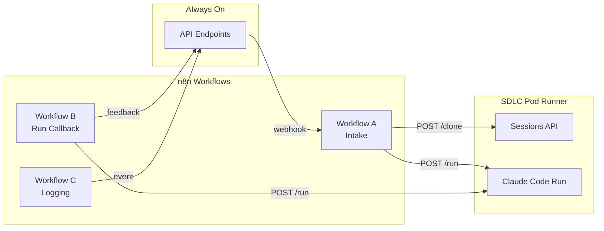
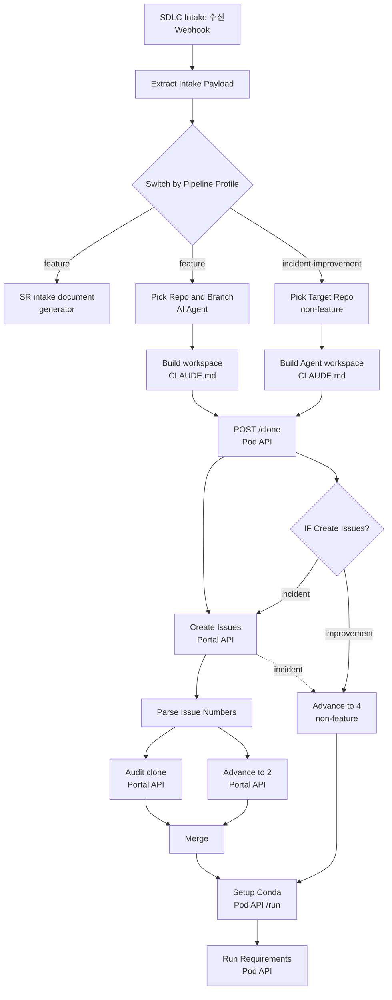
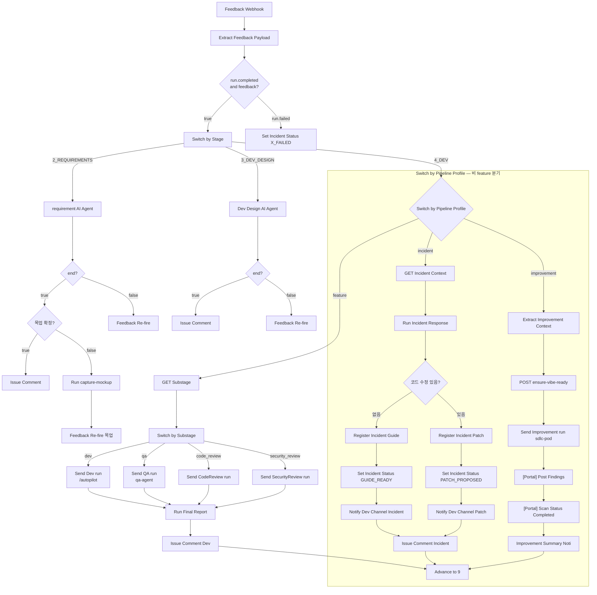
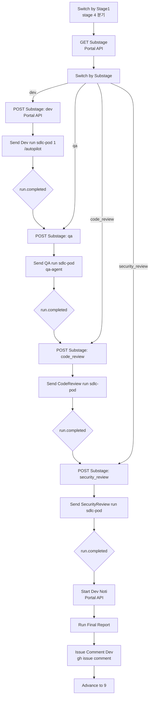
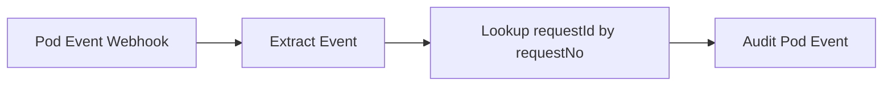
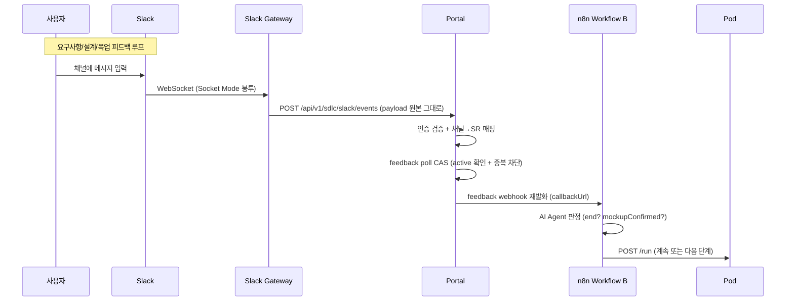

# n8n 워크플로우 설계 — Workflow A/B/C

> n8n은 Portal과 sdlc-pod-runner를 연결하는 **오케스트레이션 레이어**로, AI 에이전트(Claude Code)의 단계별 실행을 관리한다.
> AIways On의 워크플로우 A/B/C 구조는 Slack 채널 연동을 기본으로 하며 `5`~`8`을 예약만 두고 `4 → 9_COMPLETE` 단일 전이로 종결한다.

## 1. 개요



### 설계 결정

| 항목 | 설계 결정 | 비고 |
|------|----------|------|
| 채널 연동 | **Slack** (Portal MessageChannelAdapter 경유) | 어댑터 추상화로 플랫폼 교체 가능 |
| 사용자 피드백 수신 | **Slack Gateway Pod** → Portal `/slack/events` → n8n | Gateway가 Socket Mode 전담, Portal은 HTTP webhook만 수신 |
| 단계 재편 | **`5`·`6`·`7`·`8` 미사용 예약**, `4 → 9_COMPLETE` 단일 전이 | Git Push·PR까지가 시스템 범위, 배포는 외부 |
| GitHub 호스트 | `github.com` (또는 GitHub Enterprise) | 환경 변수로 설정 |

## 2. Workflow A: Intake

**파일**: `n8n/sdlc-workflow-A-intake.json`
**트리거**: `POST /webhook/sdlc-intake` (Portal intake 완료 후 발송)

### 2.1 노드 구성



> **실제 노드 25개**. 기존 20개 (resume 관련 없음): SDLC Intake 수신(Webhook), Extract Intake Payload, SR intake document generator(AI Agent), Pick Repo and Branch(AI Agent), Build workspace CLAUDE.md, POST sessions clone, [Portal] Create Issues, [portal] github issue link1, [portal] Audit clone, Advance to 2, Setup Conda, Merge Repo Options(code), Merge, Update CLAUDE.md Issues, Update CLAUDE.md(하위 repo 실행 환경 추가), Update CLAUDE.md(conda 환경 설명), Run Requirements, OpenAI Chat Model1, Structured Output Parser1, 문서 출력 파서.

**신규 노드 5개** (incident·improvement 프로파일 분기용):

| 노드 | 타입 | 동작 |
|------|------|------|
| `Switch by Pipeline Profile` | switch | `srMetadata.pipelineProfile` → `feature`(default) / `incident` / `improvement` 분기 |
| `Pick Target Repo (non-feature)` | set | `metadata.targetRepoIds`(incident) / `metadata.targetRepoId`(improvement)를 그대로 사용. **AI `Pick Repo and Branch` 호출 없음** — 대상 repo가 이미 확정되어 있다 |
| `Build Agent workspace CLAUDE.md` | code | agent 프로파일용 `CLAUDE.md` 생성. 요구사항·설계 섹션 없이 장애 정보 / 스캔 컨텍스트만 기술 |
| `IF Create Issues?` | if | `incident`는 GitHub Issue 생성(기존 `[Portal] Create Issues` 합류), `improvement`는 **Issue·PR 생성 안 함** |
| `Advance to 4 (non-feature)` | httpRequest | `POST /advance` `{from:"1_REGISTERED", to:"4_DEV_IN_PROGRESS"}` — `Advance to 2`를 대체하는 조건부 전이 |

- `feature` 경로의 기존 20개 노드와 연결은 **한 곳도 변경되지 않는다**. `Extract Intake Payload` 뒤에 switch 1개가 끼어들 뿐이다.
- 비 feature 경로는 `SR intake document generator`(요구사항 문서 생성)와 `Run Requirements`(요구사항 interview 실행)를 **모두 건너뛴다**. 요구사항·설계 단계 자체가 없기 때문이다.
- 두 경로 모두 `POST sessions clone` → `Setup Conda`로 합류하므로 워크스페이스 준비 로직은 공용이다. `Setup Conda`의 `run.completed` 콜백이 Workflow B로 유입되어 agent 실행이 시작된다.

> **불일치 해소**: [11-incident-response-agent.md](./11-incident-response-agent.md) 4.3절은 `1 → 4` 전이 트리거를 **WF-A**로, 같은 문서 7절 mermaid는 WF-B의 `Advance to 4 incident`로 적고 있다. 정본은 **WF-A의 `Advance to 4 (non-feature)`**이며, WF-B의 `Advance to 4 incident`는 동일 `idempotencyKey`(`{requestNo}->4_DEV_IN_PROGRESS`)를 쓰는 **멱등 재시도 경로**로 해석한다 (WF-A 전이가 누락된 채 콜백이 도착한 경우). 두 번째 호출은 `{idempotent: true}`를 받는다 ([03-state-machine.md](./03-state-machine.md) 3.2절 참조).

> **Setup Conda 노드**: clone 후 `POST /run`으로 `vibe-coding-setup` 실행. Conda 환경이 이미 캐시에 있으면(`POST /conda/ensure-env` hit) skip, 없으면 conda env 생성 후 `POST /conda/pack-and-upload`로 캐시 저장.

### 2.2 Intake 페이로드

```json
{
  "requestId": "...",
  "requestNo": "SR-20260901-001",
  "requestSystem": "AIways On",
  "module": "메뉴경로",
  "srTitle": "요청제목",
  "podEndpoint": "http://sdlc-...:58001",
  "availableRepos": [],
  "channelIds": {
    "requirements": "C001",
    "design": "C002",
    "dev": "C003"
  },
  "srMetadata": {
    "requestDate": "...",
    "dueDate": "...",
    "submitter": "...",
    "submitterGithubLogin": "...",
    "submitterDepartment": "...",
    "piManager": "...",
    "requestSite": "...",
    "devType": "...",
    "problemDescription": "...",
    "expectedEffect": "...",
    "testScenario": "..."
  }
}
```

> `channelIds`는 Portal이 intake 시 생성한 **Slack channel ID**. 채널명은 프로파일에 따라 feature=`sr-{no}-requirements`/`-design`/`-dev`, incident=`inc-{no}-dev`, improvement=`imp-{no}-dev`로 달라지지만 n8n은 이름이 아니라 ID만 쓰므로 프로파일을 몰라도 된다 ([02-messaging-adapter.md](./02-messaging-adapter.md) 참조).

> **서버간 인증 토큰은 페이로드로 전달하지 않는다.** n8n·Pod 모두 `SDLC_MASTER_KEY`를 환경 변수로 주입받으므로 per-SR 토큰을 실을 필요가 없다 (7절 참조).

### 2.3 SR Intake 문서 생성

**노드**: `SR intake document generator`

SDLC 인테이크 데이터를 기반으로 Vibe-PI Interview Intake 마크다운 문서를 생성한다.

**출력 예시**:

```markdown
# Vibe-PI Interview Intake

## Metadata

- SR ID: SR-20260901-001
- Initial Title: 테스트 기능 추가
- Request Date: 2026-09-01
- Due Date: 2026-09-15
- Requester Name: 홍길동
- Requester GitHub: @hong-gildong
- Related System: AIways On
- Target Sites: aiways-on.example.com
- GitHub Repo: [portal](https://github.com/org/portal)

## Raw Request

### 문제점 및 개발의뢰 내용
현재 대시보드에서 ...

### 개선 후 기대효과
사용자 편의성 향상 ...

### Test 시나리오
1. 대시보드 접속
2. 분석 버튼 클릭
```

### 2.4 Repo 선택 및 Branch 생성

**노드**: `Pick Repo and Branch`

`availableRepos` 중 요청 내용과 관련 가능성 있는 repo를 AI가 선택하고 branch 이름을 생성한다.

**AI 프롬프트**:

```
SDLC 오케스트레이터. availableRepos 중에서 요청 내용(시스템명·모듈·문제 설명)과
관련 가능성 있는 repo를 모두 선택한다 (1~N개).

선택 기준:
- 각 repo의 description 한 줄을 보고 요청과 조금이라도 관련 가능성 있으면 포함 (넘치게 포함 > 누락).
- 명백히 무관한 repo만 제외.
- 0개 선택은 지양한다. 애매하면 가장 관련성 높은 repo 최소 1개는 고른다.

출력 JSON: { "repos": [{ "url": "...", "branch": "...", "newBranch": "sdlc/..." }] }
```

**출력 예시**:

```json
{
  "repos": [
    {
      "url": "https://github.com/org/portal",
      "branch": "main",
      "newBranch": "sdlc/SR-20260901-001-test-feature",
      "autoPrMerge": true,
      "pat": "ghp_...",
      "gitUserName": "sdlc-runner",
      "gitUserEmail": "sdlc-runner@example.com"
    }
  ]
}
```

### 2.5 Workspace CLAUDE.md 생성

**노드**: `Build workspace CLAUDE.md`

Pod에서 실행될 Claude Code의 컨텍스트로 사용될 `CLAUDE.md` 파일을 생성한다.

```markdown
# Job Context

requestNo: SR-20260901-001
srTitle: 테스트 기능 추가
module: 대시보드 > 분석

## 작업 대상 Repos

| repo   | url                          | local path                 | work branch (head)                | base branch | auto PR merge |
|--------|------------------------------|----------------------------|------------------------------------|-------------|---------------|
| portal | https://github.com/org/portal | /workspaces/session/portal | sdlc/SR-20260901-001-test-feature | main        | true          |

## GitHub Issues

(clone 후 채워짐)
```

### 2.6 Pod Session 생성 및 Repo Clone

**노드**: `POST sessions clone`
**API**: `POST {podEndpoint}/clone`

상세는 [06-pod-runner-api.md](./06-pod-runner-api.md) 2.2절 참조.

### 2.7 GitHub Issue 생성 (Portal 위임)

**노드**: `Create Issues`
**API**: `POST {portalBase}/api/v1/sdlc/requests/{requestId}/issues`

n8n이 Pod의 `gh issue create`에 의존하던 Issue 생성을 Portal에 위임. Portal이 GitHub PAT으로 `ensureIssueCreated`(idempotent)를 호출해 각 repo별 Issue를 생성하고 `work_branch`를 저장.

```json
{
  "repos": [{ "repo": "org/portal", "branch": "sdlc/SR-20260901-001-test-feature" }],
  "title": "[SDLC] SR-20260901-001 테스트 기능 추가",
  "body": "SR-20260901-001 SDLC 작업"
}
```

### 2.8 Audit 로그 기록

**노드**: `Audit clone`
**API**: `POST {portalBase}/api/v1/sdlc/requests/{requestId}/audit`

### 2.9 상태 전이 (→ 2_REQUIREMENTS_IN_PROGRESS)

**노드**: `Advance to 2`
**API**: `POST {portalBase}/api/v1/sdlc/advance`

```json
{
  "requestNo": "SR-20260901-001",
  "from": "1_REGISTERED",
  "to": "2_REQUIREMENTS_IN_PROGRESS",
  "actor": "n8n-agent",
  "idempotencyKey": "SR-20260901-001->2_REQUIREMENTS_IN_PROGRESS"
}
```

### 2.10 요구사항 Interview 실행

**노드**: `Run Requirements`
**API**: `POST {podEndpoint}/run`

```
/sdlc:user-deep-interview 사용자의 초기 요구사항을 구체화 시켜줘.
요청한 사용자는 IT에 대해 하나도 모르는 사람이야 일반적인 중학생 수준이야.
인터뷰를 통해 요구사항을 구체화한 문서를 만들어서 requirement_interview.md에 저장해줘.

초기 요구사항은 아래와 같아

{output}
```

> 대상 repo 중 `isUi`로 표시된 repo가 있으면 프롬프트에 UI 안내가 덧붙는다. 화면 목업(Before/After)은 이 단계가 아니라 **요구사항 텍스트 정의가 끝난 뒤 Workflow B의 별도 목업 단계**에서 진행하므로, 여기서는 스크린샷을 캡처하지 않고 요구사항 텍스트 인터뷰에만 집중한다.

---

## 3. Workflow B: Run Callback

**파일**: `n8n/sdlc-workflow-B-run-callback.json`
**트리거**: `POST /webhook/sdlc-run-complete` (Pod에서 run.completed 이벤트)

### 3.1 노드 구성



**신규 노드 12개** (`Switch by Pipeline Profile` 이하). 기존 `Switch by Stage1`의 `feature` 경로 노드·연결은 stage 5·7 분기 제거를 제외하면 변경되지 않는다.

> **`Advance to 9`는 전 프로파일 공용 단일 노드다.** `4_DEV_IN_PROGRESS → 9_COMPLETE`가 전 프로파일 공통 전이가 되었으므로([03-state-machine.md](./03-state-machine.md) 2.1절), 기존 `Advance to 5` / `Advance to 7` / `Advance to 8` / `Advance to 8 incident` / `Advance to 5 incident` / `Advance to 8 (improvement)` 6개 노드가 이 하나로 통합됐다. feature·incident·improvement 세 경로가 모두 이 노드로 수렴한다.

incident 분기 ([11-incident-response-agent.md](./11-incident-response-agent.md) 7절):

| 노드 | 타입 | API/동작 |
|------|------|----------|
| `Switch by Pipeline Profile` | switch | `metadata.pipelineProfile` → `feature`(default) / `incident` / `improvement` 분기 |
| `GET Incident Context` | httpRequest | `GET /requests/{id}` → `metadata.incidentId`·`severity`·`targetRepoIds` 추출 |
| `Advance to 4 incident` | httpRequest | `POST /advance` `{from:"1_REGISTERED", to:"4_DEV_IN_PROGRESS"}` — WF-A 전이 누락 시 멱등 재시도 |
| `Run Incident Response` | httpRequest | Pod `POST /run` — `sdlc:incident-response`, `permission_mode: acceptEdits`, `timeout_seconds: 3600` |
| `Register Incident Guide` | httpRequest | `POST /incidents/{id}/analysis` `{kind:"guide"}` |
| `Register Incident Patch` | httpRequest | `POST /incidents/{id}/analysis` `{kind:"patch"}` |
| `Set Incident Status GUIDE_READY` | httpRequest | `POST /incidents/{id}/status` |
| `Set Incident Status PATCH_PROPOSED` | httpRequest | `POST /incidents/{id}/status` |
| `Set Incident Status X_FAILED` | httpRequest | `POST /incidents/{id}/status` — `run.failed` 수신 시 |
| `Notify Dev Channel Incident` | httpRequest | `POST /channel-notification` (`channelType: dev`) |
| `Notify Dev Channel Patch` | httpRequest | `POST /channel-notification` (PR 링크 포함) |
| `Issue Comment Incident` | httpRequest | GitHub Issue comment — 장애 대응 요약 형식 |
| `Advance to 9` | httpRequest | `POST /advance` `{from:"4_DEV_IN_PROGRESS", to:"9_COMPLETE"}` — **feature 경로와 공용 노드**. 가이드 전용(`GUIDE_READY`)이든 코드 수정(`PATCH_PROPOSED`)이든 목적지가 같으므로 분기하지 않는다. PR 생성 여부는 Portal 진입 작업의 commit 이력 판정이 결정한다 |

improvement 분기 ([12-self-improvement-agent.md](./12-self-improvement-agent.md) 10절):

| 노드 | 타입 | API/동작 |
|------|------|----------|
| `Extract Improvement Context` | set | `improvementScanId`, `scanNo`, `targetRepoId`, `podEndpoint` 추출 (토큰은 환경 변수 `SDLC_MASTER_KEY`를 쓰므로 추출 대상이 아니다) |
| `POST ensure-vibe-ready` | httpRequest | Pod `POST /ensure-vibe-ready` — 결정론적 사전 스캔 신호 확보 (실패는 warn-only) |
| `Send Improvement run(sdlc-pod)` | httpRequest | Pod `POST /run` — `sdlc:repo-improvement`, `permission_mode: plan`, `timeout_seconds: 5400`, `call_webhook: true` |
| `[Portal] Post Findings` | httpRequest | `POST /improvements/{scanId}/findings` — finding 일괄 등록 |
| `[Portal] Scan Status Completed` | httpRequest | `POST /improvements/{scanId}/status` `{status:"completed"}` |
| `Improvement Summary Noti` | httpRequest | Pod `POST /notify-channel` — Slack `imp-{no}-dev` 채널 요약 |
| `Advance to 9` | httpRequest | `POST /advance` `4_DEV_IN_PROGRESS → 9_COMPLETE` — **feature·incident 경로와 공용 노드** |

> 두 분기 모두 실패 시 기존 `X_FAILED` 보상 경로를 그대로 재사용한다. 어댑터·알림 실패는 전이를 차단하지 않는다(warn-only).

> 설계 결정: stage 5·7 분기 제거(`5`~`8` 미사용 예약), `Advance to *` 노드 6개를 `Advance to 9` 단일 노드로 통합, `Auto Merge?` 분기 제거(Portal 진입 작업으로 이관), resume 서브그래프 전체 제거, `4_DEV` 분기를 devSubStage 4단계 서브스테이지로 세분화, `4_DEV` 출력에 `Switch by Pipeline Profile` 2차 분기 추가.

### 3.2 피드백 데이터 추출

```json
{
  "requestId": "...",
  "event": "run.completed",
  "requestNo": "SR-20260901-001",
  "userFeedback": "i",
  "podEndpoint": "...",
  "status": "2_REQUIREMENTS_IN_PROGRESS",
  "claudeSessionId": "...",
  "isError": "false",
  "error": null
}
```

> `userFeedback`는 Slack 채널의 사용자 메시지 (Portal `/slack/events` → n8n 재발화).

### 3.3 Stage별 분기

**노드**: `Switch by Stage1`

| 출력 키 | 조건 | 설명 |
|---------|------|------|
| `requirement` | `status === 2_REQUIREMENTS_IN_PROGRESS` | 요구사항 interview 처리 |
| `dev_design` | `status === 3_DEV_DESIGN_IN_PROGRESS` | 설계 interview 처리 |
| `dev` | `status === 4_DEV_IN_PROGRESS` | 개발 완료 처리 — **`metadata.pipelineProfile` 2차 분기**(`Switch by Pipeline Profile`)를 거친다. `feature`는 `GET Substage`로, `incident`/`improvement`는 각 agent 분기로 진행 (3.1절 참조). 세 경로 모두 `Advance to 9`로 수렴 |
| `other_status` | 위 조건 없음 | 오류 처리 |

> stage `5`·`7` 분기는 삭제됐다. `5`~`8`은 미사용 예약 번호이므로 WF-B가 그 상태로 콜백을 받는 일이 없다. 최종 보고서 생성은 `4_DEV_IN_PROGRESS`의 마지막 서브스테이지 완료 직후로 옮겨졌다 (3.12절).

### 3.4 요구사항 Interview 종료 판정

**노드**: `requirement AI Agent`

요구사항 텍스트 정의 완료 여부(`end`)와 **UI 목업 화면(Before/After) 확정 여부(`mockupConfirmed`)** 를 함께 판정한다.

```
너는 requirement 요구사항 정의 interview가 끝났는지, 그리고 UI 목업(Before/After) 화면을
사용자가 확정했는지 검사하는 Agent야.

[end 판단 — 요구사항 텍스트 정의 완료 여부]
- 요구사항 정의가 완료 되었다고 하는 경우
- 요구사항 정의서 파일이 생성된 경우 (/workspaces/session/.mvc/requirement/*.md)
- autopilot 혹은 파일 수정 혹은 개발 시작하라고 하는 경우
- UI 목업 화면 단계로 넘어갔거나 목업 피드백을 주고받는 경우 (텍스트 요구사항은 이미 끝난 것이므로 end=true)

[mockupConfirmed 판단 — UI 목업 화면 확정 여부]
- 사용자가 목업/화면/디자인이 좋다·이대로 진행하라·확정한다고 하는 경우 → true
- 사용자가 목업을 수정·재작성·다른 화면을 요청하는 경우 → false
- 아직 목업 화면을 한 번도 보여주지 않았거나 확정 언급이 없는 경우 → false

JSON 양식으로만 응답해줘:
{end: <요구사항 정의 완료 여부>, files: ["<요구사항명세서 파일 경로>"], mockupConfirmed: <UI 목업 확정 여부>}
```

### 3.5 UI 목업 Before/After 서브루프

**흐름**: `요구사항 interview 종료`(`end=true`) 직후 `목업 확정?`이 `mockupConfirmed`를 검사.

- **true**: `Issue Comment (Stage)1` → `Advance to 3` 흐름으로 진행 (요구사항 명세서에 UI 변경점 반영).
- **false**: `Run capture-mockup` → `Feedback Re-fire (목업)`로 사용자 확인/수정 요청 후 응답 대기 **재캡처 루프**.

**`Run capture-mockup`**

**API**: `POST {podEndpoint}/run`

`sdlc:capture-mockup`을 실행해 UI가 바뀌는 화면의 Before/After 목업을 생성하고, 각 이미지를 Portal 채널에 업로드한다.

- 대상은 `is_ui=true`로 등록된 repo. `is_ui` repo가 없으면 `NO_UI`만 출력하고 즉시 종료.
- 업로드는 화면·kind(before/after)별로 curl로 Portal에 전송.

```
POST {portalBaseUrl}/api/v1/sdlc/requests/{requestId}/channel-image
  -F 'file=@<png>' -F 'kind=before|after' -F 'screenName=<screen>'
  -F 'channelType={status}' -F 'caption=<screen> Before|After'
  -F 'callbackUrl=.../webhook/portal-feedback'
```

> 이미지는 S3에 저장되고, Slack 채널 표시는 Portal 프록시 URL(`/api/v1/sdlc/images/{id}`)을 사용한다.

**`Feedback Re-fire (목업)`**

**API**: `POST {portalBaseUrl}/api/v1/sdlc/requests/{requestId}/feedback-request`

채널에 올린 Before/After 화면을 확인하고 수정할 점이 있으면 알려달라고, 이대로 좋으면 확정이라고 말해달라고 사용자에게 요청. 사용자 응답(Slack 메시지)이 다시 Workflow B로 유입되어 서브루프가 반복된다.

### 3.6 요구사항 명세서 Issue Comment 등록

**노드**: `Issue Comment (Stage)1`
**API**: `POST {podEndpoint}/run`

```
요구사항정의서 생성 + Issue comment 등록.

【절차】
1. Task(subagent_type='rsccb-report') 호출하여 요구사항정의서 생성
   - stage: requirements
   - outputPath: /workspaces/session/.sdlc-reports/requirements.md
   - context: 방금 진행한 요구사항 인터뷰 전체 내용 + 확정된 UI 목업(Before/After) 변경점
2. Read 도구로 .mvc/requirement/*.md 파일들의 전문을 읽는다
3. /tmp/issue-comment.md를 Write 도구로 아래 형식으로 작성
4. 대상 repo 각각에 gh issue comment {issue번호} --body-file /tmp/issue-comment.md

comment 본문 형식:
## ✅ 요구사항 분석 완료

핵심 요구사항 요약:
- (bullet 1)
- (bullet 2)
- (bullet 3)

<details><summary>📄 요구사항 명세서 전문 보기</summary>

(.mvc 파일 전문 그대로)

</details>
```

### 3.7 상태 전이 (→ 3_DEV_DESIGN_IN_PROGRESS)

**노드**: `requirement end - Advance to 3`
**API**: `POST {portalBase}/api/v1/sdlc/advance`

```json
{
  "requestNo": "SR-20260901-001",
  "from": "2_REQUIREMENTS_IN_PROGRESS",
  "to": "3_DEV_DESIGN_IN_PROGRESS",
  "actor": "n8n-agent-fb",
  "idempotencyKey": "SR-20260901-001->3_DEV_DESIGN_IN_PROGRESS"
}
```

### 3.8 설계 Interview 실행

**노드**: `Send Dev_Design run(sdlc-pod)`

```
/oh-my-claudecode:deep-interview `/workspaces/session/.mvc/requirement/*.md`
이 경로의 파일에 요구사항을 인터뷰한 결과있음.
인터뷰 결과를 참고해서 개발하기 위한 인터뷰를 수행한다.

⚠️ 보고서 (design.md)는 여기서 생성하지 않는다. 설계 인터뷰와 결정사항 정리까지만 수행한다.
```

### 3.9 설계 보고서 Issue Comment 등록

**노드**: `Issue Comment (Stage)2`

```
설계 보고서 생성 및 Issue comment 등록.

【절차】
1. Task(subagent_type='rsccb-report') 호출하여 PI 설계서 생성
   - stage: design
   - outputPath: /workspaces/session/.sdlc-reports/design.md
2. Read 도구로 design.md 전문을 읽는다
3. /tmp/issue-comment.md를 Write 도구로 아래 형식으로 작성
4. gh issue comment {issue번호} --body-file /tmp/issue-comment.md

comment 본문 형식:
## ✅ 설계 완료

핵심 설계 결정사항 요약:
- (bullet 1)
- (bullet 2)
- (bullet 3)

<details><summary>📄 PI 설계서 전문 보기</summary>

(design.md 전문 그대로)

</details>
```

### 3.10 개발 실행 (autopilot)

**노드**: `Send Dev run(sdlc-pod)1`

```
/autopilot 설계했던 개발 건 진행해줘. 구현·테스트·commit·push까지 완료한다.

⚠️ 보고서 (.sdlc-reports/*.md)는 여기서 생성/수정하지 않는다. 개발만 수행한다.
```

### 3.11 개발 완료 Issue Comment

**노드**: `Issue Comment Dev`

```
개발 완료 요약 Issue comment 등록 (보고서 전문은 최종 단계에서 생성하므로 여기서는 생성하지 않는다).

【절차】
1. 방금 완료한 개발 내역(commit/PR 생성/변경파일/테스트 결과)을 간략히 정리한다.
2. /tmp/issue-comment.md를 Write 도구로 아래 형식으로 작성
3. gh issue comment {issue번호} --body-file /tmp/issue-comment.md

comment 본문 형식:
## ✅ 개발 완료

핵심 구현 내역 요약:
- (bullet 1)
- (bullet 2)
- (bullet 3)

commit 내역까지만 적는다. **PR 생성·병합은 Portal이 `9_COMPLETE` 진입 시 수행하므로 여기서는 예정 사항으로만 언급**하고, 확정된 PR 링크와 머지 결과는 Portal이 dev 채널에 게시하는 완료 요약 메시지에서 확인한다.
```

### 3.12 최종 보고서 생성

**노드**: `Run Final Report`

`security_review` 서브스테이지 완료 후, `Advance to 9` 호출 **전에** 실행한다. 기존에는 `5_READY_FOR_DEPLOY` 분기에 있었으나 해당 stage가 없어지면서 `4_DEV_IN_PROGRESS` 말단으로 이동했다.

```
최종 단계: 개발 보고서 + RSCCB 보고서 2종 생성 및 Issue comment 등록.

【절차】
1. Task(subagent_type='rsccb-report') 호출하여 개발 보고서 생성
   - stage: development
   - outputPath: /workspaces/session/.sdlc-reports/development.md
   - context: 개발 전체 내역 (commit/변경파일/테스트/리뷰 결과) — PR·merge는 Portal이 이후 수행하므로 제외
2. Task(subagent_type='rsccb-report') 호출하여 RSCCB 보고서 생성
   - stage: rsccb
   - outputPath: /workspaces/session/.sdlc-reports/rsccb.md
   - context: 요구사항·설계·개발 전체 흐름
3. development.md 전문을 읽고 /tmp/dev-comment.md 작성 후 gh issue comment
4. rsccb.md 전문을 읽고 /tmp/rsccb-comment.md 작성 후 gh issue comment
```

### 3.13 상태 전이 (→ 9_COMPLETE)

**노드**: `Advance to 9` (4 → 9_COMPLETE)

> **n8n은 Git Push·PR에 전혀 관여하지 않는다.** `9_COMPLETE` 진입 시점에 Portal이 `runStageEntryActions`에서 repo 루프 → commit 이력 판정 → git push → PR 생성 → `autoPrMerge` 분기 → dev 채널 결과 요약 게시까지 전부 수행한다([03-state-machine.md](./03-state-machine.md) 4.4절). n8n은 최종 보고서 생성 후 전이 1회만 호출한다. 기존에 WF-B에 있던 `Auto Merge?` 분기와 "Manual merge 대기 + Feedback Re-fire" 경로는 이 Portal 진입 작업으로 흡수되어 **워크플로우에서 삭제**됐다 — 수동 머지 안내는 Portal이 게시하는 결과 요약 메시지가 대신한다.

```json
{
  "requestNo": "SR-20260901-001",
  "from": "4_DEV_IN_PROGRESS",
  "to": "9_COMPLETE",
  "actor": "n8n-agent-fb",
  "idempotencyKey": "SR-20260901-001->9_COMPLETE"
}
```

- 세 프로파일이 이 노드를 공용한다. `actor`만 `n8n-agent-fb`(feature) / `n8n-wf-b`(incident) / `n8n-agent-improve`(improvement)로 달라진다.
- `9_COMPLETE`는 성공 terminal이므로 이후 전이가 없다. Pod 종료·feedback poll 비활성화도 Portal 진입 작업이 처리한다.

> **역전이 노드 0개.** `7 → 4` 재개발 경로가 상태 머신에서 사라졌으므로 WF-B에도 뒤로 가는 `Advance to *` 노드가 존재하지 않는다 ([03-state-machine.md](./03-state-machine.md) 2.1절 "역방향 전이 0개").

### 3.14 DevSubStage 분기 (4_DEV_IN_PROGRESS 내부)

`4_DEV_IN_PROGRESS` 단계는 4개 서브스테이지(`dev` → `qa` → `code_review` → `security_review`)로 세분화된다. `Switch by Stage1`에서 `GET Substage` 노드가 `metadata.devSubStage.current`를 조회한 후 `Switch by Substage`가 분기한다.



**노드 상세**:

| 노드 | 타입 | API/동작 |
|------|------|----------|
| `GET Substage` | httpRequest | `GET /requests/{id}/dev-substage` — 현재 서브스테이지 조회 |
| `Switch by Substage` | switch | `dev` / `qa` / `code_review` / `security_review` / 기타 |
| `POST Substage: dev/qa/cr/sr` | httpRequest | `POST /requests/{id}/dev-substage` — 다음 서브스테이지 시작 |
| `Send Dev run(sdlc-pod)1` | httpRequest | `POST /run` — `/autopilot` 개발 실행 |
| `Send QA run(sdlc-pod)` | httpRequest | `POST /run` — `qa-agent` Task 호출 (Playwright QA 검수) |
| `Send CodeReview run(sdlc-pod)` | httpRequest | `POST /run` — 코드 리뷰 실행 |
| `Send SecurityReview run(sdlc-pod)` | httpRequest | `POST /run` — 보안 리뷰 실행 |
| `Start Dev Noti` | httpRequest | `POST /requests/{id}/stage-done-mail` — 개발 단계 완료 알림 |
| `Run Final Report` | httpRequest | `POST /run` — 개발·RSCCB 보고서 2종 생성 (3.12절) |
| `Issue Comment Dev` | httpRequest | `POST /run` — `gh issue comment` 개발 완료 요약 |

> 각 서브스테이지 완료 시 `run.completed` 콜백이 WF-B로 재유입되어 다음 서브스테이지로 진행. `security_review` 완료 후 최종 보고서 생성 → `Advance to 9` 호출.

> **설계 결정**: resume 서브그래프(resume 예산 청구, stage별 resume 분기)는 **전체 제거**. Pod 사망 시 자동 재개 불가.

---

## 4. Workflow C: Logging

**파일**: `n8n/sdlc-workflow-C-logging.json`
**트리거**: `POST /webhook/sdlc-pod-event` (Pod에서 pod 이벤트)

### 4.1 노드 구성



### 4.2 이벤트 타입

Pod Runner가 실제로 발송하는 이벤트는 5종이다 ([06-pod-runner-api.md](./06-pod-runner-api.md) 5절과 일치).

| 이벤트 | 트리거 | 설명 |
|--------|--------|------|
| `session.ready` | `POST /clone` 성공 | 워크스페이스 준비 완료 |
| `session.closed` | `DELETE /session` | Pod 세션 종료 |
| `run.completed` | `POST /run` 성공 | Claude Code 실행 완료 |
| `run.failed` | `POST /run` 실패 또는 `/clone` 실패 | 실행 실패 |
| `git.pushed` | `POST /git/commit-push` | Git push 완료 |

> **불일치 해소**: 이 표는 기존에 `session.created` / `session.cloned` / `run.started` / `session.deleted`를 적고 있었으나 Pod 구현에는 없는 이름이었다. 06절 정본에 맞춰 정정한다. `stage.completed` / `stage.failed`는 `run.completed` / `run.failed`의 **하위 호환 alias**로 계속 수신된다.

**`data.agent` 필드** — 어느 agent가 실행됐는지 식별한다. 감사 로그의 `metadata.data.agent`로 그대로 보존된다.

| 값 | 의미 |
|-----|------|
| `incident-response` | 장애 대응 agent 실행 |
| `repo-improvement` | 자체개선 agent 실행 |
| `null` (또는 필드 없음) | 기존 feature 흐름 |

**두 agent가 발생시키는 신규 audit action**:

| action | 발생 시점 | 정의 문서 |
|--------|----------|----------|
| `sdlc.incident_injected` | Test 트리거 주입 | [11-incident-response-agent.md](./11-incident-response-agent.md) 2.2절 |
| `sdlc.incident_analysis` | `POST /incidents/{id}/analysis` 등록 | 11번 6.5절 |
| `sdlc.incident_status` | `POST /incidents/{id}/status` 갱신 | 11번 9.2절 |
| `sdlc.incident_resolved` | 장애 종결 | 11번 9.2절 |
| `sdlc.incident_archived` | 장애 아카이브 | 11번 9.2절 |
| `finding.promoted_sr` | finding → SR 승격 | [12-self-improvement-agent.md](./12-self-improvement-agent.md) 8.2절 |
| `sdlc.memory.rule.create` / `.update` / `.archive` | 규정 생성·개정·폐기 | [13-developer-memory-agent.md](./13-developer-memory-agent.md) 4.4절 |
| `sdlc.memory.token.issue` / `.revoke` | MCP 토큰 발급·폐기 | 13번 4.4절 |

> 위 action들은 Workflow C가 아니라 **Portal API 내부에서 직접** `audit_events`에 기록한다. Workflow C는 Pod 이벤트(`pod.*`)만 감사 기록한다. agent 관련 audit이 Portal 한 곳으로 모이는 구조는 기존 `sdlc.advance` 기록 방식과 동일하다.

### 4.3 감사 로그 형식

```json
{
  "action": "pod.clone",
  "metadata": {
    "sessionId": "...",
    "ts": "2026-09-01T10:00:00.000Z",
    "data": { "cloned_repos": [] }
  }
}
```

---

## 5. Slack 피드백 루프 (변경사항)

**Slack Events API**를 통한 피드백 수신 흐름.



> 상세 라우팅 로직은 [02-messaging-adapter.md](./02-messaging-adapter.md) 6절, [05-portal-api.md](./05-portal-api.md) 2.12절, Gateway 매니페스트는 [10-k8s-infrastructure.md](./10-k8s-infrastructure.md) 4절 참조.

### 5.1 Slack 수신 설정

**n8n 관점에서는 두 모드가 구분되지 않는다** — 어느 쪽이든 Portal이 `callbackUrl`로 재발화하는 페이로드는 동일하다.

| `SLACK_INBOUND_MODE` | 경로 | 인증 | 퍼블릭 엔드포인트 |
|---------------------|------|------|------------------|
| `gateway` (기본, 사내망) | Slack →(WebSocket)→ Gateway Pod →(HTTP)→ Portal | Bearer `SDLC_MASTER_KEY` | 불필요 |
| `events-api` (추후 전환) | Slack →(HTTP)→ Portal | signing secret | 필요 |

구독 이벤트: `message.channels` (채널 메시지 수신) — 두 모드 공통.

**전환 절차**: `SLACK_INBOUND_MODE=events-api`로 변경 → Gateway Deployment `replicas: 0` → Slack App의 Event Subscriptions Request URL 등록 → Portal `/api/v1/sdlc/slack/events` Ingress 노출. **n8n 워크플로우는 변경하지 않는다.**

### 5.2 feedback poll 연동

Slack 메시지 수신 시 Portal은 `sdlc_feedback_polls`를 **CAS UPDATE** 한 번으로 조회·갱신하고, 성공(1 row)한 경우에만 `callbackUrl`로 n8n에 재발화한다. `lastMessageId`는 폴링 커서가 아니라 **중복 수신 차단 커서**다 — 이미 처리한 Slack `ts` 이하가 다시 도착하면 0 rows가 되어 드롭되므로 n8n이 같은 메시지로 두 번 발화하지 않는다.

> **미도입 — feedback poll worker**: Slack `conversations.history`를 10초마다 폴링하던 `portal-sdlc-feedback-poll` Deployment와 Portal `POST /feedback-poll` 엔드포인트는 제거했다. 폴링과 이벤트 수신이 공존하면 동일 메시지로 워크플로우가 이중 발화한다.

## 6. 워크플로우 파일 구성

```
n8n/
├── sdlc-workflow-A-intake.json          # Intake (요청 등록 → clone → issue → 요구사항 interview)
├── sdlc-workflow-B-run-callback.json    # Run Callback (단계별 피드백 처리 → 보고서)
└── sdlc-workflow-C-logging.json         # Logging (Pod 이벤트 감사 로그)
```

> **파일 개수는 3종 그대로 — 신규 워크플로우 파일 없음.** 장애 대응·자체개선 파이프라인은 Workflow A/B 내부의 `Switch by Pipeline Profile` 분기로만 구현된다.
>
> **n8n Schedule Trigger를 도입하지 않은 이유**: AIways On의 모든 스케줄링은 K8s CronJob(`portal-sdlc-reconcile`, 5분 주기)이 담당한다. 자체개선 스캔도 `portal-sdlc-improve-scan` CronJob(`17 3 * * *`)으로 통일해 **스케줄링 계층을 한 곳에 유지**한다. n8n에 schedule 트리거를 추가하면 스케줄 정의가 K8s 매니페스트와 n8n 워크플로우 두 곳으로 갈라져 운영 시 발화 이력·재시도 정책을 두 시스템에서 추적해야 한다. [12-self-improvement-agent.md](./12-self-improvement-agent.md) 2절 참조.

## 7. 인증 토큰 (n8n → Portal/Pod)

| 호출 | 토큰 | 비고 |
|------|------|------|
| n8n → Portal `/intake` (트리거) | — | Portal이 n8n webhook 호출 |
| n8n → Portal `/advance`, `/audit`, `/issues` 등 | `SDLC_MASTER_KEY` | n8n 환경 변수로 주입 (고정값) |
| n8n → Portal `/dev-substage`, `/feedback-request` 등 | `SDLC_MASTER_KEY` | 동일 |
| n8n → Pod `/clone`, `/run`, `/git/commit-push` | `POD_AUTH_TOKEN` | Pod별 주입 |
| n8n → Pod `/conda/ensure-env`, `/conda/pack-and-upload` | `POD_AUTH_TOKEN` | Pod별 주입 |
| n8n → Pod `/notify-channel` | `SDLC_MASTER_KEY` | Pod env로 주입 |
| n8n → Pod `/run` `mcp_servers` 헤더 (Memory MCP) | `memoryMcp.token` (`sdlcmem_...`) | intake 페이로드의 `memoryMcp: {url, token}`을 그대로 `mcp_servers['sdlc-memory'].headers.Authorization`에 주입. `POST /api/internal/sdlc/memory/tokens/issue-scoped`가 **SR별로 발급**하며 TTL 4시간 ([13-developer-memory-agent.md](./13-developer-memory-agent.md) 8.2절 참조) |
| Portal → n8n webhook | `N8N_WEBHOOK_TOKEN` | n8n webhook 인증 |
| Slack Gateway → Portal `/slack/events` (`SLACK_INBOUND_MODE=gateway`) | `SDLC_MASTER_KEY` | 클러스터 내부 릴레이. Gateway Deployment env로 주입 |
| Slack → Portal `/slack/events` (`SLACK_INBOUND_MODE=events-api`) | signing secret | Slack 요청 검증 |

> **서버간 인증은 `SDLC_MASTER_KEY` 단일 키다.** per-SR 발급 체계는 없어졌으므로 n8n은 SR마다 다른 토큰을 관리하지 않고, Portal·Pod 호출 모두 환경 변수의 고정 키를 `Bearer`로 실어 보낸다. 이 키가 유출되면 전 경로가 노출되므로 회전 시 Portal·n8n·Pod을 동시에 갱신해야 한다 ([05-portal-api.md](./05-portal-api.md) 1절 토큰 카탈로그 정본 참조).
>
> `memoryMcp.token`(`sdlcmem_*`)은 Master Key 통합 대상이 아니며 SR별 발급을 그대로 유지한다.

> **미도입**: resume-claim, resume-design 호출 (resume 기능 전체 제거).
