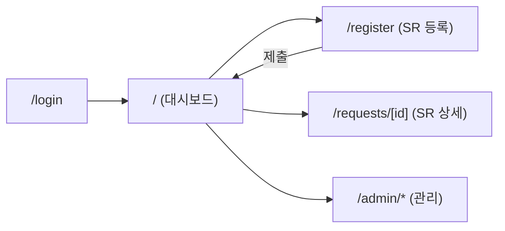
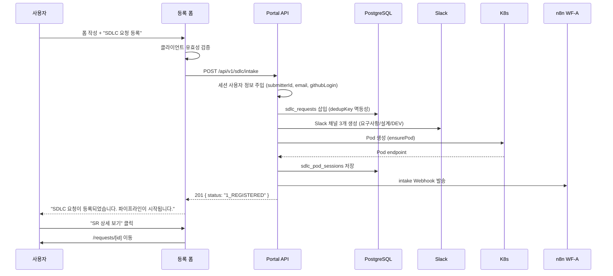
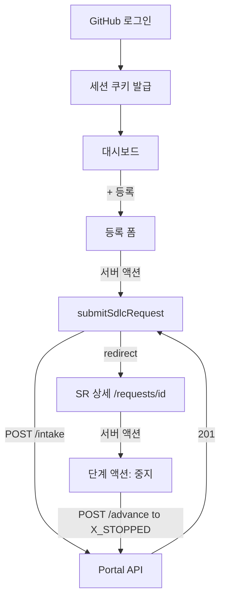

# SDLC SR 신규 등록 UI 설계

> SR(Software Request) 신규 등록 화면과 전체 페이지 구조를 설계한다.
> GitHub 로그인 연동과 Slack 채널 멤버 지정을 기본으로 설계한다.

## 1. 개요

### 1.1 설계 목표

- 비개발자(PI 관리자/일반 사용자)도 자연어로 개발 요청을 등록할 수 있는 폼
- GitHub OAuth 로그인 후 제출자 정보 자동 채움
- 등록 즉시 SDLC 파이프라인(요구사항 → 설계 → 개발 → 완료) 자동 시작
- 진행 상태를 직관적으로 파악할 수 있는 대시보드

### 1.2 설계 결정

| 항목 | 설계 결정 | 근거 |
|------|----------|------|
| 인증 | GitHub OAuth (제출자 정보 자동 채움) | SDLC 코어가 GitHub 연동 기반 |
| 채널 멤버 | **Slack 이메일/username** 입력 | `users.lookupByEmail`로 자동 변환 |
| System 선택 | 단순 텍스트 입력 | 다중 시스템 관리 불필요 |
| SWP 연동 | 미도입 | intake/개발대기 전환 불필요 |

## 2. 페이지 구조



### 2.1 페이지 목록

| 경로 | 페이지 | 인증 | 설명 |
|------|--------|------|------|
| `/login` | 로그인 | 공개 | "Sign in with GitHub" 버튼 |
| `/` | 대시보드 | user | SR 목록 + 진행 상태 요약 |
| `/register` | SR 등록 | user | 신규 SR 등록 폼 |
| `/requests/[id]` | SR 상세 | user | 단계별 상태·채널·Pod·GitHub 링크 |
| `/admin/orgs` | Org 관리 | admin | GitHub Org/Credential 관리 |
| `/admin/repos` | Repo 관리 | admin | GitHub Repo 등록·설정 |
| `/incidents` | 장애 대응 | user | 장애 목록 + 상태별 집계 카드 |
| `/incidents/[id]` | 장애 상세 | user | 상태 레일 + `analyses[]` + 종결 액션 |
| `/incidents/inject` | Test 트리거 주입 | admin | 템플릿 기반 가짜 장애 주입 |
| `/improvements` | 자체개선 | user | 스캔 회차 목록 + finding 집계 카드 |
| `/improvements/[id]` | 스캔 상세 | user | 스캔 결과 + finding 검토·승격 |
| `/memory` | 개발 규정 | user | 시스템 Card 그리드 + 전역 검색 |
| `/memory` | 개발 규정 | user | category Tabs 5개 + Table + 전역 검색 |
| `/memory/[category]/[slug]` | 규정 상세 | user | Markdown 본문 + 메타 + 개정 이력 |
| `/admin/incident-templates` | 장애 템플릿 | admin | 장애 템플릿 CRUD |
| `/admin/improvement-targets` | 개선 대상 | admin | repo별 스캔 설정·수동 트리거 |
| `/admin/memory-tokens` | MCP 토큰 관리 | admin | MCP 접근 토큰 발급·폐기 |

> 신규 12개 페이지의 상세 레이아웃은 각 소유 문서를 참조한다 — [11-incident-response-agent.md](./11-incident-response-agent.md) 10절, [12-self-improvement-agent.md](./12-self-improvement-agent.md) 9절, [13-developer-memory-agent.md](./13-developer-memory-agent.md) 7절 참조.

### 2.2 라우트 그룹 (App Router)

```
src/app/
├── (auth)/
│   └── login/page.tsx              # GitHub 로그인
├── (dashboard)/
│   ├── page.tsx                    # 대시보드 (SR 목록)
│   ├── register/page.tsx           # SR 등록 폼
│   ├── requests/[id]/
│   │   ├── page.tsx                # SR 상세
│   │   └── actions.ts              # stopRequest (중지)
│   ├── incidents/
│   │   ├── page.tsx                # 장애 목록
│   │   ├── [id]/page.tsx           # 장애 상세 (상태 레일 + analyses)
│   │   ├── inject/page.tsx         # Test 트리거 주입 (admin 전용)
│   │   └── actions.ts              # 서버 액션 4개
│   ├── improvements/
│   │   ├── page.tsx                # 스캔 목록
│   │   ├── [id]/page.tsx           # 스캔 상세 + finding 검토
│   │   └── actions.ts              # acceptFinding / rejectFinding / promote*
│   └── memory/
│       ├── page.tsx                          # category Tabs 5개 + Table + 전역 검색
│       └── [category]/[slug]/page.tsx        # 규정 상세 (2열)
│       └── actions.ts                        # createMemoryRule / updateMemoryRule / archiveMemoryRule
├── (admin)/
│   ├── orgs/page.tsx
│   ├── repos/page.tsx
│   ├── incident-templates/
│   │   ├── page.tsx                # 템플릿 관리
│   │   └── actions.ts              # 템플릿 CRUD 서버 액션
│   ├── improvement-targets/
│   │   ├── page.tsx                # repo별 스캔 설정
│   │   └── actions.ts              # triggerScan / updateImprovementTarget
│   └── memory-tokens/
│       ├── page.tsx                # 토큰 Table + [+ 발급] Dialog + [폐기] AlertDialog
│       └── actions.ts              # issueMemoryToken / revokeMemoryToken
└── api/v1/sdlc/                    # API Routes
```

> **No Top Nav** 규칙 준수: 상단 네비게이션 바 없이 모든 전역 컨트롤은 사이드바에 통합 (CLAUDE.md 디자인 시스템 규칙). **No-Line**: surface 계층(배경색 차이)으로 구조 분리.

## 3. SR 등록 폼 (`/register`)

### 3.1 폼 레이아웃

```
┌─────────────────────────────────────────────────────────┐
│  사이드바  │  SR 신규 등록                                │
│            │  ───────────────────────────────────────────  │
│  • 대시보드│  [기본 정보]                                  │
│  • SR 등록 │  제목 *      [________________________]      │
│  • 내 요청 │  개발 유형 * [feature ▾]                      │
│  • 관리    │  요청 시스템 [________________________]      │
│            │  메뉴 경로   [________________________]      │
│            │  요청 사이트 [________________________]      │
│            │                                              │
│            │  [상세 내용]                                  │
│            │  문제점·개발의뢰                              │
│            │  ┌──────────────────────────────────────┐   │
│            │  │                                      │   │
│            │  │  (마크다운 에디터)                    │   │
│            │  │                                      │   │
│            │  └──────────────────────────────────────┘   │
│            │  기대효과                                    │
│            │  ┌──────────────────────────────────────┐   │
│            │  │                                      │   │
│            │  └──────────────────────────────────────┘   │
│            │  테스트 시나리오                             │
│            │  ┌──────────────────────────────────────┐   │
│            │  │                                      │   │
│            │  └──────────────────────────────────────┘   │
│            │                                              │
│            │  [일정 및 참여자]                            │
│            │  요청일 *    [2026-09-01]                    │
│            │  목표 완료일 [2026-09-15]                    │
│            │  PI 관리자  [________________________]      │
│            │  부서       [________________________]      │
│            │  Slack 멤버 [user1@example.com   +]        │
│            │             [user2@example.com   +]        │
│            │             [+ 이메일 추가]                  │
│            │                                              │
│            │              [취소]  [SDLC 요청 등록]        │
└─────────────────────────────────────────────────────────┘
```

### 3.2 폼 필드 정의

| 필드 | 타입 | 필수 | 기본값 | 비고 |
|------|------|------|--------|------|
| `srTitle` | text | ✅ | — | 요청 제목 (intake `srTitle`) |
| `devType` | select | ✅ | `feature` | feature / bugfix / refactor / hotfix |
| `requestSystem` | text | ✅ | — | 요청 시스템명 |
| `module` | text | ❌ | — | 메뉴 경로 |
| `requestSite` | text | ✅ | — | 요청 사이트 (예: `aiways-on.example.com`) |
| `problemDescription` | markdown editor | ✅ | — | 문제점·개발의뢰 내용 |
| `expectedEffect` | markdown editor | ❌ | — | 개선 후 기대효과 |
| `testScenario` | markdown editor | ❌ | — | 테스트 시나리오 |
| `requestDate` | date | ✅ | 오늘 | 요청일 |
| `dueDate` | date | ❌ | — | 목표 완료일 |
| `piManager` | text | ❌ | — | PI 관리자명 |
| `department` | text | ❌ | 제출자 부서 | 대상 부서 |
| `members` | email list | ❌ | 제출자 이메일 | Slack 채널 초대할 멤버 이메일 |

### 3.3 자동 채움 (GitHub 세션)

로그인한 사용자 정보가 자동으로 채워진다 (수정 불가 또는 읽기 전용 표시).

| 필드 | 출처 | 표시 |
|------|------|------|
| 제출자명 | `session.user.name` | 읽기 전용 배지 |
| 제출자 이메일 | `session.user.email` | 읽기 전용 배지 |
| GitHub username | `session.user.login` | 읽기 전용 배지 (Slack 멤버 매핑용) |
| 제출자 부서 | `users.department` (선택) | 폼 기본값 |

```typescript
// 등록 폼 상단에 표시
<div className="flex items-center gap-3">
  <Avatar src={session.user.avatarUrl} />
  <div>
    <p className="font-body text-text-on-surface">{session.user.name}</p>
    <p className="font-mono-id text-sm text-text-on-surface-variant">
      @{session.user.login} · {session.user.email}
    </p>
  </div>
  <Badge>제출자 (자동)</Badge>
</div>
```

### 3.4 Slack 멤버 입력

Slack 채널에 초대할 멤버 이메일을 입력한다. `MessageChannelAdapter.inviteMembers`가 이메일 → Slack user ID 변환 (`users.lookupByEmail`).

```
[Slack 멤버]
┌─────────────────────────────────────────┐
│ user1@example.com                    [×] │
│ user2@example.com                    [×] │
│ [+ 이메일 추가]                          │
└─────────────────────────────────────────┘
💡 입력한 이메일로 Slack 초대를 발송합니다.
   (Slack에 등록된 이메일만 초대 가능, 미가입자는 자동 제외됩니다)
```

> 제출자 본인 이메일은 자동 포함. 변환 실패한 멤버는 skip + 경고 로그 (`_resolveOwUserIds` 동작).

## 4. 등록 제출 흐름



> feature SR은 채널 3개(`sr-{no}-requirements`/`-design`/`-dev`)를 생성한다. incident·improvement 프로파일은 dev 채널 1개(`inc-{no}-dev`·`imp-{no}-dev`)만 생성한다 ([02-messaging-adapter.md](./02-messaging-adapter.md) 5.2절).

### 4.1 Server Action (제출)

```typescript
// src/app/(dashboard)/register/actions.ts
'use server';
import { requireUser } from '@/lib/auth/guards';
import { env } from '@/env';

export async function submitSdlcRequest(formData: FormData) {
  const session = await requireUser();

  const payload = {
    requestNo: generateRequestNo(),  // SR-YYYYMMDD-NNN
    submitter: session.user.name ?? session.user.login,
    submitterEmail: session.user.email,
    submitterGithubLogin: session.user.login,
    requestSite: String(formData.get('requestSite')),
    devType: String(formData.get('devType')),
    requestSystem: String(formData.get('requestSystem')),
    module: formData.get('module') ? String(formData.get('module')) : undefined,
    dedupKey: generateDedupKey(),
    metadata: {
      srTitle: String(formData.get('srTitle')),
      requestDate: String(formData.get('requestDate')),
      dueDate: formData.get('dueDate') ? String(formData.get('dueDate')) : undefined,
      piManager: formData.get('piManager') ? String(formData.get('piManager')) : undefined,
      department: formData.get('department') ? String(formData.get('department')) : undefined,
      problemDescription: String(formData.get('problemDescription')),
      expectedEffect: formData.get('expectedEffect') ? String(formData.get('expectedEffect')) : undefined,
      testScenario: formData.get('testScenario') ? String(formData.get('testScenario')) : undefined,
      members: formData.getAll('members').map(String),
    },
  };

  // Portal 내부 intake API 호출 (또는 직접 orchestrator 호출)
  const res = await fetch(`${env.PORTAL_BASE_URL}/api/v1/sdlc/intake`, {
    method: 'POST',
    headers: {
      'Content-Type': 'application/json',
      Authorization: `Bearer ${env.SDLC_MASTER_KEY}`,
    },
    body: JSON.stringify(payload),
  });

  if (res.status === 201) {
    return { success: true, status: '1_REGISTERED', requestNo: payload.requestNo };
  }
  const err = await res.json();
  return { success: false, error: err.message };
}
```

### 4.2 요청 번호 생성 규칙

`SR-YYYYMMDD-NNN` 형식. 같은 날짜 내 일련번호.

```typescript
// src/lib/sdlc/request-no.ts
export function generateRequestNo(): string {
  const date = new Date();  // ⚠️ 서버 사이드에서만 호출
  const ymd = date.toISOString().slice(0, 10).replace(/-/g, '');
  // DB에서 해당 날짜 최대 일련번호 조회 후 +1
  const seq = await getNextSequence(ymd);  // 001, 002, ...
  return `SR-${ymd}-${seq}`;
}
```

> `Date.now()`/`new Date()`는 클라이언트가 아닌 **서버 사이드에서만** 사용. 서버 Action 내에서 호출.

## 5. 대시보드 (`/`)

### 5.1 레이아웃

```
┌─────────────────────────────────────────────────────────┐
│  사이드바  │  SDLC 대시보드                              │
│            │  ───────────────────────────────────────────│
│  • 대시보드│  [진행 현황]                                │
│  • SR 등록 │  ┌──────┐ ┌──────┐ ┌──────┐                 │
│  • 내 요청 │  │ 진행 │ │ 완료 │ │ 실패 │                 │
│ • 장애 대응│  │  3   │ │  12  │ │  0   │                 │
│  • 자체개선│  └──────┘ └──────┘ └──────┘                 │
│ • 개발 규정│                                              │
│  • 관리    │  [SR 목록]              [상태: 전체 ▾] [검색]│
│            │  ─────────────────────────────────────────  │
│            │  SR-20260901-001  홍길동  개발중  09-01      │
│            │  SR-20260901-002  김철수  설계중  09-01      │
│            │  SR-20260831-005  이영희  요구사항 08-31     │
│            │  SR-20260831-004  박민수  완료    08-31      │
│            │  ...                                         │
│            │  [더 보기]                                   │
│            │                                              │
│            │  ┌──────────────────────────────────────┐    │
│            │  │  + SDLC 요청 등록                     │    │
│            │  └──────────────────────────────────────┘    │
└─────────────────────────────────────────────────────────┘
```

사이드바 항목 전체 순서는 아래와 같다. 신규 3개 최상위 항목(`장애 대응`·`자체개선`·`개발 규정`)과 `관리` 하위 4개가 추가된다.

| 순서 | 항목 | 경로 | 권한 |
|------|------|------|------|
| 1 | 대시보드 | `/` | user |
| 2 | SR 등록 | `/register` | user |
| 3 | 내 요청 | `/requests` | user |
| 4 | **장애 대응** | `/incidents` | user |
| 5 | **자체개선** | `/improvements` | user |
| 6 | **개발 규정** | `/memory` | user |
| 7 | 관리 > Org | `/admin/orgs` | admin |
| 8 | 관리 > Repo | `/admin/repos` | admin |
| 9 | **관리 > 장애 템플릿** | `/admin/incident-templates` | admin |
| 10 | **관리 > 개선 대상** | `/admin/improvement-targets` | admin |
| 11 | **관리 > MCP 토큰** | `/admin/memory-tokens` | admin |

> **No Top Nav 유지**: 신규 항목은 전부 사이드바에만 추가한다. 상단 네비게이션 바는 도입하지 않으며, 규정 전역 검색·Test 트리거 주입·수동 스캔 트리거 같은 보조 컨트롤은 각 페이지 본문 내부 버튼 또는 `Command` 팔레트로 노출한다. active 상태는 좌측 4px Cyan blade + `bg-sidebar-active` + `shadow-glow-active` 규칙을 따른다.

### 5.2 진행 현황 카드

상태별 SR 개수를 집계한 카드. 클릭 시 해당 상태로 필터.

| 카드 | 상태 조건 | 색상 토큰 |
|------|-----------|-----------|
| 진행 | non-terminal (`1`~`4`) | `text-on-surface` + accent |
| 완료 | `9_COMPLETE` | success accent |
| 실패 | `X_FAILED` / `X_STOPPED` | error accent |

### 5.3 SR 목록 테이블

| 컬럼 | 설명 |
|------|------|
| 요청 번호 | `requestNo` (SR 상세 링크) |
| 제출자 | `submitter` |
| 시스템 | `requestSystem` |
| 상태 | `status` (Stage 라벨 + 색상 배지) |
| 요청일 | `createdAt` |

> 페이지네이션 (`page`, `limit`), 상태 필터, 검색 (`requestNo`/`submitter`) 지원. API는 `GET /requests` (05-portal-api.md 2.13절).

## 6. SR 상세 (`/requests/[id]`)

### 6.1 레이아웃

```
┌─────────────────────────────────────────────────────────┐
│  사이드바  │  SR-20260901-001                            │
│            │  ───────────────────────────────────────────│
│            │  [단계 진행 표시]                            │
│            │  ① 등록 ─── ② 요구사항 ─── ③ 설계 ───        │
│            │  ④ 개발 ─── ⑨ 완료                           │
│            │              ▲ 현재: ④ 개발 중               │
│            │                                              │
│            │  [기본 정보]                                  │
│            │  제목: 테스트 기능 추가                       │
│            │  제출자: 홍길동 @hong-gildong                 │
│            │  시스템: AIways On                             │
│            │  개발 유형: feature                           │
│            │  목표일: 2026-09-15                           │
│            │                                              │
│            │  [Slack 채널]                                 │
│            │  #sr-20260901-001-requirements  [활성]       │
│            │  #sr-20260901-001-design        [활성]       │
│            │  #sr-20260901-001-dev          [활성]        │
│            │                                              │
│            │  [Pod 상태]                                   │
│            │  sdlc-SR-20260901-001  RUNNING  /health ✅   │
│            │                                              │
│            │  [GitHub]                                     │
│            │  Issue #123  org/portal  [open]              │
│            │  PR #45     org/portal  [open]               │
│            │                                              │
│            │  [단계 이력]                                  │
│            │  1→2  2026-09-01 10:00  n8n-agent            │
│            │  2→3  2026-09-01 14:00  n8n-agent-fb         │
│            │  3→4  2026-09-01 18:00  n8n-agent-fb         │
│            │                                              │
│            │  ┌──────────────────────────────────────┐    │
│            │  │  [중지]                               │    │
│            │  └──────────────────────────────────────┘    │
└─────────────────────────────────────────────────────────┘
```

> Slack 채널은 SR이 실패(`X_FAILED`)해도 아카이브되지 않는다. 보상 트랜잭션이 각 채널에 실패 단계·원인·삭제된 Pod·GitHub 링크를 게시하므로, 담당자는 채널에서 실패 원인을 확인하고 후속 논의를 이어갈 수 있다 ([03-state-machine.md](./03-state-machine.md) 참조).

### 6.2 단계 진행 표시

상태 머신의 정상 단계 5개를 시각화. 현재 단계 강조 (사이드바 Active 규칙과 동일한 cyan blade 토큰 사용).

```
① 등록 ─── ② 요구사항 ─── ③ 설계 ─── ④ 개발 ─── ⑨ 완료
                                      ▲ 현재
```

> Stage `5`~`8`은 향후 배포/검증 단계 재도입용으로 번호만 예약되어 있어 표시하지 않는다. `9_COMPLETE`가 유일한 성공 terminal이다.
>
> incident·improvement 프로파일은 `1 → 4 → 9`로 축약되므로 ②·③을 건너뛴 상태로 렌더링한다.

### 6.3 단계별 액션 버튼

현재 상태에 따라 활성화되는 버튼 (서버 액션 → Portal API).

| 상태 | 버튼 | API | 인증 |
|------|------|-----|------|
| non-terminal (`1`~`4`) | "중지" | `POST /advance` (to X_STOPPED) | 세션 (admin 권장) |
| terminal (`9_COMPLETE` / `X_*`) | (없음) | — | — |

```typescript
// src/app/(dashboard)/requests/[id]/actions.ts
'use server';
export async function stopRequest(requestId: string, from: string) {
  const res = await fetch(`${env.PORTAL_BASE_URL}/api/v1/sdlc/advance`, {
    method: 'POST',
    headers: { Cookie: cookies().toString() },  // 세션 쿠키 전달
    body: JSON.stringify({ requestId, from, to: 'X_STOPPED' }),
  });
  return res.json();
}
```

> 역방향 전이 버튼은 제공하지 않는다. 상태 머신에 역전이가 0개이므로 이미 진행된 단계로 되돌리는 액션은 존재하지 않으며, 재작업이 필요하면 신규 SR을 등록한다 ([03-state-machine.md](./03-state-machine.md) 참조).

### 6.4 DevSubStage 표시 (4_DEV_IN_PROGRESS)

`4_DEV_IN_PROGRESS` 단계에서 4개 서브스테이지 진행 상태를 스텝 표시로 렌더링. 10초마다 상세 재조회로 갱신.

```
┌─────────────────────────────────────────────────────────┐
│  [개발 서브스테이지]                                      │
│  ① dev ─── ② qa ─── ③ code_review ─── ④ security_review  │
│     ✅        ✅        ▲ 진행 중                         │
└─────────────────────────────────────────────────────────┘
```

| 서브스테이지 | 표시 | 데이터 출처 |
|-------------|------|------------|
| `dev` | ✅ 완료 / 🔵 진행 / ⚪ 대기 | `metadata.devSubStage.history` |
| `qa` | ✅ / 🔵 / ⚪ | `metadata.devSubStage.history` |
| `code_review` | ✅ / 🔵 / ⚪ | `metadata.devSubStage.history` |
| `security_review` | ✅ / 🔵 / ⚪ | `metadata.devSubStage.current` |

> `GET /requests/{id}` 응답의 `metadata.devSubStage`에서 진행 상태 조회. `current`가 현재 진행 중, `history`에 완료된 서브스테이지 기록.

### 6.5 웹 터미널 (Claude Code CLI 접근)

SR 상세에서 Pod 내 Claude Code CLI에 직접 접근하는 웹 터미널. SSE 스트리밍으로 실시간 출력 표시.

```
┌─────────────────────────────────────────────────────────┐
│  [터미널]                                    [열기/닫기]  │
│  ─────────────────────────────────────────────────────  │
│  > ls -la                                               │
│  drwxr-xr-x  3 runner runner 4096 Sep  1 10:00 portal   │
│  > npm run dev                                          │
│  ▲ Ready in 2.3s                                        │
│  ▲ Local: https://localhost:3000                        │
│  ─────────────────────────────────────────────────────  │
│  [입력] _                                       [전송]   │
└─────────────────────────────────────────────────────────┘
```

| 기능 | API | 설명 |
|------|-----|------|
| 스트림 열기 | `GET /terminal/stream` | SSE로 stdout/stderr 실시간 스트리밍 |
| 입력 | `POST /terminal/stdin` | 키보드 입력 전송 (`SDLC_CLAUDE_TERMINAL_READONLY=true` 시 차단) |
| 크기 조정 | `POST /terminal/resize` | 터미널 TTY 크기 (cols/rows) |
| 종료 | `POST /terminal/close` | 터미널 세션 종료 (Pod 프로세스는 계속) |
| 상태 | `GET /terminal/status` | 활성 여부, claudeSessionId, podName |

> 터미널은 K8s `pods/exec` API를 WebSocket으로 연결하여 Pod 내 Claude Code 세션에 접근. RBAC `pods/exec` 권한 필요.

## 7. 디자인 시스템 적용

CLAUDE.md 디자인 시스템 규칙 준수.

| 규칙 | 적용 |
|------|------|
| No Top Nav | 상단 네비게이션 바 없음, 사이드바 통합 |
| No-Line | surface 계층(배경색 차이)으로 구조 분리, border 최소 |
| 색상 토큰 | `globals.css` `@theme` 블록 의미적 토큰만 사용 (`text-on-surface`, `bg-surface-container`) |
| 타이포그래피 | `font-headline`(Manrope, 타이틀) / `font-body`(Inter, 본문) / `font-mono-id`(JetBrains Mono, SR 번호·GitHub username) |
| 사이드바 Active | 좌측 4px Cyan blade + `bg-sidebar-active` + `box-shadow: var(--shadow-glow-active)` |
| `label-tech` | 10px uppercase 라벨 (섹션 헤더, 상태 배지) |

### 상태 배지 색상 매핑

| 상태 | 배지 스타일 |
|------|-----------|
| `1_REGISTERED` | `label-tech` accent (진행 중) |
| `2_REQUIREMENTS_IN_PROGRESS` | `label-tech` accent (진행 중) |
| `3_DEV_DESIGN_IN_PROGRESS` | `label-tech` accent (진행 중) |
| `4_DEV_IN_PROGRESS` | `label-tech` accent (진행 중) |
| `9_COMPLETE` | success accent |
| `X_STOPPED` | warning accent |
| `X_FAILED` | error accent |

### incident 상태 배지 매핑

| 상태 | 배지 스타일 |
|------|-----------|
| `DETECTED` | `label-tech` `text-on-surface-variant` (대기) |
| `TRIAGING` | `label-tech` accent (진행 중) |
| `SR_PROMOTED` | `label-tech` accent (진행 중) |
| `GUIDE_READY` | `label-tech` accent (산출 완료) |
| `PATCH_PROPOSED` | `label-tech` warning accent (사람 리뷰 대기) |
| `RESOLVED` | `label-tech` success accent |
| `X_FAILED` | `label-tech` error accent |
| `ARCHIVED` | `label-tech` `text-on-surface-variant` |

### improvement finding 배지 매핑

| 축 | 값 | 배지 스타일 |
|----|-----|-----------|
| severity | `critical` | `label-tech` error accent |
| severity | `high` | `label-tech` warning accent |
| severity | `medium` | `label-tech` accent |
| severity | `low` | `text-on-surface-variant` |
| status | `proposed` | `label-tech` accent (미검토) |
| status | `accepted` | `label-tech` accent (채택됨) |
| status | `promoted_sr` | `label-tech` success accent |
| status | `promoted_memory` | `label-tech` success accent |
| status | `rejected` | `text-on-surface-variant` |

### memory 규정 배지 매핑

| 축 | 값 | 배지 스타일 |
|----|-----|-----------|
| severity | `critical` | `label-tech` error accent |
| severity | `warn` | `label-tech` warning accent |
| severity | `info` | `text-on-surface-variant` |
| sourceType | `manual` | `text-on-surface-variant` (중성) |
| sourceType | `incident` | `label-tech` error accent |
| sourceType | `improvement` | `label-tech` accent |
| sourceType | `agent` | `label-tech` accent |
| scope | `read_write` | `label-tech` warning accent |
| scope | `read` | `text-on-surface-variant` (중성) |

> 신규 배지 3종은 accent 등급 체계(진행=accent, 성공=success accent, 경고=warning accent, 실패=error accent, 대기·중성=`text-on-surface-variant`)를 재사용한다. 신규 색 토큰은 도입하지 않으며 raw hex도 쓰지 않는다. 각 축의 전체 정의는 [11-incident-response-agent.md](./11-incident-response-agent.md) 10.8절, [12-self-improvement-agent.md](./12-self-improvement-agent.md) 9.7절, [13-developer-memory-agent.md](./13-developer-memory-agent.md) 7.9절 참조.

## 8. 관리자 페이지

### 8.1 Org 관리 (`/admin/orgs`)

GitHub Org 등록 + Credential(PAT) 연결.

```
┌─────────────────────────────────────────┐
│  GitHub Org 관리                        │
│  ─────────────────────────────────────  │
│  [+ Org 등록]                          │
│  ─────────────────────────────────────  │
│  org    https://github.com/org   [설정] │
│  bia    https://github.com/bia   [설정] │
└─────────────────────────────────────────┘
```

### 8.2 Repo 관리 (`/admin/repos`)

Org별 GitHub Repo 등록. `autoPrMerge`, `isUi`, `runnable`, `playwrightEnabled` 옵션 설정.

```
┌─────────────────────────────────────────────────────────┐
│  Repo 관리  [Org: org ▾]                                 │
│  ─────────────────────────────────────────────────────  │
│  [+ Repo 등록]                                          │
│  ─────────────────────────────────────────────────────  │
│  portal    github.com/org/portal                        │
│            main · autoPrMerge ✅ · isUi ❌ · runnable ✅  │
│            [설정] [셋업 실행]                            │
│  ─────────────────────────────────────────────────────  │
│  dashboard github.com/org/dashboard                     │
│            main · autoPrMerge ❌ · isUi ✅ · runnable ✅  │
│            [설정] [셋업 실행]                            │
└─────────────────────────────────────────────────────────┘
```

### 8.3 Repo 등록 폼

| 필드 | 타입 | 설명 |
|------|------|------|
| `repoUrl` | text | GitHub Repo URL |
| `repoName` | text | 표시명 |
| `defaultBranch` | text | 기본 브랜치 (기본 `main`) |
| `autoPrMerge` | toggle | 자동 PR merge 여부 |
| `isUi` | toggle | UI repo 여부 (목업 캡처 대상) |
| `runnable` | toggle | 실행 가능 여부 |
| `playwrightEnabled` | toggle | Playwright 테스트 가능 |
| `devServerUrl` | text | 개발 서버 URL (isUi 시) |
| `files` | key-value | 등록 파일 (.env.local 등, 암호화 저장) |
| `envVars` | key-value | 환경 변수 (암호화 저장) |

## 9. 컴포넌트 구성 (shadcn/ui)

AIways On은 shadcn/ui + Radix UI primitives + Tailwind 기반의 컴포넌트 규칙을 따른다.

| 컴포넌트 | 용도 |
|----------|------|
| `Form` + `FormField` + `Input` + `Select` | 등록 폼 입력 |
| `Textarea` (마크다운) | 상세 내용 입력 (problemDescription 등) |
| `Tag` / `Badge` | 상태 배지, 멤버 태그 |
| `Table` | SR 목록, 단계 이력 |
| `Card` | 진행 현황 카드, 상세 섹션 |
| `Button` | 등록, 액션 버튼 |
| `Dialog` | Org/Repo 등록 모달 |
| `Toast` | 등록 성공/실패 알림 |
| `Avatar` | 제출자 프로필 (GitHub avatar) |
| `Tabs` | `/memory` category 5종 전환 |
| `Accordion` | 장애 상세 `analyses[]` 펼침, 규정 상세 개정 이력 |
| `Switch` | 템플릿 `enabled`, `autoPromote`, `registerMemoryRule` 토글 |
| `AlertDialog` | 트리거 주입·finding 승격·규정 폐기·MCP 토큰 폐기 확인 |
| `Progress` | 장애 상세 상태 레일 진행도 |
| `Command` | `/memory` 전역 규정 검색 팔레트 (선택) |

> 신규 6개 컴포넌트(`Tabs`·`Accordion`·`Switch`·`AlertDialog`·`Progress`·`Command`)는 모두 shadcn/ui 표준 컴포넌트로 추가 설치만 필요하며, Radix UI primitives 기반이라 본 컴포넌트 규칙과 충돌하지 않는다.

## 10. 데이터 흐름 (UI 관점)



## 11. 접근 권한

| 페이지 | user | admin |
|--------|------|-------|
| `/login` | ✅ | ✅ |
| `/` (대시보드) | 본인 SR만 | 전체 SR |
| `/register` | ✅ | ✅ |
| `/requests/[id]` | 본인 SR | 전체 SR |
| `/admin/orgs` | ❌ (403) | ✅ |
| `/admin/repos` | ❌ (403) | ✅ |
| `/incidents` | ✅ | ✅ |
| `/incidents/[id]` | ✅ (읽기) | ✅ (+ 승격·종결·아카이브) |
| `/incidents/inject` | ❌ (403) | ✅ |
| `/improvements` | ✅ | ✅ |
| `/improvements/[id]` | ✅ (읽기 + finding 검토) | ✅ (+ 승격 확정) |
| `/memory` | ✅ | ✅ |
| `/memory/[category]/[slug]` | ✅ (읽기 + 등록·수정) | ✅ (+ 폐기) |
| `/admin/incident-templates` | ❌ (403) | ✅ |
| `/admin/improvement-targets` | ❌ (403) | ✅ |
| `/admin/memory-tokens` | ❌ (403) | ✅ |

> **개발 규정의 비대칭 권한**: `/memory` 계열은 일반 사용자가 읽기뿐 아니라 **규정 등록·수정까지** 가능하다. 규정을 늘리는 것은 장려하고 없애는 것은 통제한다는 원칙에 따라 `archive`(폐기)만 admin 전용이며, `prohibition` category 승격은 예외적으로 admin 승인을 요구한다 ([13-developer-memory-agent.md](./13-developer-memory-agent.md) 7.11절 참조).

> 대시보드의 SR 목록은 user일 경우 `submitterId = session.user.id` 필터, admin일 경우 전체 조회 (`GET /requests` API에서 처리).
