# SDLC 데이터 흐름 — 엔드투엔드 시퀀스

> AIways On의 데이터 흐름은 **Slack 채널**을 기준으로 설계하며 Stage `5`·`6`·`7`·`8`은 미사용 예약 구간이다.
> Intake → 요구사항 → 설계 → 개발 → 완료 처리 전체 흐름과 보상 트랜잭션을 다룬다.

## 1. 엔드투엔드 워크플로우 개요

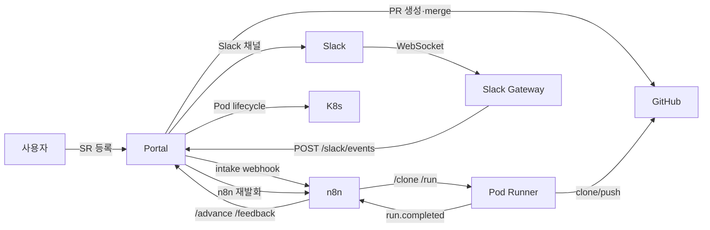

## 2. Intake 단계 (요청 등록)

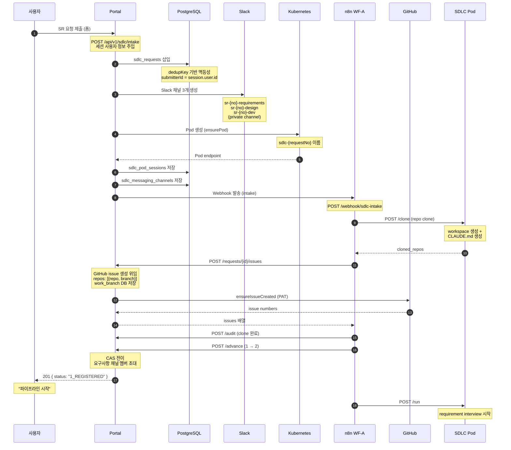

> SR 등록 → 채널 생성 → Pod 생성 → n8n webhook은 **단일 경로**다. 접수 시 별도 판정이나 대기 적재 없이 즉시 프로비저닝하므로 `POST /intake`는 `201 { requestNo, status: "1_REGISTERED" }`만 반환한다.
>
> 위 채널명은 **feature 프로파일 기준**이다. incident는 `inc-{no}-dev` 1개, improvement는 `imp-{no}-dev` 1개만 생성한다 ([02-messaging-adapter.md](./02-messaging-adapter.md) 참조).

## 3. 요구사항 정의 단계 (2_REQUIREMENTS_IN_PROGRESS)

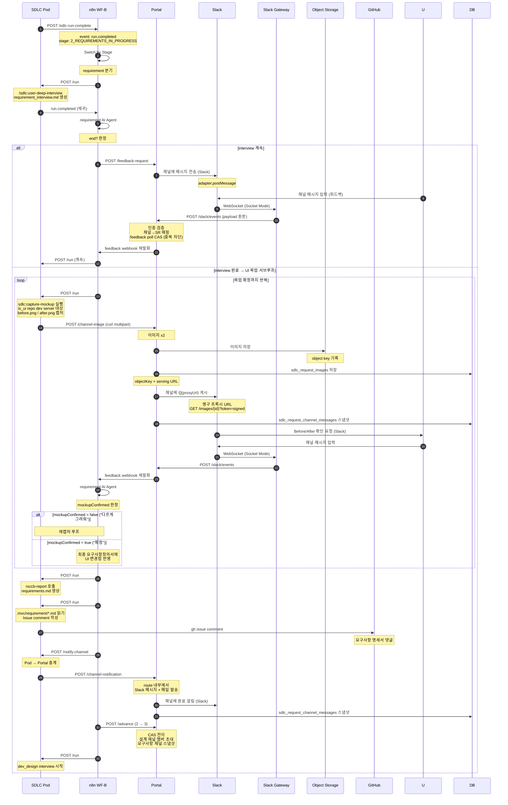

## 4. 설계 단계 (3_DEV_DESIGN_IN_PROGRESS)

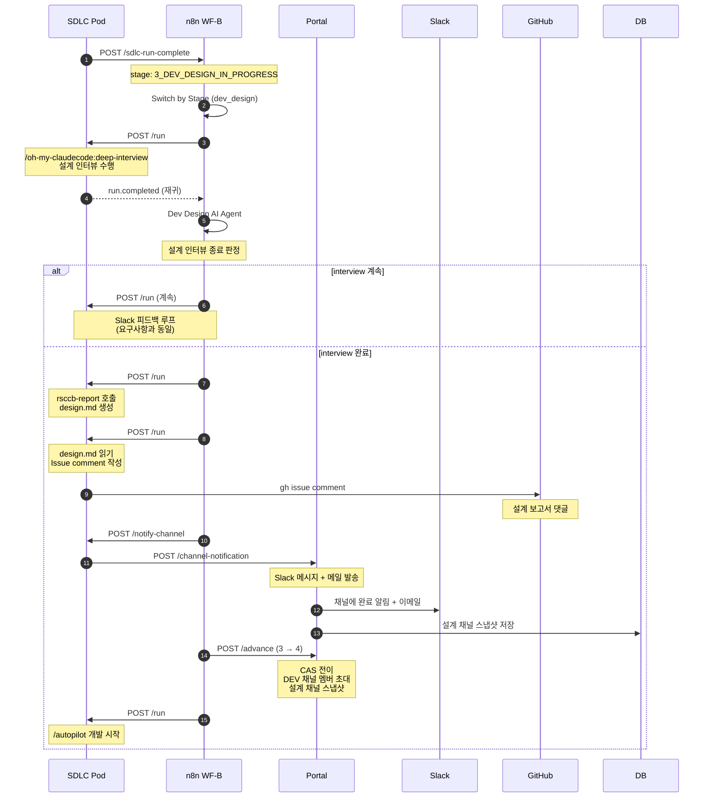

## 5. 개발 단계 (4_DEV_IN_PROGRESS)

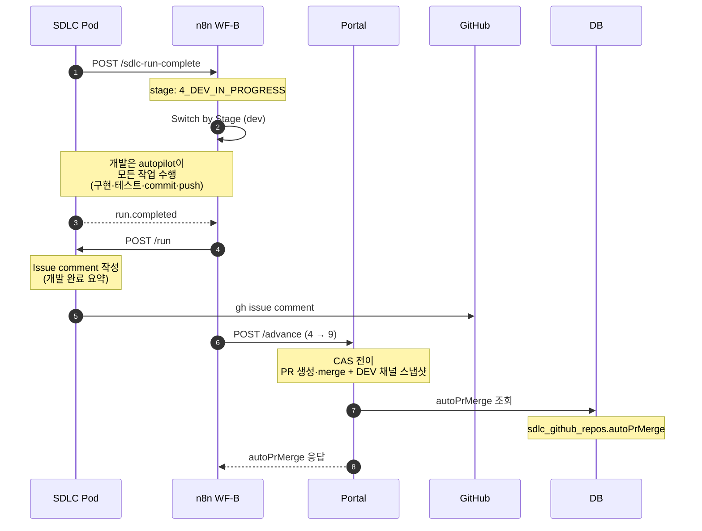

> **n8n은 `autoPrMerge`를 분기 조건으로 쓰지 않는다.** `Auto Merge?` 분기가 Portal 진입 작업으로 흡수됐으므로([07-n8n-workflows.md](./07-n8n-workflows.md) 3.13절) 응답의 이 필드는 관측·디버깅 목적으로만 전달된다. 실제 머지 판단은 `9_COMPLETE` 진입 시 Portal이 단독 수행한다 ([03-state-machine.md](./03-state-machine.md) 4.4절 참조).

## 6. 완료 처리 단계 (4 → 9_COMPLETE)

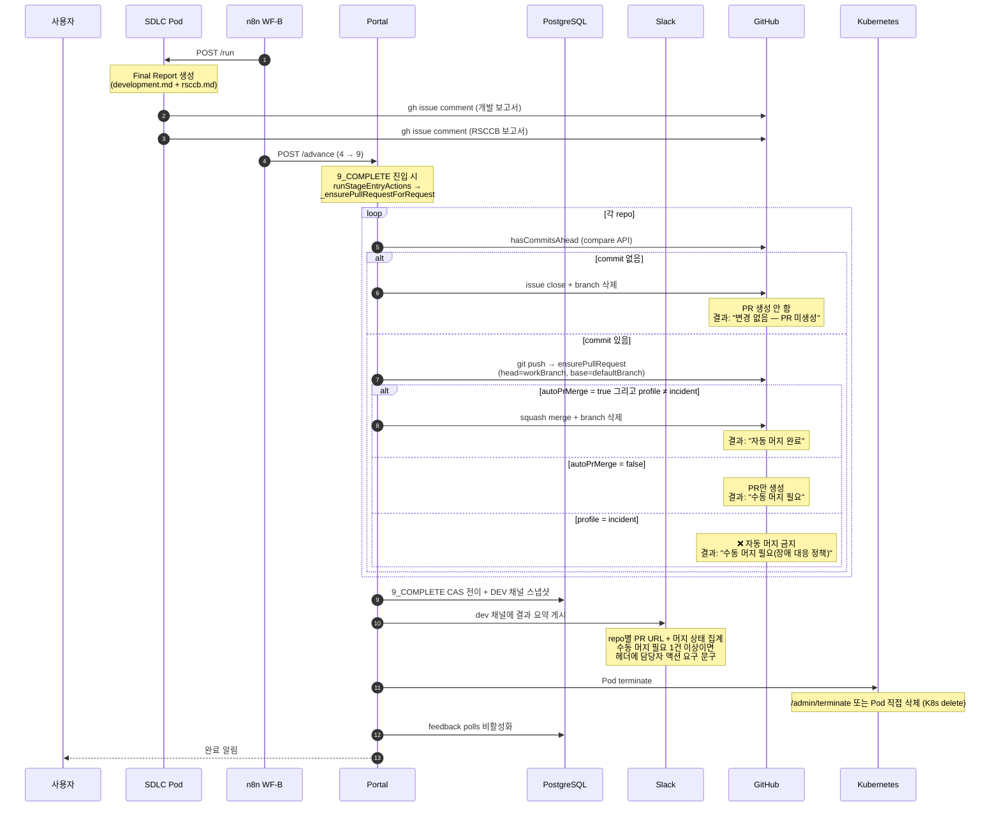

> Stage `5`·`6`·`7`·`8`은 미사용 예약 구간이므로 **`4 → 9_COMPLETE` 직접 전이**다. `9_COMPLETE`가 유일한 성공 terminal이며, 역방향 전이는 **0개**다. 진입 작업 정본은 [03-state-machine.md](./03-state-machine.md) 참조.
>
> 재개발이 필요한 경우 역전이 대신 **신규 SR 등록**으로 처리한다.

## 7. 보상 트랜잭션 (실패 처리)

```mermaid
sequenceDiagram
    autonumber
    participant ERR as 오류 감지
    participant P as Portal
    participant DB as PostgreSQL
    participant K8S as Kubernetes
    participant S as Slack
    participant GH as GitHub

    ERR->>P: 실패 감지
    note over P: compensateFailedSdlc 호출

    P->>DB: CAS → X_FAILED
    note over DB: idempotencyKey:<br/>compensate:{requestNo}

    P->>DB: sdlc_pod_sessions lookup

    alt Pod 존재
        P->>K8S: ensureDeletePod
        note over K8S: Pod 직접 삭제 (404 ok)
    end

    P->>P: 모든 채널 메시지 스냅샷
    note over P: adapter.listMessages<br/>최대 1000개 저장

    loop 각 채널
        P->>S: 실패 결과 메시지 게시
        note over S: adapter.postMessage<br/>실패 단계(currentStage)·실패 원인 요약<br/>삭제된 Pod 이름·Issue/PR 링크<br/>운영자 개입 안내
        note over S: dedup 마커<br/>&lt;!-- SDLC-FAILED:{requestNo} --&gt;<br/>Reconcile 재시도 시 중복 게시 방지
    end

    P->>DB: sdlc_github_issues lookup

    alt Issue 존재
        P->>GH: ensureIssueComment
        note over GH: FAILED 코멘트<br/>(close 하지 않음)
    end

    note over P: 보상 트랜잭션 완료<br/>운영자 개입 대기
```

> 각 보상 단계는 실패해도(non-fatal) 계속 진행한다. 보상 트랜잭션의 핵심 원칙.
>
> **채널은 아카이브하지 않고 살려 둔다** — 담당자가 실패 원인을 확인하고 후속 논의를 이어갈 창구가 필요하기 때문이다. 게시 내용 명세는 [03-state-machine.md](./03-state-machine.md) 참조.

## 8. DevSubStage 흐름 (4_DEV_IN_PROGRESS 내부)

`4_DEV_IN_PROGRESS` 단계는 4개 서브스테이지로 세분화되어 순차 실행된다.

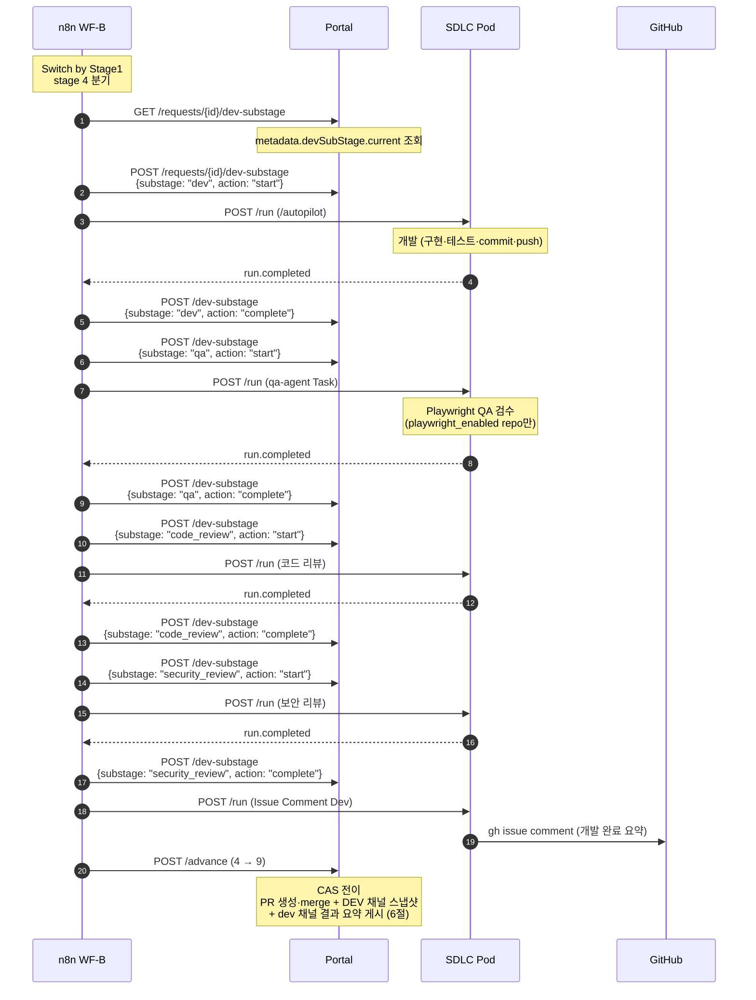

> **설계 결정**: resume 시퀀스는 미도입. 대신 devSubStage 4단계 순차 실행 흐름으로 구성.

---

### 8.1 Conda 환경 캐시 흐름 (Intake 시)

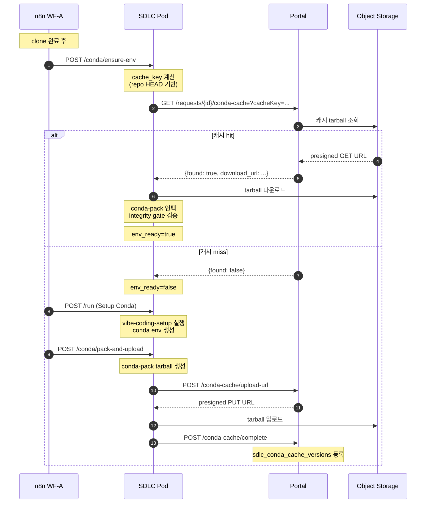

> Conda 캐시는 Pod 시작 시간 단축용 (선택). 캐시 miss여도 SR 실행에는 영향 없음.

## 9. 채널 스냅샷 타이밍

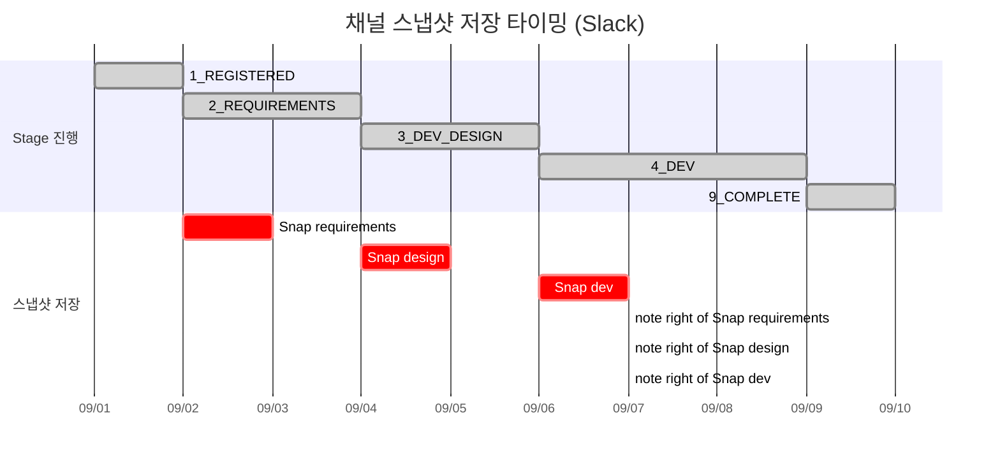

> 스냅샷은 `adapter.listMessages(channelId, 1000)`로 Slack `conversations.history`를 조회해 DB에 저장. 채널은 실패 시에도 아카이브되지 않으므로 스냅샷과 채널 이력이 함께 남는다.

## 10. 데이터 저장소 매핑

### Portal (PostgreSQL)

| 테이블 | 저장 데이터 |
|--------|------------|
| `sdlc_requests` | SDLC 요청 기본 정보 |
| `sdlc_stage_transitions` | 단계 전이 이력 |
| `sdlc_stage_resume_attempts` | Pod resume 예산 |
| `sdlc_messaging_channels` | Slack 채널 매핑 |
| `sdlc_request_channel_messages` | 채널 메시지 스냅샷 |
| `sdlc_request_images` | UI 목업 이미지 메타데이터 (S3 objectKey) |
| `sdlc_pod_sessions` | Pod 세션 정보 |
| `sdlc_github_issues` | GitHub Issue 정보 |
| `sdlc_github_pull_requests` | GitHub PR 정보 |
| `sdlc_github_orgs` | GitHub Org 설정 |
| `sdlc_github_repos` | GitHub Repo 설정 |
| `sdlc_github_credentials` | GitHub 인증 정보 (참조) |
| `sdlc_feedback_polls` | 사용자 피드백 poll |
| `sdlc_request_reports` | 단계별 보고서 markdown |
| `secret_refs` | 암호화된 토큰/비밀번호 |
| `audit_events` | 감사 로그 |
| `users` / `accounts` | 인증 (GitHub OAuth) |
| `sdlc_incidents` | 장애 레코드 (`dedupKey` 멱등, `requestId`·`memoryRuleId` 역참조) |
| `sdlc_incident_templates` | 장애 템플릿 (Test 트리거 주입용) |
| `sdlc_incident_analyses` | 장애 분석 산출물 (가설·가이드·패치) |
| `sdlc_improvement_scans` | 자체개선 스캔 회차 |
| `sdlc_improvement_findings` | 발굴 항목 (`fingerprint` 지문, `recurrenceCount`) |
| `sdlc_memory_rules` | 규정 본체 (category 5종, `contentMd`) |
| `sdlc_memory_rule_revisions` | 규정 개정 이력 (불변) |
| `sdlc_memory_access_tokens` | MCP 접근 토큰 (sha256 해시 저장) |

> 신규 9개 테이블은 모두 동일 Portal PostgreSQL 스키마에 추가된다. 상세 정의는 [11-incident-response-agent.md](./11-incident-response-agent.md) 8절, [12-self-improvement-agent.md](./12-self-improvement-agent.md) 7절, [13-developer-memory-agent.md](./13-developer-memory-agent.md) 3절 참조.

### Developer Memory MCP 서버

| 컴포넌트 | 저장소 접근 | 비고 |
|----------|------------|------|
| `portal-sdlc-memory-mcp` (K8s Deployment) | 동일 PostgreSQL — **전용 role `sdlc_memory_mcp`** | 읽기는 DB 직접 조회, 쓰기는 Portal 내부 API 경유 |

> MCP 서버는 Portal과 별개 프로세스이지만 새로운 데이터 저장소를 도입하지 않는다. 같은 PostgreSQL을 `SDLC_MEMORY_DATABASE_URL`(전용 role) 연결로 읽으며, 권한은 `sdlc_memory_*` 테이블 `SELECT`로 한정된다. 쓰기 경로는 `/api/internal/sdlc/memory/*`를 통해 Portal이 단독으로 수행하므로 감사 로그·revision 기록이 우회되지 않는다 ([13-developer-memory-agent.md](./13-developer-memory-agent.md) 6.3절 참조).

### n8n (메모리/워크플로우 상태)

| 데이터 | 용도 |
|--------|------|
| Workflow State | AI 에이전트 실행 컨텍스트 |
| Claude Session ID | Claude Code 세션 resume |

### SDLC Pod (인메모리 세션)

| 데이터 | 용도 |
|--------|------|
| `SessionState` | 현재 세션 상태 |
| `clone_fingerprint` | repo clone 멱등성 |
| `claude_session_id` | Claude Code 세션 ID (PVC 영속) |
| `sdlc_context` | SDLC 컨텍스트 (request_no, channel_ids 등) |

### 외부 스토리지

| 저장소 | 용도 |
|--------|------|
| Slack | 단계별 채널 (요구사항/설계/DEV) + 사용자 피드백 |
| Object Storage (S3) | UI 목업 이미지 (Ceph RGW 또는 AWS S3) |
| GitHub | Repo, Issue, PR |
| Kubernetes | Pod lifecycle |

## 11. 장애 대응 흐름 (트리거 → incident → SR → Pod)

`pipelineProfile=incident` SR의 축약 흐름이다. Stage enum은 불변이며 `1_REGISTERED → 4_DEV_IN_PROGRESS` 조건부 전이로 요구사항·설계 단계를 건너뛴다. 축약 경로는 **`1 → 4 → 9`**다.

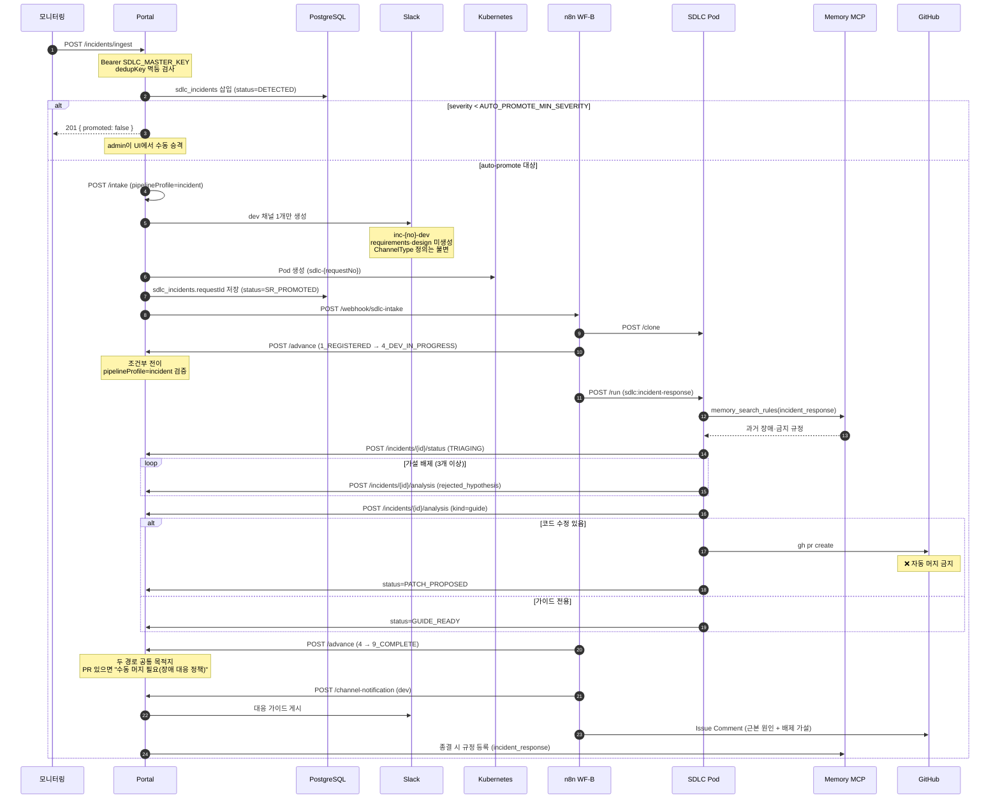

> 전체 상세 흐름(멱등 3중 게이트, 산출물 파일 경로)은 [11-incident-response-agent.md](./11-incident-response-agent.md) 참조.

## 12. 자체개선 스캔 흐름 (CronJob → SR → Pod → finding)

`pipelineProfile=improvement` SR의 축약 흐름이다. 축약 경로는 **`1 → 4 → 9`**다. 스케줄링은 K8s CronJob `portal-sdlc-improve-scan`(`17 3 * * *`)이 담당하며 n8n schedule trigger를 쓰지 않는다.

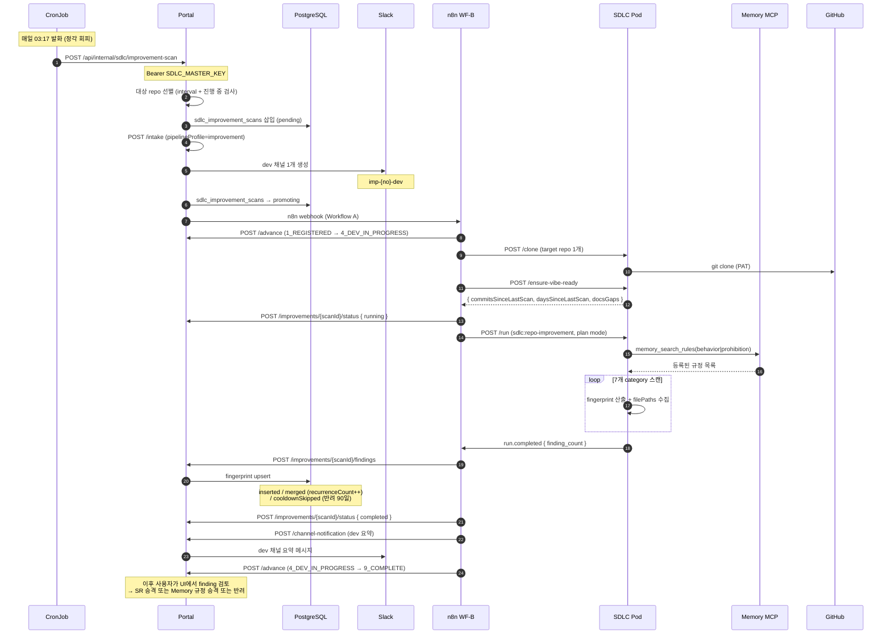

> 전체 상세 흐름(finding 승격 매트릭스, `recurrenceCount` 임계 도달 시 `failure_case` 자동 승격)은 [12-self-improvement-agent.md](./12-self-improvement-agent.md) 참조.

## 13. Developer Memory 조회·갱신 흐름 (로컬 Claude Code / Pod agent)

규정 조회는 MCP 서버가 PostgreSQL을 전용 role로 직접 읽고, 갱신은 반드시 Portal 내부 API를 경유한다. 소비자는 사내 개발자 로컬 Claude Code와 SDLC Pod agent 2종이다.

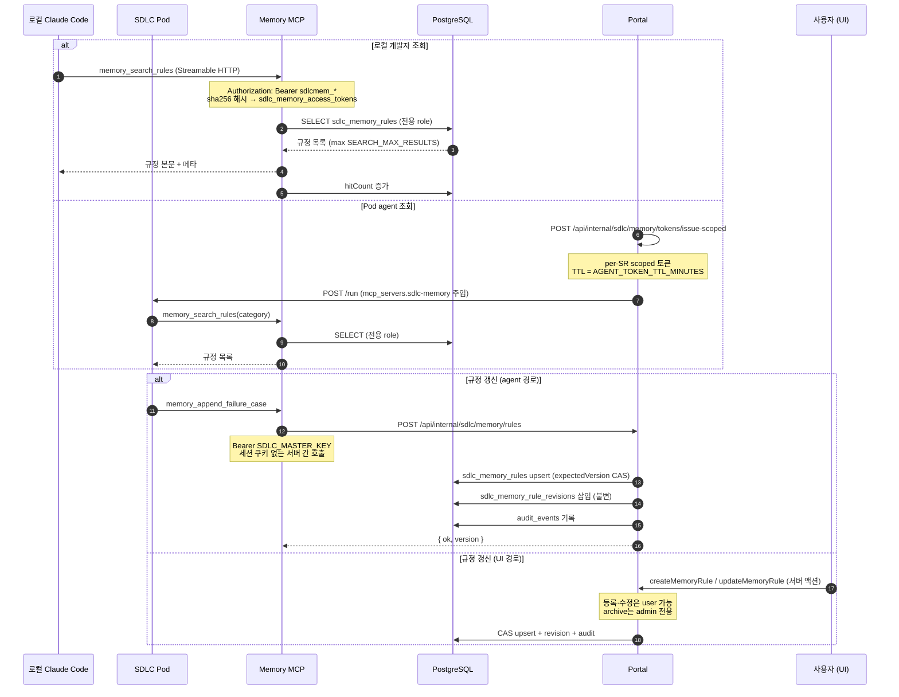

> **쓰기 단일 경로**: MCP 서버의 DB 전용 role은 `SELECT` 권한만 가진다. 모든 쓰기는 Portal이 수행하므로 `expectedVersion` CAS·revision 불변 이력·감사 로그가 경로에 관계없이 항상 기록된다. 전체 상세 흐름은 [13-developer-memory-agent.md](./13-developer-memory-agent.md) 11절 흐름도 참조.

## 14. 설계 결정 요약 (데이터 흐름)

| 흐름 | 설계 결정 | 비고 |
|------|----------|------|
| 채널 생성 | Slack `adapter.ensureChannel(opts)` | MessageChannelAdapter 추상화, `srPrefix`+`type`으로 이름 산출 |
| 채널 네이밍 | feature=`sr-{no}-{type}`, incident=`inc-{no}-dev`, improvement=`imp-{no}-dev` | `ChannelType` enum 불변 |
| 멤버 초대 | Slack `adapter.inviteMembers` | 이메일 → Slack user ID 변환 |
| 사용자 피드백 | Slack → Gateway Pod → Portal `/slack/events` | Gateway가 Socket Mode 전담(Bearer 릴레이). `events-api` 모드 전환 시 signing secret |
| 피드백 중복 차단 | `sdlc_feedback_polls.lastMessageId` CAS | Slack `ts` 단조 증가 이용, 별도 테이블 없음 |
| 메시지 스냅샷 | Slack `adapter.listMessages` (`conversations.history`) | 최대 1000개 DB 저장 |
| `4 → 9` 전이 | `4 → 9_COMPLETE` 직접 전이 | Stage `5`~`8` 미사용 예약, 역전이 0개 |
| 서버간 인증 | `SDLC_MASTER_KEY` 단일 키 | per-SR 콜백 토큰 발급 폐지 |
| 보상 트랜잭션 | Slack 채널에 실패 결과 게시 (아카이브 안 함) | 단계별 non-fatal 보상 |
| 인증 | GitHub OAuth `submitterId` FK | 세션 사용자 정보 자동 주입 |
| **Pod 사망 복구** | **미도입** (Pod 사망 시 reconcile → `X_FAILED` 보상만) | 자동 resume 없음 |
| **개발 서브스테이지** | **4단계 순차 실행** (dev→qa→cr→sr) | 진행 표시용 metadata |
| **Conda 캐시** | **HEAD 기반 캐시 키 + S3 tarball + integrity gate** | Pod 시작 시간 단축 |
