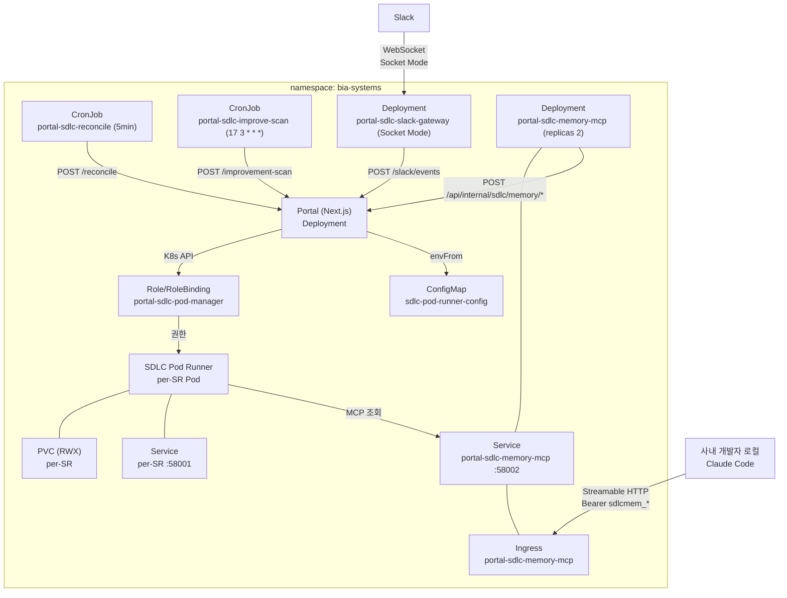

# K8s 인프라 설계 — 매니페스트·Pod 생성·환경 변수

> AIways On이 Kubernetes에서 실행되기 위한 인프라 요구사항을 정의한다.
> K8s 매니페스트 5종, Pod 생성 상세(Pod + PVC + Service), 전체 환경 변수 목록을 포함한다.

## 1. 개요

### 1.1 아키텍처 컴포넌트



> **RBAC 무관 컴포넌트**: `portal-sdlc-memory-mcp`와 `portal-sdlc-slack-gateway`는 K8s API를 호출하지 않으므로 Role `portal-sdlc-pod-manager`에 어떤 rule도 추가하지 않는다. 둘 다 `serviceAccountName: default`를 그대로 쓴다 ([13-developer-memory-agent.md](./13-developer-memory-agent.md) 10.1절, 본 문서 4절 참조).

### 1.2 매니페스트 목록

| 매니페스트 | kind | 용도 |
|-----------|------|------|
| `portal-sdlc-rbac.yaml` | Role + RoleBinding | Portal Pod가 SDLC runner Pod 관리 권한 |
| `sdlc-reconcile-cronjob.yaml` | CronJob | 5분마다 reconcile 호출 |
| `sdlc-slack-gateway.yaml` | Deployment | Slack Socket Mode 연결 전담 릴레이 (단일 replica) |
| `sdlc-pod-runner-config.yaml` | ConfigMap | Pod Runner 공통 환경 변수 |
| `sdlc-improve-scan-cronjob.yaml` | CronJob | 일 1회 improvement-scan 호출 (`17 3 * * *`) |
| `sdlc-memory-mcp.yaml` | Deployment + Service + ConfigMap | Memory MCP 서버 본체 + ClusterIP :58002 |
| `sdlc-memory-mcp-ingress.yaml` | Ingress | 사내 도메인 TLS 노출 (로컬 개발자 접근용) |

> **적용 순서** (코드 배포 전 완료 필수 — RBAC이 없으면 Portal이 Pod를 생성하지 못해 모든 접수가 실패한다):
> 1. `kubectl apply -f portal-sdlc-rbac.yaml`
> 2. `kubectl apply -f sdlc-pod-runner-config.yaml`
> 3. `kubectl apply -f sdlc-reconcile-cronjob.yaml`
> 4. Secret `sdlc-secrets`에 신규 5개 키 추가 (`master-key`, `memory-token-issuer-token`, `memory-db-url`, `aws-bearer-token-bedrock`, `slack-app-token`)
> 5. DB에 전용 role `sdlc_memory_mcp` 생성 + GRANT ([13-developer-memory-agent.md](./13-developer-memory-agent.md) 6.3절)
> 6. `kubectl apply -f sdlc-slack-gateway.yaml`
> 7. `kubectl apply -f sdlc-improve-scan-cronjob.yaml`
> 8. `kubectl apply -f sdlc-memory-mcp.yaml`
> 9. `kubectl apply -f sdlc-memory-mcp-ingress.yaml`
> 10. Portal 배포 (신규 `/api/internal/sdlc/memory/*`·`/api/internal/sdlc/improvement-scan` 라우트 포함)

> **fail-closed 순서 근거**: `master-key`가 Secret에 없으면 improve-scan CronJob Pod와 Slack Gateway Pod가 기동하지 못한다. `slack-app-token`이 없으면 Gateway가 Socket Mode 연결에 실패해 livenessProbe가 계속 재시작을 유발한다. `memory-db-url`과 DB role이 없으면 MCP Deployment의 readiness probe가 실패한다. 따라서 Secret·DB role을 신규 매니페스트 적용보다 먼저 준비한다.

> **Gateway와 Portal의 배포 순서**: Gateway(6번)가 Portal 배포(10번)보다 먼저 뜨면 릴레이 대상인 `/slack/events`가 아직 신규 인증 로직을 갖지 않아 401이 날 수 있다. Gateway는 3회 재시도 후 로그만 남기고 드롭하므로 전이를 막지는 않으나, 무중단이 필요하면 Gateway를 `replicas: 0`으로 적용한 뒤 Portal 배포 완료 후 `replicas: 1`로 올린다.

---

## 2. RBAC (Role + RoleBinding)

Portal Pod(ServiceAccount `default`)가 SDLC runner Pod를 관리하는 데 필요한 최소 권한.

### 2.1 Role: `portal-sdlc-pod-manager`

```yaml
apiVersion: rbac.authorization.k8s.io/v1
kind: Role
metadata:
  name: portal-sdlc-pod-manager
  namespace: bia-systems
rules:
  # Pod 관리 (생성/삭제/상태 조회)
  - apiGroups: [""]
    resources: ["pods"]
    verbs: ["get", "list", "watch", "create", "delete"]
  # pods/exec (터미널 WebSocket)
  - apiGroups: [""]
    resources: ["pods/exec"]
    verbs: ["get", "create"]
  # Pod 로그
  - apiGroups: [""]
    resources: ["pods/log"]
    verbs: ["get"]
  # Secret 조회 (PAT, master key 등)
  - apiGroups: [""]
    resources: ["secrets"]
    verbs: ["get"]
  # Service (Pod용 Headless Service)
  - apiGroups: [""]
    resources: ["services"]
    verbs: ["get", "list", "create", "delete"]
  # ConfigMap 조회 (Pod Runner 공통 설정)
  - apiGroups: [""]
    resources: ["configmaps"]
    verbs: ["get", "list"]
  # PVC 관리 (per-SR 워크스페이스)
  - apiGroups: [""]
    resources: ["persistentvolumeclaims"]
    verbs: ["get", "list", "create", "delete"]
```

### 2.2 RoleBinding

```yaml
apiVersion: rbac.authorization.k8s.io/v1
kind: RoleBinding
metadata:
  name: portal-sdlc-pod-manager-binding
  namespace: bia-systems
subjects:
  - kind: ServiceAccount
    name: default
    namespace: bia-systems
roleRef:
  apiGroup: rbac.authorization.k8s.io
  kind: Role
  name: portal-sdlc-pod-manager
```

### 2.3 K8s API 호출 매핑

| Portal 코드 | K8s API | RBAC 권한 |
|-------------|---------|-----------|
| `createNamespacedPod` | v1 Pods | create |
| `deleteNamespacedPod` | v1 Pods | delete |
| `readNamespacedPod` | v1 Pods | get |
| `readNamespacedPodLog` | v1 Pods/log | get |
| `readNamespacedSecret` | v1 Secrets | get |
| `createNamespacedService` | v1 Services | create |
| `createNamespacedPersistentVolumeClaim` | v1 PVCs | create |
| `deleteNamespacedPersistentVolumeClaim` | v1 PVCs | delete |

---

## 3. Reconcile CronJob

5분마다 Portal `/api/internal/sdlc/reconcile`을 호출해 stale/orphaned 상태를 점검한다.

```yaml
apiVersion: batch/v1
kind: CronJob
metadata:
  name: portal-sdlc-reconcile
  namespace: bia-systems
spec:
  schedule: "*/5 * * * *"           # 5분마다
  concurrencyPolicy: Forbid          # 동시 실행 금지 (이전 Job 완료 대기)
  successfulJobsHistoryLimit: 3
  failedJobsHistoryLimit: 3
  jobTemplate:
    spec:
      backoffLimit: 0                # 실패 시 재시도 안 함
      template:
        spec:
          restartPolicy: Never
          serviceAccountName: default
          containers:
            - name: reconcile
              image: curlimages/curl:8.7.1
              command:
                - sh
                - -c
                - |
                  set -e
                  HTTP_STATUS=$(curl -k -sS -o /tmp/resp.json -w "%{http_code}" \
                    -X POST \
                    -H "Authorization: Bearer ${SDLC_RECONCILE_TOKEN}" \
                    -H "Content-Type: application/json" \
                    "${PORTAL_URL}/api/internal/sdlc/reconcile")
                  if [ "${HTTP_STATUS}" != "200" ]; then
                    echo "Reconcile failed: ${HTTP_STATUS}"
                    exit 1
                  fi
              env:
                - name: PORTAL_URL
                  valueFrom:
                    configMapKeyRef:
                      name: portal-config
                      key: APP_URL
                - name: SDLC_RECONCILE_TOKEN
                  valueFrom:
                    configMapKeyRef:
                      name: portal-config
                      key: SDLC_RECONCILE_TOKEN
              resources:
                requests: { cpu: 50m, memory: 32Mi }
                limits: { cpu: 100m, memory: 64Mi }
              securityContext:
                allowPrivilegeEscalation: false
                readOnlyRootFilesystem: true
                runAsNonRoot: true
                runAsUser: 1000
```

### 3.1 Reconcile 실행 순서 (resume sweep 제거)

| 단계 | 동작 |
|------|------|
| 1. auth | `SDLC_RECONCILE_TOKEN` 검증 |
| 2. liveness sweep | `sdlc_pod_sessions.status`를 K8s 실제 Pod 상태와 동기화 |
| 3. stale scan | `SDLC_RECONCILE_STALENESS_SECONDS`(2100s) 초과 활성 SR 검출 → 보상 |
| 4. orphan scan | `SDLC_RECONCILE_POD_MISSING_SECONDS`(600s) 초과 Pod 부재 감지 → 보상 |
| 5. compensate | stale/orphan 감지 시 `compensateFailedSdlc()` → `X_FAILED` |
| 6. PVC TTL | `SDLC_PVC_RETENTION_DAYS`(7일) 초과 PVC 삭제 |

> **설계 결정**: resume sweep 단계 제거.

### 3.2 Improvement Scan CronJob

파일 `sdlc-improve-scan-cronjob.yaml`. 일 1회 Portal `/api/internal/sdlc/improvement-scan`을 호출해 자체개선 스캔 회차를 개시한다. 매니페스트 구조는 위 `sdlc-reconcile-cronjob.yaml`을 그대로 미러링한다 — n8n schedule trigger를 쓰지 않고 K8s CronJob으로 스케줄링하는 기존 선례를 따른다.

```yaml
apiVersion: batch/v1
kind: CronJob
metadata:
  name: portal-sdlc-improve-scan
  namespace: bia-systems
spec:
  schedule: "17 3 * * *"             # 일 1회 새벽 03:17 (정각 회피 — 부하 분산)
  concurrencyPolicy: Forbid          # 동시 실행 금지
  successfulJobsHistoryLimit: 3
  failedJobsHistoryLimit: 3
  jobTemplate:
    spec:
      backoffLimit: 0                # 실패 시 재시도 안 함 (다음 회차에 자연 재시도)
      activeDeadlineSeconds: 300
      template:
        spec:
          restartPolicy: Never
          serviceAccountName: default
          containers:
            - name: improve-scan
              image: curlimages/curl:8.7.1
              command:
                - sh
                - -c
                - |
                  set -e
                  curl -k -sS --fail-with-body \
                    -X POST \
                    -H "Authorization: Bearer ${SDLC_MASTER_KEY}" \
                    -H "Content-Type: application/json" \
                    "${PORTAL_BASE_URL}/api/internal/sdlc/improvement-scan"
              env:
                - name: PORTAL_BASE_URL
                  valueFrom:
                    configMapKeyRef:
                      name: portal-config
                      key: APP_URL
                - name: SDLC_MASTER_KEY
                  valueFrom:
                    secretKeyRef:
                      name: sdlc-secrets
                      key: master-key
              resources:
                requests: { cpu: 50m, memory: 64Mi }
                limits: { cpu: 200m, memory: 128Mi }
              securityContext:
                allowPrivilegeEscalation: false
                readOnlyRootFilesystem: true
                runAsNonRoot: true
                runAsUser: 1000
```

| 항목 | reconcile | improve-scan | 근거 |
|------|-----------|--------------|------|
| `schedule` | `*/5 * * * *` | `17 3 * * *` | 스캔은 야간 유휴 시간 1회. 정각 회피로 클러스터 부하 분산 |
| `concurrencyPolicy` | `Forbid` | `Forbid` | 동일 — 중복 발화 방어 |
| `backoffLimit` | `0` | `0` | 동일 — 다음 회차에 자연 재시도 |
| `activeDeadlineSeconds` | — | `300` | 스캔 개시 API는 비동기 반환이므로 5분이면 충분 |
| 토큰 주입 | `configMapKeyRef` | `secretKeyRef` | `SDLC_MASTER_KEY`는 Secret에 둔다 (평문 금지) |

> **멱등**: `concurrencyPolicy: Forbid`로 이전 Job이 끝나기 전 다음 회차가 겹쳐 실행되지 않도록 막는다 ([12-self-improvement-agent.md](./12-self-improvement-agent.md) 2절 참조).

---

## 4. Slack Gateway (Deployment)

Slack Socket Mode WebSocket 연결을 전담하고, 수신한 이벤트를 Portal `/api/v1/sdlc/slack/events`로 릴레이하는 **무상태 Pod**다. Portal은 어느 모드에서도 WebSocket을 열지 않으므로 이 Pod가 유일한 Slack 인바운드 연결점이다.

**왜 별도 Pod인가**: Socket Mode는 장수명 상태 연결이라 1.1절 Portal(`replicas: 2+`, stateless)에 두면 replica 수만큼 중복 수신된다. 단일 replica 전용 Pod로 분리해야 정확히 한 번 수신된다. 롤링 업데이트 중 소켓 2개가 동시에 열리는 것을 막기 위해 `strategy: Recreate`를 쓴다.

```yaml
apiVersion: apps/v1
kind: Deployment
metadata:
  name: portal-sdlc-slack-gateway
  namespace: bia-systems
spec:
  replicas: 1
  strategy:
    type: Recreate          # 롤링 시 소켓 중복 연결 방지 (중복 수신 차단)
  selector:
    matchLabels:
      app: portal-sdlc-slack-gateway
  template:
    metadata:
      labels:
        app: portal-sdlc-slack-gateway
    spec:
      restartPolicy: Always
      serviceAccountName: default
      containers:
        - name: gateway
          image: sdlc-slack-gateway:latest
          ports:
            - containerPort: 58003
          env:
            - name: PORTAL_URL
              valueFrom:
                configMapKeyRef:
                  name: portal-config
                  key: APP_URL
            - name: SLACK_APP_TOKEN
              valueFrom:
                secretKeyRef:
                  name: sdlc-secrets
                  key: slack-app-token
            - name: SDLC_MASTER_KEY
              valueFrom:
                secretKeyRef:
                  name: sdlc-secrets
                  key: master-key
            - name: SLACK_GATEWAY_STALE_SECONDS
              value: "90"
          livenessProbe:               # 조용히 끊긴 소켓 감지 → Pod 재시작
            httpGet: { path: /health, port: 58003 }
            initialDelaySeconds: 15
            periodSeconds: 30
            failureThreshold: 2
          resources:
            requests: { cpu: 50m, memory: 64Mi }
            limits: { cpu: 200m, memory: 256Mi }
          securityContext:
            allowPrivilegeEscalation: false
            readOnlyRootFilesystem: true
            runAsNonRoot: true
            runAsUser: 1000
```

> **Service·Ingress 없음** — Gateway는 아웃바운드 전용이고, livenessProbe는 kubelet이 노드 로컬로 호출하므로 Service가 필요 없다. `SLACK_BOT_TOKEN`도 주입하지 않는다 (Slack Web API 미호출).

> **livenessProbe가 필수인 이유**: 프로세스는 살아 있으나 WebSocket이 조용히 끊겨 이벤트가 오지 않는 상태가 이 구조의 주된 실패 모드다. 마지막 이벤트/ping 수신이 `SLACK_GATEWAY_STALE_SECONDS`를 넘으면 `/health`가 503을 반환해 kubelet이 Pod를 재시작한다.

> **미도입 — `portal-sdlc-feedback-poll` Deployment**: Slack `conversations.history`를 10초마다 폴링하던 보조 Worker는 제거했다. 폴링과 이벤트 수신이 공존하면 같은 메시지로 n8n이 두 번 발화하므로, 수신 경로를 Gateway 단일 경로로 줄이고 Portal에서 CAS dedup으로 중복을 차단한다 ([05-portal-api.md](./05-portal-api.md) 2.12절, [02-messaging-adapter.md](./02-messaging-adapter.md) 6.2절 참조). `portal-config`의 `FEEDBACK_POLL_TOKEN`·`FEEDBACK_POLL_INTERVAL_SECONDS` 키도 함께 제거한다.

> **Events API 전환 시**: `SLACK_INBOUND_MODE=events-api`로 바꾸고 이 Deployment를 `replicas: 0`으로 내린 뒤 Portal `/api/v1/sdlc/slack/events`를 Ingress로 노출하면 된다. Portal 코드·엔드포인트·페이로드는 변경되지 않는다 ([02-messaging-adapter.md](./02-messaging-adapter.md) 6.0절).

### 4.1 Developer Memory MCP Deployment

파일 `sdlc-memory-mcp.yaml`. 사내 개발자 로컬 Claude Code와 SDLC Pod agent가 개발 규정을 조회하는 MCP 서버다. 위 `portal-sdlc-slack-gateway` Deployment 선례를 미러링한다 — Portal singleton 워커 명명(`portal-sdlc-*`), `serviceAccountName: default`, securityContext 4종, ConfigMap + Secret 조합 env.

```yaml
apiVersion: v1
kind: ConfigMap
metadata:
  name: sdlc-memory-mcp-config
  namespace: bia-systems
data:
  SDLC_MEMORY_ENABLED: "true"
  SDLC_MEMORY_MCP_PORT: "58002"
  SDLC_MEMORY_TOKEN_TTL_DAYS: "180"
  SDLC_MEMORY_AGENT_TOKEN_TTL_MINUTES: "240"
  SDLC_MEMORY_RATE_LIMIT_PER_MINUTE: "60"
  SDLC_MEMORY_SEARCH_MAX_RESULTS: "10"
---
apiVersion: apps/v1
kind: Deployment
metadata:
  name: portal-sdlc-memory-mcp
  namespace: bia-systems
spec:
  replicas: 2
  selector:
    matchLabels:
      app: portal-sdlc-memory-mcp
  template:
    metadata:
      labels:
        app: portal-sdlc-memory-mcp
    spec:
      restartPolicy: Always
      serviceAccountName: default
      containers:
        - name: mcp
          image: sdlc-memory-mcp:latest
          ports:
            - name: http
              containerPort: 58002
          env:
            - name: APP_URL
              valueFrom:
                configMapKeyRef:
                  name: portal-config
                  key: APP_URL
            - name: SDLC_MEMORY_DATABASE_URL
              valueFrom:
                secretKeyRef:
                  name: sdlc-secrets
                  key: memory-db-url
            # 서버간 공용 인증 키 (/api/internal/sdlc/memory/rules 호출용).
            # memory-token-issuer-token은 이 Deployment에 의도적으로 주입하지 않는다 —
            # MCP 컨테이너가 침해되어도 agent 토큰을 발급할 수 없어야 한다.
            - name: SDLC_MASTER_KEY
              valueFrom:
                secretKeyRef:
                  name: sdlc-secrets
                  key: master-key
          envFrom:
            - configMapRef:
                name: sdlc-memory-mcp-config
          readinessProbe:
            httpGet:
              path: /health
              port: 58002
            initialDelaySeconds: 5
            periodSeconds: 10
            timeoutSeconds: 3
            failureThreshold: 3
          livenessProbe:
            httpGet:
              path: /health
              port: 58002
            initialDelaySeconds: 15
            periodSeconds: 30
            timeoutSeconds: 3
            failureThreshold: 3
          resources:
            requests: { cpu: 100m, memory: 128Mi }
            limits: { cpu: 500m, memory: 512Mi }
          securityContext:
            allowPrivilegeEscalation: false
            readOnlyRootFilesystem: true
            runAsNonRoot: true
            runAsUser: 1000
---
apiVersion: v1
kind: Service
metadata:
  name: portal-sdlc-memory-mcp
  namespace: bia-systems
spec:
  type: ClusterIP
  selector:
    app: portal-sdlc-memory-mcp
  ports:
    - name: http
      port: 58002
      targetPort: 58002
      protocol: TCP
```

| 항목 | slack-gateway | memory-mcp | 근거 |
|------|--------------|------------|------|
| `replicas` | `1` (+ `strategy: Recreate`) | `2` | Gateway는 소켓 중복 연결 방지를 위해 단일 인스턴스, MCP는 개발자 다수의 동시 조회를 받는 사용자 대면 서비스이므로 이중화 |
| `serviceAccountName` | `default` | `default` | 동일 — K8s API 미호출 |
| securityContext | 4종 | 4종 | 동일 (`allowPrivilegeEscalation:false`, `readOnlyRootFilesystem:true`, `runAsNonRoot:true`, `runAsUser:1000`) |
| probe | liveness `GET /health` :58003 | readiness + liveness `GET /health` :58002 | Gateway는 조용히 끊긴 소켓 감지용 liveness만, MCP는 요청 수용 서비스이므로 준비 상태 게이트도 필요 |
| 포트 | `58003` (Service 없음) | `58002` (ClusterIP) | Pod Runner `58001`과 구분. Gateway는 아웃바운드 전용이라 Service 불필요 |
| Secret 키 | `slack-app-token`, `master-key` (2개만) | `memory-db-url`, `master-key` (2개만) | Gateway는 Socket Mode 연결과 릴레이 인증에 필요한 최소 키만 — `SLACK_BOT_TOKEN` 미주입 |

> 🔒 **`memory-token-issuer-token`은 이 Deployment에 주입하지 않는다.** 컨테이너 env는 `master-key`와 `memory-db-url` 2개만 `secretKeyRef`로 받는다. 발급용 토큰은 Portal Deployment만 보유하므로, MCP 서버가 침해되어도 `POST /api/internal/sdlc/memory/tokens/issue-scoped`를 호출해 임의 규정의 `read_write` agent 토큰을 발급할 수 없다 (7.1절 `#### SDLC — Developer Memory` 참조).

> ❓ **미해결 — `readOnlyRootFilesystem: true` vs MCP 세션 상태**: 이 설정은 MCP 서버가 디스크에 아무것도 쓰지 않는다는 전제에 의존한다. Streamable HTTP 세션 상태는 메모리에만 유지한다. 배포 전 `@modelcontextprotocol/sdk`가 세션 재개(resumability) 토큰을 파일로 쓰지 않는지 런타임 확인이 필요하다. 쓰는 것이 확인되면 `emptyDir` 볼륨 마운트를 추가해야 한다.

> **RBAC 변경은 없다**: MCP 서버는 K8s API를 호출하지 않는다. Role `portal-sdlc-pod-manager`(2절)에 어떤 rule도 추가하지 않으며 `serviceAccountName: default`를 그대로 쓴다.

> **`readOnlyRootFilesystem: true` 가능 근거**: Node 프로세스가 디스크에 쓰지 않는다. rate limit 카운터는 메모리 sliding window로 유지한다. PVC를 요구하지 않으므로 namespace storage 총량에 영향이 없다.

> Ingress(`sdlc-memory-mcp-ingress.yaml`)는 SSE 스트림을 위해 `proxy-read-timeout`·`proxy-send-timeout` `300`과 `proxy-buffering: off` annotation이 필요하다. 상세는 [13-developer-memory-agent.md](./13-developer-memory-agent.md) 10절 참조.

---

## 5. Pod Runner ConfigMap

SDLC Pod Runner가 사용하는 공통 환경변수. Pod 생성 시 `envFrom.configMapRef`로 주입한다.

```yaml
apiVersion: v1
kind: ConfigMap
metadata:
  name: sdlc-pod-runner-config
  namespace: bia-systems
data:
  # Bedrock / Claude Code
  CLAUDE_CODE_USE_BEDROCK: "1"
  AWS_REGION: "ap-northeast-2"
  ANTHROPIC_MODEL: "global.anthropic.claude-sonnet-5"
  ANTHROPIC_DEFAULT_HAIKU_MODEL: "global.anthropic.claude-haiku-4-5-20251001-v1:0"
  CLAUDE_BIN: "claude-dsassistant"

  # Workspace
  WORKSPACE_ROOT: "/workspaces"

  # Conda
  CONDA_BIN: "/opt/conda/bin/conda"

  # Timeout & Logging
  RUN_TIMEOUT_SECONDS: "14400"
  LOG_LEVEL: "INFO"

  # Git / gh CLI
  GIT_HOSTNAME: "github.com"

  # n8n Feedback Webhook
  N8N_FEEDBACK_WEBHOOK_TIMEOUT_S: "120"
  N8N_FEEDBACK_WEBHOOK_URL: "https://n8n.example.com/webhook/.../sdlc-feedback/:requestId/:stage"
  N8N_FEEDBACK_WEBHOOK_TOKEN: "*****"
```

> **⚠️ `AWS_BEARER_TOKEN_BEDROCK`는 ConfigMap에 두지 않는다.** Secret `sdlc-secrets`(key: `aws-bearer-token-bedrock`)를 `secretKeyRef`로 직접 주입한다. (Secret 분리 원칙)

### 5.1 ConfigMap 목록

| ConfigMap | 용도 | 소비자 |
|-----------|------|-------|
| `portal-config` | Portal 공통 설정 (`APP_URL`, `SDLC_RECONCILE_TOKEN` 등) | Portal, reconcile CronJob, Slack Gateway, improve-scan CronJob, Memory MCP |
| `sdlc-pod-runner-config` | Pod Runner 공통 환경 변수 | per-SR Pod Runner |
| `sdlc-memory-mcp-config` | Memory MCP 서버 설정 (`SDLC_MEMORY_*` 6종) | `portal-sdlc-memory-mcp` Deployment (4.1절) |

### 5.2 Secret `sdlc-secrets` 키 목록

기존 Secret에 신규 5개 키를 추가한다. Secret 자체를 신설하지 않으므로 기존 `secretKeyRef` 참조 구조는 변경되지 않는다.

```yaml
apiVersion: v1
kind: Secret
metadata:
  name: sdlc-secrets
  namespace: bia-systems
type: Opaque
stringData:
  github-pat: "ghp_..."
  pod-auth-token: "sdlc-pod-auth-..."
  master-key: "<SDLC_MASTER_KEY 값>"                                # 신규 — 서버간 인증 단일 키
  memory-token-issuer-token: "<SDLC_MEMORY_TOKEN_ISSUER_TOKEN 값>"   # 신규 — Portal orchestrator → Portal, /memory/tokens/issue-scoped 전용
  memory-db-url: "postgresql://sdlc_memory_mcp:<pw>@<host>:5432/<db>?options=-csearch_path%3Dsdlc"  # 신규
  aws-bearer-token-bedrock: "<AWS_BEARER_TOKEN_BEDROCK 값>"          # 신규 — Bedrock 직접 연결 bearer token
  slack-app-token: "xapp-..."                                        # 신규 — Socket Mode (Slack Gateway 전용)
```

| Secret | 키 | 소비자 |
|--------|-----|-------|
| `sdlc-secrets` | `github-pat` | Portal, Pod |
| `sdlc-secrets` | `pod-auth-token` | Portal, n8n, Pod |
| `sdlc-secrets` | **`master-key`** | Portal (검증), n8n · Pod · CronJob `portal-sdlc-improve-scan` · Memory MCP · 외부 모니터링 (발신) |
| `sdlc-secrets` | **`memory-token-issuer-token`** | Portal orchestrator (제시 — `/memory/tokens/issue-scoped` 전용), Portal (검증). **Memory MCP는 소비자가 아니다** |
| `sdlc-secrets` | **`memory-db-url`** | Memory MCP (DB 전용 role 연결) |
| `sdlc-secrets` | **`aws-bearer-token-bedrock`** | Pod `AWS_BEARER_TOKEN_BEDROCK` (Bedrock 직접 연결) |
| `sdlc-secrets` | **`slack-app-token`** | Slack Gateway Deployment **전용**. Portal에는 주입하지 않는다 — Portal은 WebSocket을 열지 않는다 (4절) |

> **평문 금지**: 신규 5개 키 모두 매니페스트 env에 평문을 넣지 않고 `secretKeyRef`로 주입한다. `secret_refs` 테이블은 GitHub PAT 등 per-repo 시크릿 저장 용도로 계속 유지된다 (서버간 인증 키는 per-SR 발급이 아니므로 이 테이블을 쓰지 않는다).

---

## 6. Pod 생성 상세 (per-SR)

Portal이 SR 접수 시 SR별로 K8s 리소스를 생성한다. `src/lib/adapters/pod.ts`가 구현.

> **왜 Deployment가 아닌 bare Pod인가**: per-SR Pod는 1회성 실행 환경이다. self-heal(재시작 시 새 Pod 생성)이 불필요하다 — Pod가 죽으면 보상 트랜잭션/재시도 흐름이 처리한다. `activeDeadlineSeconds`·graceful shutdown(`/admin/terminate`)이 수명 관리를 담당하므로 Deployment의 `replicas` 관리·rolling update 전부 불필요하다. 리소스 1종 감소(Deployment → Pod 직접)로 K8s API 호출·RBAC 권한이 단순해진다.

### 6.1 생성 리소스


| 리소스 | kind | 이름 패턴 | 용도 |
|--------|------|-----------|------|
| PVC | PersistentVolumeClaim | `sdlc-{requestNo}` | 워크스페이스 영속 (RWX) |
| Pod | Pod | `sdlc-{requestNo}` | 단일 Pod — Pod Runner 컨테이너 실행 (self-heal 없음) |
| Service | Service | `sdlc-{requestNo}` | ClusterIP, port 58001 |

### 6.2 PVC Spec

```yaml
apiVersion: v1
kind: PersistentVolumeClaim
metadata:
  name: sdlc-SR-20260901-001
  namespace: bia-systems
spec:
  accessModes:
    - ReadWriteMany                    # RWX — Pod 재생성 시 데이터 유지
  storageClassName: netapp-nfs         # env.SDLC_POD_STORAGE_CLASS
  resources:
    requests:
      storage: 20Gi                    # env.SDLC_POD_STORAGE_SIZE
```

> **멱등**: 409 AlreadyExists 시 성공으로 간주 (ensure-* 패턴).

### 6.3 Pod Spec

```yaml
apiVersion: v1
kind: Pod
metadata:
  name: sdlc-SR-20260901-001
  namespace: bia-systems
  labels:
    app: sdlc-SR-20260901-001
    component: sdlc-pod-runner
spec:
  serviceAccountName: default
  initContainers:
    - name: init-workspace
      image: sdlc-runner:latest
      command: ["/usr/local/bin/init-workspace.sh"]
      volumeMounts:
        - name: workspace
          mountPath: /workspaces
  containers:
    - name: runner
      image: sdlc-runner:latest     # env.SDLC_ALLOWED_RUNNER_IMAGES allowlist 검증
      ports:
        - containerPort: 58001
      envFrom:
        - configMapRef:
            name: sdlc-pod-runner-config
      env:
        # Secrets (secretKeyRef)
        - name: AWS_BEARER_TOKEN_BEDROCK
          valueFrom:
            secretKeyRef:
              name: sdlc-secrets
              key: aws-bearer-token-bedrock
        - name: GITHUB_PAT
          valueFrom:
            secretKeyRef:
              name: sdlc-secrets
              key: github-pat
        - name: POD_AUTH_TOKEN
          valueFrom:
            secretKeyRef:
              name: sdlc-secrets
              key: pod-auth-token
        - name: SDLC_MASTER_KEY
          valueFrom:
            secretKeyRef:
              name: sdlc-secrets
              key: master-key
        # Pod 식별 (Portal에서 주입)
        - name: REQUEST_NO
          value: "SR-20260901-001"
        - name: REQUEST_ID
          value: "uuid..."
        - name: PORTAL_BASE_URL
          value: "https://aiways-on.example.com"
        - name: POD_ENDPOINT
          value: "http://sdlc-SR-20260901-001.bia-systems.svc.cluster.local:58001"
        - name: CHANNEL_IDS
          value: '{"requirements":"C001","design":"C002","dev":"C003"}'
        - name: N8N_RUN_CALLBACK_URL
          value: "https://n8n.example.com/webhook/sdlc-run-complete"
      resources:
        requests:
          cpu: "1"                   # env.SDLC_POD_CPU_REQUEST
          memory: "2Gi"              # env.SDLC_POD_MEMORY_REQUEST
        limits:
          cpu: "2"                   # env.SDLC_POD_CPU_LIMIT
          memory: "4Gi"              # env.SDLC_POD_MEMORY_LIMIT
      volumeMounts:
        - name: workspace
          mountPath: /workspaces
      livenessProbe:
        httpGet:
          path: /health
          port: 58001
        initialDelaySeconds: 5
        periodSeconds: 30
        timeoutSeconds: 3
        failureThreshold: 3
      readinessProbe:
        httpGet:
          path: /health
          port: 58001
        initialDelaySeconds: 5
        periodSeconds: 10
  volumes:
    - name: workspace
      persistentVolumeClaim:
        claimName: sdlc-SR-20260901-001
  activeDeadlineSeconds: 14400        # env.SDLC_POD_DEADLINE_SECONDS (4시간)
```

### 6.4 Service Spec

```yaml
apiVersion: v1
kind: Service
metadata:
  name: sdlc-SR-20260901-001
  namespace: bia-systems
spec:
  type: ClusterIP
  selector:
    app: sdlc-SR-20260901-001
  ports:
    - port: 58001
      targetPort: 58001
      protocol: TCP
```

> Base URL: `http://sdlc-SR-20260901-001.bia-systems.svc.cluster.local:58001`

### 6.5 Pod 종료

| 상황 | 동작 |
|------|------|
| 정상 완료 (`9_COMPLETE`) | `POST /admin/terminate` → SIGTERM → Pod 삭제 → PVC 삭제 |
| 사용자 중지 (`X_STOPPED`) | `POST /admin/terminate` → Pod 삭제 → PVC 삭제 |
| 실패 (`X_FAILED`) | Pod 삭제 → **PVC 보존** (디버깅용) |

> **PVC 보존**: `X_FAILED` 시 PVC를 삭제하지 않고 `SDLC_PVC_RETENTION_DAYS`(7일) 후 reconcile이 삭제.

### 6.6 이미지 보안 (RCE 방지)

```typescript
// SDLC_ALLOWED_RUNNER_IMAGES 쉼표 분리 allowlist
const allowed = env.SDLC_ALLOWED_RUNNER_IMAGES.split(',');
// metadata.podImage이 allowlist에 있으면 사용, 없으면 첫 번째 이미지 (fallback)
const image = allowed.includes(req.metadata.podImage) ? req.metadata.podImage : allowed[0];
```

> 사용자 입력(`metadata.podImage`)을 무시하고 allowlist만 사용해 RCE 방지.

---

## 7. 전체 환경 변수 목록

### 7.1 Portal 환경 변수 (env.ts)

#### 인증

| 변수 | 필수 | 기본값 | 용도 |
|------|------|--------|------|
| `AUTH_SECRET` | ✅ | — | JWT 암호화 키 (세션 서명) |
| `AUTH_GITHUB_ID` | ✅ | — | GitHub OAuth App Client ID |
| `AUTH_GITHUB_SECRET` | ✅ | — | GitHub OAuth App Client Secret |
| `AUTH_TRUST_HOST` | | `true` | 프록시/도메인 신뢰 |
| `INITIAL_ADMIN_GITHUB_LOGINS` | | — | 최초 admin 부여 GitHub username (콤마 구분) |

#### App

| 변수 | 필수 | 기본값 | 용도 |
|------|------|--------|------|
| `APP_URL` | ✅ | `http://localhost:3000` | Portal base URL |
| `PORTAL_BASE_URL` | | — | 외부 접근 URL (Pod 전달용) |
| `ALLOWED_ORIGINS` | | — | CORS 허용 Origin (콤마 구분) |
| `DATABASE_URL` | ✅ | — | PostgreSQL 연결 문자열 |
| `POSTGRES_SCHEMA` | | `portal` | Drizzle pgSchema |

#### SDLC — Intake & n8n

| 변수 | 필수 | 기본값 | 용도 |
|------|------|--------|------|
| `SDLC_MASTER_KEY` | ✅ | — | **서버간 인증 단일 키.** `/intake`·`/incidents/ingest`·`/improvement-scan`·`/memory/rules`·Pod 콜백 등 모든 서버간 경로의 Bearer 토큰. Secret `sdlc-secrets` 키 `master-key`로 주입 |
| `SDLC_INTAKE_HMAC_SECRET` | | — | Intake HMAC 서명 |
| `SDLC_N8N_WEBHOOK_URL` | | — | n8n Workflow A trigger URL |
| `SDLC_N8N_RUN_CALLBACK_URL` | | — | Pod → n8n `/run` 완료 콜백 URL |
| `SDLC_N8N_RUN_CALLBACK_TOKEN` | | — | 콜백 인증 토큰 |
| `SDLC_N8N_REPO_SETUP_WEBHOOK_URL` | | — | Repo 등록 시 vibe-coding-setup webhook |

> **단일 Master Key 채택 근거**: 서버간 경로의 발신·수신 주체가 모두 동일 운영 조직이므로 경로별 토큰을 분리해도 신뢰 경계가 나뉘지 않는다. 반면 키 5종은 Secret 키·`secretKeyRef`·회전 절차를 5배로 늘려 관리 비용만 발생시킨다. 따라서 `SDLC_MASTER_KEY` 1개로 통합한다.
>
> ⚠️ **잔존 위험**: (1) 키 1개가 유출되면 `/intake`·`/incidents/ingest`·`/improvement-scan`·`/memory/rules`를 포함한 전 서버간 경로가 동시에 노출된다. (2) 회전 시 Portal·n8n·Pod·CronJob·Memory MCP를 동시에 갱신해야 하므로 무중단 회전이 불가능하다 — 회전은 점검 창구에서 수행한다.
>
> 단, `SDLC_MEMORY_TOKEN_ISSUER_TOKEN`은 **통합 대상이 아니다**. 토큰 발급 권한은 Master Key 보유자와 신뢰 경계가 실제로 다르며(MCP 컨테이너 침해 시 agent 토큰 발급을 막아야 한다), 그 분리 근거는 아래 `#### SDLC — Developer Memory`에 유지된다.

#### SDLC — Reconcile (resume 제거)

| 변수 | 필수 | 기본값 | 용도 |
|------|------|--------|------|
| `SDLC_RECONCILE_TOKEN` | ✅ | — | reconcile CronJob 인증 Bearer 토큰 |
| `SDLC_RECONCILE_STALENESS_SECONDS` | | `2100` | stale 판정 기준 (최장 pod run 1800s + 여유) |
| `SDLC_RECONCILE_POD_MISSING_SECONDS` | | `600` | Pod 부재 감지 cutoff |
| `SDLC_PVC_RETENTION_DAYS` | | `7` | PVC 보존 기간 (초과 시 reconcile이 삭제) |

> **reconcile 관련 변수의 소비 주체는 Portal Deployment다.** CronJob `portal-sdlc-reconcile`(3절)은 `curl`로 `POST /api/internal/sdlc/reconcile`만 호출하는 트리거이며 실제 판정 로직은 Portal 프로세스가 수행한다. 따라서 CronJob 컨테이너 env에는 `PORTAL_URL`과 `SDLC_RECONCILE_TOKEN` 2개만 필요하고, `SDLC_RECONCILE_STALENESS_SECONDS`·`SDLC_RECONCILE_POD_MISSING_SECONDS`·`SDLC_PVC_RETENTION_DAYS`·`SDLC_INCIDENT_PROMOTE_STALE_MINUTES`는 모두 **Portal Deployment env**에 등록한다. CronJob에 추가할 필요가 없다.

#### SDLC — Pod 리소스

| 변수 | 필수 | 기본값 | 용도 |
|------|------|--------|------|
| `SDLC_POD_DEADLINE_SECONDS` | | `14400` | Pod 활성 deadline (4시간) |
| `SDLC_POD_CPU_REQUEST` | | `1` | Pod CPU 요청량 |
| `SDLC_POD_MEMORY_REQUEST` | | `2Gi` | Pod 메모리 요청량 |
| `SDLC_POD_CPU_LIMIT` | | `2` | Pod CPU 제한 |
| `SDLC_POD_MEMORY_LIMIT` | | `4Gi` | Pod 메모리 제한 |
| `SDLC_POD_STORAGE_CLASS` | | `netapp-nfs` | PVC storageClass |
| `SDLC_POD_STORAGE_SIZE` | | `20Gi` | PVC 요청 storage 크기 |
| `SDLC_POD_AWS_BEARER_TOKEN_BEDROCK` | | — | Pod용 Bedrock bearer token (Secret `sdlc-secrets` key `aws-bearer-token-bedrock`에서 주입源) |
| `SDLC_POD_CLAUDE_CODE_USE_BEDROCK` | | `1` | Pod용 Bedrock 모드 활성화 |
| `SDLC_POD_AWS_REGION` | | `ap-northeast-2` | Pod용 Bedrock 리전 |
| `SDLC_POD_ANTHROPIC_MODEL` | | `global.anthropic.claude-sonnet-5` | Pod용 Bedrock Sonnet 모델 ID |
| `SDLC_POD_ANTHROPIC_DEFAULT_HAIKU_MODEL` | | `global.anthropic.claude-haiku-4-5-20251001-v1:0` | Pod용 Bedrock Haiku 모델 ID |
| `SDLC_POD_CLAUDE_BIN` | | `claude-dsassistant` | Pod용 Claude Code CLI 경로 |
| `SDLC_POD_WORKSPACE_ROOT` | | `/workspaces` | Pod용 워크스페이스 루트 |
| `SDLC_POD_N8N_WEBHOOK_TOKEN` | | — | Pod용 n8n 웹훅 토큰 |
| `SDLC_REQUEST_NAMESPACE` | | `bia-systems` | K8s namespace (PVC·Pod·Service 생성 대상) |
| `SDLC_ALLOWED_RUNNER_IMAGES` | | `sdlc-runner:latest` | 허용된 runner 이미지 (콤마 구분, RCE 방지) |

#### SDLC — 기타

| 변수 | 필수 | 기본값 | 용도 |
|------|------|--------|------|
| `SDLC_CALLBACK_BEARER` | | — | Pod API 인증 공유 시크릿 (선택) |
| `SDLC_IMAGE_SIGNING_SECRET` | | — | 이미지 서빙 URL 서명용 (비어 있으면 AUTH_SECRET 재사용) |
| `SDLC_TAB_ENABLED` | | `true` | SDLC 탭 표시 여부 |
| `SDLC_CLAUDE_TERMINAL_READONLY` | | `false` | Claude 터미널 읽기 전용 (키보드 입력 차단) |
| `SDLC_MAIL_EXCLUDE_SYSTEM_ANONYMOUS` | | `false` | 메일 발송 시 비실명계정 제외 |

#### SDLC — 장애 대응 (incident)

| 변수 | 필수 | 기본값 | 용도 |
|------|------|--------|------|
| `SDLC_INCIDENT_ENABLED` | | `true` | 장애 대응 파이프라인 전체 on/off. `false`면 ingest·inject 모두 403 |
| `SDLC_INCIDENT_AUTO_PROMOTE` | | `true` | ingest 시 자동 SR 승격 여부 |
| `SDLC_INCIDENT_AUTO_PROMOTE_MIN_SEVERITY` | | `high` | 자동 승격 최소 등급 (`critical` \| `high` \| `medium` \| `low`) |
| `SDLC_INCIDENT_DEDUP_WINDOW_MINUTES` | | `60` | dedup 윈도 (분). 윈도 내 동일 `dedupKey`는 중복 처리 |
| `SDLC_INCIDENT_RUN_TIMEOUT_SECONDS` | | `3600` | Pod `POST /run` `timeout_seconds` |
| `SDLC_INCIDENT_ALLOW_CODE_PATCH` | | `true` | `false`면 agent가 코드 수정 없이 가이드만 산출 |
| `SDLC_INCIDENT_PROMOTE_STALE_MINUTES` | | `30` | 승격 미완료 incident(`status='DETECTED'` + `requestId IS NULL` + `promotionAttempts > 0`)의 reconcile 재시도 stale 임계(분). `promotionAttempts >= 3`이면 `X_FAILED` |
| `SDLC_INCIDENT_ALLOW_TEST_INJECTION` | | `false` | `POST /incidents/inject` 전용 게이트. `SDLC_INCIDENT_ENABLED`와 **독립**이며 fail-closed — 미설정 시 inject는 403. 운영 환경에서는 `false` 유지 |

> 상세는 [11-incident-response-agent.md](./11-incident-response-agent.md) 12절 참조. 신규 K8s 오브젝트는 0개이며 Portal Deployment env에 값만 추가한다.

#### SDLC — 자체개선 (improvement)

| 변수 | 필수 | 기본값 | 용도 |
|------|------|--------|------|
| `SDLC_IMPROVEMENT_ENABLED` | | `true` | 자체개선 파이프라인 전역 on/off. `false`면 스캔 엔드포인트가 즉시 no-op 반환 |
| `SDLC_IMPROVEMENT_BATCH_SIZE` | | `1` | 한 회차 선별 repo 최대 개수 |
| `SDLC_IMPROVEMENT_DEFAULT_INTERVAL_DAYS` | | `14` | `improvementScanIntervalDays` 컬럼 기본값 |
| `SDLC_IMPROVEMENT_RUN_TIMEOUT_SECONDS` | | `5400` | Pod `/run` `timeout_seconds`. 기존 최장 1800s보다 김 |
| `SDLC_IMPROVEMENT_RECURRENCE_TO_MEMORY` | | `3` | `recurrenceCount` 임계 — 도달 시 `failure_case` 규정 자동 승격 후보 |
| `SDLC_IMPROVEMENT_REJECT_COOLDOWN_DAYS` | | `90` | 반려 지문 재등록 차단 기간(일) |

> 상세는 [12-self-improvement-agent.md](./12-self-improvement-agent.md) 12절 참조. CronJob `portal-sdlc-improve-scan`은 Secret `sdlc-secrets` 키 `master-key`를 `SDLC_MASTER_KEY`로 주입받아 스캔 엔드포인트를 호출한다 (3.2절).

#### SDLC — Developer Memory

| 변수 | 필수 | 기본값 | 용도 |
|------|------|--------|------|
| `SDLC_MEMORY_ENABLED` | | `true` | Memory 계층 전체 kill switch. `false`면 Portal이 agent 토큰 발급을 건너뛰고 `mcp_servers` 주입도 하지 않는다 |
| `SDLC_MASTER_KEY` | ✅ | — | **MCP 서버 → Portal.** `POST /api/internal/sdlc/memory/rules` 인증 Bearer 토큰 (위 `#### SDLC — Intake & n8n`의 그 키). 토큰 발급 엔드포인트에는 사용할 수 없다 |
| `SDLC_MEMORY_TOKEN_ISSUER_TOKEN` | ✅ | — | **Portal orchestrator → Portal 전용.** `POST /api/internal/sdlc/memory/tokens/issue-scoped` 인증 Bearer 토큰. MCP 서버에는 주입하지 않는다 |
| `SDLC_MEMORY_MCP_URL` | ✅ | — | MCP 서버 외부 URL (`https://sdlc-memory-mcp.example.com/mcp`). Portal이 `mcp_servers` 주입 시 사용 |
| `SDLC_MEMORY_MCP_PORT` | | `58002` | MCP 서버 listen 포트 (Pod Runner 58001과 구분) |
| `SDLC_MEMORY_DATABASE_URL` | ✅ | — | 전용 role `sdlc_memory_mcp` 연결 문자열 (Portal `DATABASE_URL`과 별개) |
| `SDLC_MEMORY_TOKEN_TTL_DAYS` | | `180` | developer 토큰 기본 TTL |
| `SDLC_MEMORY_AGENT_TOKEN_TTL_MINUTES` | | `240` | agent 토큰 TTL 상한 (Pod `activeDeadlineSeconds` 14400s와 정렬) |
| `SDLC_MEMORY_RATE_LIMIT_PER_MINUTE` | | `60` | 토큰당 분당 요청 상한 |
| `SDLC_MEMORY_SEARCH_MAX_RESULTS` | | `10` | `memory_search_rules` 반환 상한 (컨텍스트 절약) |

> ⚠️ **토큰 발급 경로만 Master Key에서 분리한 이유**: `SDLC_MASTER_KEY`가 `/memory/tokens/issue-scoped`까지 인증하면, MCP 서버 컨테이너가 침해된 공격자가 임의 규정에 대해 `read_write` agent 토큰을 발급받아 전역 규정을 재작성할 수 있다. MCP 컨테이너는 Master Key를 보유해야 하므로(`/memory/rules` 기록용) 발급 권한만은 별도 키로 떼어낸다. `SDLC_MEMORY_TOKEN_ISSUER_TOKEN`은 `portal-sdlc-memory-mcp` Deployment에 **주입하지 않으며** Portal Deployment만 보유한다 (4.1절).

> 위 9개 변수는 Portal과 MCP 서버가 나눠 소비한다. Portal은 `SDLC_MEMORY_ENABLED`·`TOKEN_ISSUER_TOKEN`·`MCP_URL`·`TOKEN_TTL_DAYS`·`AGENT_TOKEN_TTL_MINUTES`를, MCP 서버는 `ENABLED`·`MCP_PORT`·`DATABASE_URL`·`RATE_LIMIT_PER_MINUTE`·`SEARCH_MAX_RESULTS`를 읽는다. `SDLC_MASTER_KEY`는 양쪽이 공유한다. 소비 주체별 분배 표는 [13-developer-memory-agent.md](./13-developer-memory-agent.md) 10절 참조.

#### S3 (Ceph RGW) — 이미지/conda 캐시

| 변수 | 필수 | 기본값 | 용도 |
|------|------|--------|------|
| `S3_ENDPOINT` | ✅ | — | S3 호환 Object Storage endpoint (path-style) |
| `S3_BUCKET` | ✅ | — | S3 버킷명 |
| `S3_ACCESS_KEY` | ✅ | — | S3 액세스 키 |
| `S3_SECRET_KEY` | ✅ | — | S3 시크릿 키 |
| `S3_REGION` | | — | S3 리전 |
| `S3_PREFIX` | | — | S3 객체 키 prefix |

#### Slack (메시징)

| 변수 | 필수 | 기본값 | 용도 |
|------|------|--------|------|
| `MESSAGING_PROVIDER` | ✅ | — | `slack` (향후 `discord` 확장) |
| `SLACK_BOT_TOKEN` | ✅ | — | Slack Bot 토큰 (xoxb-). 송신 전용 — Gateway에는 주입하지 않는다 |
| `SLACK_INBOUND_MODE` | | `gateway` | 수신 인증기 선택: `gateway`(Bearer) \| `events-api`(signing secret). 하나만 활성화 (fail-closed) |
| `SLACK_SIGNING_SECRET` | | — | `SLACK_INBOUND_MODE=events-api`일 때 **필수**. `gateway` 모드에서는 미사용 |
| `SLACK_DEFAULT_WORKSPACE` | | — | 채널 이름 prefix용 |
| `SLACK_CHANNEL_VISIBILITY` | | `private` | `private` \| `public` |
| `SDLC_PORTAL_OPERATOR_EMAILS` | | — | 포털 운영 계정 이메일 (콤마 구분, 채널 초대용) |

> **`SLACK_APP_TOKEN`은 Portal 환경 변수가 아니다.** Socket Mode 연결은 `portal-sdlc-slack-gateway` Deployment가 전담하므로 app token은 해당 Deployment에만 `secretKeyRef`로 주입한다 (4절). Portal은 어느 모드에서도 WebSocket을 열지 않는다.

##### Slack Gateway Deployment 전용 환경 변수

| 변수 | 필수 | 기본값 | 용도 |
|------|------|--------|------|
| `SLACK_APP_TOKEN` | ✅ | — | Socket Mode 연결 (xapp-). Secret `slack-app-token` |
| `PORTAL_URL` | ✅ | — | 릴레이 대상 Portal base URL. ConfigMap `portal-config.APP_URL` |
| `SDLC_MASTER_KEY` | ✅ | — | Portal `/slack/events` 릴레이 시 Bearer 인증. Secret `master-key` |
| `SLACK_GATEWAY_STALE_SECONDS` | | `90` | `/health` 소켓 정지 판정 임계 (초과 시 503 → Pod 재시작) |

> **미도입**: `SDLC_N8N_STAGE_RESUME_WEBHOOK_URL`, `SDLC_RESUME_MAX_ATTEMPTS`, `SDLC_RESUME_STUCK_SECONDS`, `SDLC_RESUME_INFLIGHT_SECONDS`, `SDLC_POD_MAX_RESTARTS` (resume 기능 전체 제거).

### 7.2 Pod Runner 환경 변수 (config.py)

> 상세는 [06-pod-runner-api.md](./06-pod-runner-api.md) 11절 참조. K8s ConfigMap/Secret에서 주입.

#### Secrets (K8s Secret)

| 변수 | 용도 |
|------|------|
| `POD_AUTH_TOKEN` | API 인증 Bearer 토큰 |
| `GITHUB_PAT` | GitHub Personal Access Token |
| `SDLC_MASTER_KEY` | Portal 콜백 인증 키 (서버간 단일 키) |
| `AWS_BEARER_TOKEN_BEDROCK` | Bedrock 직접 연결 bearer token |

#### ConfigMap (sdlc-pod-runner-config)

| 변수 | 기본값 | 용도 |
|------|--------|------|
| `CLAUDE_CODE_USE_BEDROCK` | `1` | Bedrock 직접 연결 모드 활성화 |
| `AWS_REGION` | `ap-northeast-2` | Bedrock 리전 |
| `ANTHROPIC_MODEL` | `global.anthropic.claude-sonnet-5` | Bedrock Sonnet 모델 ID |
| `ANTHROPIC_DEFAULT_HAIKU_MODEL` | `global.anthropic.claude-haiku-4-5-20251001-v1:0` | Bedrock Haiku 모델 ID |
| `CLAUDE_BIN` | `claude-dsassistant` | Claude Code CLI 경로 |
| `WORKSPACE_ROOT` | `/workspaces` | per-session 디렉토리 루트 |
| `CONDA_BIN` | `/opt/conda/bin/conda` | conda 바이너리 경로 |
| `RUN_TIMEOUT_SECONDS` | `14400` | per-run subprocess 타임아웃 (4시간) |
| `LOG_LEVEL` | `INFO` | 로그 레벨 |
| `GIT_HOSTNAME` | `github.com` | gh CLI / git remote hostname |
| `N8N_FEEDBACK_WEBHOOK_URL` | — | stage 피드백 웹훅 URL |
| `N8N_FEEDBACK_WEBHOOK_TOKEN` | — | 피드백 웹훅 Bearer 토큰 |
| `N8N_FEEDBACK_WEBHOOK_TIMEOUT_S` | `120` | 피드백 웹훅 HTTP 타임아웃 |

#### Pod 식별 (Portal에서 주입)

| 변수 | 용도 |
|------|------|
| `POD_ENDPOINT` | 이 Pod의 Service URL |
| `REQUEST_NO` | SDLC 요청 번호 |
| `REQUEST_ID` | SDLC 요청 UUID |
| `PORTAL_BASE_URL` | Portal origin URL |
| `CHANNEL_IDS` | JSON map: channel type→id |
| `N8N_RUN_CALLBACK_URL` | 비동기 `/run` 완료 콜백 URL |
| `N8N_RUN_CALLBACK_TOKEN` | 콜백 Bearer 토큰 |

#### Vibe-coding Thresholds

| 변수 | 기본값 | 용도 |
|------|--------|------|
| `VIBE_STALE_COMMIT_THRESHOLD` | `50` | rescan 트리거 commit 수 |
| `VIBE_STALE_DAYS_THRESHOLD` | `30.0` | rescan 트리거 일수 |
| `VIBE_GIT_LOG_TIMEOUT_SECONDS` | `15` | git rev-list 타임아웃 |

---

## 8. 리소스 요구사량 산정

### 8.1 Portal Pod

| 리소스 | 요구사항 |
|--------|----------|
| CPU | 1 core (request) / 2 core (limit) |
| Memory | 2Gi (request) / 4Gi (limit) |
| Replicas | 2+ (stateless, 수평 확장) |

### 8.2 SDLC Pod Runner (per-SR)

| 리소스 | 요구사항 |
|--------|----------|
| CPU | 1 core (request) / 2 core (limit) |
| Memory | 2Gi (request) / 4Gi (limit) |
| Storage | 20Gi (PVC, RWX) |
| Deadline | 14400s (4시간) |

### 8.3 CronJob / Worker

| 리소스 | CPU | Memory | 주기 |
|--------|-----|--------|------|
| Reconcile CronJob | 50m / 100m | 32Mi / 64Mi | 5분 |
| Slack Gateway (`portal-sdlc-slack-gateway`) | 50m / 200m | 64Mi / 256Mi | 상시 (WebSocket 연결 유지) |
| Improve Scan CronJob | 50m / 200m | 64Mi / 128Mi | 일 1회 (03:17) |
| Memory MCP (`portal-sdlc-memory-mcp`) | 100m / 500m | 128Mi / 512Mi | 상시 (replicas 2 → req 200m / 256Mi) |

> Memory MCP와 Slack Gateway가 `curlimages/curl` 기반 CronJob보다 요구량이 큰 이유: Node 20 런타임 baseline(~60Mi)이 상주하기 때문이다. Memory MCP는 여기에 `@modelcontextprotocol/sdk` + pg connection pool + rate limit 카운터가, Slack Gateway는 `@slack/socket-mode` WebSocket 클라이언트가 더해진다. Gateway는 DB 커넥션을 갖지 않아 상한이 더 낮다.

### 8.4 전체 storage

동시 활성 SR 4건을 기준으로 한 참고 산정치다.

```
SDLC Pod PVC: 동시 활성 SR 4건 × 20Gi = 80Gi
Conda cache: ~15Gi
기존 워크로드 여유: ~44Gi
합계: ~139Gi
```

> **incident·improvement SR의 storage 영향 없음**: 두 프로파일 모두 동일한 per-SR PVC 20Gi를 재사용하므로 신규 storage 항목이 없고 위 총량 산정은 불변이다. Memory MCP는 storage를 전혀 사용하지 않는다.
>
> 접수 시점에 동시 실행 건수를 제한하지 않으므로(자원 게이트 미도입 — SR 등록 직후 즉시 프로비저닝) 위 4건은 상한이 아니라 통상 관측치다. 실제 동시 건수가 이를 크게 넘으면 namespace의 storageClass 용량이 PVC 생성 실패로 나타난다. 이때는 `SDLC_PVC_RETENTION_DAYS`(7일) 단축 또는 storageClass 용량 증설로 대응한다.

---

## 9. K8s 클라이언트 라이브러리

Portal은 `@kubernetes/client-node`를 사용해 K8s API를 호출한다.

```typescript
import {
  KubeConfig, CoreV1Api, Exec,
  V1Pod, V1ObjectMeta, V1Service, V1OwnerReference,
  V1PersistentVolumeClaim,
} from '@kubernetes/client-node';
```

### 9.1 주요 함수 (pod.ts)

| 함수 | 용도 |
|------|------|
| `makeApiClient()` | KubeConfig 초기화, CoreV1Api 인스턴스 생성 |
| `ensurePod(input)` | Pod 생성 (단일 Pod, PVC mount) |
| `ensurePVC(requestNo, namespace)` | PVC 생성 (RWX, idempotent) |
| `ensureService()` | Pod용 ClusterIP Service (owner reference) |
| `ensureDeletePod()` | Pod 삭제 (404=성공, ensure-delete) |
| `ensureDeletePVC()` | PVC 삭제 (404=성공) |
| `ensureTerminatePod()` | Pod self-terminate API 호출 후 K8s delete 폴백 |
| `waitForPodReady()` | Pod Ready 대기 (180s timeout) |
| `getPodPhase()` | Running / Pending / Failed 상태 판정 |
| `openClaudeTerminal()` | pods/exec WebSocket (터미널) |

> **Secret 주입**: PAT, master key, `AWS_BEARER_TOKEN_BEDROCK`는 K8s Secret에서 `secretKeyRef`로 주입. Pod env에 평문 금지.

---

## 10. 설계 결정 요약

| 항목 | 설계 결정 | 비고 |
|------|----------|------|
| 인증 | GitHub OAuth | 표준 `email` claim |
| 메시징 송신 | Slack (MessageChannelAdapter) | 어댑터 추상화. Portal 프로세스 내부 라이브러리 |
| **메시징 수신** | **`portal-sdlc-slack-gateway` 단일 replica Deployment로 분리** — Socket Mode WebSocket 전담, Portal은 HTTP webhook만 수신 | Portal은 `replicas: 2+` stateless라 장수명 소켓을 둘 수 없다. `strategy: Recreate`로 소켓 중복 방지. Events API 전환 시 Portal 코드 무변경 (4절) |
| **feedback poll worker** | **미도입** — `portal-sdlc-feedback-poll` Deployment + `POST /feedback-poll` 제거 | 폴링·이벤트 공존 시 n8n 이중 발화. 수신 경로 일원화 + CAS dedup으로 대체 |
| 단계 번호 `5`·`6`·`7`·`8` | **미사용 예약** (향후 배포/검증 단계용) | 성공 terminal은 `9_COMPLETE` 단일. 배포 파이프라인 없음 |
| **Pod 자동 resume** | **미도입** (reconcile → `X_FAILED` 보상만) | 자동 재개 없음 |
| **resume 환경 변수** | 미도입 | — |
| **resume 테이블** | 미도입 | — |
| **resume API** | 미도입 | — |
| **resume sweep** | 미도입 | — |
| K8s 인프라 | 5종 매니페스트로 명시 | Pod, PVC, Service, CronJob, Secret |
| Conda 캐시 | HEAD 기반 캐시 키 + S3 tarball | Pod 시작 시간 단축 |
| DevSubStage | 4단계 순차 실행 (dev→qa→cr→sr) | 진행 표시용 |
| **`sdlc-secrets` 키** | **7개** (`github-pat`, `pod-auth-token`, `master-key`, `memory-token-issuer-token`, `memory-db-url`, `aws-bearer-token-bedrock`, `slack-app-token`) | 신규 5개 추가 |
| **서버간 인증** | **`SDLC_MASTER_KEY` 단일 키** — `/intake`·`/incidents/ingest`·`/improvement-scan`·`/memory/rules`·Pod 콜백 공용 | 발신·수신 주체가 동일 운영 조직. 잔존 위험은 7.1절 참조 |
| **Memory 토큰 발급 권한** | Master Key에서 **분리 유지** — `SDLC_MEMORY_TOKEN_ISSUER_TOKEN`(orchestrator → `/memory/tokens/issue-scoped`)은 MCP Deployment에 미주입 | MCP 침해 시 agent 토큰 발급 차단 |
| **자원 게이트 / 대기 큐** | **미도입** — SR 등록 직후 즉시 프로비저닝 | ResourceQuota 매니페스트·큐 priority 환경변수 없음 |
| **incident 승격 재시도** | `SDLC_INCIDENT_PROMOTE_STALE_MINUTES`(30) Portal env 추가 — reconcile이 소비 | — |
| **inject 게이트** | `SDLC_INCIDENT_ALLOW_TEST_INJECTION`(false, fail-closed) — `SDLC_INCIDENT_ENABLED`와 독립 | — |
