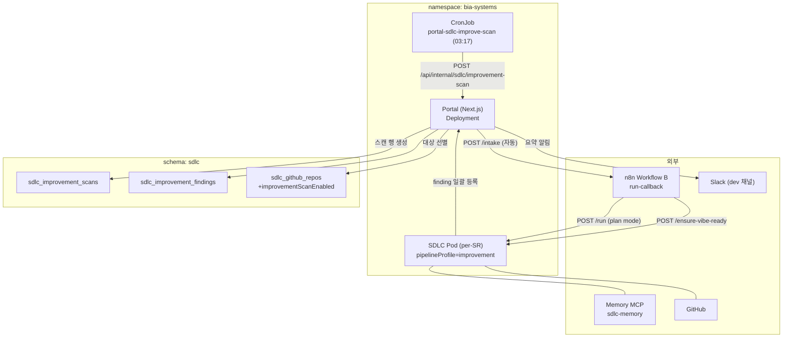
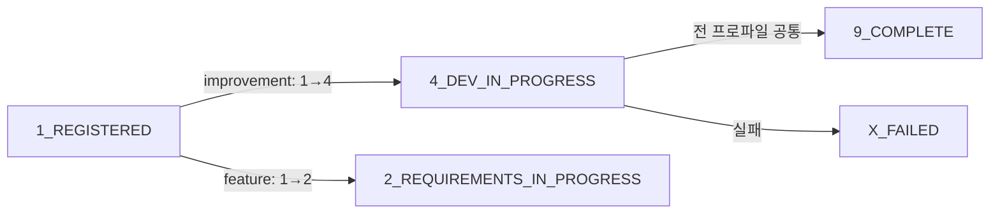
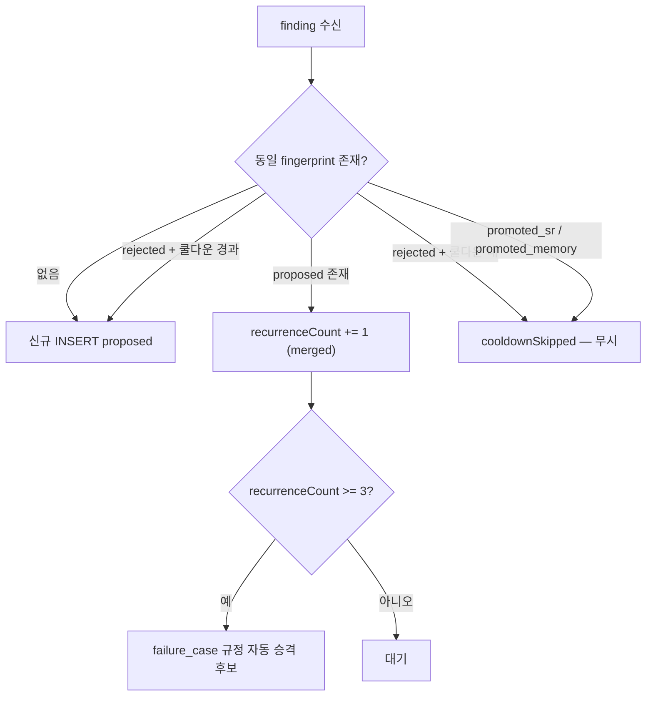
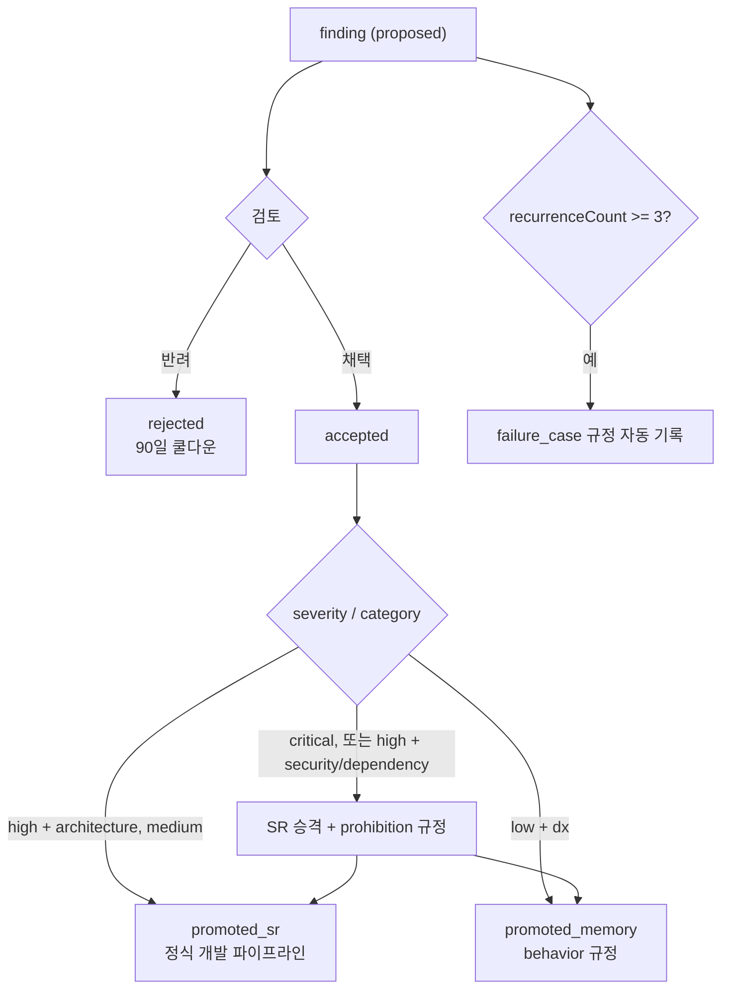
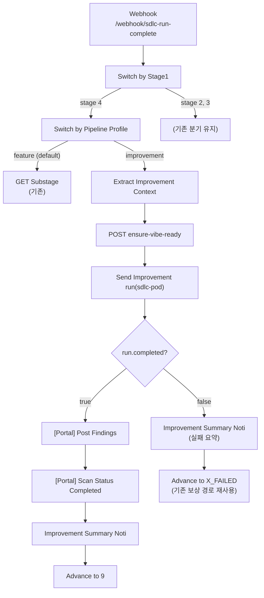
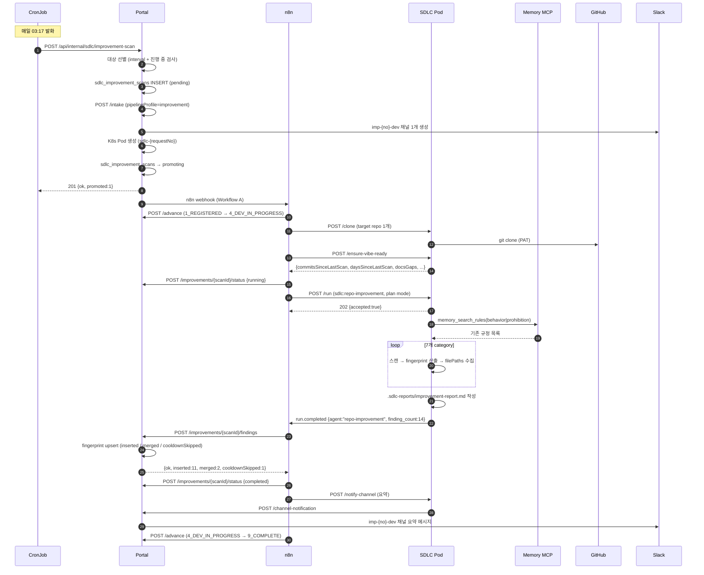
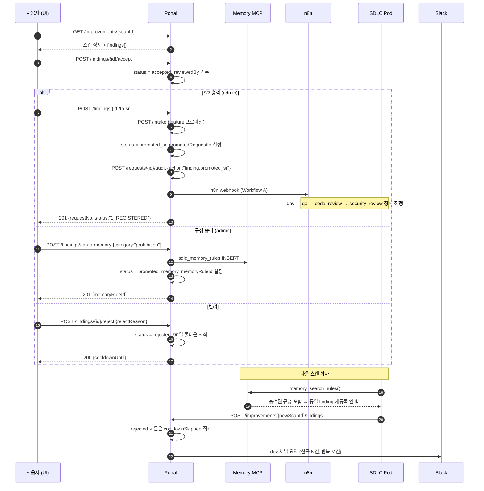
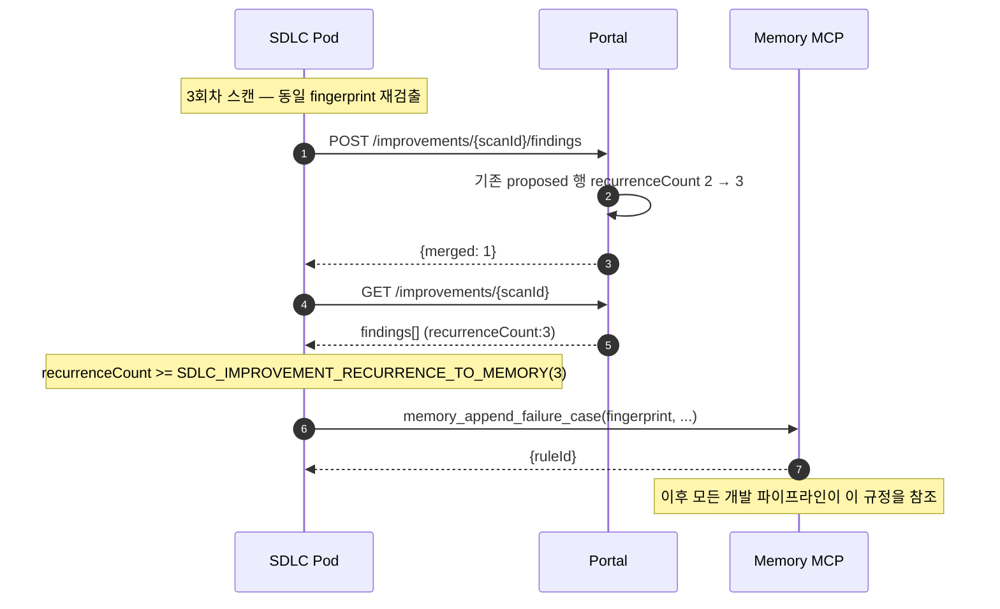

# repo 기반 자체개선 Agent — 주기 스캔·개선점 발굴·finding 승격

> 등록된 repo를 주기적으로 스캔해 개선점(finding)을 발굴하고, 검토를 거쳐 SR 또는 개발자 규정으로 승격하는 자체개선 파이프라인을 정의한다.
> 스케줄러는 K8s CronJob으로 신설하고, 실제 스캔은 기존 SDLC Pod에서 `pipelineProfile=improvement` SR로 수행하므로 Pod Runner 코드·엔드포인트 변경은 없다.

## 1. 개요

### 1.1 아키텍처 컴포넌트



> **미러링**: `portal-sdlc-improve-scan` CronJob은 `portal-sdlc-reconcile` 선례를 미러링한다 ([10-k8s-infrastructure.md](./10-k8s-infrastructure.md) 3절 참조).

### 1.2 자체개선 파이프라인 5단계

| 단계 | 주체 | 동작 | 산출 |
|------|------|------|------|
| 1. 선별 | CronJob → Portal | `improvementScanEnabled=true` repo 중 주기 도달분 선별 | `sdlc_improvement_scans` (`pending`) |
| 2. 스캔 SR 승격 | Portal | `pipelineProfile=improvement` SR 자동 intake | `sdlc_requests` (`1_REGISTERED`) |
| 3. 분석 | Pod (Claude Code) | `ensure-vibe-ready` 결정론적 신호 + `sdlc:repo-improvement` skill | `improvement-report.md` |
| 4. finding 등록 | Pod → Portal | `fingerprint` 기준 upsert 일괄 등록 | `sdlc_improvement_findings` (`proposed`) |
| 5. 승격/반려 | 사용자·admin | 채택 → SR 승격 / 규정 승격 / 반려 | `sdlc_requests` 또는 `sdlc_memory_rules` |

### 1.3 설계 원칙

| 원칙 | 내용 |
|------|------|
| **스케줄러는 CronJob** | n8n 워크플로우 3종은 모두 webhook 트리거이며 schedule 트리거가 존재하지 않는다. 주기 실행 수단은 이미 `portal-sdlc-reconcile`로 확립된 K8s CronJob이므로 이를 미러링한다 |
| **Pod 무변경** | 새 Pod 타입·새 Pod 엔드포인트 없음. 신규 agent는 이미 설치된 `sdlc@mvc` 플러그인의 skill이며 기존 `POST /run`으로 호출한다 |
| **Stage 불변** | Stage enum에 값을 추가하지 않는다. 조건부 전이 `1_REGISTERED → 4_DEV_IN_PROGRESS`와 전 프로파일 공통 전이 `4_DEV_IN_PROGRESS → 9_COMPLETE`를 활용한다 |
| **읽기 전용** | 스캔은 `permission_mode: "plan"`으로 실행되어 repo를 수정하지 않는다 |
| **기존 채널 재사용** | ChannelType은 `requirements\|design\|dev` 불변. improvement 프로파일은 `dev` 채널 1개만 생성하며 채널명은 `imp-{no}-dev`다 ([02-messaging-adapter.md](./02-messaging-adapter.md) 5.2절) |

> **n8n schedule 트리거 미신설**: n8n 워크플로우 파일은 A(intake) / B(run-callback `/webhook/sdlc-run-complete`) / C(logging) 3종 그대로 유지한다. Workflow B에 improvement 프로파일 분기만 추가하며, 신규 워크플로우 파일은 만들지 않는다. 주기 실행을 n8n에 두면 워크플로우 파일 수와 트리거 종류가 동시에 늘어나므로, 이미 검증된 CronJob → Portal internal API 경로를 택한다.

---

## 2. 스캔 스케줄러

### 2.1 `portal-sdlc-improve-scan` CronJob

파일 `sdlc-improve-scan-cronjob.yaml`. 매니페스트 구조는 `sdlc-reconcile-cronjob.yaml`을 그대로 미러링한다.

```yaml
apiVersion: batch/v1
kind: CronJob
metadata:
  name: portal-sdlc-improve-scan
  namespace: bia-systems
spec:
  schedule: "17 3 * * *"             # 일 1회 새벽 03:17 (정각 회피 — 부하 분산)
  concurrencyPolicy: Forbid          # 동시 실행 금지
  successfulJobsHistoryLimit: 3
  failedJobsHistoryLimit: 3
  jobTemplate:
    spec:
      backoffLimit: 0                # 실패 시 재시도 안 함 (다음 회차에 자연 재시도)
      activeDeadlineSeconds: 300
      template:
        spec:
          restartPolicy: Never
          serviceAccountName: default
          containers:
            - name: improve-scan
              image: curlimages/curl:8.7.1
              command:
                - sh
                - -c
                - |
                  set -e
                  curl -k -sS --fail-with-body \
                    -X POST \
                    -H "Authorization: Bearer ${SDLC_MASTER_KEY}" \
                    -H "Content-Type: application/json" \
                    "${PORTAL_BASE_URL}/api/internal/sdlc/improvement-scan"
              env:
                - name: PORTAL_BASE_URL
                  valueFrom:
                    configMapKeyRef:
                      name: portal-config
                      key: APP_URL
                - name: SDLC_MASTER_KEY
                  valueFrom:
                    secretKeyRef:
                      name: sdlc-secrets
                      key: master-key
              resources:
                requests: { cpu: 50m, memory: 64Mi }
                limits: { cpu: 200m, memory: 128Mi }
              securityContext:
                allowPrivilegeEscalation: false
                readOnlyRootFilesystem: true
                runAsNonRoot: true
                runAsUser: 1000
```

> **멱등**: `concurrencyPolicy: Forbid`가 K8s 레벨에서 이전 Job 완료 전 중복 실행을 막는다. 동일 repo에 진행 중 스캔이 있으면 선별 쿼리(2.3절)가 `scan_in_progress`로 제외하므로 중복 스캔도 발생하지 않는다.

### 2.2 `POST /api/internal/sdlc/improvement-scan`

**`POST /api/internal/sdlc/improvement-scan`** — 인증: `Bearer SDLC_MASTER_KEY`

CronJob이 호출하는 내부 엔드포인트. 대상 repo를 선별해 improvement SR로 승격한다.

**요청 본문**: 없음

**응답**:

```json
{
  "ok": true,
  "evaluated": 7,
  "promoted": 1,
  "skipped": [
    { "repoId": "0f2c...", "reason": "interval_not_reached" },
    { "repoId": "8a41...", "reason": "scan_in_progress" }
  ]
}
```

**오류 응답**:

| HTTP | code | 설명 |
|------|------|------|
| 401 | `UNAUTHORIZED` | `SDLC_MASTER_KEY` 불일치 |
| 500 | `INTERNAL_ERROR` | 선별/승격 실패 |

**수행 작업**:

1. `SDLC_MASTER_KEY` 검증 (`SDLC_IMPROVEMENT_ENABLED=false`면 `{ok:true, evaluated:0}` 즉시 반환)
2. 대상 repo 선별 (2.3절 쿼리) — 최대 `SDLC_IMPROVEMENT_BATCH_SIZE`(1)개
3. `sdlc_improvement_scans` 행 생성 (`status='pending'`, `scanNo` 발급, `triggeredBy='cron'`)
4. `POST /intake` 자동 호출 (3.1절 페이로드) — SR 등록 직후 즉시 dev 채널·Pod 프로비저닝
5. `status='promoting'` 갱신 후 `{ok, evaluated, promoted, skipped}` 반환

> **미러링**: `/api/internal/sdlc/*` 경로 + Bearer 인증 구조는 `POST /api/internal/sdlc/reconcile` 선례를 미러링한다. 단 토큰은 경로별로 나누지 않고 서버간 단일 키 `SDLC_MASTER_KEY`를 쓴다 ([10-k8s-infrastructure.md](./10-k8s-infrastructure.md) 7.1절).

### 2.3 대상 repo 선별 로직

```sql
-- 대상 선별: 스캔 활성 + 주기 도달 + 진행 중 스캔 없음
SELECT r.id, r.repo_name, s_last.completed_at
FROM sdlc.sdlc_github_repos r
LEFT JOIN LATERAL (
  SELECT completed_at
  FROM sdlc.sdlc_improvement_scans
  WHERE repo_id = r.id AND status = 'completed'
  ORDER BY completed_at DESC
  LIMIT 1
) s_last ON TRUE
WHERE r.improvement_scan_enabled = TRUE
  AND (
    s_last.completed_at IS NULL
    OR s_last.completed_at + (r.improvement_scan_interval_days * INTERVAL '1 day') < now()
  )
  AND NOT EXISTS (
    SELECT 1 FROM sdlc.sdlc_improvement_scans
    WHERE repo_id = r.id AND status IN ('pending', 'promoting', 'running')
  )
ORDER BY s_last.completed_at ASC NULLS FIRST   -- 오래 방치된 repo 우선
LIMIT 1;                                        -- SDLC_IMPROVEMENT_BATCH_SIZE
```

| 조건 | 판정 | skip reason |
|------|------|-------------|
| `improvementScanEnabled = false` | 제외 | `scan_disabled` |
| 최근 `completed` 스캔 없음 | 선별 대상 (최우선) | — |
| `completedAt + improvementScanIntervalDays >= now()` | 제외 | `interval_not_reached` |
| 동일 repo에 `pending\|promoting\|running` 스캔 존재 | 제외 | `scan_in_progress` |
| 선별 순위 | `completedAt NULLS FIRST` | — |

> **`SDLC_IMPROVEMENT_BATCH_SIZE`(1)가 유일한 동시 실행 억제 수단이다.** 한 회차에 1개 repo만 선별하므로 야간 부하가 평탄화되고, 동일 repo 중복 스캔은 위 `scan_in_progress` 규칙이 막는다. 접수 시점의 자원 게이트나 대기 큐는 없으며 improvement SR도 등록 직후 즉시 프로비저닝된다.

---

## 3. 스캔 → SR 승격

### 3.1 자동 intake 페이로드

Portal이 자기 자신의 `POST /intake`를 `SDLC_MASTER_KEY`로 호출한다. 사람이 등록한 SR과 동일한 경로를 타므로 신규 intake 분기가 없다.

```json
{
  "requestNo": "SR-20260903-014",
  "submitter": "SDLC Improvement Bot",
  "submitterEmail": "sdlc-bot@example.local",
  "submitterGithubLogin": "sdlc-bot",
  "requestSite": "aiways-on.example.com",
  "devType": "refactor",
  "requestSystem": "AIways On",
  "module": "자체개선 > repo 스캔",
  "dedupKey": "IMP-20260903-001",
  "metadata": {
    "pipelineProfile": "improvement",
    "improvementScanId": "3f9c1a52-...",
    "scanNo": "IMP-20260903-001",
    "targetRepoId": "0f2c8d13-...",
    "requestDate": "2026-09-03",
    "problemDescription": "repo 정기 개선점 스캔 (자동 생성)",
    "expectedEffect": "code_smell / architecture / security / dependency / test_coverage / dx / performance 7개 category 개선점 발굴",
    "members": []
  }
}
```

| 필드 | 값 | 설명 |
|------|-----|------|
| `metadata.pipelineProfile` | `"improvement"` | 파이프라인 프로파일 판별 키. 미지정 시 기존 feature 흐름 |
| `metadata.improvementScanId` | uuid | `sdlc_improvement_scans.id` — finding 등록 시 경로 파라미터로 사용 |
| `metadata.scanNo` | `IMP-YYYYMMDD-NNN` | `dedupKey`로도 사용 — intake 멱등성 확보 |
| `metadata.targetRepoId` | uuid | 스캔 대상 repo. Pod clone 대상 1개로 제한 |

> **멱등**: `dedupKey = scanNo`이므로 CronJob 중복 발화 시 `ON CONFLICT DO NOTHING`으로 두 번째 intake는 무시된다.

> **`devType` enum은 확장하지 않는다**: `GET /dev-types`가 반환하는 허용값은 `feature | bugfix | refactor | hotfix` 4개 그대로다. improvement 스캔 SR은 의미상 가장 가까운 `refactor`를 사용하며, improvement 파이프라인 판별은 `devType`이 아니라 **`metadata.pipelineProfile === 'improvement'`** 로만 수행한다. [11-incident-response-agent.md](./11-incident-response-agent.md)의 장애 SR도 동일한 방식으로 `devType = 'hotfix'` + `metadata.pipelineProfile`을 사용한다.

### 3.2 `pipelineProfile=improvement` 파이프라인 차이

| 항목 | feature (기존) | improvement (신규) |
|------|---------------|-------------------|
| 채널 생성 | `requirements` + `design` + `dev` 3개 (`sr-{no}-*`) | **`dev` 1개만** (`imp-{no}-dev`) |
| 요구사항 단계 | `2_REQUIREMENTS_IN_PROGRESS` 수행 | **건너뜀** |
| 설계 단계 | `3_DEV_DESIGN_IN_PROGRESS` 수행 | **건너뜀** |
| 전이 시작 | `1 → 2` | **`1 → 4`** (조건부 전이) |
| DevSubStage | `dev → qa → code_review → security_review` | **없음** — 단일 improvement run |
| `permission_mode` | `acceptEdits` / `bypassPermissions` | **`plan`** (읽기 전용) |
| GitHub Issue/PR | 생성 | **생성하지 않음** |
| 종결 | `4 → 9_COMPLETE` | **`4 → 9_COMPLETE`** (동일 — 전 프로파일 공통) |
| 산출물 | 코드 변경 + PR | finding 레코드 + 리포트 md |

### 3.3 조건부 전이 `1→4`와 공통 종결 `4→9`

Stage enum과 `LEGAL_TRANSITIONS` 테이블에 값을 추가하지 않는다. 조건부 전이 `1→4`를 `pipelineProfile=improvement`일 때 사용하고, 종결은 전 프로파일 공통 전이 `4→9`를 그대로 탄다.



| 전이 | 조건 | actor | idempotencyKey |
|------|------|-------|----------------|
| `1_REGISTERED → 4_DEV_IN_PROGRESS` | `metadata.pipelineProfile === 'improvement'` | `n8n-agent-improve` | `{requestNo}->4_DEV_IN_PROGRESS` |
| `4_DEV_IN_PROGRESS → 9_COMPLETE` | finding 등록 완료 (`sdlc_improvement_scans.status='completed'`) | `n8n-agent-improve` | `{requestNo}->9_COMPLETE` |

전이는 기존 `POST /advance` `{requestNo, from, to, actor, idempotencyKey}`를 그대로 사용한다. `1→4`는 조건 미충족 시 `INVALID_TRANSITION` 422를 반환하므로, feature SR이 실수로 `1→4`를 요청해도 차단된다.

> **리포트 전용 종결**: improvement 스캔은 배포 산출물이 없다. `4 → 9_COMPLETE`가 전 프로파일 공통 종결 전이이므로 improvement 전용 분기가 필요하지 않으며, 단계 번호 `5`~`8`은 미사용 예약 상태다 ([03-state-machine.md](./03-state-machine.md) 참조). 단 `4→9` 진입 작업의 PR 생성 루프는 commit 이력이 없으면 PR을 만들지 않으므로(같은 문서 4.4절), `permission_mode: "plan"`으로 실행되는 improvement 스캔은 "변경 없음 — PR 미생성"으로 집계된다.

---

## 4. Pod agent 실행

### 4.1 `POST /ensure-vibe-ready` 결정론적 사전 스캔 재사용

n8n은 `/run` 호출 전에 기존 `POST /ensure-vibe-ready`를 먼저 호출해 AI 없이 계산된 결정론적 신호를 얻는다. 신규 엔드포인트를 만들지 않는다.

**`POST /ensure-vibe-ready`** — 인증: `POD_AUTH_TOKEN`

**요청 본문**:

```json
{
  "repos": [
    { "name": "portal", "path": "/workspaces/session/portal" }
  ]
}
```

**응답**:

```json
{
  "results": [
    {
      "repo": "portal",
      "path": "/workspaces/session/portal",
      "needsSetup": false,
      "missingFiles": [],
      "detectedLanguageManifests": ["package.json"],
      "needsDocsRescan": true,
      "docsGaps": ["docs/api-spec.md", "docs/testing.md"],
      "commitsSinceLastScan": 132,
      "daysSinceLastScan": 41.6
    }
  ]
}
```

| 신호 | 스캔에서의 용도 |
|------|----------------|
| `commitsSinceLastScan` | `VIBE_STALE_COMMIT_THRESHOLD`(50) 초과 시 변경 집중 영역을 우선 스캔 |
| `daysSinceLastScan` | `VIBE_STALE_DAYS_THRESHOLD`(30.0) 초과 시 전체 재스캔 범위로 승격 |
| `docsGaps` | `dx` category finding 후보로 직접 전환 |
| `detectedLanguageManifests` | `dependency` category 스캔 대상 매니페스트 결정 |
| `missingFiles` | baseline 누락 → `dx` finding 후보 |

> **미러링**: "결정론적 스캔 → 결과를 `/run` 프롬프트에 주입 → Claude가 판단"은 [06-pod-runner-api.md](./06-pod-runner-api.md) 7절에서 확립된 패턴이다. 자체개선 agent는 이 패턴의 두 번째 적용 사례다.

### 4.2 `POST /run` 페이로드

**`POST /run`** — 인증: `POD_AUTH_TOKEN`

기존 엔드포인트 그대로. improvement 프로파일은 `permission_mode: "plan"`으로 읽기 전용 실행한다.

**요청 본문**:

```json
{
  "prompt": "/sdlc:repo-improvement\n\n## 스캔 컨텍스트\n- scanId: 3f9c1a52-...\n- scanNo: IMP-20260903-001\n- repo: /workspaces/session/portal\n- baseCommitSha: 9d3f1ab...\n\n## ensure-vibe-ready 결정론적 신호\n- commitsSinceLastScan: 132 (임계 50 초과)\n- daysSinceLastScan: 41.6 (임계 30 초과)\n- docsGaps: docs/api-spec.md, docs/testing.md\n- detectedLanguageManifests: package.json\n- missingFiles: (없음)\n\n## 이미 규정화된 항목 (finding 제외 대상)\n- [behavior] Drizzle 인덱스는 배열 형태로 선언한다\n- [prohibition] pgEnum 사용 금지\n\n## 산출\n- /workspaces/session/.sdlc-reports/improvement-report.md\n- POST /api/v1/sdlc/improvements/3f9c1a52-.../findings 일괄 등록",
  "resume": true,
  "timeout_seconds": 5400,
  "permission_mode": "plan",
  "allowed_tools": "Read,Grep,Glob,Bash,Task,mcp__sdlc-memory__*",
  "mcp_servers": {
    "sdlc-memory": {
      "type": "http",
      "url": "https://sdlc-memory-mcp.example.com/mcp",
      "headers": { "Authorization": "Bearer sdlcmem_..." }
    }
  },
  "output_format": "stream-json",
  "call_webhook": true,
  "stage": "4_DEV_IN_PROGRESS"
}
```

**응답 (202)**:

```json
{ "accepted": true, "stage": "4_DEV_IN_PROGRESS" }
```

**비동기 콜백** (n8n `/webhook/sdlc-run-complete`):

```json
{
  "request_id": "8b12...",
  "request_no": "SR-20260903-014",
  "event": "run.completed",
  "data": {
    "agent": "repo-improvement",
    "result": "...",
    "is_error": false,
    "exit_code": 0,
    "duration_ms": 3184000,
    "claude_session_id": "abc-123",
    "improvement_scan_id": "3f9c1a52-...",
    "finding_count": 14,
    "base_commit_sha": "9d3f1ab",
    "pod_endpoint": "http://sdlc-SR-20260903-014.bia-systems.svc.cluster.local:58001",
    "master_key": "...",
    "portal_base_url": "...",
    "current_stage": "4_DEV_IN_PROGRESS"
  }
}
```

**오류 응답** (`event: "run.failed"`):

```json
{ "result": "", "is_error": true, "exit_code": 1, "duration_ms": 5400000, "error": "timeout", "agent": "repo-improvement" }
```

| 필드 | 값 | 비고 |
|------|-----|----------|
| `permission_mode` | `"plan"` | improvement 전용. feature는 `acceptEdits`/`bypassPermissions` |
| `allowed_tools` | `Read,Grep,Glob,Bash,Task,mcp__sdlc-memory__*` | `Write`/`Edit` 미포함 — 쓰기 도구 원천 차단 |
| `timeout_seconds` | 5400 | `SDLC_IMPROVEMENT_RUN_TIMEOUT_SECONDS`. 기존 최장 1800s보다 길다 |
| `mcp_servers` | `sdlc-memory` | Memory MCP 주입 (4.4절) |
| `data.agent` | `"repo-improvement"` | **신규 필드** — 콜백 envelope에 agent 식별자 추가 |

> **미러링**: `data.agent` 필드는 기존 envelope `{request_id, request_no, event, data{...}}`를 깨지 않는 순수 추가다. `agent` 미존재 콜백은 기존 feature 흐름으로 처리된다.

### 4.3 `sdlc:repo-improvement` skill 절차

신규 agent는 이미 Pod 이미지에 설치된 `sdlc@mvc` 플러그인의 skill로 배포된다. `sdlc:capture-mockup`이 별도 엔드포인트 없이 `POST /run`만으로 동작하는 선례를 그대로 미러링하며, **Pod 코드·Dockerfile·엔드포인트 변경은 없다** ([06-pod-runner-api.md](./06-pod-runner-api.md) 2절 참조).

1. `memory_search_rules(category=behavior|prohibition)` 호출 — 이미 규정화된 사항은 finding으로 올리지 않는다 (중복 잡음 제거)
2. `ensure-vibe-ready` 신호를 출발점으로 7개 category를 각각 스캔 (`code_smell`, `architecture`, `security`, `dependency`, `test_coverage`, `dx`, `performance`)
3. 각 발견에 `fingerprint` 계산, `filePaths` 수집, `recommendationMd` 작성
4. `/workspaces/session/.sdlc-reports/improvement-report.md` 작성
5. `POST /improvements/{scanId}/findings` 일괄 등록 → `POST /improvements/{scanId}/status` `completed`
6. Slack `dev` 채널에 요약 알림 — Pod `POST /notify-channel` (Portal이 `MessageChannelAdapter`로 실제 전송)
7. `recurrenceCount >= 3` 항목은 MCP `memory_append_failure_case` 직접 호출

> **읽기 전용 원칙**: 자체개선 agent는 `permission_mode: "plan"`으로 실행되어 repo를 수정하지 않는다. 코드 수정은 finding을 SR로 승격시켜 정식 개발 파이프라인(dev→qa→code_review→security_review)을 태울 때만 일어난다.

### 4.4 Memory MCP 주입

| 항목 | 값 |
|------|-----|
| 서버 이름 | `sdlc-memory` |
| 전송 | `type: "http"` |
| URL | `https://sdlc-memory-mcp.example.com/mcp` (env `SDLC_MEMORY_MCP_URL`) |
| 배포 단위 | 독립 `portal-sdlc-memory-mcp` Deployment — Portal Next.js 앱과 별개 프로세스. Portal에는 `/api/mcp/*` 라우트가 존재하지 않는다 |
| 인증 | `Authorization: Bearer sdlcmem_...` (Portal 발급 per-SR 토큰) |
| 조회 도구 | `memory_search_rules(category)` — 스캔 시작 전 규정 목록 확보 |
| 기록 도구 | `memory_append_failure_case(fingerprint, ...)` — `recurrenceCount >= 3` 항목 |

> **미러링**: `mcp_servers` dict → `--mcp-config` 변환은 기존 `POST /run` 파라미터다. Memory MCP는 [13-developer-memory-agent.md](./13-developer-memory-agent.md) 6절에서 정의한 독립 서버(`portal-sdlc-memory-mcp`)를 그대로 참조하며, URL은 Portal orchestrator가 `SDLC_MEMORY_MCP_URL`에서 읽어 주입한다.

### 4.5 산출물 경로

| 경로 | 형식 | 내용 |
|------|------|------|
| `/workspaces/session/.sdlc-reports/improvement-report.md` | markdown | category별 finding 상세 + 권고안. `summaryMd` 원본 |
| `/workspaces/session/.sdlc-reports/improvement-findings.json` | json | `POST /improvements/{scanId}/findings` 요청 본문 그대로 (재전송용) |
| `/workspaces/session/.sdlc-reports/improvement-metrics.md` | markdown | 스캔 범위·파일 수·소요 시간·category별 건수 |

> **미러링**: `.sdlc-reports/` 경로와 `rsccb-report` subagent 활용은 기존 리포트 산출 규약을 그대로 따른다 (`Task(subagent_type='rsccb-report')`).

---

## 5. finding 분류 체계

### 5.1 category 7종

| category | 대상 | 대표 발견 예 | 기본 severity 경향 |
|----------|------|-------------|-------------------|
| `code_smell` | 중복·긴 함수·죽은 코드 | 3곳 이상 복제된 fetch 래퍼 | medium |
| `architecture` | 레이어 위반·순환 의존 | 서버 액션이 K8s 클라이언트를 직접 호출 | high |
| `security` | 비밀 노출·인증 누락 | route에 `requireUser()` 누락 | critical / high |
| `dependency` | 취약·구식 패키지 | `detectedLanguageManifests` 기준 CVE 보유 패키지 | high |
| `test_coverage` | 테스트 부재·취약 | 전이 로직에 단위 테스트 없음 | medium |
| `dx` | 문서·스크립트·baseline | `docsGaps`의 `docs/api-spec.md` 부재 | low / medium |
| `performance` | N+1·불필요 렌더 | 목록 조회에서 per-row 쿼리 | medium |

### 5.2 severity

| severity | 정의 | 승격 경로 기본값 | SLA 권고 |
|----------|------|-----------------|---------|
| `critical` | 즉시 사고 가능 (인증 우회, 비밀 노출) | SR 승격 + `prohibition` 규정 | 당일 검토 |
| `high` | 사고 가능성 있음 / 구조적 부채 | SR 승격 | 3일 내 검토 |
| `medium` | 유지보수 비용 증가 | 채택 후 배치 처리 | 2주 내 검토 |
| `low` | 개선 시 이득, 방치 가능 | 규정 승격 또는 반려 | 주기 검토 |

### 5.3 `fingerprint` 산출 규칙과 반복 검출 카운트

```typescript
// src/lib/sdlc/improvement/fingerprint.ts
import { createHash } from 'node:crypto';

export function computeFindingFingerprint(input: {
  repoId: string;
  category: string;
  title: string;
  filePaths: string[];
}): string {
  const normalizedTitle = input.title
    .toLowerCase()
    .replace(/\s+/g, ' ')
    .replace(/[^\p{L}\p{N} ]/gu, '')
    .trim();
  const sortedFilePaths = [...input.filePaths].sort().join(',');
  const raw = `${input.repoId}:${input.category}:${normalizedTitle}:${sortedFilePaths}`;
  return createHash('sha256').update(raw).digest('hex').slice(0, 64);
}
```

| 규칙 | 동작 |
|------|------|
| 산출식 | `sha256(repoId + ':' + category + ':' + normalize(title) + ':' + sortedFilePaths.join(','))`의 앞 64자 |
| `normalize(title)` | 소문자화 → 연속 공백 1개로 축약 → 문자·숫자·공백 외 제거 → trim |
| `sortedFilePaths` | 사전순 정렬 후 콤마 결합 — 발견 순서에 무관한 안정 지문 |
| 재검출 | 동일 지문이 새 스캔에서 재검출되면 **새 행을 만들지 않고** 최신 `proposed` 행의 `recurrenceCount`를 증가시킨다 |
| 반려 쿨다운 | `rejected` 지문은 `SDLC_IMPROVEMENT_REJECT_COOLDOWN_DAYS`(90) 동안 재등록하지 않는다 (`cooldownSkipped`로 집계) |
| 규정 승격 임계 | `recurrenceCount >= SDLC_IMPROVEMENT_RECURRENCE_TO_MEMORY`(3)이면 `failure_case` 규정 자동 승격 후보 |



> **멱등**: 동일 스캔 결과를 두 번 등록해도 `fingerprint` upsert이므로 `inserted=0, merged=N`이 되고 `recurrenceCount`는 스캔 단위로 1회만 증가한다. 이 멱등성은 애플리케이션 로직이 아니라 `sdlc_improvement_findings_scan_fingerprint_idx` **unique 인덱스**(`(scan_id, fingerprint)`, 7절)로 DB 레벨에서 보장된다 — 동일 스캔·동일 지문의 두 번째 INSERT는 제약 위반으로 걸러지고 `recurrenceCount` 증가가 재실행되지 않는다.

> **지문 churn (알려진 트레이드오프)**: 파일 경로가 지문에 포함되므로 파일 이동·리네임 시 새 지문이 되어 `recurrenceCount`가 1로 초기화된다. 이는 의도된 동작이다 — 경로가 바뀐 발견은 다른 발견으로 본다. 다만 리팩터링이 빈번한 코드에서는 `recurrenceCount >= 3` 임계에 도달하지 못할 수 있다. 경로 무관 추적이 필요해지면 `sha256(repoId + ':' + category + ':' + normalize(title))`만으로 2차 지문(`titleFingerprint`)을 별도 산출해 추세 집계용으로 병행한다.

---

## 6. finding 승격 경로

### 6.1 → SR (코드 수정)

**`POST /findings/{findingId}/to-sr`** — 인증: 세션(admin)

채택된 finding을 정식 개발 SR로 승격한다. 승격된 SR은 feature 프로파일이므로 `dev → qa → code_review → security_review` 전 과정을 거친다.

| 항목 | 값 |
|------|-----|
| 대상 조건 | `status = 'accepted'` |
| 생성 SR | `devType = 'refactor'`, `pipelineProfile` **미지정** (feature 흐름) |
| SR `problemDescription` | finding의 `descriptionMd` |
| SR `expectedEffect` | finding의 `recommendationMd` |
| finding 갱신 | `status = 'promoted_sr'`, `promotedRequestId` 설정 |
| 채널 | 3개 정상 생성 (`requirements`/`design`/`dev`) |

### 6.2 → Memory 규정

**`POST /findings/{findingId}/to-memory`** — 인증: 세션(admin)

코드 수정 없이 "앞으로 이렇게 하라/하지 말라"로 고정하는 것이 효과적인 finding을 규정으로 승격한다.

| finding 조건 | 규정 category | 승인 |
|-------------|--------------|------|
| `category ∈ {code_smell, architecture, dx, performance}` | `behavior` | **admin 필수** |
| `category ∈ {security, dependency}` | `prohibition` | **admin 필수** |

승격 대상은 [13-developer-memory-agent.md](./13-developer-memory-agent.md)의 `sdlc_memory_rules`이며, 전역 규정으로 승격된다.

규정 category는 finding `category`만으로 결정한다. `severity`는 category 판정에 관여하지 않는다 — `critical` severity의 처리는 §6.4의 `critical | 전체` 행이 담당한다.

> **모든 규정 승격은 admin 승인을 거친다.** `behavior`도 예외가 아니다. agent가 작성한 finding이 규정으로 승격되면 이후 모든 agent의 행동을 조종하게 되므로(규정은 SR마다 프롬프트에 주입된다), 사람 검토 없이 자동 승격되는 경로를 두지 않는다. 엔드포인트는 `requireAdmin()`으로 보호한다.

#### severity → 규정 severity 변환

finding `severity`는 `critical|high|medium|low` 4단계이고, `sdlc_memory_rules.severity`는 `critical|warn|info` 3단계다. 승격 시 다음 표로 변환한다.

| finding `severity` | 규정 `severity` |
|--------------------|-----------------|
| `critical` | `critical` |
| `high` | `warn` |
| `medium` | `warn` |
| `low` | `info` |

#### 반복 검출 자동 기록 (엔드포인트 무관)

`recurrenceCount >= 3`인 finding은 `failure_case` 규정으로 자동 기록된다. 이 경로는 **`POST /findings/{findingId}/to-memory`를 거치지 않는다** — SDLC Pod가 자신의 scoped agent 토큰으로 Memory MCP를 직접 호출해 기록하는 별도 경로이며, admin 승인 대상이 아니다. 위 조건 표(admin 전용 엔드포인트)와 혼동하지 않도록 분리해 기술한다.

### 6.3 반려

**`POST /findings/{findingId}/reject`** — 인증: 세션(user)

| 항목 | 값 |
|------|-----|
| 본문 | `{ "rejectReason": "의도된 설계 — 레거시 호환 유지" }` |
| finding 갱신 | `status = 'rejected'`, `rejectReason`, `reviewedBy` |
| 쿨다운 | 동일 `fingerprint`는 `SDLC_IMPROVEMENT_REJECT_COOLDOWN_DAYS`(90) 동안 재등록 차단 |
| 재등록 | 90일 경과 후 재검출되면 `proposed` 신규 행으로 부활 |

반려 이유를 남기는 것은 필수다. 쿨다운 만료 후 같은 지문이 다시 올라올 때 검토자가 과거 판단 근거를 볼 수 있어야 한다.

### 6.4 승격 결정 매트릭스

| severity | category | 권고 경로 | 승인자 |
|----------|----------|----------|-------|
| `critical` | 전체 | SR 승격 + `prohibition` 규정 동시 | admin |
| `high` | `security` / `dependency` | SR 승격 + `prohibition` 규정 | admin |
| `high` | `architecture` | SR 승격 | admin |
| `medium` | `code_smell` / `performance` | 채택 → 배치 SR 승격 | user 채택 / admin 승격 |
| `medium` | `test_coverage` | SR 승격 | admin |
| `low` | `dx` | `behavior` 규정 승격 | admin |
| `low` | 기타 | 반려 허용 | user |
| 임의 | `recurrenceCount >= 3` | `failure_case` 규정 (자동) + SR 승격 검토 | 자동 / admin |



> **fail-closed**: `status`가 `proposed`/`accepted`가 아닌 finding에 승격을 시도하면 `FINDING_NOT_PROMOTABLE` 422를 반환한다. 이미 승격된 항목의 중복 승격을 원천 차단한다.

---

## 7. 데이터 모델

신규 테이블 2종과 기존 테이블 컬럼 추가로 구성한다. 명명·타입·인덱스 규약은 [04-db-schema.md](./04-db-schema.md) 5절을 그대로 미러링한다.

### 7.1 `sdlc_improvement_scans` — 스캔 회차

```typescript
export const sdlcImprovementScans = mySchema.table('sdlc_improvement_scans', {
  id: uuid('id').primaryKey().defaultRandom(),
  scanNo: varchar('scan_no', { length: 100 }).notNull(),        // IMP-YYYYMMDD-NNN
  repoId: uuid('repo_id').notNull()
    .references(() => sdlcGithubRepos.id, { onDelete: 'cascade' }),
  status: varchar('status', { length: 32 }).notNull().default('pending'),
  // pending | promoting | running | completed | failed
  requestId: uuid('request_id')
    .references(() => sdlcRequests.id, { onDelete: 'set null' }),
  baseCommitSha: varchar('base_commit_sha', { length: 64 }),
  findingCount: integer('finding_count').notNull().default(0),
  summaryMd: text('summary_md'),
  triggeredBy: varchar('triggered_by', { length: 32 }).notNull().default('cron'),
  // cron | manual
  attempts: integer('attempts').notNull().default(0),
  lastError: text('last_error'),
  startedAt: timestamp('started_at', { withTimezone: true }),
  completedAt: timestamp('completed_at', { withTimezone: true }),
  createdAt: timestamp('created_at').notNull().defaultNow(),
  updatedAt: timestamp('updated_at').notNull().defaultNow(),
}, (t) => [
  uniqueIndex('sdlc_improvement_scans_scan_no_idx').on(t.scanNo),
  index('sdlc_improvement_scans_repo_idx').on(t.repoId),
  index('sdlc_improvement_scans_status_idx').on(t.status),
  index('sdlc_improvement_scans_repo_completed_idx').on(t.repoId, t.completedAt),
]);
```

| 컬럼 | 타입 | 설명 |
|------|------|------|
| `id` | uuid PK | `defaultRandom()` |
| `scanNo` | varchar(100) | `IMP-YYYYMMDD-NNN`. `request-no.ts::generateRequestNo` 패턴 미러링. `dedupKey`로도 사용 |
| `repoId` | uuid FK | → `sdlc_github_repos`, cascade |
| `status` | varchar(32) | `pending` → `promoting` → `running` → `completed` / `failed` |
| `requestId` | uuid FK | → `sdlc_requests`, set null. 승격된 improvement SR |
| `baseCommitSha` | varchar(64) | 스캔 기준 커밋. 다음 회차 delta 판정용 |
| `findingCount` | integer | 등록 완료 시 갱신 (기본 0) |
| `summaryMd` | text | `improvement-report.md` 요약 원문 |
| `triggeredBy` | varchar(32) | `cron`(CronJob) / `manual`(admin 수동) |
| `attempts` | integer | 승격 재시도 횟수 |
| `lastError` | text | 마지막 실패 사유 |
| `startedAt` / `completedAt` | timestamp tz | Pod run 시작·종료 |

| 인덱스 | 컬럼 | 용도 |
|--------|------|------|
| `sdlc_improvement_scans_scan_no_idx` | `scan_no` (unique) | `scanNo` 멱등 조회 |
| `sdlc_improvement_scans_repo_idx` | `repo_id` | repo별 이력 |
| `sdlc_improvement_scans_status_idx` | `status` | 진행 중 스캔 상한 검사 |
| `sdlc_improvement_scans_repo_completed_idx` | `(repo_id, completed_at)` | **2.3절 대상 선별 쿼리** |

### 7.2 `sdlc_improvement_findings` — 발굴 항목

```typescript
export const sdlcImprovementFindings = mySchema.table('sdlc_improvement_findings', {
  id: uuid('id').primaryKey().defaultRandom(),
  scanId: uuid('scan_id').notNull()
    .references(() => sdlcImprovementScans.id, { onDelete: 'cascade' }),
  fingerprint: varchar('fingerprint', { length: 64 }).notNull(),
  category: varchar('category', { length: 32 }).notNull(),
  // code_smell | architecture | security | dependency | test_coverage | dx | performance
  severity: varchar('severity', { length: 16 }).notNull().default('medium'),
  // critical | high | medium | low
  title: varchar('title', { length: 500 }).notNull(),
  descriptionMd: text('description_md').notNull(),
  filePaths: jsonb('file_paths').$type<string[]>().notNull().default([]),
  recommendationMd: text('recommendation_md'),
  estimatedEffort: varchar('estimated_effort', { length: 16 }),   // S | M | L
  status: varchar('status', { length: 32 }).notNull().default('proposed'),
  // proposed | accepted | promoted_sr | promoted_memory | rejected
  promotedRequestId: uuid('promoted_request_id')
    .references(() => sdlcRequests.id, { onDelete: 'set null' }),
  memoryRuleId: uuid('memory_rule_id')
    .references(() => sdlcMemoryRules.id, { onDelete: 'set null' }),
  recurrenceCount: integer('recurrence_count').notNull().default(1),
  rejectReason: text('reject_reason'),
  reviewedBy: varchar('reviewed_by', { length: 255 }),
  createdAt: timestamp('created_at').notNull().defaultNow(),
  updatedAt: timestamp('updated_at').notNull().defaultNow(),
}, (t) => [
  index('sdlc_improvement_findings_scan_idx').on(t.scanId),
  index('sdlc_improvement_findings_fingerprint_idx').on(t.fingerprint),
  index('sdlc_improvement_findings_status_idx').on(t.status),
  index('sdlc_improvement_findings_category_severity_idx').on(t.category, t.severity),
  uniqueIndex('sdlc_improvement_findings_scan_fingerprint_idx').on(t.scanId, t.fingerprint),
]);
```

| 컬럼 | 타입 | 설명 |
|------|------|------|
| `id` | uuid PK | `defaultRandom()` |
| `scanId` | uuid FK | → `sdlc_improvement_scans`, cascade |
| `fingerprint` | varchar(64) | 5.3절 산출식. 재검출 판정 키 |
| `category` | varchar(32) | 7종 (5.1절) |
| `severity` | varchar(16) | 4단계, 기본 `medium` |
| `title` | varchar(500) | 한 줄 요약. `normalize()` 대상 |
| `descriptionMd` | text | 근거·현상 상세 (필수) |
| `filePaths` | jsonb `string[]` | 관련 파일 경로. 정렬 후 지문 산출에 사용 |
| `recommendationMd` | text | 권고 조치안. SR 승격 시 `expectedEffect`로 전사 |
| `estimatedEffort` | varchar(16) | `S`(<1일) / `M`(1~3일) / `L`(>3일) |
| `status` | varchar(32) | `proposed` → `accepted` → `promoted_sr` / `promoted_memory`, 또는 `rejected` |
| `promotedRequestId` | uuid FK | → `sdlc_requests`, set null |
| `memoryRuleId` | uuid FK | → `sdlc_memory_rules`, set null |
| `recurrenceCount` | integer | 재검출 누적. 기본 1, 임계 3에서 `failure_case` 승격 후보 |
| `rejectReason` | text | 반려 필수 입력 |
| `reviewedBy` | varchar(255) | 채택·반려·승격 수행자 GitHub login |

| 인덱스 | 컬럼 | 용도 |
|--------|------|------|
| `sdlc_improvement_findings_scan_idx` | `scan_id` | 상세 페이지 조회 |
| `sdlc_improvement_findings_fingerprint_idx` | `fingerprint` | upsert 및 쿨다운 검사 |
| `sdlc_improvement_findings_status_idx` | `status` | 미검토 건수 스탯 카드 |
| `sdlc_improvement_findings_category_severity_idx` | `(category, severity)` | category Tabs + severity 정렬 |
| `sdlc_improvement_findings_scan_fingerprint_idx` | `(scan_id, fingerprint)` (unique) | **`recurrenceCount` 이중 증가 차단** — 5.3절 멱등성을 DB 레벨에서 보장. 기존 `dedupKey`/`idempotencyKey` unique 인덱스 규약과 동일 |

### 7.3 `sdlc_github_repos` 컬럼 추가

```typescript
// sdlc_github_repos 기존 정의에 2개 컬럼 추가
  improvementScanEnabled: boolean('improvement_scan_enabled').notNull().default(false),
  improvementScanIntervalDays: integer('improvement_scan_interval_days').notNull().default(14),
```

| 컬럼 | 타입 | 기본값 | 설명 |
|------|------|--------|------|
| `improvementScanEnabled` | boolean | `false` | 자체개선 스캔 대상 여부. opt-in |
| `improvementScanIntervalDays` | integer | `14` | 스캔 주기(일). `SDLC_IMPROVEMENT_DEFAULT_INTERVAL_DAYS`와 동일값 |

> **미러링**: `runnable` / `isUi` / `playwrightEnabled`가 boolean opt-in 플래그로 존재하는 기존 패턴을 미러링한다. 기본 `false`이므로 기존 repo의 동작은 변하지 않는다.

> **마이그레이션**: `drizzle-kit push`로 적용한다. 3개 변경(2 신규 테이블 + `sdlc_github_repos` 2컬럼) 모두 기본값이 있어 기존 행에 안전하다. `pgEnum`은 사용하지 않고 `varchar(N)` + 허용값 주석으로 표현한다.

---

## 8. Portal API

Base는 `/api/v1/sdlc`, 내부용은 `/api/internal/sdlc`. POST-only RPC 동사 규약을 따르며 PUT/PATCH/DELETE는 사용하지 않는다 ([05-portal-api.md](./05-portal-api.md) 1절에 정의된 규약).

### 8.1 스캔 API

**`POST /improvements/scan`** — 인증: 세션(admin)

주기를 기다리지 않고 특정 repo를 즉시 1회 스캔한다. `triggeredBy='manual'`로 기록된다.

**요청 본문**:

```json
{ "repoId": "0f2c8d13-..." }
```

**응답**:

```json
{ "scanNo": "IMP-20260903-002", "scanId": "7a1e...", "status": "promoting", "requestNo": "SR-20260903-015" }
```
HTTP 201 Created

**오류 응답**:

| HTTP | code | 설명 |
|------|------|------|
| 400 | `VALIDATION_ERROR` | `repoId` 누락/형식 오류 |
| 403 | `FORBIDDEN` | admin 아님 |
| 404 | `NOT_FOUND` | repo 미존재 |
| 409 | `SCAN_IN_PROGRESS` | 동일 repo에 `pending\|promoting\|running` 스캔 존재 |
| 422 | `SCAN_NOT_ELIGIBLE` | `improvementScanEnabled = false` |

**수행 작업**:

1. `requireAdmin()` 검증
2. repo 조회 및 `improvementScanEnabled` 확인 (미활성 시 `SCAN_NOT_ELIGIBLE`)
3. 동일 repo 진행 중 스캔 검사 (`SCAN_IN_PROGRESS`)
4. `sdlc_improvement_scans` 행 생성 (`triggeredBy='manual'`)
5. `POST /intake` 자동 호출 → 201

> **주기 무시**: 수동 스캔은 `improvementScanIntervalDays` 도달 여부를 검사하지 않는다. 단 `improvementScanEnabled`는 필수다.

---

**`GET /improvements?repoId=&status=&page=&limit=`** — 인증: 세션(user)

스캔 목록. 표준 페이지네이션 응답을 사용한다.

**응답**:

```json
{
  "items": [
    {
      "id": "3f9c1a52-...",
      "scanNo": "IMP-20260903-001",
      "repoId": "0f2c8d13-...",
      "repoName": "portal",
      "status": "completed",
      "requestNo": "SR-20260903-014",
      "findingCount": 14,
      "triggeredBy": "cron",
      "startedAt": "2026-09-03T03:22:11.000Z",
      "completedAt": "2026-09-03T04:15:48.000Z"
    }
  ],
  "total": 23,
  "page": 1,
  "limit": 20
}
```

**오류 응답**:

| HTTP | code | 설명 |
|------|------|------|
| 400 | `VALIDATION_ERROR` | `page`/`limit` 범위 초과 |
| 401 | `UNAUTHORIZED` | 세션 없음 |

---

**`GET /improvements/{scanId}`** — 인증: 세션(user)

스캔 상세. finding 전체와 연결된 SR·repo 정보를 포함한다.

**응답**:

```json
{
  "id": "3f9c1a52-...",
  "scanNo": "IMP-20260903-001",
  "status": "completed",
  "baseCommitSha": "9d3f1ab",
  "findingCount": 14,
  "summaryMd": "## 스캔 요약\n...",
  "triggeredBy": "cron",
  "startedAt": "2026-09-03T03:22:11.000Z",
  "completedAt": "2026-09-03T04:15:48.000Z",
  "repo": {
    "id": "0f2c8d13-...",
    "repoName": "portal",
    "repoUrl": "https://github.com/org/portal",
    "defaultBranch": "main",
    "improvementScanIntervalDays": 14
  },
  "request": {
    "id": "8b12...",
    "requestNo": "SR-20260903-014",
    "status": "9_COMPLETE"
  },
  "findings": [
    {
      "id": "c41a...",
      "fingerprint": "9f2b7c...",
      "category": "architecture",
      "severity": "high",
      "title": "서버 액션이 K8s 클라이언트를 직접 호출",
      "descriptionMd": "...",
      "filePaths": ["src/app/(dashboard)/requests/[id]/actions.ts"],
      "recommendationMd": "...",
      "estimatedEffort": "M",
      "status": "proposed",
      "recurrenceCount": 2,
      "promotedRequestId": null,
      "memoryRuleId": null
    }
  ]
}
```

**오류 응답**:

| HTTP | code | 설명 |
|------|------|------|
| 401 | `UNAUTHORIZED` | 세션 없음 |
| 404 | `NOT_FOUND` | `scanId` 미존재 |

---

**`POST /improvements/{scanId}/findings`** — 인증: `Bearer {SDLC_MASTER_KEY}`

Pod 또는 n8n이 스캔 결과를 일괄 등록한다.

**요청 본문**:

```json
{
  "baseCommitSha": "9d3f1ab",
  "summaryMd": "## 스캔 요약\n총 14건 (critical 1 / high 4 / medium 7 / low 2)",
  "findings": [
    {
      "category": "security",
      "severity": "critical",
      "title": "내부 route에 requireUser() 누락",
      "descriptionMd": "`src/app/api/v1/sdlc/repos/route.ts`가 세션 검증 없이 목록을 반환한다.",
      "filePaths": ["src/app/api/v1/sdlc/repos/route.ts"],
      "recommendationMd": "핸들러 최상단에 `await requireAdmin()` 추가.",
      "estimatedEffort": "S"
    },
    {
      "category": "dx",
      "severity": "low",
      "title": "docs/api-spec.md 부재",
      "descriptionMd": "ensure-vibe-ready docsGaps에서 감지됨.",
      "filePaths": ["docs/"],
      "recommendationMd": "core-4 문서 중 api-spec.md 작성.",
      "estimatedEffort": "M"
    }
  ]
}
```

**응답**:

```json
{ "ok": true, "inserted": 11, "merged": 2, "cooldownSkipped": 1 }
```

**오류 응답**:

| HTTP | code | 설명 |
|------|------|------|
| 400 | `VALIDATION_ERROR` | `findings` 비배열 / `category`·`severity` 허용값 위반 |
| 401 | `UNAUTHORIZED` | `SDLC_MASTER_KEY` 불일치 |
| 404 | `NOT_FOUND` | `scanId` 미존재 |

**수행 작업**:

1. `SDLC_MASTER_KEY` 검증 (상수 시간 비교)
2. `category`·`severity`·`estimatedEffort` 허용값 검증
3. 각 finding에 `fingerprint` 산출 (5.3절)
4. `rejected` + 쿨다운 내 지문은 건너뛰고 `cooldownSkipped` 집계
5. 기존 `proposed` 지문은 `recurrenceCount += 1` (`merged`), 없으면 INSERT (`inserted`)
6. `sdlc_improvement_scans.baseCommitSha`·`summaryMd`·`findingCount` 갱신
7. `recurrenceCount >= SDLC_IMPROVEMENT_RECURRENCE_TO_MEMORY`(3) 항목을 응답 로그에 표시

> **멱등**: `fingerprint` 기준 upsert이므로 동일 본문 재전송 시 `inserted=0`이 되고 `recurrenceCount`는 `scanId` 중복 검사로 이중 증가하지 않는다.

---

**`POST /improvements/{scanId}/status`** — 인증: `Bearer {SDLC_MASTER_KEY}`

스캔 진행 상태를 갱신한다.

**요청 본문**:

```json
{ "status": "completed" }
```

**응답**:

```json
{ "ok": true, "scanNo": "IMP-20260903-001", "status": "completed" }
```

**오류 응답**:

| HTTP | code | 설명 |
|------|------|------|
| 400 | `VALIDATION_ERROR` | `status`가 `running\|completed\|failed` 외 |
| 401 | `UNAUTHORIZED` | `SDLC_MASTER_KEY` 불일치 |
| 404 | `NOT_FOUND` | `scanId` 미존재 |

**수행 작업**:

1. `SDLC_MASTER_KEY` 검증 (상수 시간 비교)
2. `running` → `startedAt` 설정, `completed`/`failed` → `completedAt` 설정
3. `failed`이면 `attempts += 1`, `lastError` 기록
4. `completed`이면 후속으로 `POST /advance` `4_DEV_IN_PROGRESS → 9_COMPLETE` 호출 가능 상태가 됨

### 8.2 finding 검토·승격 API

**`POST /findings/{findingId}/accept`** — 인증: 세션(user)

finding을 채택한다. 채택 후에만 승격이 가능하다.

**요청 본문**: 없음

**응답**:

```json
{ "ok": true, "findingId": "c41a...", "status": "accepted" }
```

**오류 응답**:

| HTTP | code | 설명 |
|------|------|------|
| 401 | `UNAUTHORIZED` | 세션 없음 |
| 404 | `NOT_FOUND` | `findingId` 미존재 |
| 422 | `FINDING_NOT_PROMOTABLE` | `status`가 `proposed` 아님 |

**수행 작업**:

1. `requireUser()` 검증
2. `status === 'proposed'` 확인
3. `status = 'accepted'`, `reviewedBy` = 세션 GitHub login 기록

---

**`POST /findings/{findingId}/reject`** — 인증: 세션(user)

finding을 반려하고 쿨다운을 시작한다.

**요청 본문**:

```json
{ "rejectReason": "의도된 설계 — 레거시 API 호환 유지 목적" }
```

**응답**:

```json
{ "ok": true, "findingId": "c41a...", "status": "rejected", "cooldownUntil": "2026-12-02T00:00:00.000Z" }
```

**오류 응답**:

| HTTP | code | 설명 |
|------|------|------|
| 400 | `VALIDATION_ERROR` | `rejectReason` 누락 |
| 401 | `UNAUTHORIZED` | 세션 없음 |
| 404 | `NOT_FOUND` | `findingId` 미존재 |
| 422 | `FINDING_NOT_PROMOTABLE` | 이미 승격됨 |

**수행 작업**:

1. `requireUser()` 검증, `rejectReason` 필수 확인
2. `status = 'rejected'`, `rejectReason`, `reviewedBy` 기록
3. `cooldownUntil = now() + SDLC_IMPROVEMENT_REJECT_COOLDOWN_DAYS`(90일) 산출해 응답에 포함

---

**`POST /findings/{findingId}/to-sr`** — 인증: 세션(admin)

채택된 finding을 정식 개발 SR로 승격한다.

**요청 본문**: 없음

**응답**:

```json
{ "requestNo": "SR-20260903-016", "status": "1_REGISTERED" }
```
HTTP 201 Created

**오류 응답**:

| HTTP | code | 설명 |
|------|------|------|
| 401 | `UNAUTHORIZED` | 세션 없음 |
| 403 | `FORBIDDEN` | admin 아님 |
| 404 | `NOT_FOUND` | `findingId` 미존재 |
| 422 | `FINDING_NOT_PROMOTABLE` | `status`가 `accepted` 아님 |

**수행 작업**:

1. `requireAdmin()` 검증, `status === 'accepted'` 확인
2. `POST /intake` 호출 — `devType='refactor'`, `pipelineProfile` **미지정**(feature 흐름)
3. `problemDescription` = `descriptionMd`, `expectedEffect` = `recommendationMd` 전사
4. `status = 'promoted_sr'`, `promotedRequestId` 설정
5. `POST /requests/{id}/audit` `{action: 'finding.promoted_sr', metadata: {findingId, fingerprint}}` 기록

---

**`POST /findings/{findingId}/to-memory`** — 인증: 세션(admin)

finding을 개발자 규정으로 승격한다.

**요청 본문**:

```json
{ "category": "prohibition", "slug": "no-unguarded-route", "severity": "critical" }
```

**응답**:

```json
{ "memoryRuleId": "e91f...", "category": "prohibition" }
```
HTTP 201 Created

**오류 응답**:

| HTTP | code | 설명 |
|------|------|------|
| 400 | `VALIDATION_ERROR` | `category`가 `behavior\|prohibition\|failure_case` 외 |
| 401 | `UNAUTHORIZED` | 세션 없음 |
| 403 | `FORBIDDEN` | admin 아님 |
| 404 | `NOT_FOUND` | `findingId` 미존재 |
| 422 | `FINDING_NOT_PROMOTABLE` | `status`가 `accepted` 아님 |

**수행 작업**:

1. `requireAdmin()` 검증, `status === 'accepted'` 확인
2. `sdlc_memory_rules` 행 생성 — `slug` 미지정 시 `normalize(title)`에서 자동 생성
3. `status = 'promoted_memory'`, `memoryRuleId` 설정

> **admin 필수**: `category = 'prohibition'` 승격은 전 개발 파이프라인의 금지 규정이 되므로 admin 세션만 허용한다. 상세는 [13-developer-memory-agent.md](./13-developer-memory-agent.md) 참조.

### 8.3 repo 스캔 설정 API

**`POST /repos/{repoId}/update`** — 인증: 세션(admin)

repo의 자체개선 스캔 설정을 변경한다.

**요청 본문**:

```json
{ "improvementScanEnabled": true, "improvementScanIntervalDays": 14 }
```

**응답**:

```json
{ "ok": true, "repoId": "0f2c8d13-...", "improvementScanEnabled": true, "improvementScanIntervalDays": 14 }
```

**오류 응답**:

| HTTP | code | 설명 |
|------|------|------|
| 400 | `VALIDATION_ERROR` | `improvementScanIntervalDays`가 1~365 범위 외 |
| 401 | `UNAUTHORIZED` | 세션 없음 |
| 403 | `FORBIDDEN` | admin 아님 |
| 404 | `NOT_FOUND` | repo 미존재 |

**수행 작업**:

1. `requireAdmin()` 검증
2. 전달된 필드만 부분 갱신 (미전달 필드는 유지)
3. `updatedAt` 갱신

> **POST-only 동사 규약**: 시스템에 PUT/PATCH/DELETE 엔드포인트는 존재하지 않는다. 갱신은 `POST /{resource}/{id}/update`, 삭제는 `POST /{resource}/{id}/archive`다. `POST /repos/{repoId}/update`는 이 규약의 첫 적용 사례이며, 이후 모든 갱신 엔드포인트는 이 형태를 따른다 ([05-portal-api.md](./05-portal-api.md) 1절).

### 8.4 신규 오류 코드

| code | HTTP | 설명 |
|------|------|------|
| `SCAN_IN_PROGRESS` | 409 | 동일 repo에 `pending\|promoting\|running` 스캔이 이미 존재 |
| `SCAN_NOT_ELIGIBLE` | 422 | `improvementScanEnabled=false` 또는 스캔 주기 미도달 |
| `FINDING_NOT_PROMOTABLE` | 422 | 이미 승격 또는 반려된 finding에 승격/채택 시도 |

재사용 코드: `UNAUTHORIZED` 401, `FORBIDDEN` 403, `VALIDATION_ERROR` 400, `NOT_FOUND` 404.

### 8.5 엔드포인트 인증 매트릭스

| 엔드포인트 | 인증 방식 | 호출자 |
|-----------|----------|-------|
| `POST /api/internal/sdlc/improvement-scan` | Bearer `SDLC_MASTER_KEY` | CronJob |
| `POST /improvements/scan` | 세션 (admin) | UI 관리 버튼 |
| `GET /improvements` | 세션 (user) | UI 목록 |
| `GET /improvements/{scanId}` | 세션 (user) | UI 상세 |
| `POST /improvements/{scanId}/findings` | Bearer `SDLC_MASTER_KEY` | Pod / n8n WF-B |
| `POST /improvements/{scanId}/status` | Bearer `SDLC_MASTER_KEY` | Pod / n8n WF-B |
| `POST /findings/{findingId}/accept` | 세션 (user) | UI 버튼 |
| `POST /findings/{findingId}/reject` | 세션 (user) | UI 버튼 |
| `POST /findings/{findingId}/to-sr` | 세션 (admin) | UI 버튼 |
| `POST /findings/{findingId}/to-memory` | 세션 (admin) | UI 버튼 |
| `POST /repos/{repoId}/update` | 세션 (admin) | UI 관리 |

> **미러링**: Bearer 서버간 인증과 세션 쿠키 이원 구조는 기존 `POST /advance` / `POST /requests/{id}/confirm-requirements` 선례를 미러링한다. 서버간 경로는 per-SR 토큰이 아니라 단일 `SDLC_MASTER_KEY`를 상수 시간 비교로 검증한다 ([05-portal-api.md](./05-portal-api.md) 1절).

---

## 9. Portal UI

### 9.1 라우트 구성

```
src/app/
├── (dashboard)/
│   └── improvements/
│       ├── page.tsx              # 스캔 목록
│       ├── actions.ts            # acceptFinding / rejectFinding / promote*
│       └── [id]/
│           └── page.tsx          # 스캔 상세 + finding 검토
└── (admin)/
    └── improvement-targets/
        ├── page.tsx              # repo별 스캔 설정
        └── actions.ts            # triggerScan / updateImprovementTarget
```

### 9.2 사이드바

| 항목 | 경로 | 권한 |
|------|------|------|
| 대시보드 | `/` | user |
| SR 등록 | `/register` | user |
| 내 요청 | `/requests` | user |
| **자체개선** | `/improvements` | user |
| 관리 | `/admin` | admin |

> **No Top Nav**: 상단 네비게이션 바를 추가하지 않는다. `자체개선` 항목은 기존 사이드바에만 삽입되며, active 상태는 좌측 4px cyan blade + `bg-sidebar-active` + `shadow-glow-active` 규칙을 그대로 따른다.

### 9.3 목록 페이지 (`/improvements`)

```
┌──────────────────────────────────────────────────────────────┐
│  사이드바  │  자체개선                                        │
│            │  ──────────────────────────────────────────────  │
│  • 대시보드│  ┌────────┐ ┌────────┐ ┌────────┐ ┌────────┐   │
│  • SR 등록 │  │진행 중  │ │미검토   │ │채택됨   │ │반려됨   │   │
│  • 내 요청 │  │  1     │ │  23    │ │  8     │ │  14    │   │
│  • 자체개선│  │스캔     │ │finding │ │finding │ │finding │   │
│  • 관리    │  └────────┘ └────────┘ └────────┘ └────────┘   │
│            │                                                  │
│            │  [스캔 이력]                    [repo ▾][상태 ▾] │
│            │  ┌────────────────────────────────────────────┐ │
│            │  │ SCAN NO         REPO     STATUS   FIND  완료│ │
│            │  │ IMP-20260903-001 portal  완료      14  09-03│ │
│            │  │ IMP-20260820-004 runner  완료       6  08-20│ │
│            │  │ IMP-20260903-002 pod-api 실행 중    —      —│ │
│            │  └────────────────────────────────────────────┘ │
│            │                          ‹ 1 2 3 ›              │
└──────────────────────────────────────────────────────────────┘
```

| 요소 | 컴포넌트 | 내용 |
|------|----------|------|
| 스탯 카드 4개 | `Card` | 진행 중 스캔 / 미검토 finding / 채택됨 / 반려됨 |
| 스캔 Table | `Table` | `scanNo`(`font-mono-id`), repo, status `Badge`, `findingCount`, `completedAt` |
| 필터 | `Select` | repo 선택, status 선택 → `GET /improvements?repoId=&status=` |
| 페이지네이션 | `Button` | `{items,total,page,limit}` 기반 |

### 9.4 상세 페이지 (`/improvements/[id]`)

```
┌──────────────────────────────────────────────────────────────┐
│  사이드바  │  IMP-20260903-001                               │
│            │  ──────────────────────────────────────────────  │
│            │  [스캔 메타]                                     │
│            │  repo: portal      base: 9d3f1ab               │
│            │  SR: SR-20260903-014                               │
│            │  상태: 완료   finding: 14   소요: 53분            │
│            │                                                  │
│            │  ┌ security(2) │ architecture(3) │ dx(4) │ … ┐  │
│            │  │                                            │  │
│            │  │ SEV   TITLE                  FILES  RECUR │  │
│            │  │ ⚠crit requireUser() 누락        1     1   │  │
│            │  │        [채택] [반려]                       │  │
│            │  │ high  서버 액션 K8s 직접 호출    1     2   │  │
│            │  │        ✅채택됨 [SR 승격] [규정 승격]      │  │
│            │  │ high  구식 패키지 3종            2     1   │  │
│            │  │        [채택] [반려]                       │  │
│            │  └────────────────────────────────────────────┘ │
└──────────────────────────────────────────────────────────────┘
```

| 요소 | 컴포넌트 | 내용 |
|------|----------|------|
| 스캔 메타 | `Card` | repo, `baseCommitSha`, 연결 SR, `findingCount`, 소요 시간 |
| 진행률 | `Progress` | `status='running'`일 때 경과 시간 / `SDLC_IMPROVEMENT_RUN_TIMEOUT_SECONDS` |
| category 탭 | `Tabs` | 7개 category (건수 0인 탭은 비활성) |
| finding Table | `Table` | severity `Badge`, title, `filePaths`, `recurrenceCount`, status `Badge` |
| 행별 액션 (proposed) | `Button` | `[채택]` / `[반려]` — 반려는 `Dialog` + `Textarea`로 `rejectReason` 입력 |
| 행별 액션 (accepted) | `Button` | `[SR 승격]` / `[규정 승격]` — 둘 다 `AlertDialog` 확인. 규정 승격은 `Select`로 category 선택 |
| 상세 확장 | `Dialog` | `descriptionMd` / `recommendationMd` 마크다운 렌더 |

### 9.5 관리 페이지 (`/admin/improvement-targets`)

```
┌──────────────────────────────────────────────────────────────┐
│  사이드바  │  자체개선 대상 관리                              │
│            │  ──────────────────────────────────────────────  │
│            │  ┌────────────────────────────────────────────┐ │
│            │  │ REPO      SCAN   주기(일)  최근 스캔  액션 │ │
│            │  │ portal    [ON ]  [ 14 ]   09-03  [즉시 스캔]│ │
│            │  │ pod-api   [ON ]  [ 30 ]   08-20  [즉시 스캔]│ │
│            │  │ legacy    [OFF]  [ 14 ]      —   [즉시 스캔]│ │
│            │  └────────────────────────────────────────────┘ │
└──────────────────────────────────────────────────────────────┘
```

| 요소 | 컴포넌트 | 동작 |
|------|----------|------|
| repo Table | `Table` | repo 전체 목록 (admin 목록은 bare array 응답) |
| `improvementScanEnabled` | `Switch` | 토글 시 `POST /repos/{repoId}/update` |
| `improvementScanIntervalDays` | `Input` (number) | 1~365, blur 시 저장 |
| `[즉시 스캔]` | `Button` | `POST /improvements/scan` — `improvementScanEnabled=false`면 disabled |

### 9.6 서버 액션

```typescript
// src/app/(dashboard)/improvements/actions.ts
'use server';
import { cookies } from 'next/headers';
import { requireUser, requireAdmin } from '@/lib/auth/guards';
import { env } from '@/env';

export async function acceptFinding(findingId: string) {
  await requireUser();
  const res = await fetch(
    `${env.PORTAL_BASE_URL}/api/v1/sdlc/findings/${findingId}/accept`,
    { method: 'POST', headers: { Cookie: cookies().toString() } },
  );
  if (!res.ok) {
    const { message } = await res.json();
    return { success: false, error: message } as const;
  }
  return { success: true, ...(await res.json()) } as const;
}

export async function rejectFinding(findingId: string, rejectReason: string) {
  await requireUser();
  const res = await fetch(
    `${env.PORTAL_BASE_URL}/api/v1/sdlc/findings/${findingId}/reject`,
    {
      method: 'POST',
      headers: { Cookie: cookies().toString(), 'Content-Type': 'application/json' },
      body: JSON.stringify({ rejectReason }),
    },
  );
  if (!res.ok) {
    const { message } = await res.json();
    return { success: false, error: message } as const;
  }
  return { success: true, ...(await res.json()) } as const;
}

export async function promoteFindingToSr(findingId: string) {
  await requireAdmin();
  /* POST /findings/{id}/to-sr */
}

export async function promoteFindingToMemory(
  findingId: string,
  input: { category: 'behavior' | 'prohibition' | 'failure_case'; slug?: string; severity: string },
) {
  await requireAdmin();
  /* POST /findings/{id}/to-memory */
}
```

| 액션 | 파일 | 가드 | 대상 엔드포인트 |
|------|------|------|----------------|
| `acceptFinding` | `(dashboard)/improvements/actions.ts` | `requireUser()` | `POST /findings/{id}/accept` |
| `rejectFinding` | `(dashboard)/improvements/actions.ts` | `requireUser()` | `POST /findings/{id}/reject` |
| `promoteFindingToSr` | `(dashboard)/improvements/actions.ts` | `requireAdmin()` | `POST /findings/{id}/to-sr` |
| `promoteFindingToMemory` | `(dashboard)/improvements/actions.ts` | `requireAdmin()` | `POST /findings/{id}/to-memory` |
| `triggerScan` | `(admin)/improvement-targets/actions.ts` | `requireAdmin()` | `POST /improvements/scan` |
| `updateImprovementTarget` | `(admin)/improvement-targets/actions.ts` | `requireAdmin()` | `POST /repos/{repoId}/update` |

> **미러링**: 모든 액션은 `'use server'` → 가드 우선 호출 → `Cookie: cookies().toString()` 전달 → `{success:true,...}` / `{success:false,error}` 반환 → 호출부 `Toast` 표시 순서를 지킨다 ([08-sr-registration-ui.md](./08-sr-registration-ui.md) 참조).

### 9.7 배지 매핑

| severity | 토큰 | 표기 |
|----------|------|------|
| `critical` | `label-tech` danger | ⚠️ CRITICAL |
| `high` | `label-tech` warning | HIGH |
| `medium` | `label-tech` accent | MEDIUM |
| `low` | `text-on-surface-variant` | LOW |

| finding status | 토큰 | 표기 |
|----------------|------|------|
| `proposed` | `label-tech` accent | 미검토 |
| `accepted` | `label-tech` accent | ✅ 채택됨 |
| `promoted_sr` | `label-tech` success | SR 승격 |
| `promoted_memory` | `label-tech` success | 규정 승격 |
| `rejected` | `text-on-surface-variant` | ❌ 반려 |

| scan status | 토큰 | 표기 |
|-------------|------|------|
| `pending` | `text-on-surface-variant` | 대기 |
| `promoting` | `label-tech` accent | 승격 중 |
| `running` | `label-tech` accent | 실행 중 |
| `completed` | `label-tech` success | 완료 |
| `failed` | `label-tech` danger | 실패 |

> **디자인 시스템**: No-Line 원칙에 따라 표·카드 구분은 테두리 없이 `bg-surface-container` 계층 차이로만 표현한다. 색상은 semantic token(`text-on-surface`, `text-on-surface-variant`, `bg-surface-container`, `bg-sidebar-active`)만 사용하고 raw hex를 쓰지 않는다.

---

## 10. n8n Workflow B 분기

### 10.1 분기 구조

기존 `Switch by Stage1`의 `dev`(stage 4) 출력에 `Switch by Pipeline Profile` 2차 분기를 추가한다.



### 10.2 신규 노드 목록

| 노드 | 타입 | 동작 |
|------|------|------|
| `Switch by Pipeline Profile` | switch | `metadata.pipelineProfile` 분기 — `improvement` / default(feature) |
| `Extract Improvement Context` | set | `improvementScanId`, `scanNo`, `targetRepoId`, `podEndpoint` 추출 |
| `POST ensure-vibe-ready` | httpRequest | Pod `POST /ensure-vibe-ready` — 결정론적 사전 스캔 신호 확보 |
| `Send Improvement run(sdlc-pod)` | httpRequest | Pod `POST /run` — `sdlc:repo-improvement`, `permission_mode: "plan"`, `call_webhook: true` |
| `[Portal] Post Findings` | httpRequest | `POST /improvements/{scanId}/findings` — 일괄 등록 |
| `[Portal] Scan Status Completed` | httpRequest | `POST /improvements/{scanId}/status` `{status:"completed"}` |
| `Improvement Summary Noti` | httpRequest | Pod `POST /notify-channel` — Slack `imp-{no}-dev` 채널 요약 |

> **`Advance to 9`는 신규 노드가 아니다**: `4_DEV_IN_PROGRESS → 9_COMPLETE`는 전 프로파일 공통 전이이므로 improvement 분기도 기존 `Advance to 9` 단일 노드로 합류한다 ([07-n8n-workflows.md](./07-n8n-workflows.md) 3.13절). 따라서 이 문서가 추가하는 노드는 위 7개다.

> **미러링**: 노드 명명은 기존 스타일을 그대로 따른다 — Pod 호출은 `Send {Stage} run(sdlc-pod)`, Portal 호출은 `[Portal] {동작}`, 알림은 `{대상} Noti`, 전이는 `Advance to {N}` ([07-n8n-workflows.md](./07-n8n-workflows.md) 참조).

### 10.3 워크플로우 파일

| 파일 | 상태 | 변경 |
|------|------|------|
| Workflow A (intake) | 유지 | 없음 |
| Workflow B (run-callback) | 유지 | **노드 7개 추가** (신규 파일 아님) |
| Workflow C (logging) | 유지 | 없음 |

**워크플로우 파일은 3종 그대로 — 신규 파일 없음.** improvement 프로파일은 Workflow B 내부 분기로만 구현되며, schedule 트리거는 추가하지 않는다.

### 10.4 실패 처리

| 실패 지점 | 동작 |
|----------|------|
| `POST ensure-vibe-ready` 실패 | 신호 없이 `/run` 진행 (warn-only) — 스캔 범위만 축소 |
| `Send Improvement run` 타임아웃 | `run.failed` 콜백 → `POST /improvements/{scanId}/status` `failed` → 기존 `X_FAILED` 보상 경로 |
| `[Portal] Post Findings` 실패 | 스캔 `failed`, `attempts += 1`. `improvement-findings.json`이 Pod PVC에 남아 재전송 가능 |
| `Improvement Summary Noti` 실패 | warn-only — 전이를 막지 않음 |
| `Advance to 9` `INVALID_TRANSITION` | 스캔 `completed`는 유지. reconcile stale scan이 후속 보상 |

> **warn-only**: 어댑터·메시징 실패는 전이를 차단하지 않는다는 기존 원칙을 그대로 유지한다.

---

## 11. 흐름도

### 11.1 전체 스캔 흐름 (CronJob → finding 등록)



### 11.2 finding 승격 흐름



### 11.3 반복 검출 → `failure_case` 자동 승격



---

## 12. K8s·환경 변수

### 12.1 매니페스트

| 매니페스트 | kind | 용도 |
|-----------|------|------|
| `sdlc-improve-scan-cronjob.yaml` | CronJob | 일 1회 improvement-scan 호출 |

> **적용 순서**: 기존 매니페스트 적용 후 마지막에 `kubectl apply -f sdlc-improve-scan-cronjob.yaml`. Secret `sdlc-secrets`에 `master-key` 키가 먼저 존재해야 Pod가 기동한다 (fail-closed).

```yaml
# sdlc-secrets에 신규 키 추가 (기존 Secret 갱신)
apiVersion: v1
kind: Secret
metadata:
  name: sdlc-secrets
  namespace: bia-systems
type: Opaque
stringData:
  # 기존 키 유지
  master-key: "<SDLC_MASTER_KEY 값>"   # 서버간 인증 단일 키
```

### 12.2 환경 변수

#### SDLC — 자체개선 (improvement)

| 변수 | 필수 | 기본값 | 용도 |
|------|------|--------|------|
| `SDLC_IMPROVEMENT_ENABLED` | | `true` | 자체개선 파이프라인 전역 on/off. `false`면 스캔 엔드포인트가 즉시 no-op 반환 |
| `SDLC_IMPROVEMENT_BATCH_SIZE` | | `1` | 한 회차 선별 repo 최대 개수 |
| `SDLC_IMPROVEMENT_DEFAULT_INTERVAL_DAYS` | | `14` | `improvementScanIntervalDays` 컬럼 기본값 |
| `SDLC_IMPROVEMENT_RUN_TIMEOUT_SECONDS` | | `5400` | Pod `/run` `timeout_seconds`. 기존 최장 1800s보다 김 |
| `SDLC_IMPROVEMENT_RECURRENCE_TO_MEMORY` | | `3` | `recurrenceCount` 임계 — 도달 시 `failure_case` 규정 자동 승격 후보 |
| `SDLC_IMPROVEMENT_REJECT_COOLDOWN_DAYS` | | `90` | 반려 지문 재등록 차단 기간(일) |

#### 재사용 변수

| 변수 | 기본값 | improvement에서의 용도 |
|------|--------|----------------------|
| `SDLC_MASTER_KEY` | — | 서버간 인증 단일 키 (신규 아님). CronJob → `/improvement-scan`, Portal 자기 자신의 `POST /intake`, Pod/n8n → finding·status 등록에 모두 사용. 정의는 [10-k8s-infrastructure.md](./10-k8s-infrastructure.md) 7.1절 |
| `SDLC_POD_STORAGE_SIZE` | `20Gi` | improvement Pod PVC |
| `VIBE_STALE_COMMIT_THRESHOLD` | `50` | `commitsSinceLastScan` 판정 기준 |
| `VIBE_STALE_DAYS_THRESHOLD` | `30.0` | `daysSinceLastScan` 판정 기준 |
| `PORTAL_BASE_URL` | — | CronJob이 curl 대상으로 사용 (ConfigMap `portal-config`) |
| `SDLC_MEMORY_MCP_URL` | — | Pod `/run`의 `mcp_servers["sdlc-memory"].url`에 주입 (`https://sdlc-memory-mcp.example.com/mcp`). 정의는 [13-developer-memory-agent.md](./13-developer-memory-agent.md) 10절 |

### 12.3 Secret 키

| Secret | 키 | 값 | 소비자 |
|--------|-----|-----|-------|
| `sdlc-secrets` | `master-key` | `SDLC_MASTER_KEY` | CronJob `portal-sdlc-improve-scan`, Portal, Pod |

> **평문 금지**: CronJob env에 키 평문을 넣지 않고 `secretKeyRef`로 주입한다. 서버간 인증 키는 per-SR 발급이 아니므로 `secret_refs` 테이블을 쓰지 않으며, Portal은 요청 헤더의 Bearer 값을 `SDLC_MASTER_KEY`와 상수 시간 비교한다.

### 12.4 리소스

| 리소스 | CPU (req/limit) | Memory (req/limit) | 주기 |
|--------|-----------------|-------------------|------|
| Improve Scan CronJob | 50m / 200m | 64Mi / 128Mi | 일 1회 (03:17) |
| improvement SDLC Pod | 기존 per-SR Pod와 동일 | 기존과 동일 | 회차당 최대 90분 |

### 12.5 storage 영향

```
improvement Pod PVC: SDLC_IMPROVEMENT_BATCH_SIZE(1) × 20Gi = 20Gi
  → 회차당 최대 1개 repo이므로 동시 점유는 PVC 1개
기존 총량 산정(~139Gi) 불변
```

improvement SR은 기존 per-SR PVC 20Gi를 그대로 재사용하므로 신규 storage 항목이 없다. 회차당 1개 repo만 선별하고 실행 시각이 야간(03:17)이므로 실질 추가 부하는 유휴 시간에 국한된다.

### 12.6 관측·운영

| 항목 | 확인 방법 |
|------|----------|
| CronJob 발화 이력 | `kubectl get jobs -n bia-systems -l job-name` (history limit 3) |
| 스캔 실패 원인 | `sdlc_improvement_scans.lastError` / `attempts` |
| 스캔 누락 | `sdlc_improvement_scans_repo_completed_idx` 기준 `completedAt`이 주기를 크게 초과한 repo 조회 |
| 승격 정체 | `sdlc_improvement_scans` `WHERE status IN ('pending','promoting')` — 오래 머무는 행 |
| 미검토 finding 누적 | `sdlc_improvement_findings_status_idx` — `status='proposed'` 건수 |

> **자연 복구**: `backoffLimit: 0`이므로 CronJob은 실패 시 재시도하지 않는다. 스캔 누락은 다음 회차(24시간 후)에 `completedAt NULLS FIRST` 정렬로 자동 우선 선별된다.

---

## 13. 설계 결정 요약

| 항목 | 설계 결정 | 비고 |
|------|----------|------|
| 주기 실행 수단 | **`portal-sdlc-improve-scan` CronJob** + reconcile CronJob (2종) | K8s CronJob으로 스케줄링 통일 |
| n8n 워크플로우 파일 | **3종 (A/B/C) 유지** — Workflow B에 노드 7개 추가 | 종결 전이는 공용 `Advance to 9` 재사용 |
| n8n schedule 트리거 | **미도입** (CronJob으로 대체) | 스케줄링 계층 단일화 |
| Pod Runner 코드/Dockerfile/엔드포인트 | `sdlc@mvc` 플러그인에 `sdlc:repo-improvement` skill 추가 | Pod Runner 자체는 불변 |
| Pod 사전 스캔 | `POST /ensure-vibe-ready` 재사용 (improvement 신호원) | setup용과 동일 엔드포인트 |
| Stage enum | **불변** — 조건부 전이 `1→4` + 공통 종결 `4→9`만 활용 (축약 경로 `1→4→9`) | — |
| ChannelType | `requirements\|design\|dev` **불변** — improvement는 `dev` 1개만 생성, 채널명 `imp-{no}-dev` | prefix만 프로파일별로 다름 |
| `permission_mode` | **`plan` 활용** (읽기 전용 스캔) | `acceptEdits` / `bypassPermissions`와 병행 |
| 신규 테이블 | `sdlc_improvement_scans`, `sdlc_improvement_findings` (unique `(scan_id, fingerprint)` 포함) | — |
| `sdlc_github_repos` | **+2** `improvementScanEnabled`, `improvementScanIntervalDays` | opt-in 플래그 |
| 자원 게이트 / 대기 큐 | **미도입** — improvement SR도 등록 직후 즉시 프로비저닝 | 회차당 1 repo(`BATCH_SIZE`)와 `scan_in_progress` 규칙으로만 억제 |
| `devType` 허용값 | `feature\|bugfix\|refactor\|hotfix` **불변** — improvement SR은 `refactor` 사용, 파이프라인 판별은 `metadata.pipelineProfile` | — |
| Portal API | **+11개** (내부 1 + 스캔 5 + finding 4 + repo 1) | `/api/v1/sdlc/*`에 추가 |
| 오류 코드 | **+3** `SCAN_IN_PROGRESS`, `SCAN_NOT_ELIGIBLE`, `FINDING_NOT_PROMOTABLE` | — |
| RPC 동사 규약 | **`POST /repos/{id}/update`로 첫 명시 적용** | POST-only RPC |
| 사이드바 | **+`자체개선`** (No Top Nav 유지) | 사이드바 통합 |
| Portal 라우트 | `(dashboard)/improvements/*`, `(admin)/improvement-targets/*` | — |
| 환경 변수 | **+6** `SDLC_IMPROVEMENT_*` | 서버간 인증은 기존 `SDLC_MASTER_KEY` 재사용 (신규 아님) |
| Secret 키 | 신규 없음 — 기존 `master-key` 재사용 | — |
| 콜백 envelope | **`data.agent` 필드 추가** (하위 호환) | `{request_id, request_no, event, data}` 유지 |
| Memory 규정 유입 경로 | **finding 승격 경로 3종** (`behavior` / `prohibition` / `failure_case`) | 수동 등록과 병행 |
| repo 개선점 발굴 | 없음 (사람이 인지) | **주기 자동 스캔 + fingerprint 반복 추적** |
