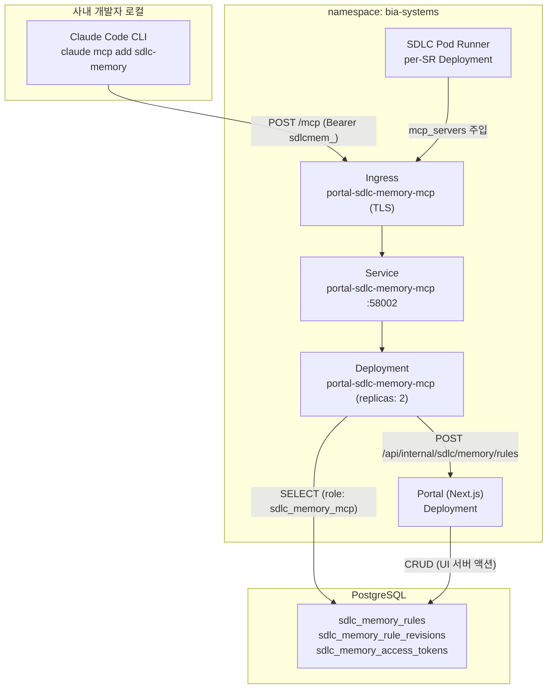
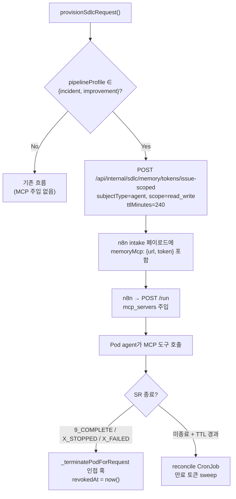
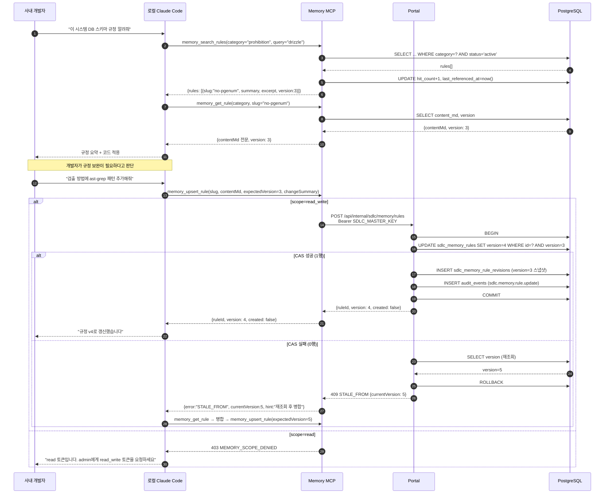
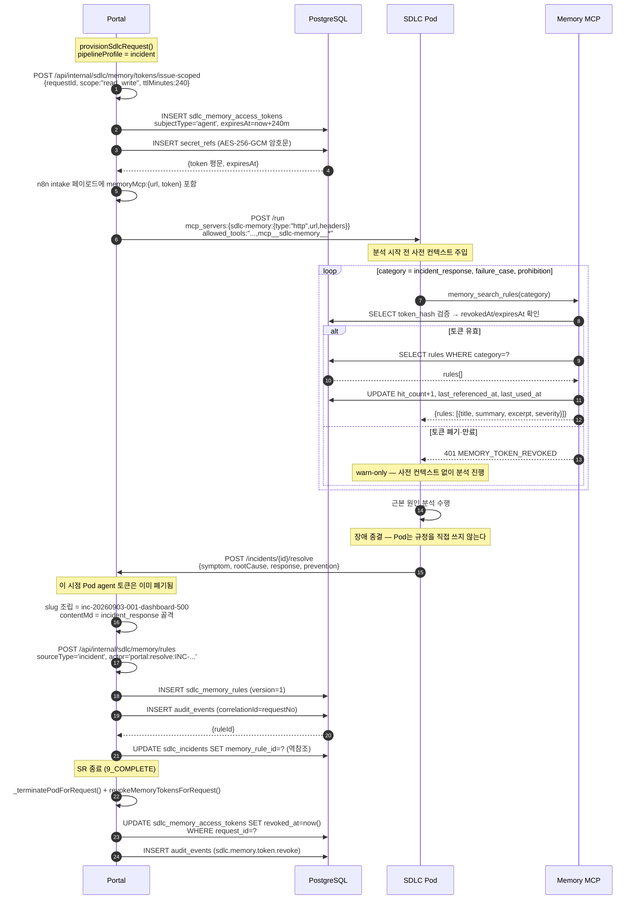
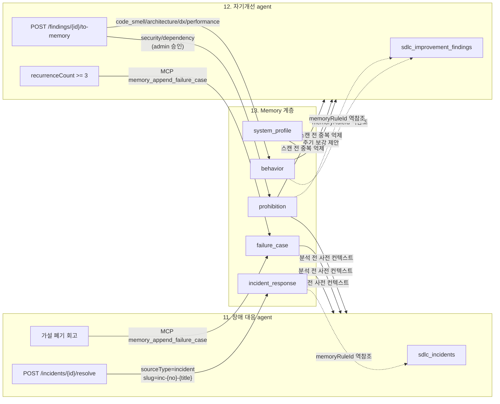

# Developer Memory Agent — 시스템별 규정 관리·MCP 서버·로컬 Claude Code 연동

> 사내 개발자와 SDLC Pod agent가 시스템별 개발 규정·금지사항·실패사례·장애 이력을 조회하고 축적하는 Memory 계층을 정의한다.
> 규정은 Portal DB의 신규 `sdlc_memory_*` 3테이블에 저장하고, 독립 K8s Deployment로 배포한 MCP 서버가 Streamable HTTP transport로 노출한다.

## 1. 개요

### 1.1 아키텍처 컴포넌트



> **왜 쓰기를 Portal로 우회하는가**: MCP 서버가 직접 DB에 쓰면 `audit_events` 기록·검증 로직이 두 곳으로 갈라진다. Portal 내부 API를 단일 창구로 두어 감사·검증을 한 곳에 모은다. `POST /api/internal/sdlc/reconcile`이 CronJob 전용 내부 창구인 선례를 미러링([05-portal-api.md](./05-portal-api.md) 8절 참조).

### 1.2 규정 5종 요약

| category | 한글명 | 목적 | 주 생성자 | slug 예시 |
|----------|--------|------|----------|----------|
| `system_profile` | 시스템 프로파일 | Architecture / DB / 비즈니스 Flow 등 시스템 이해 기반 | 사람(수동) + 12번 보강 | `architecture-overview`, `db-schema`, `business-flow-sr-intake` |
| `behavior` | 행동 규정 | 개발 시 어떻게 행동해야 하는가 | 사람 + 12번 finding 승격 | `commit-convention`, `api-error-format` |
| `prohibition` | 금지 규정 | 하지 말아야 할 것 / 오류 나는 부분 | 12번 finding 승격 + 사람 | `no-pgenum`, `no-top-nav` |
| `failure_case` | 실패사례 | 오류 수정 중 잘못된 접근을 누적해 반복 방지 | 11·12번 agent 자동 | `drizzle-push-fk-order-failure` |
| `incident_response` | 장애 대응 | 이전 장애 상황을 저장해 재발 방지 | 11번 agent 자동(종결 시) | `inc-20260903-001-dashboard-500` |

### 1.3 소비자 2종

| 소비자 | 접근 경로 | 토큰 | scope | 수명 |
|--------|----------|------|-------|------|
| 사내 개발자 로컬 Claude Code | `claude mcp add sdlc-memory -s user --transport http` | `sdlcmem_live_...` | 기본 `read`, 필요 시 `read_write` | `SDLC_MEMORY_TOKEN_TTL_DAYS`(180) |
| SDLC Pod agent (11·12번) | `POST /run`의 `mcp_servers` 필드로 요청마다 주입 | `sdlcmem_agent_...` | `read_write` (`requestId` 바인딩) | `SDLC_MEMORY_AGENT_TOKEN_TTL_MINUTES`(240) |

> **이미지에 굽지 않는다**: Pod agent 토큰은 SR마다 다르므로 `claude mcp add -s user`로 이미지에 굽지 않는다. 상세 근거는 8.1절 참조.

### 1.4 설계 원칙

| 원칙 | 내용 | 무엇을 미러링했는가 |
|------|------|-------------------|
| Portal DB 단일 진실 | 규정은 Portal DB `sdlc_memory_*` 4테이블에만 존재. MCP 서버는 별도 저장소를 두지 않는다 | 기존 SDLC 테이블이 모두 `pgSchema('sdlc')` 단일 DB에 모인 구조를 미러링 |
| 쓰기는 Portal 경유 | MCP 도구의 write 경로는 Portal `POST /api/internal/sdlc/memory/rules` 호출 | `POST /api/internal/sdlc/reconcile` 내부 API 선례를 미러링 |
| 이미지 baked-in 금지 | 원격 HTTP MCP + per-SR 토큰이므로 `POST /run`의 `mcp_servers`로 주입 | `secret_refs` 평문 미저장 원칙(비밀은 이미지·코드에 고정하지 않음)을 미러링 |
| 낙관적 동시성 | 규정 갱신은 `expectedVersion` CAS. 불일치 시 409 `STALE_FROM` | `src/lib/sdlc/advance.ts`의 CAS 전이 패턴을 미러링 |
| 불변 이력 | `failure_case`·`incident_response`는 물리 삭제 불가, `status='archived'`만 허용 | 논리 삭제 = `POST /{resource}/{id}/archive` 규약을 미러링 |
| MCP 실패 warn-only | Pod agent 관점에서 MCP 실패는 SR 전이를 차단하지 않는다 | 메시징 어댑터 실패 정책([02-messaging-adapter.md](./02-messaging-adapter.md) 9절)을 미러링 |

---

## 2. 규정 항목 체계

### 2.1 category 5종 정의

| category | 불변성 | 삭제 정책 | admin 승인 | 검색 우선순위 |
|----------|--------|----------|-----------|--------------|
| `system_profile` | 가변 | archive 가능 | 불필요 | 낮음 (컨텍스트 배경) |
| `behavior` | 가변 | archive 가능 | **필요** (12번 승격 시) | 중간 |
| `prohibition` | 가변 | archive 가능 | **필요** (12번 승격 시) | 높음 (`severity=critical` 다수) |
| `failure_case` | **불변** | archive만 | 불필요 | 높음 |
| `incident_response` | **불변** | archive만 | 불필요 | 높음 |

> **불변 이력 원칙**: `failure_case` / `incident_response`는 물리 삭제 불가. 무효화는 `status='archived'`로만 가능하다. 실패 이력을 지우면 재발 방지 목적 자체가 무너진다.

### 2.2 category별 Markdown 골격

`contentMd`는 category별 고정 H2 골격을 따른다. MCP `memory_upsert_rule`과 Portal UI 에디터 모두 이 골격을 초기값으로 제시한다.

#### `system_profile`

```markdown
## 개요

## 구성 요소

## 데이터 모델

## 주요 Flow

## 참고 경로
```

#### `behavior`

```markdown
## 규정

## 근거

## 적용 예

## 위반 예
```

#### `prohibition`

```markdown
## 금지 사항

## 발생하는 오류

## 대안

## 검출 방법
```

#### `failure_case`

```markdown
## 상황

## 잘못된 접근

## 왜 실패했는가

## 올바른 접근

## 재발 방지 체크
```

#### `incident_response`

```markdown
## 장애 요약

## 증상

## 근본 원인

## 대응 절차

## 재발 방지 조치

## 관련 SR·커밋
```

### 2.3 severity·tags·sourceType

| 필드 | 타입 | 기본값 | 설명 |
|------|------|--------|------|
| `severity` | `critical` \| `warn` \| `info` | `info` | `critical`은 MCP 검색 결과 최상단 고정. `prohibition`은 대부분 `critical` |
| `tags` | `string[]` | `[]` | 소문자·하이픈. 검색 필터 축 (`drizzle`, `nextjs`, `auth`, `k8s` 등) |
| `sourceType` | `manual` \| `incident` \| `improvement` \| `agent` | `manual` | 규정의 출처. `incident`/`improvement`는 `sourceRefId`로 원본 역참조 |
| `sourceRefId` | uuid | — | `sdlc_incidents.id`(11번) 또는 `sdlc_improvement_findings.id`(12번) |

### 2.4 slug 규칙

| 항목 | 내용 |
|------|------|
| 허용 문자 | 소문자·숫자·하이픈만 (`^[a-z0-9][a-z0-9-]*$`) |
| 최대 길이 | 200자 |
| 유일성 | `(category, slug)` 조합 유일. 위반 시 409 `RULE_DUPLICATE` |
| `incident_response` 강제 형식 | `inc-{incidentNo소문자}-{제목 slug}` (예: `inc-20260903-001-dashboard-500`) |
| 검증 위치 | Portal API(`POST /memory/rules`) + 내부 API 모두. MCP 서버는 검증하지 않고 Portal 응답의 `VALIDATION_ERROR`를 그대로 전달 |

> **멱등**: 동일 `(category, slug)`로 `memory_upsert_rule`을 재호출하면 신규 생성이 아니라 `expectedVersion` CAS 갱신으로 처리된다. 재시도가 중복 규정을 만들지 않는다.

---

## 3. 데이터 모델

`pgSchema('sdlc')` 하위 신규 3테이블. 기존 명명 규약(snake_case `sdlc_` prefix, TS export camelCase, 명시적 컬럼 매핑)을 그대로 따른다.

### 3.1 `sdlc_memory_rules` — 규정 본체

```typescript
export const sdlcMemoryRules = mySchema.table('sdlc_memory_rules', {
  id: uuid('id').primaryKey().defaultRandom(),
  category: varchar('category', { length: 32 }).notNull(),
  // system_profile | behavior | prohibition | failure_case | incident_response
  slug: varchar('slug', { length: 200 }).notNull(),
  title: varchar('title', { length: 500 }).notNull(),
  summary: varchar('summary', { length: 1000 }),
  contentMd: text('content_md').notNull(),
  tags: jsonb('tags').$type<string[]>().notNull().default([]),
  severity: varchar('severity', { length: 16 }).notNull().default('info'),
  // critical | warn | info
  sourceType: varchar('source_type', { length: 16 }).notNull().default('manual'),
  // manual | incident | improvement | agent
  sourceRefId: uuid('source_ref_id'),        // sdlc_incidents.id | sdlc_improvement_findings.id
  status: varchar('status', { length: 16 }).notNull().default('active'),
  // active | archived
  version: integer('version').notNull().default(1),
  hitCount: integer('hit_count').notNull().default(0),
  lastReferencedAt: timestamp('last_referenced_at', { withTimezone: true }),
  createdByActor: varchar('created_by_actor', { length: 255 }),
  updatedByActor: varchar('updated_by_actor', { length: 255 }),
  createdAt: timestamp('created_at').notNull().defaultNow(),
  updatedAt: timestamp('updated_at').notNull().defaultNow(),
}, (t) => [
  uniqueIndex('sdlc_memory_rules_slug_idx').on(t.category, t.slug),
  index('sdlc_memory_rules_category_idx').on(t.category, t.status),
  index('sdlc_memory_rules_status_idx').on(t.status),
  index('sdlc_memory_rules_source_idx').on(t.sourceType, t.sourceRefId),
]);
```

| 컬럼 | 타입 | 설명 |
|------|------|------|
| `category` | VARCHAR(32) | 규정 5종. `pgEnum` 미사용 — 허용값은 주석으로 명시 |
| `slug` | VARCHAR(200) | category 내 유일 식별자 |
| `title` | VARCHAR(500) | 규정 제목 |
| `summary` | VARCHAR(1000) | MCP 검색 결과에 노출되는 1~2문장 요약 |
| `contentMd` | TEXT | 규정 본문 Markdown (category별 고정 골격) |
| `tags` | JSONB `string[]` | 검색 필터 태그, 기본 `[]` |
| `severity` | VARCHAR(16) | `critical`/`warn`/`info`, 기본 `info` |
| `sourceType` | VARCHAR(16) | `manual`/`incident`/`improvement`/`agent`, 기본 `manual` |
| `sourceRefId` | UUID | 원본 장애·finding id (FK 미설정 — 두 테이블 중 하나를 가리키는 다형 참조) |
| `status` | VARCHAR(16) | `active`/`archived`, 기본 `active` |
| `version` | INTEGER | 낙관적 동시성 카운터, 기본 1 |
| `hitCount` | INTEGER | MCP `memory_search_rules` 매칭 누적 횟수 |
| `lastReferencedAt` | TIMESTAMPTZ | 최근 참조 시각 (규정 유효성 판단) |
| `createdByActor` / `updatedByActor` | VARCHAR(255) | 사람 GitHub login 또는 agent 식별자 |

> `sourceRefId`에 FK를 걸지 않은 이유: `sdlc_incidents`와 `sdlc_improvement_findings` 두 테이블 중 하나를 가리키는 다형 참조이므로 단일 FK로 표현할 수 없다. 대신 `sdlc_incidents.memoryRuleId` / `sdlc_improvement_findings.memoryRuleId`가 **역방향**으로 FK를 갖는다.

### 3.2 `sdlc_memory_rule_revisions` — 개정 이력

```typescript
export const sdlcMemoryRuleRevisions = mySchema.table('sdlc_memory_rule_revisions', {
  id: uuid('id').primaryKey().defaultRandom(),
  ruleId: uuid('rule_id').notNull()
    .references(() => sdlcMemoryRules.id, { onDelete: 'cascade' }),
  version: integer('version').notNull(),
  contentMd: text('content_md').notNull(),
  title: varchar('title', { length: 500 }),
  changeSummary: varchar('change_summary', { length: 1000 }),
  actor: varchar('actor', { length: 255 }),
  createdAt: timestamp('created_at', { withTimezone: true }).notNull().defaultNow(),
}, (t) => [
  uniqueIndex('sdlc_memory_rule_revisions_version_idx').on(t.ruleId, t.version),
]);
```

| 컬럼 | 타입 | 설명 |
|------|------|------|
| `ruleId` | UUID FK→sdlc_memory_rules | 대상 규정 (cascade) |
| `version` | INTEGER | 개정 시점의 버전 번호. `(ruleId, version)` 유일 |
| `contentMd` | TEXT | 개정 **직전** 본문 스냅샷 |
| `title` | VARCHAR(500) | 개정 직전 제목 |
| `changeSummary` | VARCHAR(1000) | 변경 요약 (커밋 메시지 성격) |
| `actor` | VARCHAR(255) | 변경자 |

> `sdlc_stage_transitions`가 상태 전이를 append-only로 남기는 패턴을 미러링. 개정 이력은 UPDATE·DELETE 하지 않는다.

### 3.3 `sdlc_memory_access_tokens` — MCP 접근 토큰

```typescript
export const sdlcMemoryAccessTokens = mySchema.table('sdlc_memory_access_tokens', {
  id: uuid('id').primaryKey().defaultRandom(),
  name: varchar('name', { length: 255 }).notNull(),
  tokenHash: varchar('token_hash', { length: 64 }).notNull(),   // sha256 hex
  tokenSecretRefId: uuid('token_secret_ref_id')
    .references(() => secretRefs.id, { onDelete: 'set null' }),
  scope: varchar('scope', { length: 16 }).notNull().default('read'),
  // read | read_write
  subjectType: varchar('subject_type', { length: 16 }).notNull().default('developer'),
  // developer | agent
  ownerUserId: text('owner_user_id')
    .references(() => users.id, { onDelete: 'set null' }),
  requestId: uuid('request_id')
    .references(() => sdlcRequests.id, { onDelete: 'set null' }),       // agent 토큰만
  expiresAt: timestamp('expires_at', { withTimezone: true }),
  lastUsedAt: timestamp('last_used_at', { withTimezone: true }),
  revokedAt: timestamp('revoked_at', { withTimezone: true }),
  createdAt: timestamp('created_at').notNull().defaultNow(),
}, (t) => [
  uniqueIndex('sdlc_memory_access_tokens_hash_idx').on(t.tokenHash),
  index('sdlc_memory_access_tokens_owner_idx').on(t.ownerUserId, t.revokedAt),
  index('sdlc_memory_access_tokens_request_idx').on(t.requestId),
]);
```

| 컬럼 | 타입 | 설명 |
|------|------|------|
| `name` | VARCHAR(255) | 토큰 표시명 (예: `홍길동 로컬`, `SR-20260903-001 agent`) |
| `tokenHash` | VARCHAR(64) | 평문 토큰의 sha256 hex, unique. MCP 인증 시 O(1) 조회 축 |
| `tokenSecretRefId` | UUID FK→secret_refs | AES-256-GCM 암호문 참조 (set null) |
| `scope` | VARCHAR(16) | `read`/`read_write`, 기본 `read` |
| `subjectType` | VARCHAR(16) | `developer`/`agent`, 기본 `developer` |
| `ownerUserId` | TEXT FK→users | 발급 대상 개발자 (agent 토큰은 null) |
| `requestId` | UUID FK→sdlc_requests | agent 토큰의 소속 SR (developer 토큰은 null) |
| `expiresAt` | TIMESTAMPTZ | 만료 시각. 초과 시 401 `MEMORY_TOKEN_REVOKED` |
| `lastUsedAt` | TIMESTAMPTZ | 최근 사용 시각 (MCP가 인증 성공 시 갱신) |
| `revokedAt` | TIMESTAMPTZ | 폐기 시각. non-null이면 401 |

#### `tokenHash` + `tokenSecretRefId` 이중 보관

| 컬럼 | 역할 | 근거 |
|------|------|------|
| `tokenHash` | O(1) 인증 조회 | 매 MCP 요청마다 `WHERE token_hash = sha256(bearer)` 단일 인덱스 조회 |
| `tokenSecretRefId` | 관리자 재조회 (재발급 없이) | GitHub PAT·repo 등록 파일이 쓰는 `secret_refs` 패턴을 따른다 — 암호문만 `secret_refs`에 두고 owning 테이블은 uuid FK만 보유 |

> `secret_refs`에 평문은 없다. AES-256-GCM `ciphertext` + `iv` + `hint`만 저장하는 기존 원칙([04-db-schema.md](./04-db-schema.md) 8.1절)을 유지한다. 운영 로그에는 토큰 앞 8자 + sha256 지문만 기록한다.

### 3.4 인덱스 요약

| 인덱스 | 테이블 | 컬럼 | 용도 |
|--------|--------|------|------|
| `sdlc_memory_rules_slug_idx` | rules | `(category, slug)` unique | upsert 멱등 축, `RULE_DUPLICATE` 검출 |
| `sdlc_memory_rules_category_idx` | rules | `(category, status)` | UI Tabs 조회, MCP category 필터 검색 |
| `sdlc_memory_rules_status_idx` | rules | `(status)` | archived 제외 전역 스캔 |
| `sdlc_memory_rules_source_idx` | rules | `(sourceType, sourceRefId)` | 11·12번 원본 → 규정 정방향 조회 |
| `sdlc_memory_rule_revisions_version_idx` | revisions | `(ruleId, version)` unique | 개정 이력 중복 방지 |
| `sdlc_memory_access_tokens_hash_idx` | tokens | `(tokenHash)` unique | MCP 인증 O(1) |
| `sdlc_memory_access_tokens_owner_idx` | tokens | `(ownerUserId, revokedAt)` | 개발자별 유효 토큰 목록 |
| `sdlc_memory_access_tokens_request_idx` | tokens | `(requestId)` | SR 종료 훅의 일괄 폐기 |

### 3.5 스키마 생성 순서 (FK 의존성)

⚠️ **FK 순서 경고**: `sdlc_incidents.memoryRuleId`와 `sdlc_improvement_findings.memoryRuleId`가 `sdlc_memory_rules`를 참조하므로 `drizzle-kit push` 시 **규정 테이블이 장애·개선 테이블보다 먼저** 생성되어야 한다.

```
1. sdlc_memory_rules         (독립 — FK 없음)
2. sdlc_memory_rule_revisions (sdlc_memory_rules FK)
3. sdlc_memory_access_tokens (secret_refs, users, sdlc_requests FK)
4. sdlc_incidents            (sdlc_memory_rules FK ← 여기서 참조)
5. sdlc_improvement_findings (sdlc_memory_rules FK ← 여기서 참조)
```

> `drizzle-kit push`는 의존성을 자동 해결하지만 스키마 파일을 나누거나 수동 SQL을 실행할 때는 위 순서를 따른다. [04-db-schema.md](./04-db-schema.md) 12절 참조.

---

## 4. 버전 관리·이력

### 4.1 `expectedVersion` CAS

규정 갱신은 낙관적 동시성으로 처리한다. 로컬 개발자와 Pod agent가 같은 규정을 동시에 갱신할 때 후자가 전자의 내용을 덮어쓰지 않도록 한다.

```typescript
// src/lib/sdlc/memory/update-rule.ts
export async function updateMemoryRule(input: {
  ruleId: string;
  expectedVersion: number;
  title?: string;
  summary?: string;
  contentMd: string;
  tags?: string[];
  severity?: string;
  changeSummary?: string;
  actor: string;
}): Promise<{ ruleId: string; version: number; updatedAt: Date; idempotent?: boolean }> {
  const nextVersion = input.expectedVersion + 1;

  // 1) 개정 직전 스냅샷을 revisions에 남긴다 (동일 트랜잭션)
  return await db.transaction(async (tx) => {
    const [prev] = await tx.select()
      .from(sdlcMemoryRules)
      .where(eq(sdlcMemoryRules.id, input.ruleId));

    if (!prev) throw new NotFoundError('memory rule not found');
    if (prev.status !== 'active') throw new ValidationError('archived rule cannot be updated');

    // 2) CAS: version이 expectedVersion과 일치할 때만 UPDATE
    const updated = await tx.update(sdlcMemoryRules)
      .set({
        title: input.title ?? prev.title,
        summary: input.summary ?? prev.summary,
        contentMd: input.contentMd,
        tags: input.tags ?? prev.tags,
        severity: input.severity ?? prev.severity,
        version: nextVersion,
        updatedByActor: input.actor,
        updatedAt: new Date(),
      })
      .where(and(
        eq(sdlcMemoryRules.id, input.ruleId),
        eq(sdlcMemoryRules.version, input.expectedVersion),   // ← CAS 조건
      ))
      .returning({ id: sdlcMemoryRules.id, version: sdlcMemoryRules.version, updatedAt: sdlcMemoryRules.updatedAt });

    // 3) 0행 → 재조회 후 멱등 판정
    if (updated.length === 0) {
      const [current] = await tx.select({ version: sdlcMemoryRules.version, contentMd: sdlcMemoryRules.contentMd, updatedAt: sdlcMemoryRules.updatedAt })
        .from(sdlcMemoryRules)
        .where(eq(sdlcMemoryRules.id, input.ruleId));

      // 이미 목표 버전이고 본문이 동일하면 재시도로 간주 → 멱등 성공
      if (current?.version === nextVersion && current.contentMd === input.contentMd) {
        return { ruleId: input.ruleId, version: current.version, updatedAt: current.updatedAt, idempotent: true };
      }
      throw new StaleFromError(
        `expectedVersion ${input.expectedVersion} != current ${current?.version}`,
      );  // → HTTP 409 STALE_FROM
    }

    // 4) 개정 이력 append
    await tx.insert(sdlcMemoryRuleRevisions).values({
      ruleId: input.ruleId,
      version: input.expectedVersion,        // 스냅샷은 '직전' 버전 번호로 기록
      contentMd: prev.contentMd,
      title: prev.title,
      changeSummary: input.changeSummary,
      actor: input.actor,
    });

    return { ruleId: updated[0].id, version: updated[0].version, updatedAt: updated[0].updatedAt };
  });
}
```

> **무엇을 미러링했는가**: `src/lib/sdlc/advance.ts`의 CAS 전이 패턴 — 조건부 `UPDATE ... WHERE key=? AND status=from RETURNING` → 0행이면 재조회 → 이미 목표 상태면 `{idempotent:true}`, 아니면 `StaleFromError` → HTTP 409 `STALE_FROM`. `status` 축을 `version` 축으로 바꾼 것 외에는 동일하다.

### 4.2 revision 기록 규칙

| 시점 | 기록 대상 | `version` 값 |
|------|----------|-------------|
| 신규 생성 (`POST /memory/rules`) | 기록하지 않음 | — (rules.version = 1) |
| 갱신 (`POST /memory/rules/{id}/update`) | **개정 직전** 본문 스냅샷 | `expectedVersion` (직전 값) |
| archive (`POST /memory/rules/{id}/archive`) | 기록하지 않음 | — (본문 변경 없음) |
| MCP `memory_upsert_rule` (기존 slug) | 갱신과 동일 | `expectedVersion` |

> 신규 생성 시 revision을 남기지 않는 이유: `rules.contentMd` 자체가 version 1의 원본이므로 중복 저장이 된다. version N의 본문은 revision N에서, 최신 버전 본문은 `rules.contentMd`에서 읽는다.

### 4.3 불변 이력 원칙

| category | `POST /update` | `POST /archive` | 물리 삭제 |
|----------|---------------|----------------|----------|
| `system_profile` | ✅ | ✅ (admin) | ❌ API 없음 |
| `behavior` | ✅ | ✅ (admin) | ❌ API 없음 |
| `prohibition` | ✅ | ✅ (admin) | ❌ API 없음 |
| `failure_case` | ✅ (보강만) | ✅ (admin) | ❌ 422 `RULE_IMMUTABLE` |
| `incident_response` | ✅ (보강만) | ✅ (admin) | ❌ 422 `RULE_IMMUTABLE` |

> **불변 이력 원칙**: 물리 삭제 엔드포인트는 애초에 존재하지 않는다(POST-only RPC 규약상 DELETE 동사가 없다). `RULE_IMMUTABLE` 422는 향후 관리 도구가 `failure_case`/`incident_response`에 대해 하드 삭제를 시도할 경우를 위한 fail-closed 방어선이다.

### 4.4 감사 로그

모든 규정 변경은 `audit_events`에 기록한다. MCP 서버의 쓰기 경로가 Portal 내부 API를 경유하므로 감사 기록 지점이 하나로 모인다.

| `action` | `resourceType` | `resourceId` | `beforeState` | `afterState` |
|----------|---------------|-------------|--------------|-------------|
| `sdlc.memory.rule.create` | `sdlc_memory_rule` | `ruleId` | `null` | `{category, slug, title, version:1, sourceType}` |
| `sdlc.memory.rule.update` | `sdlc_memory_rule` | `ruleId` | `{version, title, contentMdSha256}` | `{version, title, contentMdSha256, changeSummary}` |
| `sdlc.memory.rule.archive` | `sdlc_memory_rule` | `ruleId` | `{status:'active'}` | `{status:'archived'}` |
| `sdlc.memory.token.issue` | `sdlc_memory_access_token` | `tokenId` | `null` | `{name, scope, subjectType, expiresAt, tokenFingerprint}` |
| `sdlc.memory.token.revoke` | `sdlc_memory_access_token` | `tokenId` | `{revokedAt:null}` | `{revokedAt}` |

`correlationId`는 다음 규칙으로 채운다.

| 호출자 | `correlationId` | `actorId` |
|--------|----------------|----------|
| Portal UI 서버 액션 | `null` | `session.user.githubLogin` |
| MCP (developer 토큰) | `null` | `mcp:developer:{ownerGithubLogin}` |
| MCP (agent 토큰) | `requestNo` | `mcp:agent:{requestNo}` |
| 11·12번 Pod agent | `requestNo` | `agent:incident` / `agent:improvement` |

> `contentMd` 전문을 `beforeState`/`afterState`에 넣지 않고 sha256만 기록한다. `audit_events`가 규정 본문의 사실상 두 번째 사본이 되는 것을 막고, 로그에 실제값을 남기지 않는 기존 원칙([04-db-schema.md](./04-db-schema.md) 8.1절)을 유지한다. 본문 이력은 `sdlc_memory_rule_revisions`가 담당한다.

---

## 5. Portal API

### 5.1 HTTP 동사 규약 재확인

본 문서는 POST-only RPC 규약의 가장 무거운 사용처다. 규정 CRUD 전체가 이 규약을 따른다.

| 의미 | ❌ 사용 금지 | ✅ 사용 |
|------|-------------|--------|
| 조회 | — | `GET /memory/rules`, `GET /memory/rules/{ruleId}` |
| 생성 | — | `POST /memory/rules` |
| 수정 | `PUT /memory/rules/{ruleId}`, `PATCH ...` | `POST /memory/rules/{ruleId}/update` |
| 논리 삭제 | `DELETE /memory/rules/{ruleId}` | `POST /memory/rules/{ruleId}/archive` |
| 토큰 폐기 | `DELETE /memory/tokens/{tokenId}` | `POST /memory/tokens/{tokenId}/revoke` |

> API 전역에 PUT/PATCH/DELETE는 존재하지 않는다. [05-portal-api.md](./05-portal-api.md) 1절에 정의된 규약이며, 본 문서의 모든 엔드포인트가 이를 따른다.

### 5.2 규정 CRUD

**`GET /memory/rules?category=&q=&tag=&status=&page=&limit=`** — 인증: 세션 (user)

규정 목록 조회. `contentMd` 전문은 포함하지 않는다(목록 응답 비대화 방지).

| 쿼리 파라미터 | 필수 | 기본값 | 설명 |
|--------------|------|--------|------|
| `category` | | — | 5종 중 하나. 미지정 시 전체 |
| `q` | | — | `title`·`summary` 부분 일치 검색 |
| `tag` | | — | `tags` 배열 포함 검사 (단일 태그) |
| `status` | | `active` | `active` \| `archived` \| `all` |
| `page` | | `1` | offset pagination |
| `limit` | | `20` | 최대 100 |

**응답**:

```json
{
  "items": [
    {
      "id": "a1b2c3d4-e5f6-7890-abcd-ef1234567890",
      "category": "prohibition",
      "slug": "no-pgenum",
      "title": "Drizzle 스키마에서 pgEnum 사용 금지",
      "summary": "status 컬럼은 varchar(N) + 허용값 주석으로 표현한다. pgEnum은 push 시 타입 변경이 불가하다.",
      "tags": ["drizzle", "db", "schema"],
      "severity": "critical",
      "sourceType": "improvement",
      "sourceRefId": "9f8e7d6c-5b4a-3210-fedc-ba9876543210",
      "status": "active",
      "version": 3,
      "hitCount": 47,
      "lastReferencedAt": "2026-09-02T23:41:00.000Z",
      "updatedByActor": "hong-gildong",
      "updatedAt": "2026-08-28T02:15:00.000Z"
    }
  ],
  "total": 7,
  "page": 1,
  "limit": 20
}
```

**오류 응답**:

| HTTP | code | 설명 |
|------|------|------|
| 400 | `VALIDATION_ERROR` | `category` 허용값 아님 / `limit` > 100 |
| 401 | `UNAUTHORIZED` | 세션 없음 |

**수행 작업**:

1. `requireUser()` 통과 확인
2. `sdlc_memory_rules_category_idx`로 필터 조회
3. `severity` 내림차순(`critical` → `warn` → `info`) → `updatedAt` 내림차순 정렬
4. `{items, total, page, limit}` 반환. `contentMd` 제외

---

**`GET /memory/rules/{ruleId}`** — 인증: 세션 (user)

규정 상세. `contentMd` 전문과 `version`을 포함한다. UI 편집 화면이 `expectedVersion`으로 사용할 값이다.

**응답**:

```json
{
  "id": "a1b2c3d4-e5f6-7890-abcd-ef1234567890",
  "category": "prohibition",
  "slug": "no-pgenum",
  "title": "Drizzle 스키마에서 pgEnum 사용 금지",
  "summary": "status 컬럼은 varchar(N) + 허용값 주석으로 표현한다.",
  "contentMd": "## 금지 사항\n\n`pgEnum`을 사용하지 않는다...\n\n## 발생하는 오류\n\n...\n\n## 대안\n\n`varchar(N)` + `//` 주석...\n\n## 검출 방법\n\n`grep -r \"pgEnum\" src/db/schema/`\n",
  "tags": ["drizzle", "db", "schema"],
  "severity": "critical",
  "sourceType": "improvement",
  "sourceRefId": "9f8e7d6c-5b4a-3210-fedc-ba9876543210",
  "status": "active",
  "version": 3,
  "hitCount": 47,
  "lastReferencedAt": "2026-09-02T23:41:00.000Z",
  "createdByActor": "agent:improvement",
  "updatedByActor": "hong-gildong",
  "createdAt": "2026-08-20T01:00:00.000Z",
  "updatedAt": "2026-08-28T02:15:00.000Z"
}
```

**오류 응답**:

| HTTP | code | 설명 |
|------|------|------|
| 401 | `UNAUTHORIZED` | 세션 없음 |
| 404 | `NOT_FOUND` | `ruleId` 미존재 |

**수행 작업**:

1. `requireUser()` 통과 확인
2. `sdlc_memory_rules` PK 조회
3. `contentMd` 포함 전체 필드 반환
4. UI 조회는 `hitCount`를 올리지 않는다 — MCP `memory_search_rules`만 카운트한다(9.1절 참조)

---

**`POST /memory/rules`** — 인증: 세션 (user)

규정 신규 생성.

**요청 본문**:

```json
{
  "category": "behavior",
  "slug": "api-error-format",
  "title": "API 오류 응답은 {code, message} 포맷을 따른다",
  "summary": "모든 API 오류는 code(대문자 스네이크)와 message(한국어) 두 필드만 반환한다.",
  "contentMd": "## 규정\n\n...\n\n## 근거\n\n...\n\n## 적용 예\n\n...\n\n## 위반 예\n\n...\n",
  "tags": ["api", "error-handling"],
  "severity": "warn"
}
```

**응답**:

```json
{ "ruleId": "b2c3d4e5-f6a7-8901-bcde-f23456789012", "version": 1 }
```
HTTP 201 Created

**오류 응답**:

| HTTP | code | 설명 |
|------|------|------|
| 400 | `VALIDATION_ERROR` | `slug` 형식 위반 / `category` 허용값 아님 / `contentMd` 누락 / `incident_response` slug가 `inc-` 형식 아님 |
| 401 | `UNAUTHORIZED` | 세션 없음 |
| 409 | `RULE_DUPLICATE` | `(category, slug)` 중복 |

**수행 작업**:

1. `requireUser()` 통과 확인
2. `slug` 형식 검증. `category='incident_response'`면 `inc-{incidentNo}-{title}` 패턴 강제
3. `sdlc_memory_rules` INSERT (`version=1`, `status='active'`, `createdByActor=session.user.githubLogin`)
4. unique 위반 → 409 `RULE_DUPLICATE`
5. revision은 기록하지 않음 (4.2절)
6. `audit_events` `sdlc.memory.rule.create` 기록

---

**`POST /memory/rules/{ruleId}/update`** — 인증: 세션 (user)

규정 갱신. **`expectedVersion` 필수**.

**요청 본문**:

```json
{
  "expectedVersion": 3,
  "title": "Drizzle 스키마에서 pgEnum 사용 금지",
  "summary": "status 컬럼은 varchar(N) + 허용값 주석으로 표현한다.",
  "contentMd": "## 금지 사항\n\n...\n",
  "tags": ["drizzle", "db", "schema", "migration"],
  "severity": "critical",
  "changeSummary": "검출 방법에 ast-grep 패턴 추가"
}
```

**응답**:

```json
{ "ruleId": "a1b2c3d4-e5f6-7890-abcd-ef1234567890", "version": 4, "updatedAt": "2026-09-03T06:20:00.000Z" }
```

**오류 응답**:

| HTTP | code | 설명 |
|------|------|------|
| 400 | `VALIDATION_ERROR` | `expectedVersion` 누락 / `contentMd` 누락 / archived 규정 갱신 시도 |
| 401 | `UNAUTHORIZED` | 세션 없음 |
| 404 | `NOT_FOUND` | `ruleId` 미존재 |
| **409** | **`STALE_FROM`** | **`expectedVersion` != 현재 `version`** |

**수행 작업**:

1. `requireUser()` 통과 확인
2. `updateMemoryRule()` 호출 (4.1절 CAS 로직)
3. 0행 → 재조회 → 이미 목표 버전 + 동일 본문이면 200 `{idempotent:true}`, 아니면 409 `STALE_FROM`
4. 성공 시 동일 트랜잭션에서 `sdlc_memory_rule_revisions` INSERT (직전 본문 스냅샷)
5. `audit_events` `sdlc.memory.rule.update` 기록 (`contentMdSha256`만)

> **무엇을 미러링했는가**: `POST /advance`가 `from`/`to`로 CAS를 걸고 409 `STALE_FROM`을 반환하는 계약을 `expectedVersion` 축으로 그대로 옮겼다. `from` → `expectedVersion`, `to` → `expectedVersion + 1`.

---

**`POST /memory/rules/{ruleId}/archive`** — 인증: 세션 (admin)

규정 논리 삭제. `status='archived'`로 전환한다.

**요청 본문**:

```json
{ "reason": "Next.js 16 업그레이드로 규정 무효화" }
```

**응답**:

```json
{ "ruleId": "a1b2c3d4-e5f6-7890-abcd-ef1234567890", "status": "archived" }
```

**오류 응답**:

| HTTP | code | 설명 |
|------|------|------|
| 401 | `UNAUTHORIZED` | 세션 없음 |
| 403 | `FORBIDDEN` | admin 아님 |
| 404 | `NOT_FOUND` | `ruleId` 미존재 |

**수행 작업**:

1. `requireAdmin()` 통과 확인 — 생성은 user, archive는 admin (규정 무효화는 영향 범위가 크다)
2. `status='archived'` UPDATE. `version`은 올리지 않음 (본문 변경 아님)
3. archived 규정은 MCP 검색 결과에서 제외되고 `GET /memory/rules?status=archived`로만 조회된다
4. `audit_events` `sdlc.memory.rule.archive` 기록

> **불변 이력 원칙**: `failure_case`/`incident_response`도 archive는 가능하다. 금지되는 것은 물리 삭제뿐이다. archive된 실패사례는 `status=archived` 필터로 언제든 다시 읽을 수 있다.

---

**`GET /memory/rules/{ruleId}/revisions`** — 인증: 세션 (user)

개정 이력 목록. UI 상세 화면 하단 Accordion이 사용한다.

**응답**:

```json
{
  "items": [
    {
      "id": "c3d4e5f6-a7b8-9012-cdef-345678901234",
      "version": 3,
      "title": "Drizzle 스키마에서 pgEnum 사용 금지",
      "contentMd": "## 금지 사항\n\n(version 3 시점 본문)\n",
      "changeSummary": "검출 방법에 ast-grep 패턴 추가",
      "actor": "hong-gildong",
      "createdAt": "2026-09-03T06:20:00.000Z"
    },
    {
      "id": "d4e5f6a7-b8c9-0123-def4-56789012345a",
      "version": 2,
      "title": "pgEnum 사용 금지",
      "contentMd": "## 금지 사항\n\n(version 2 시점 본문)\n",
      "changeSummary": "대안 섹션 보강",
      "actor": "agent:improvement",
      "createdAt": "2026-08-28T02:15:00.000Z"
    }
  ],
  "total": 2,
  "page": 1,
  "limit": 20
}
```

**오류 응답**:

| HTTP | code | 설명 |
|------|------|------|
| 401 | `UNAUTHORIZED` | 세션 없음 |
| 404 | `NOT_FOUND` | `ruleId` 미존재 |

**수행 작업**:

1. `requireUser()` 통과 확인
2. `sdlc_memory_rule_revisions_version_idx`로 `(ruleId)` 조회, `version` 내림차순
3. `{items, total, page, limit}` 반환
4. UI는 인접 version 간 diff를 클라이언트에서 계산해 표시한다

---

### 5.4 토큰 관리

**`GET /memory/tokens`** — 인증: 세션 (admin)

MCP 접근 토큰 목록. **평문 토큰은 절대 포함하지 않는다.**

**응답**: **bare array**

```json
[
  {
    "id": "e5f6a7b8-c9d0-1234-ef56-789012345abc",
    "name": "홍길동 로컬",
    "scope": "read_write",
    "subjectType": "developer",
    "ownerUserId": "u_01H8X...",
    "ownerGithubLogin": "hong-gildong",
    "requestId": null,
    "tokenPrefix": "sdlcmem_",
    "tokenFingerprint": "3f2a1b8c",
    "expiresAt": "2027-03-02T00:00:00.000Z",
    "lastUsedAt": "2026-09-03T06:55:00.000Z",
    "revokedAt": null,
    "createdAt": "2026-09-03T00:10:00.000Z"
  },
  {
    "id": "f6a7b8c9-d0e1-2345-fa67-89012345abcd",
    "name": "SR-20260903-001 agent",
    "scope": "read_write",
    "subjectType": "agent",
    "ownerUserId": null,
    "ownerGithubLogin": null,
    "requestId": "7b8c9d0e-1f2a-3456-7890-abcdef123456",
    "tokenPrefix": "sdlcmem_",
    "tokenFingerprint": "9c4d2e7f",
    "expiresAt": "2026-09-03T11:00:00.000Z",
    "lastUsedAt": "2026-09-03T07:12:00.000Z",
    "revokedAt": null,
    "createdAt": "2026-09-03T07:00:00.000Z"
  }
]
```

**오류 응답**:

| HTTP | code | 설명 |
|------|------|------|
| 401 | `UNAUTHORIZED` | 세션 없음 |
| 403 | `FORBIDDEN` | admin 아님 |

**수행 작업**:

1. `requireAdmin()` 통과 확인
2. `sdlc_memory_access_tokens` 전체 조회 + `users` join
3. `tokenHash` 앞 8자를 `tokenFingerprint`로 노출 (전체 sha256도 노출하지 않음)
4. `tokenSecretRefId`는 응답에 포함하지 않음 — 평문 복호화 경로를 API로 열지 않는다
5. bare array 반환

---

**`POST /memory/tokens`** — 인증: 세션 (admin)

MCP 접근 토큰 발급. **평문 `token`은 이 응답에서 단 1회만 노출된다.**

**요청 본문**:

```json
{
  "name": "홍길동 로컬",
  "scope": "read",
  "ownerUserId": "u_01H8X...",
  "expiresAt": "2027-03-02T00:00:00.000Z"
}
```

| 필드 | 타입 | 기본값 | 설명 |
|------|------|--------|------|
| `name` | string | (필수) | 토큰 표시명 |
| `scope` | string | `read` | `read` \| `read_write` |
| `ownerUserId` | string \| null | `null` | 발급 대상 개발자 |
| `expiresAt` | string \| null | `now + SDLC_MEMORY_TOKEN_TTL_DAYS` | ISO 8601 만료 시각 |

**응답**:

```json
{
  "tokenId": "e5f6a7b8-c9d0-1234-ef56-789012345abc",
  "name": "홍길동 로컬",
  "token": "sdlcmem_live_7f3a9b2c8e1d4f5a6b7c8d9e0f1a2b3c4d5e6f7a",
  "scope": "read",
  "expiresAt": "2027-03-02T00:00:00.000Z"
}
```
HTTP 201 Created

**오류 응답**:

| HTTP | code | 설명 |
|------|------|------|
| 400 | `VALIDATION_ERROR` | `name` 누락 / `scope` 허용값 아님 / `expiresAt` 과거 시각 |
| 401 | `UNAUTHORIZED` | 세션 없음 |
| 403 | `FORBIDDEN` | admin 아님 |
| 404 | `NOT_FOUND` | `ownerUserId` 미존재 |

**수행 작업**:

1. `requireAdmin()` 통과 확인
2. 평문 토큰 생성: `sdlcmem_live_` + `crypto.randomBytes(20).toString('hex')`
3. sha256 계산 → `tokenHash`
4. 평문을 AES-256-GCM 암호화 → `secret_refs` INSERT (`hint='memory-access-token'`) → `tokenSecretRefId`
5. `sdlc_memory_access_tokens` INSERT (`subjectType='developer'`)
6. `audit_events` `sdlc.memory.token.issue` 기록 (`tokenFingerprint`만)
7. **응답에 평문 `token` 포함 — 이후 어떤 API도 평문을 반환하지 않는다**

> **fail-closed**: 모든 토큰은 전역 규정에 접근한다. scope(`read`/`read_write`)로만 권한을 분리한다.

---

**`POST /memory/tokens/{tokenId}/revoke`** — 인증: 세션 (admin)

토큰 폐기. `revokedAt`을 설정한다.

**요청 본문**: 없음

**응답**:

```json
{ "tokenId": "e5f6a7b8-c9d0-1234-ef56-789012345abc", "revokedAt": "2026-09-03T08:00:00.000Z" }
```

**오류 응답**:

| HTTP | code | 설명 |
|------|------|------|
| 401 | `UNAUTHORIZED` | 세션 없음 |
| 403 | `FORBIDDEN` | admin 아님 |
| 404 | `NOT_FOUND` | `tokenId` 미존재 |

**수행 작업**:

1. `requireAdmin()` 통과 확인
2. `revokedAt = now()` UPDATE. 행은 삭제하지 않는다 (감사 이력 보존)
3. MCP 서버는 다음 요청부터 401 `MEMORY_TOKEN_REVOKED` 반환
4. `audit_events` `sdlc.memory.token.revoke` 기록

> **멱등**: 이미 폐기된 토큰에 재호출하면 기존 `revokedAt`을 그대로 반환하고 덮어쓰지 않는다.

---

### 5.5 내부 API

Portal 내부 API는 `/api/internal/sdlc/*` 하위에 둔다. MCP 서버와 Pod agent의 쓰기 경로가 여기로 수렴한다.

**`POST /api/internal/sdlc/memory/rules`** — 인증: `Bearer SDLC_MASTER_KEY`

MCP 서버·11번·12번의 규정 쓰기 **단일 창구**. upsert 시맨틱. `SDLC_MASTER_KEY`는 서버 간 호출 공통 인증 토큰이지만 **토큰 발급 엔드포인트에는 사용할 수 없다** — 발급 권한은 별도 토큰으로 분리되어 있다.

**요청 본문**:

```json
{
  "category": "failure_case",
  "slug": "drizzle-push-fk-order-failure",
  "title": "drizzle-kit push에서 FK 순서 오류로 테이블 생성 실패",
  "summary": "참조 테이블보다 참조하는 테이블을 먼저 정의해 push가 relation does not exist로 실패했다.",
  "contentMd": "## 상황\n\n...\n\n## 잘못된 접근\n\n...\n\n## 왜 실패했는가\n\n...\n\n## 올바른 접근\n\n...\n\n## 재발 방지 체크\n\n...\n",
  "tags": ["drizzle", "db", "migration"],
  "severity": "warn",
  "sourceType": "agent",
  "sourceRefId": null,
  "expectedVersion": 2,
  "changeSummary": "12번 스캔에서 recurrenceCount 3 도달로 보강",
  "actor": "mcp:agent:SR-20260903-001"
}
```

| 필드 | 타입 | 기본값 | 설명 |
|------|------|--------|------|
| `category` | string | (필수) | 규정 5종 |
| `slug` | string | (필수) | 유일 식별자 |
| `title` | string | (필수) | 규정 제목 |
| `summary` | string \| null | `null` | 검색 결과 요약 |
| `contentMd` | string | (필수) | 본문 Markdown |
| `tags` | string[] | `[]` | 태그 |
| `severity` | string | `info` | `critical` \| `warn` \| `info` |
| `sourceType` | string | `agent` | `manual` \| `incident` \| `improvement` \| `agent`. **이 엔드포인트의 기본값만 `agent`다** — 호출자가 MCP 서버와 agent이기 때문이다. 반면 `sdlc_memory_rules.source_type` 컬럼 기본값은 `manual`이며(2.3절·7절), 이는 UI에서 사람이 직접 생성한 규정에 적용된다. 두 기본값은 의도적으로 다르다 |
| `sourceRefId` | uuid \| null | `null` | 원본 장애·finding id |
| `expectedVersion` | int \| null | `null` | 기존 slug 갱신 시 필수. 신규 생성 시 무시 |
| `changeSummary` | string \| null | `null` | 개정 요약 |
| `actor` | string | (필수) | 변경자 식별자 |

**응답**:

```json
{ "ruleId": "b2c3d4e5-f6a7-8901-bcde-f23456789012", "version": 3, "created": false }
```

멱등 재호출(동일 본문 재전송)일 때는 `idempotent` 플래그가 추가된다.

```json
{ "ruleId": "b2c3d4e5-f6a7-8901-bcde-f23456789012", "version": 3, "created": false, "idempotent": true }
```

| 필드 | 타입 | 설명 |
|------|------|------|
| `ruleId` | uuid | 생성·갱신된 규정 id |
| `version` | int | 반영 후 버전 |
| `created` | boolean | 신규 INSERT였는지 여부 |
| `idempotent` | boolean (optional) | 동일 본문 재호출로 version 증가 없이 종료된 경우 `true`. 필드 부재는 `false`와 동일 |

**오류 응답**:

| HTTP | code | 설명 |
|------|------|------|
| 200 | — | 정상 (`created: true` 신규 / `false` 갱신) |
| 200 | — | 멱등 재호출 — `{idempotent: true}`, version 불변. `POST /advance`의 멱등 규약과 동일 |
| 400 | `VALIDATION_ERROR` | `slug` 형식 위반 / 기존 slug인데 `expectedVersion` 누락 |
| 401 | `UNAUTHORIZED` | `SDLC_MASTER_KEY` 불일치 |
| 409 | `STALE_FROM` | `expectedVersion` 불일치 |
| 500 | `INTERNAL_ERROR` | DB 오류 |

**수행 작업**:

1. `Bearer SDLC_MASTER_KEY` 상수 시간 비교
2. `(category, slug)` 조회
   - **없음** → INSERT (`version=1`, `createdByActor=actor`) → `{created: true, version: 1}`
   - **있음** → `expectedVersion` 필수 확인 → `updateMemoryRule()` CAS (4.1절) → `{created: false, version: N+1}`
3. 갱신 시 `sdlc_memory_rule_revisions` INSERT
4. `audit_events` `sdlc.memory.rule.create` 또는 `.update` 기록

> **멱등**: 동일 `(category, slug)` + 동일 `contentMd`로 재호출하면 CAS 0행 → 재조회 → 본문 동일 확인 → `{idempotent:true}` 200. 네트워크 재시도가 version을 무한히 올리지 않는다.

---

**`POST /api/internal/sdlc/memory/tokens/issue-scoped`** — 인증: `Bearer SDLC_MEMORY_TOKEN_ISSUER_TOKEN`

Portal orchestrator가 per-SR agent 토큰을 발급한다. `provisionSdlcRequest()`가 호출한다.

> **별도 토큰을 쓰는 이유 (권한 상승 차단)**: 서버 간 인증은 `SDLC_MASTER_KEY`로 단일화했지만 **이 엔드포인트만은 예외로 남긴다**. 이 엔드포인트는 임의 규정에 대한 `read_write` agent 토큰을 발급할 수 있으므로, `SDLC_MASTER_KEY`로 인증하게 하면 그 키를 보유한 모든 컴포넌트(MCP 서버 포함)가 토큰 발급 권한을 갖는다. 그렇게 되면 MCP 서버가 침해될 때 침해자가 규정을 재작성할 수 있는 토큰을 스스로 발급할 수 있다. 따라서 발급 권한은 `SDLC_MEMORY_TOKEN_ISSUER_TOKEN`으로 분리하고, 이 토큰은 **`portal-sdlc-memory-mcp` Deployment에 절대 마운트하지 않는다** — Portal orchestrator만 보유한다. Master Key 단일화가 넓힌 침해 범위를 이 한 지점에서 되잡는 설계다 ([05-portal-api.md](./05-portal-api.md) 인증 매트릭스의 "발급 권한만은 분리 유지" 항목과 동일한 결정).

**요청 본문**:

```json
{
  "requestId": "7b8c9d0e-1f2a-3456-7890-abcdef123456",
  "scope": "read_write",
  "ttlMinutes": 240
}
```

**응답**:

```json
{
  "token": "sdlcmem_agent_2b8f4a1c9e7d3f6a5b8c0d2e4f6a8b0c2d4e6f8a",
  "expiresAt": "2026-09-03T11:00:00.000Z"
}
```
HTTP 201 Created

**오류 응답**:

| HTTP | code | 설명 |
|------|------|------|
| 400 | `VALIDATION_ERROR` | `ttlMinutes` > 240 또는 <= 0 |
| 401 | `UNAUTHORIZED` | `SDLC_MEMORY_TOKEN_ISSUER_TOKEN` 불일치 (`SDLC_MASTER_KEY`로는 통과하지 못한다 — 발급 권한 분리) |
| 404 | `NOT_FOUND` | `requestId` 미존재 |

**수행 작업**:

1. `Bearer SDLC_MEMORY_TOKEN_ISSUER_TOKEN` 상수 시간 비교
2. `ttlMinutes` 상한 검증 — `SDLC_MEMORY_AGENT_TOKEN_TTL_MINUTES`(240) 초과 불가
3. 평문 토큰 생성: `sdlcmem_agent_` + `crypto.randomBytes(20).toString('hex')`
4. `sdlc_memory_access_tokens` INSERT (`subjectType='agent'`, `requestId`, `expiresAt = now + ttlMinutes`)
5. `secret_refs`에 암호문 저장 → `tokenSecretRefId`
6. `audit_events` `sdlc.memory.token.issue` 기록 (`correlationId=requestNo`)
7. 평문을 응답으로 반환 — 호출자(orchestrator)가 n8n intake 페이로드에 실어 Pod로 전달

> **fail-closed**: `ttlMinutes` 상한이 240인 이유는 Pod Deployment `activeDeadlineSeconds: 14400`(4시간)과 정렬하기 위함이다. Pod보다 토큰이 오래 살면 종료 훅 누락 시 유효 토큰이 남는다. [10-k8s-infrastructure.md](./10-k8s-infrastructure.md) 6.3절 참조.

---

### 5.6 신규 오류 코드

| code | HTTP | 설명 |
|------|------|------|
| `RULE_DUPLICATE` | 409 | `(category, slug)` 중복 |
| `RULE_IMMUTABLE` | 422 | `failure_case`/`incident_response` 물리 삭제 시도 |
| `MEMORY_SCOPE_DENIED` | 403 | `scope=read` 토큰으로 write 도구 호출 |
| `MEMORY_TOKEN_REVOKED` | 401 | 토큰 폐기(`revokedAt` non-null) 또는 만료(`expiresAt` 경과) |

**재사용하는 기존 코드**:

| code | HTTP | 본 문서에서의 용도 |
|------|------|------------------|
| `STALE_FROM` | 409 | `expectedVersion` CAS 불일치 |
| `VALIDATION_ERROR` | 400 | `slug`/`category`/`severity` 형식 위반, `expectedVersion` 누락 |
| `NOT_FOUND` | 404 | `ruleId`/`tokenId` 미존재 |
| `FORBIDDEN` | 403 | admin 전용 엔드포인트에 user 접근 |
| `UNAUTHORIZED` | 401 | 세션 없음 또는 Bearer 토큰 불일치 |
| `INTERNAL_ERROR` | 500 | DB 오류 |

### 5.7 엔드포인트 인증 매트릭스

| 엔드포인트 | 인증 방식 | 호출자 |
|-----------|----------|-------|
| `GET /memory/rules` | 세션 (user) | UI `/memory` |
| `GET /memory/rules/{ruleId}` | 세션 (user) | UI 규정 상세 |
| `POST /memory/rules` | 세션 (user) | UI `[+ 규정 등록]` Dialog |
| `POST /memory/rules/{ruleId}/update` | 세션 (user) | UI `[편집]` |
| `POST /memory/rules/{ruleId}/archive` | 세션 (admin) | UI 규정 상세 |
| `GET /memory/rules/{ruleId}/revisions` | 세션 (user) | UI `[개정 이력]` Accordion |
| `GET /memory/tokens` | 세션 (admin) | UI `/admin/memory-tokens` |
| `POST /memory/tokens` | 세션 (admin) | UI `[+ 발급]` Dialog |
| `POST /memory/tokens/{tokenId}/revoke` | 세션 (admin) | UI `[폐기]` AlertDialog |
| `POST /api/internal/sdlc/memory/rules` | Bearer `SDLC_MASTER_KEY` | MCP 서버 (write 도구) |
| `POST /api/internal/sdlc/memory/tokens/issue-scoped` | Bearer `SDLC_MEMORY_TOKEN_ISSUER_TOKEN` | Portal orchestrator **전용** (MCP 서버에는 이 토큰이 없다) |

> `middleware.ts`의 public prefix 목록은 변경하지 않는다. `/api/v1/sdlc/memory/*`와 `/api/internal/sdlc/memory/*` 모두 보호 경로다. MCP 서버는 `/api/internal/*`을 서버 간 호출로 접근하며 세션 쿠키를 쓰지 않는다.

---

## 6. MCP 서버

### 6.1 런타임·transport

| 항목 | 내용 |
|------|------|
| 코드 위치 | `sdlc-memory-mcp/` (Portal repo 내 별도 디렉토리, 별도 이미지 `sdlc-memory-mcp:latest`) |
| 런타임 | Node 20 + `@modelcontextprotocol/sdk` Streamable HTTP transport |
| 엔드포인트 | `POST /mcp` (세션 협상 + 도구 호출), `GET /mcp` (SSE 스트림), `GET /health` (무인증) |
| 포트 | 58002 (Pod Runner 58001과 구분) |
| 인증 | `Authorization: Bearer sdlcmem_...` → sha256 → `sdlc_memory_access_tokens.tokenHash` 조회 → `revokedAt`/`expiresAt` 검증 → `scope` 바인딩 → `lastUsedAt` 갱신 |
| DB 접근 | 같은 PostgreSQL, **전용 role `sdlc_memory_mcp`** — `sdlc_memory_*` 3테이블에만 `SELECT`, `sdlc_memory_rules`/`_revisions`에 `INSERT`/`UPDATE`. 그 외 `sdlc_*` 테이블 권한 없음 |
| 쓰기 경로 | 도구 내부에서 직접 DB 쓰기 대신 **Portal `POST /api/internal/sdlc/memory/rules` 호출**(감사·검증 단일화). MCP 서버가 `SDLC_MASTER_KEY` 보유 |

> **왜 Streamable HTTP인가**: 소비자가 로컬 Claude Code(사내 다수 개발자)와 Pod agent(SR마다 다른 컨테이너)로 분산되어 있다. stdio transport는 프로세스를 같은 호스트에 두어야 하므로 중앙 배포가 불가능하다. Streamable HTTP는 단일 Ingress로 양쪽을 모두 수용한다.

**`GET /health`** — 인증: 없음

K8s readiness/liveness probe용. DB 연결 상태를 포함한다.

**응답**:

```json
{ "status": "ok", "db": "ok", "version": "1.0.0", "uptimeSeconds": 3821 }
```

**오류 응답**:

```json
{ "status": "degraded", "db": "error", "version": "1.0.0", "uptimeSeconds": 12 }
```
HTTP 503 Service Unavailable

> `GET /health`가 무인증인 것은 Pod Runner `GET /health`([06-pod-runner-api.md](./06-pod-runner-api.md) 참조)와 동일한 선례다. probe가 토큰을 들고 다니지 않게 한다.

### 6.2 인증·토큰 검증

```typescript
// sdlc-memory-mcp/src/auth.ts
import { createHash, timingSafeEqual } from 'node:crypto';

export interface TokenContext {
  tokenId: string;
  scope: 'read' | 'read_write';
  subjectType: 'developer' | 'agent';
  requestId: string | null;
  actor: string;               // audit actorId로 전달
}

export async function verifyToken(authHeader: string | undefined): Promise<TokenContext> {
  if (!authHeader?.startsWith('Bearer sdlcmem_')) {
    throw new McpAuthError('UNAUTHORIZED', 'Bearer sdlcmem_ 토큰이 필요하다');
  }
  const plaintext = authHeader.slice('Bearer '.length);
  const hash = createHash('sha256').update(plaintext).digest('hex');

  // tokenHash unique 인덱스로 O(1) 조회
  const [row] = await db.select()
    .from(sdlcMemoryAccessTokens)
    .where(eq(sdlcMemoryAccessTokens.tokenHash, hash));

  if (!row) throw new McpAuthError('UNAUTHORIZED', '토큰을 찾을 수 없다');
  if (row.revokedAt) throw new McpAuthError('MEMORY_TOKEN_REVOKED', '폐기된 토큰이다');
  if (row.expiresAt && row.expiresAt.getTime() < Date.now()) {
    throw new McpAuthError('MEMORY_TOKEN_REVOKED', '만료된 토큰이다');
  }

  // lastUsedAt 갱신 (실패해도 인증은 통과 — 관측 지표일 뿐)
  void db.update(sdlcMemoryAccessTokens)
    .set({ lastUsedAt: new Date() })
    .where(eq(sdlcMemoryAccessTokens.id, row.id))
    .catch((e) => logger.warn({ err: e }, 'lastUsedAt 갱신 실패'));

  return {
    tokenId: row.id,
    scope: row.scope as 'read' | 'read_write',
    subjectType: row.subjectType as 'developer' | 'agent',
    requestId: row.requestId,
    actor: row.subjectType === 'agent'
      ? `mcp:agent:${row.requestId ?? 'unknown'}`
      : `mcp:developer:${row.ownerUserId ?? 'unknown'}`,
  };
}

export function assertScope(ctx: TokenContext, required: 'read' | 'read_write'): void {
  if (required === 'read_write' && ctx.scope !== 'read_write') {
    throw new McpAuthError('MEMORY_SCOPE_DENIED', 'read 토큰으로는 쓰기 도구를 호출할 수 없다');
  }
}
```

> **무엇이 다른가**: 서버 간 인증(`SDLC_MASTER_KEY`)은 비교 대상이 단일 고정 값이므로 상수 시간 비교 한 번으로 끝난다. 반면 `sdlcmem_*` 토큰은 개발자 수 × SR 수만큼 늘어나 상수 시간 비교를 전수 반복하면 O(N)이 되므로, 여기서는 `tokenHash` sha256 인덱스 조회로 O(1) 판정한다. `tokenSecretRefId`는 관리자 재조회용으로만 남긴다(3.4절).

| 검증 단계 | 실패 시 code | HTTP |
|----------|-------------|------|
| `Bearer sdlcmem_` prefix | `UNAUTHORIZED` | 401 |
| `tokenHash` 조회 | `UNAUTHORIZED` | 401 |
| `revokedAt` non-null | `MEMORY_TOKEN_REVOKED` | 401 |
| `expiresAt` 경과 | `MEMORY_TOKEN_REVOKED` | 401 |
| write 도구 + `scope=read` | `MEMORY_SCOPE_DENIED` | 403 |

### 6.3 DB 전용 role·권한

MCP 서버는 Portal과 같은 PostgreSQL을 쓰지만 별도 role로 접속한다. Portal role의 광범위한 권한을 물려받지 않는다.

```sql
-- MCP 서버 전용 role 생성
CREATE ROLE sdlc_memory_mcp LOGIN PASSWORD '<from-k8s-secret>';

-- 스키마 접근
GRANT USAGE ON SCHEMA sdlc TO sdlc_memory_mcp;

-- 읽기: sdlc_memory_* 3테이블만
GRANT SELECT ON sdlc.sdlc_memory_rules         TO sdlc_memory_mcp;
GRANT SELECT ON sdlc.sdlc_memory_rule_revisions TO sdlc_memory_mcp;
GRANT SELECT ON sdlc.sdlc_memory_access_tokens  TO sdlc_memory_mcp;

-- 쓰기: hitCount/lastReferencedAt/lastUsedAt 갱신에 한정
GRANT UPDATE (hit_count, last_referenced_at) ON sdlc.sdlc_memory_rules        TO sdlc_memory_mcp;
GRANT UPDATE (last_used_at)                  ON sdlc.sdlc_memory_access_tokens TO sdlc_memory_mcp;

-- 규정 본문 INSERT/UPDATE 권한은 부여하지 않는다 (Portal 내부 API 경유)
-- 그 외 sdlc_* 테이블 (sdlc_requests, secret_refs, audit_events 등) 권한 없음
--
-- 신규 sdlc_* 테이블은 sdlc_memory_mcp에 자동 GRANT되지 않는다(PostgreSQL 기본 동작:
-- 새 테이블의 권한은 소유자에게만 부여되고 명명된 role에는 아무것도 부여되지 않는다).
-- 따라서 신규 테이블 추가 시 명시적 GRANT를 하지 않는 것이 유일하고 충분한 방어다.
-- ALTER DEFAULT PRIVILEGES는 여기서 불필요하다 — FOR ROLE 없이 실행하면 실행 role이
-- 생성한 객체에만 적용되어 마이그레이션 소유자 role에는 아무 효과가 없는 no-op다.
```

| 테이블 | SELECT | INSERT | UPDATE | 근거 |
|--------|--------|--------|--------|------|
| `sdlc_memory_rules` | ✅ | ❌ | ✅ (`hit_count`, `last_referenced_at`만) | 검색·조회 + 참조 지표 갱신 |
| `sdlc_memory_rule_revisions` | ✅ | ❌ | ❌ | 개정 이력 조회 (향후 도구 확장 대비) |
| `sdlc_memory_access_tokens` | ✅ | ❌ | ✅ (`last_used_at`만) | 인증 조회 + 사용 시각 갱신 |
| `sdlc_requests` | ❌ | ❌ | ❌ | MCP는 SR을 직접 읽지 않는다 |
| `secret_refs` | ❌ | ❌ | ❌ | **평문 복호화 경로 차단** |
| `audit_events` | ❌ | ❌ | ❌ | 감사 기록은 Portal이 담당 |

> **fail-closed**: `secret_refs`에 `SELECT` 권한이 없으므로 MCP 서버가 침해되어도 GitHub PAT·repo 등록 파일·타 SR의 `sdlcmem_*` 암호문을 복호화할 수 없다. 컬럼 단위 `GRANT UPDATE`로 **DB 직결 경로를 통한** 규정 본문 변조도 막았다 — 본문 쓰기는 반드시 Portal 내부 API를 지나야 한다.

> **침해 범위 (정직한 기술)**: DB role 분리는 *DB 직결* 변조만 막는다. MCP 서버는 `SDLC_MASTER_KEY`를 보유하므로, 침해 시 정당한 쓰기 경로(`POST /api/internal/sdlc/memory/rules`)로 규정 본문을 변조할 수 있다. 게다가 Master Key 단일화로 이 키는 서버 간 전 경로(`/intake`·`/advance`·`/incidents/ingest` 등)를 인증하므로, MCP 침해 시 노출 범위가 규정 쓰기에 그치지 않고 서버 간 API 전반으로 넓어졌다. 이것이 이 설계에서 남는 실제 위험이며, 다음 두 가지로 한정한다.
>
> | 통제 | 효과 |
> |------|------|
> | 토큰 발급 권한 분리 (`SDLC_MEMORY_TOKEN_ISSUER_TOKEN` 미마운트) | 침해된 MCP는 **새 agent 토큰을 발급할 수 없다** — 임의 규정에 대한 `read_write` 토큰을 스스로 만들어 권한을 확산하는 경로가 차단된다 |
> | 모든 쓰기의 `audit_events` 기록 + `sdlc_memory_rule_revisions` 개정 이력 | 변조가 사후 탐지·복원 가능하다. 규정은 삭제되지 않고 버전이 누적된다 |
>
> 즉 침해 시 "규정 변조와 서버 간 API 호출은 가능하지만 감사 흔적을 남기며, **agent 토큰 발급을 통한 권한 확대는 불가능**"이 정확한 봉쇄 수준이다. Master Key 단일화로 첫 항목의 범위가 넓어진 만큼 두 번째 통제(발급 권한 분리)의 비중이 커졌다. 변조 자체를 차단하려면 규정 쓰기에 admin 승인 게이트를 두어야 하며, 1차 범위에서는 채택하지 않는다.

### 6.4 도구 5종

| 도구 | scope | 설명 |
|------|-------|------|
| `memory_search_rules` | `read` | `{category?, query?, tags?, limit?}` → 제목·summary·태그·발췌(본문 전문 아님 — 컨텍스트 절약). 호출마다 `hitCount+1`, `lastReferencedAt` 갱신 |
| `memory_get_rule` | `read` | `{category, slug}` 또는 `{ruleId}` → `contentMd` 전문 + `version` |
| `memory_upsert_rule` | `read_write` | `{category, slug, title, summary, contentMd, tags, severity, expectedVersion?, changeSummary}` — slug 없으면 생성, 있으면 `expectedVersion` CAS 갱신 |
| `memory_append_incident_lesson` | `read_write` | `{incidentNo, symptom, rootCause, response, prevention}` → `incident_response` 규정 골격 조립. **호출자는 Portal의 `POST /incidents/{id}/resolve` 핸들러이며 Pod agent가 아니다** (아래 주의 참조) |
| `memory_append_failure_case` | `read_write` | `{situation, wrongApproach, whyFailed, correctApproach}` → `failure_case` 규정 생성/보강 |

#### `memory_search_rules`

**입력**:

```json
{
  "category": "prohibition",
  "query": "drizzle 스키마",
  "tags": ["db"],
  "limit": 5
}
```

**출력**:

```json
{
  "total": 3,
  "rules": [
    {
      "ruleId": "a1b2c3d4-e5f6-7890-abcd-ef1234567890",
      "category": "prohibition",
      "slug": "no-pgenum",
      "title": "Drizzle 스키마에서 pgEnum 사용 금지",
      "summary": "status 컬럼은 varchar(N) + 허용값 주석으로 표현한다. pgEnum은 push 시 타입 변경이 불가하다.",
      "tags": ["drizzle", "db", "schema"],
      "severity": "critical",
      "version": 3,
      "excerpt": "## 금지 사항\n\n`pgEnum`을 사용하지 않는다. status 성격의 컬럼은 `varchar(N)`으로 선언하고 허용값을 바로 아래 `//` 주석으로...",
      "updatedAt": "2026-08-28T02:15:00.000Z"
    }
  ],
  "hint": "본문 전문은 memory_get_rule로 조회한다"
}
```

**수행 작업**:

1. `assertScope(ctx, 'read')`
2. `sdlc_memory_rules_category_idx`로 `status='active'` 필터 조회
3. `query`는 `title`·`summary`·`contentMd` 부분 일치. `tags`는 배열 교집합
4. `severity` 내림차순 → `hitCount` 내림차순 정렬, `limit`(기본 `SDLC_MEMORY_SEARCH_MAX_RESULTS`=10) 절단
5. `excerpt`는 `contentMd` 앞 200자 (전문 아님 — **컨텍스트 절약이 이 도구의 존재 이유**)
6. 반환된 각 규정에 `hitCount + 1`, `lastReferencedAt = now()` UPDATE (컬럼 단위 GRANT 범위 내)

> **왜 전문을 반환하지 않는가**: agent가 `memory_search_rules`를 스캔 시작 전에 호출하면 수십 개 규정이 매칭될 수 있다. 전문을 모두 돌려주면 그 자체로 컨텍스트가 소진된다. 검색은 "어떤 규정이 있는가"를 알려주고, agent가 필요한 것만 `memory_get_rule`로 전문 조회하는 2단 구조다.

#### `memory_get_rule`

**입력** (slug 조회):

```json
{ "category": "prohibition", "slug": "no-pgenum" }
```

**입력** (id 조회):

```json
{ "ruleId": "a1b2c3d4-e5f6-7890-abcd-ef1234567890" }
```

**출력**:

```json
{
  "ruleId": "a1b2c3d4-e5f6-7890-abcd-ef1234567890",
  "category": "prohibition",
  "slug": "no-pgenum",
  "title": "Drizzle 스키마에서 pgEnum 사용 금지",
  "summary": "status 컬럼은 varchar(N) + 허용값 주석으로 표현한다.",
  "contentMd": "## 금지 사항\n\n`pgEnum`을 사용하지 않는다...\n\n## 발생하는 오류\n\n...\n\n## 대안\n\n...\n\n## 검출 방법\n\n...\n",
  "tags": ["drizzle", "db", "schema"],
  "severity": "critical",
  "sourceType": "improvement",
  "status": "active",
  "version": 3,
  "updatedAt": "2026-08-28T02:15:00.000Z"
}
```

> `version`을 반드시 반환한다. agent가 이어서 `memory_upsert_rule`로 보강할 때 `expectedVersion`으로 그대로 넘겨야 한다.

#### `memory_upsert_rule`

**입력**:

```json
{
  "category": "behavior",
  "slug": "server-action-cookie-forward",
  "title": "서버 액션은 Cookie 헤더를 명시적으로 전달한다",
  "summary": "'use server' 액션에서 내부 API를 호출할 때 cookies().toString()을 Cookie 헤더로 전달해야 세션이 유지된다.",
  "contentMd": "## 규정\n\n...\n\n## 근거\n\n...\n\n## 적용 예\n\n...\n\n## 위반 예\n\n...\n",
  "tags": ["nextjs", "server-action", "auth"],
  "severity": "warn",
  "expectedVersion": 2,
  "changeSummary": "위반 예에 실제 401 케이스 추가"
}
```

**출력**:

```json
{ "ruleId": "c9d0e1f2-a3b4-5678-9012-3456789abcde", "version": 3, "created": false }
```

**출력** (CAS 실패):

```json
{
  "error": "STALE_FROM",
  "message": "expectedVersion 2 != current 4",
  "currentVersion": 4,
  "hint": "memory_get_rule로 최신 본문을 다시 읽고 병합한 뒤 재시도한다"
}
```

**수행 작업**:

1. `assertScope(ctx, 'read_write')` — 실패 시 403 `MEMORY_SCOPE_DENIED`
2. **직접 DB 쓰기 금지** — Portal `POST /api/internal/sdlc/memory/rules`를 `Bearer SDLC_MASTER_KEY`로 호출
3. 요청 본문에 `sourceType`을 토큰 `subjectType`에서 유도 (`agent` → `'agent'`), `actor`를 `ctx.actor`로 채움
4. Portal 응답의 `{ruleId, version, created}`를 그대로 도구 출력으로 전달
5. Portal이 409 `STALE_FROM`을 반환하면 `currentVersion`과 병합 힌트를 담아 반환 — agent가 스스로 재시도할 수 있게 한다

#### `memory_append_incident_lesson`

`incident_response` 골격을 자동 조립하는 도구다.

> **호출자 주의 — Pod agent는 이 도구를 호출하지 않는다.** [11-incident-response-agent.md](./11-incident-response-agent.md) 5.2절이 정본이며, 장애 대응 skill은 규정을 직접 생성하지 않는다. `incident_response` 규정은 **Portal이 `POST /incidents/{id}/resolve` 처리 중** 생성한다. 근거는 두 가지다.
> - 종결 시점에는 Pod agent 토큰이 이미 폐기되어 있어 Pod가 MCP를 호출할 수 없다.
> - 장애 종결은 사람이 Portal UI에서 수행하는 행위이므로, 규정 생성 주체도 Portal이어야 감사 주체(`actor`)가 일관된다.
>
> 따라서 이 도구는 Portal resolve 핸들러가 골격 조립에 사용하는 **내부 헬퍼**로 위치하며, `read_write` scope 목록에 남아 있는 것은 도구 카탈로그 상의 분류일 뿐 Pod 호출 경로가 존재한다는 뜻이 아니다.

**입력**:

```json
{
  "incidentNo": "INC-20260903-001",
  "symptom": "대시보드 진입 시 500. /api/v1/sdlc/requests가 DrizzleQueryError를 던졌다.",
  "rootCause": "sdlc_requests.submitter_id 컬럼 추가 후 drizzle-kit push를 운영에 반영하지 않아 스키마 불일치가 발생했다.",
  "response": "1. 스키마 diff 확인\n2. drizzle-kit push 실행\n3. Portal Pod 재시작\n4. 대시보드 정상 확인",
  "prevention": "배포 파이프라인에 drizzle-kit push 단계를 추가하고, Portal readiness probe에 스키마 버전 검사를 넣는다."
}
```

**출력**:

```json
{
  "ruleId": "d0e1f2a3-b4c5-6789-0123-456789abcdef",
  "slug": "inc-20260903-001-dashboard-500",
  "version": 1,
  "created": true
}
```

**수행 작업**:

1. `assertScope(ctx, 'read_write')`
2. `slug` 자동 생성: `inc-{incidentNo소문자}-{symptom 앞부분 slug화}` → `inc-20260903-001-dashboard-500`
3. `contentMd`를 `incident_response` 골격(2.2절)으로 조립:
   - `## 장애 요약` ← `incidentNo` + 한 줄 요약
   - `## 증상` ← `symptom`
   - `## 근본 원인` ← `rootCause`
   - `## 대응 절차` ← `response`
   - `## 재발 방지 조치` ← `prevention`
   - `## 관련 SR·커밋` ← `ctx.requestId` 기반 SR 링크 (agent 토큰일 때만)
4. `severity='critical'`, `sourceType='incident'`, `tags`에 `incident` 자동 추가
5. Portal 내부 API로 upsert. 이미 같은 slug가 있으면 `expectedVersion` 없이 호출하므로 400 → 도구가 자동으로 `memory_get_rule` 후 `expectedVersion`을 채워 1회 재시도

> **불변 이력 원칙**: 이 도구로 만든 `incident_response`는 물리 삭제되지 않는다. 장애 원인이 오판이었다면 `## 근본 원인`을 보강 갱신하고 `changeSummary`에 정정 사유를 남긴다 — 이력을 지우는 것이 아니라 덧쓴다.

#### `memory_append_failure_case`

11·12번 공용. `failure_case` 골격을 자동 조립한다.

**입력**:

```json
{
  "situation": "sdlc_incidents 테이블 추가 후 drizzle-kit push가 relation \"sdlc_memory_rules\" does not exist로 실패했다.",
  "wrongApproach": "push 명령을 반복 실행하고 --force 플래그를 붙였다.",
  "whyFailed": "sdlc_incidents.memory_rule_id가 sdlc_memory_rules를 참조하는데 스키마 파일 정의 순서상 규정 테이블이 나중에 선언되어 있었다. --force는 순서 문제를 해결하지 않는다.",
  "correctApproach": "스키마 export 순서를 규정 테이블 → 장애 테이블로 바꾸고 push를 재실행했다."
}
```

**출력**:

```json
{
  "ruleId": "e1f2a3b4-c5d6-7890-1234-56789abcdef0",
  "slug": "drizzle-push-fk-order-failure",
  "version": 2,
  "created": false
}
```

**수행 작업**:

1. `assertScope(ctx, 'read_write')`
2. `slug` 자동 생성: `situation`에서 핵심 명사구를 추출해 slug화. 기존 slug와 충돌하면 **보강 갱신**으로 처리(신규 생성 아님)
3. `contentMd`를 `failure_case` 골격(2.2절)으로 조립. `## 재발 방지 체크`는 `correctApproach`에서 체크리스트로 파생
4. `severity='warn'`, `sourceType='agent'`
5. 기존 slug면 `memory_get_rule`로 `version` 확인 후 `expectedVersion`을 채워 upsert
6. 보강 시 기존 `## 잘못된 접근` 항목을 지우지 않고 **추가한다** — 같은 상황에서 여러 잘못된 접근이 누적되는 것이 이 category의 목적이다

### 6.5 rate limit·fail-safe

| 항목 | 정책 |
|------|------|
| rate limit | 토큰당 `SDLC_MEMORY_RATE_LIMIT_PER_MINUTE`(60) 요청/분. 초과 시 429 + `Retry-After` 헤더 |
| rate limit 저장소 | 프로세스 메모리 sliding window. `replicas: 2`이므로 실효 상한은 토큰당 최대 120/분 — 남용 방지 목적이므로 정확한 전역 카운팅은 하지 않는다 |
| read 도구 DB 장애 | 명확한 오류 반환 (`INTERNAL_ERROR` + "DB 연결 실패"). 빈 결과를 성공으로 위장하지 않는다 |
| write 도구 DB 장애 | 재시도 가능 오류 반환. **부분 쓰기 금지** — Portal 내부 API가 트랜잭션으로 rules + revisions를 함께 커밋한다 |
| write 도구 Portal 장애 | Portal 5xx → 도구가 그대로 전달. MCP 서버가 로컬 큐에 적재하지 않는다(규정이 두 곳에 사는 상태를 만들지 않는다) |
| Pod agent 관점 | **MCP 실패는 warn-only** — SR 단계 전이를 차단하지 않는다 |

> **rate limit의 의도된 부정확성**: `SDLC_MEMORY_RATE_LIMIT_PER_MINUTE`는 **replica별 상한**이며 실효 전역 상한은 `replica 수 × 값`이다(현재 2 × 60 = 120/분). 정확한 전역 상한이 필요하면 Redis 등 공유 카운터를 도입해야 하지만, 1차 범위에서 이 통제의 목적은 악의적 남용 방지가 아니라 **버그로 인한 폭주(runaway loop) 방지**다. 폭주는 replica 배수와 무관하게 걸리므로 replica별 계수를 허용한다.

> **`SDLC_MEMORY_ENABLED=false` 중도 전환**: SR 진행 중에 플래그가 꺼지면 **이미 발급된 agent 토큰은 TTL까지 유효**하고(진행 중 SR의 MCP 호출은 계속 성공), **신규 발급만 중단**된다. 이후 프로비저닝되는 SR은 `mcp_servers` 주입 없이 실행된다. 진행 중 SR에서 MCP 호출이 실패하더라도 warn-only 정책에 따라 SR 전이를 차단하지 않으므로, 플래그를 끄기 위해 진행 중 SR의 종료를 기다릴 필요는 없다.

> **fail-closed vs warn-only**: 인증·권한(6.2절)은 fail-closed다. 반면 Pod agent의 도구 호출 실패는 warn-only다. 메시징 어댑터 실패가 단계 전이를 막지 않는 정책([02-messaging-adapter.md](./02-messaging-adapter.md) 9절)과 동일하다 — 규정 조회 실패로 SR 전체가 멈추면 Memory 계층이 단일 실패점이 된다.

### 6.6 로컬 등록 방법

사내 개발자는 admin으로부터 `sdlcmem_live_...` 토큰을 발급받아 로컬 Claude Code에 등록한다.

```bash
claude mcp add sdlc-memory -s user --transport http \
  https://sdlc-memory-mcp.example.com/mcp \
  --header "Authorization: Bearer sdlcmem_live_..."
```

등록 확인:

```bash
claude mcp list
# sdlc-memory  http  https://sdlc-memory-mcp.example.com/mcp  ✓ connected
```

| 항목 | `sdlc-memory` (본 문서) | `playwright` ([06-pod-runner-api.md](./06-pod-runner-api.md) 10.4절) |
|------|------------------------|---------------------------------------------------------------------|
| transport | `--transport http` (원격 서비스) | 기본 stdio (로컬 프로세스) |
| 실행 주체 | K8s Deployment (중앙 배포) | 컨테이너 내 `playwright-mcp` 프로세스 |
| 인증 | `--header "Authorization: Bearer ..."` | 없음 (로컬 프로세스) |
| 이미지 baked-in | ❌ (토큰이 사용자·SR마다 다름) | ✅ (이미지 빌드 시 `claude mcp add -s user`) |

> `claude mcp add playwright -s user -- playwright-mcp --headless ...`는 `--` 뒤에 실행할 로컬 명령을 두는 stdio 방식이다. `sdlc-memory`는 `--transport http` + URL을 두는 원격 방식이므로 `--` 구분자가 없다. 두 방식은 등록 문법이 다르다.

> **fail-closed**: `--header`에 담은 토큰은 `~/.claude.json`에 평문으로 저장된다. 개발자 로컬 토큰의 기본 scope를 `read`로 두는 이유이며(9.3절), 유출 시 admin이 `POST /memory/tokens/{tokenId}/revoke`로 즉시 폐기한다.

---

## 7. Portal UI

### 7.1 라우트 구조

```
src/app/
├── (dashboard)/
│   └── memory/
│       ├── page.tsx                          # category Tabs 5개 + 전역 검색 + Table
│       ├── actions.ts                        # createMemoryRule / updateMemoryRule / archiveMemoryRule
│       └── [category]/[slug]/page.tsx        # 규정 상세 (2열)
└── (admin)/
    └── memory-tokens/
        ├── page.tsx                          # 토큰 Table + [+ 발급] Dialog + [폐기] AlertDialog
        └── actions.ts                        # issueMemoryToken / revokeMemoryToken
```

| 경로 | 페이지 | 인증 | 설명 |
|------|--------|------|------|
| `/memory` | 개발 규정 | user | category Tabs 5개 + 전역 검색 + Table |
| `/memory/[category]/[slug]` | 규정 상세 | user | Markdown 본문 + 메타 + 개정 이력 |
| `/admin/memory-tokens` | MCP 토큰 관리 | admin | 토큰 발급·폐기 |

### 7.2 사이드바

기존 사이드바에 최상위 항목 `개발 규정`을 추가하고, `관리` 하위에 2개를 추가한다.

| 항목 | 경로 | 권한 | 위치 |
|------|------|------|------|
| 대시보드 | `/` | user | 기존 |
| SR 등록 | `/register` | user | 기존 |
| 내 요청 | `/requests` | user | 기존 |
| **개발 규정** | `/memory` | user | **신규 (최상위)** |
| 관리 > Org | `/admin/orgs` | admin | 기존 |
| 관리 > Repo | `/admin/repos` | admin | 기존 |
| **관리 > MCP 토큰** | `/admin/memory-tokens` | admin | **신규** |

> **No Top Nav 유지**: 규정 전역 검색은 상단 바가 아니라 `/memory` 페이지 본문 최상단 Input(또는 `Command` 팔레트)에 둔다. 상단 네비게이션 바를 도입하지 않는다([08-sr-registration-ui.md](./08-sr-registration-ui.md) 7절 하드 규칙).

### 7.3 `/memory` — Tabs + Table

```
┌────────────────────────────────────────────────────────────────────┐
│  사이드바        │  개발 규정                                    │
│                  │  ──────────────────────────────────────────────  │
│  • 대시보드      │  [시스템 프로파일 4][행동 규정 11][금지 규정 7]  │
│  • SR 등록       │  [실패사례 23][장애 대응 5]                      │
│  • 내 요청       │  ──────────────────────────────────────────────  │
│  ▌개발 규정      │                          [검색      ] [+ 규정 등록]│
│  • 관리          │  ┌──────────────────────────────────────────────┐│
│                  │  │ 제목            SEV  TAGS      SRC  V  갱신   ││
│                  │  ├──────────────────────────────────────────────┤│
│                  │  │ pgEnum 사용 금지 CRIT drizzle  IMPR 3  08-28 ││
│                  │  │ Top Nav 금지     CRIT ui,design MAN  1  08-20 ││
│                  │  │ Date.now 서버만  WARN nextjs   IMPR 2  08-25 ││
│                  │  │ ...                                          ││
│                  │  └──────────────────────────────────────────────┘│
│                  │  [1] [2] [3]                          총 7건     │
└────────────────────────────────────────────────────────────────────┘
```

| Table 컬럼 | 필드 | 표현 |
|-----------|------|------|
| 제목 | `title` | 상세 페이지 링크 |
| SEV | `severity` | Badge (`label-tech`) |
| TAGS | `tags` | Badge 다중 (최대 3개 + `+N`) |
| SRC | `sourceType` | Badge. `incident`/`improvement`는 원본 링크 아이콘 병기 |
| V | `version` | `font-mono-id` |
| 갱신 | `updatedAt` | `MM-DD` |
| 작성자 | `updatedByActor` | `font-mono-id` |

> `sourceType`이 `incident`인 행은 `/incidents/[sourceRefId]`로, `improvement`인 행은 `/improvements/[sourceRefId]`로 링크한다. [11-incident-response-agent.md](./11-incident-response-agent.md) 참조, [12-self-improvement-agent.md](./12-self-improvement-agent.md) 참조.

`[+ 규정 등록]` Dialog 필드:

| 필드 | 컴포넌트 | 검증 |
|------|---------|------|
| category | `Select` (5종) | 필수. 선택 시 `contentMd` Textarea에 골격 자동 삽입 |
| slug | `Input` | 필수. `^[a-z0-9][a-z0-9-]*$`, 200자. `incident_response`면 `inc-` prefix 강제 |
| title | `Input` | 필수, 500자 |
| summary | `Input` | 1000자 |
| contentMd | `Textarea` (markdown) | 필수. category 골격 프리필 |
| tags | `Input` (콤마 구분 → `Tag`) | 소문자·하이픈 |
| severity | `Select` (`critical`/`warn`/`info`) | 기본 `info` |

### 7.4 규정 상세 — 2열 레이아웃

```
┌────────────────────────────────────────────────────────────────────┐
│  사이드바   │  ← 금지 규정 / no-pgenum                            │
│             │  ─────────────────────────────────────────────────── │
│  • 대시보드 │  Drizzle 스키마에서 pgEnum 사용 금지     [편집][폐기] │
│  • SR 등록  │  ┌───────────────────────────┐ ┌──────────────────┐  │
│  • 내 요청  │  │ ## 금지 사항              │ │ VERSION      3   │  │
│  ▌개발 규정 │  │                           │ │ SEVERITY  CRIT   │  │
│  • 관리     │  │ pgEnum을 사용하지 않는다. │ │ SOURCE    IMPR   │  │
│             │  │ status 성격 컬럼은        │ │ ↳ 원본 finding   │  │
│             │  │ varchar(N) + 주석으로...  │ │ ────────────────  │  │
│             │  │                           │ │ TAGS             │  │
│             │  │ ## 발생하는 오류          │ │ [drizzle][db]    │  │
│             │  │ ...                       │ │ [schema]         │  │
│             │  │                           │ │ ────────────────  │  │
│             │  │ ## 대안                   │ │ HIT COUNT   47   │  │
│             │  │ ...                       │ │ LAST REF   09-02 │  │
│             │  │                           │ │ UPDATED BY       │  │
│             │  │ ## 검출 방법              │ │ hong-gildong     │  │
│             │  │ ...                       │ │ ────────────────  │  │
│             │  └───────────────────────────┘ │ STATUS   ACTIVE  │  │
│             │                                └──────────────────┘  │
│             │  ▼ 개정 이력 (2)                                     │
│             │  ┌───────────────────────────────────────────────┐   │
│             │  │ v3  09-03  hong-gildong  검출 방법에 ast-grep │   │
│             │  │ v2  08-28  agent:improve 대안 섹션 보강      │   │
│             │  └───────────────────────────────────────────────┘   │
└────────────────────────────────────────────────────────────────────┘
```

| 영역 | 내용 |
|------|------|
| 좌 (2/3) | `contentMd` Markdown 렌더. 코드 블록은 `font-mono-id` |
| 우 (1/3) | 메타 `Card` — `version`, `severity`, `sourceType`(+원본 링크), `tags`, `hitCount`, `lastReferencedAt`, `updatedByActor`, `status` |
| `[편집]` | `Textarea` markdown 에디터로 전환 + `expectedVersion` hidden field(현재 `version`) |
| `[폐기]` | admin만 표시. `AlertDialog` 확인 → `archiveMemoryRule` |
| 하단 | `[개정 이력]` `Accordion` — revisions 목록 + 인접 version 간 diff |

> `expectedVersion` hidden field는 `GET /memory/rules/{ruleId}` 응답의 `version`을 그대로 담는다. 편집 중 다른 사람이 갱신하면 제출 시 409 `STALE_FROM` → `Toast`로 "다른 사용자가 먼저 수정했습니다. 새로고침 후 다시 시도하세요"를 표시한다.

### 7.5 `/admin/memory-tokens`

| Table 컬럼 | 필드 | 표현 |
|-----------|------|------|
| 이름 | `name` | — |
| scope | `scope` | Badge |
| 주체 | `subjectType` | Badge |
| 소유자 | `ownerGithubLogin` | `font-mono-id`. agent 토큰은 `—` |
| 지문 | `tokenFingerprint` | `font-mono-id` |
| 만료 | `expiresAt` | 만료 임박(24h 이내)은 warning accent |
| 최근 사용 | `lastUsedAt` | — |
| 상태 | 유효 / 폐기 / 만료 | Badge |
| 액션 | `[폐기]` | `AlertDialog` |

`[+ 발급]` Dialog 필드: `name` `Input` / `scope` `Select`(`read` 기본) / `ownerUserId` `Select` / `expiresAt` `Input`(date).

발급 성공 직후 **평문 토큰 1회 노출 Dialog**:

| 요소 | 내용 |
|------|------|
| 제목 | `MCP 토큰이 발급되었습니다` |
| 본문 | 평문 토큰 전문 (`font-mono-id`, 선택 가능) |
| 경고 | ⚠️ `이 토큰은 다시 볼 수 없습니다. 지금 복사해 안전한 곳에 보관하세요.` (error accent) |
| 복사 Button | 클립보드 복사 + `Toast` "복사되었습니다" |
| 등록 명령 안내 | `claude mcp add sdlc-memory -s user --transport http ...` 전체 명령을 토큰이 채워진 상태로 제시 + 복사 Button |
| 닫기 Button | `이해했습니다, 닫기` — 닫으면 토큰은 화면에서 사라진다 |

> ❌ 이 Dialog를 닫은 후 어떤 화면·API도 평문을 다시 보여주지 않는다. 분실 시 폐기 후 재발급이 유일한 경로다(9.2절).

### 7.6 shadcn/ui 컴포넌트

| 컴포넌트 | 용도 | 기존 세트 여부 |
|----------|------|--------------|
| `Tabs` | `/memory` category 5종 전환 | **신규** |
| `Table` | 규정·토큰 목록 | 기존 |
| `Card` | 규정 상세 메타 | 기존 |
| `Badge` | severity·sourceType·scope·status | 기존 |
| `Dialog` | 규정 등록, 토큰 발급, 평문 노출 | 기존 |
| `AlertDialog` | 규정 폐기, 토큰 폐기 확인 | **신규** |
| `Accordion` | 개정 이력 | **신규** |
| `Input` | 검색, slug, title, summary | 기존 |
| `Textarea` | `contentMd` markdown 에디터 | 기존 |
| `Select` | category, severity, scope, ownerUserId | 기존 |
| `Button` | 등록·편집·폐기·복사 | 기존 |
| `Toast` | 서버 액션 결과 알림 | 기존 |
| `Command` | 전역 규정 검색 팔레트 (선택) | **신규 (선택)** |

### 7.9 배지 매핑

| 축 | 값 | 스타일 |
|----|-----|--------|
| severity | `critical` | error accent |
| severity | `warn` | warning accent |
| severity | `info` | `text-on-surface-variant` |
| sourceType | `manual` | 중성 (`text-on-surface-variant`) |
| sourceType | `incident` | error accent |
| sourceType | `improvement` | accent |
| sourceType | `agent` | accent |
| scope | `read_write` | warning accent |
| scope | `read` | 중성 |
| status | `active` | accent |
| status | `archived` | `text-on-surface-variant` |
| 토큰 상태 | 유효 | accent |
| 토큰 상태 | 폐기 / 만료 | error accent |

> `label-tech`(10px uppercase) 클래스를 모든 Badge에 적용한다. 색상은 `globals.css` `@theme` 의미적 토큰만 사용하며 hex 값을 직접 쓰지 않는다([08-sr-registration-ui.md](./08-sr-registration-ui.md) 7절).

### 7.10 서버 액션

모든 액션은 `'use server'` + 권한 가드 선행 + `Cookie: cookies().toString()` 전달 + discriminated return + `Toast` 패턴을 따른다.

```typescript
// src/app/(dashboard)/memory/actions.ts
'use server';

import { cookies } from 'next/headers';
import { requireUser, requireAdmin } from '@/lib/auth/guards';
import { env } from '@/lib/env';

type ActionResult<T> = { success: true } & T | { success: false; error: string };

export async function updateMemoryRule(input: {
  ruleId: string;
  expectedVersion: number;
  title: string;
  summary?: string;
  contentMd: string;
  tags: string[];
  severity: string;
  changeSummary?: string;
}): Promise<ActionResult<{ version: number }>> {
  await requireUser();   // ← 가드 먼저

  const res = await fetch(
    `${env.APP_URL}/api/v1/sdlc/memory/rules/${input.ruleId}/update`,
    {
      method: 'POST',
      headers: {
        'Content-Type': 'application/json',
        Cookie: cookies().toString(),   // ← 세션 전달
      },
      body: JSON.stringify(input),
      cache: 'no-store',
    },
  );

  if (res.status === 409) {
    return { success: false, error: '다른 사용자가 먼저 수정했습니다. 새로고침 후 다시 시도하세요.' };
  }
  if (!res.ok) {
    const { message } = await res.json().catch(() => ({ message: '규정 갱신에 실패했습니다.' }));
    return { success: false, error: message };
  }

  const { version } = await res.json();
  return { success: true, version };
}
```

| 파일 | 액션 | 가드 |
|------|------|------|
| `(dashboard)/memory/actions.ts` | `createMemoryRule` | `requireUser()` |
| `(dashboard)/memory/actions.ts` | `updateMemoryRule` (`expectedVersion` 전달) | `requireUser()` |
| `(dashboard)/memory/actions.ts` | `archiveMemoryRule` | `requireAdmin()` |
| `(admin)/memory-tokens/actions.ts` | `issueMemoryToken` | `requireAdmin()` |
| `(admin)/memory-tokens/actions.ts` | `revokeMemoryToken` | `requireAdmin()` |

> `issueMemoryToken`의 반환값에만 평문 `token`이 담긴다. 클라이언트 컴포넌트가 이 값을 상태로 받아 1회 노출 Dialog에 표시하고, Dialog를 닫을 때 상태에서 제거한다. 평문을 `localStorage`나 URL에 두지 않는다.

### 7.11 접근 권한

| 페이지 | user | admin |
|--------|------|-------|
| `/memory` | ✅ | ✅ |
| `/memory/[category]/[slug]` | ✅ (읽기 + 편집) | ✅ (+ 폐기) |
| `/admin/memory-tokens` | ❌ (403) | ✅ |

> 규정 **생성·편집은 user**, **폐기는 admin**이다. 규정을 늘리는 것은 장려하고 없애는 것은 통제한다. 단 12번 finding으로부터의 **규정 승격은 category와 무관하게 admin 승인을 요구한다**(`behavior`·`prohibition` 모두, 9.4절 / [12-self-improvement-agent.md](./12-self-improvement-agent.md) 6.2절).

---

## 8. Pod agent 연동

### 8.1 `mcp_servers` 주입

Pod Runner `POST /run`의 `mcp_servers` 필드에 요청마다 MCP 설정을 주입한다. `--mcp-config`로 직렬화된다([06-pod-runner-api.md](./06-pod-runner-api.md) 9절 참조).

```json
{
  "prompt": "장애 INC-20260903-001의 근본 원인을 분석한다. 분석 전 sdlc-memory MCP로 기존 장애 이력과 금지 규정을 조회한다.",
  "mcp_servers": {
    "sdlc-memory": {
      "type": "http",
      "url": "https://sdlc-memory-mcp.example.com/mcp",
      "headers": { "Authorization": "Bearer sdlcmem_agent_..." }
    }
  },
  "allowed_tools": "Read,Grep,Glob,Edit,Write,Bash,Task,mcp__sdlc-memory__*",
  "permission_mode": "acceptEdits",
  "stage": "2_REQUIREMENTS_IN_PROGRESS"
}
```

> **이미지에 굽지 않는 이유**: `@playwright/mcp`는 로컬 실행 프로세스지만 `sdlc-memory`는 원격 HTTP 서비스이며 토큰이 SR마다 다르다. `claude mcp add -s user`로 이미지에 굽으면 토큰이 이미지에 고정되어 secret 분리 원칙을 위반한다. 따라서 `POST /run`의 `mcp_servers` 필드로 요청마다 주입한다 — **Pod Runner 코드·Dockerfile 변경 0**.

| 항목 | 값 |
|------|-----|
| `allowed_tools` 와일드카드 | `mcp__sdlc-memory__*` — 5종 도구 전체 허용 |
| 위 예시의 `allowed_tools` | `Read,Grep,Glob,Edit,Write,Bash,Task,mcp__sdlc-memory__*` — 장애 대응은 코드 패치를 수행하므로 `Edit`/`Write`가 필수다. [11-incident-response-agent.md](./11-incident-response-agent.md) 5.1절과 동일 |
| read-only agent에 제한하려면 | `mcp__sdlc-memory__memory_search_rules,mcp__sdlc-memory__memory_get_rule` 명시 |
| Pod Runner 변경 | **없음** — 기존 `mcp_servers` dict 필드를 그대로 사용 |
| Dockerfile 변경 | **없음** — 원격 HTTP이므로 설치할 로컬 바이너리가 없다 |

### 8.2 per-SR scoped 토큰 수명주기



| 단계 | 위치 | 동작 |
|------|------|------|
| 발급 | `provisionSdlcRequest()` (`src/lib/sdlc/orchestrator.ts`) | `pipelineProfile ∈ {incident, improvement}`일 때만 `POST /api/internal/sdlc/memory/tokens/issue-scoped` 호출 |
| 바인딩 | 토큰 레코드 | `subjectType='agent'`, `requestId`, `scope='read_write'`, `expiresAt = now + 240분` |
| 전달 | n8n intake 페이로드 | `memoryMcp: { url, token }` 필드 추가 |
| 주입 | n8n → `POST /run` | `mcp_servers['sdlc-memory'].headers.Authorization` |
| 폐기 | `9_COMPLETE` / `X_STOPPED` / `X_FAILED` 종료 훅 | `_terminatePodForRequest` 인접에서 `revokedAt = now()` UPDATE — **기존 종료 훅에 1줄 추가** |
| sweep | reconcile CronJob | `expiresAt < now() AND revokedAt IS NULL`인 토큰에 `revokedAt` 설정 |

```typescript
// src/lib/sdlc/orchestrator.ts — 종료 훅 (기존 코드에 1줄 추가)
async function onSdlcTerminal(requestId: string, status: string): Promise<void> {
  await _terminatePodForRequest(requestId);
  await revokeMemoryTokensForRequest(requestId);   // ← 추가 1줄
}
```

| 정렬 근거 | 값 |
|----------|-----|
| Pod `activeDeadlineSeconds` | 14400초 = 4시간 |
| `SDLC_MEMORY_AGENT_TOKEN_TTL_MINUTES` | 240분 = 4시간 |
| 결론 | 토큰이 Pod보다 오래 살지 않는다. 종료 훅이 누락되어도 TTL이 상한을 보장한다 |

> **fail-closed**: 종료 훅과 TTL 두 겹으로 폐기를 보장한다. 종료 훅은 정상 경로, TTL은 훅 누락 시 안전망, reconcile sweep은 만료 토큰의 `revokedAt`을 명시적으로 채워 감사 이력을 남긴다. [10-k8s-infrastructure.md](./10-k8s-infrastructure.md) 3.1절 참조.

> `pipelineProfile`이 `incident`/`improvement`가 아닌 일반 SR에는 토큰을 발급하지 않는다. 일반 개발 SR의 Pod agent는 규정을 쓸 필요가 없고, 읽기만 필요하면 향후 `scope='read'` 토큰을 별도 조건으로 발급한다.

### 8.3 11·12번 사용 패턴

| agent | 시점 | 호출 도구 | 목적 |
|-------|------|----------|------|
| 11번 장애 대응 | 분석 **전** | `memory_search_rules(category='incident_response')` | 동일·유사 장애 이력 확인 |
| 11번 장애 대응 | 분석 **전** | `memory_search_rules(category='failure_case')` | 과거 잘못된 접근 회피 |
| 11번 장애 대응 | 분석 **전** | `memory_search_rules(category='prohibition')` | 금지 조치 확인 |
| 11번 장애 대응 | 가설 폐기 회고 | `memory_append_failure_case` | 폐기된 가설을 실패사례로 축적 |
| Portal (11번 종결 처리) | `POST /incidents/{id}/resolve` | `POST /api/internal/sdlc/memory/rules` (`memory_append_incident_lesson` 골격 사용) | 장애 요약·근본 원인·대응·재발 방지 기록. **Pod가 아니라 Portal이 호출한다** |
| 12번 자기개선 | 스캔 **전** | `memory_search_rules(category='behavior')` | 이미 규정화된 항목 제외 |
| 12번 자기개선 | 스캔 **전** | `memory_search_rules(category='prohibition')` | 이미 금지된 항목 제외 |
| 12번 자기개선 | `recurrenceCount >= 3` | `memory_append_failure_case` | 반복 finding을 실패사례로 승격 |
| 12번 자기개선 | 주기 실행 | `memory_upsert_rule(category='system_profile')` | 시스템 프로파일 보강 제안 |

> **왜 스캔 전에 조회하는가**: 12번이 이미 `prohibition`으로 규정화된 항목을 매번 finding으로 다시 올리면 노이즈가 된다. 스캔 전 `memory_search_rules`로 기존 규정을 읽고 중복 finding을 억제한다. 이것이 Memory 계층의 실질적 가치다 — 같은 지적이 반복되지 않는다.

> **warn-only**: 위 모든 호출이 실패해도 11·12번의 SR 전이는 진행된다(6.5절). 규정 조회 실패는 "사전 컨텍스트 없이 분석"으로 degrade되고, 규정 쓰기 실패는 경고 로그만 남긴다.

---

## 9. 운영 지표·보안

### 9.1 `hitCount` 기반 규정 유효성

규정이 늘어나면 참조되지 않는 죽은 규정이 쌓인다. `hitCount`와 `lastReferencedAt`으로 이를 관측한다.

| 지표 | 정의 | 활용 |
|------|------|------|
| `hitCount` | `memory_search_rules` 결과에 포함된 누적 횟수 | 규정의 실질 활용도 |
| `lastReferencedAt` | 최근 검색 결과 포함 시각 | 최신성 판단 축 |
| 검토 대상 | `status='active'` AND (`lastReferencedAt IS NULL` OR `lastReferencedAt < now() - 90일`) | `/memory`에 `검토 필요` Badge로 노출 |
| 고빈도 규정 | `hitCount` 상위 10건 | `severity` 상향 또는 `system_profile`로 승격 검토 |
| 중복 후보 | 동일 category 내 `tags` 완전 일치 + `hitCount` 편차 큰 쌍 | 병합 검토 |

> **`hitCount`는 정확한 카운터가 아니라 참조 추세 지표다**: `memory_search_rules`가 호출마다 `UPDATE hit_count = hit_count + 1`을 수행하지만 `replicas: 2` 환경에서 조정 장치가 없으므로 동시 UPDATE 시 lost update가 발생해 실제보다 낮게 집계될 수 있다. 따라서 90일 강제 검토 정책은 **`hitCount = 0` 여부(= 참조 전무)만 신뢰**하고, 0이 아닌 절대값은 순위·추세 판단에만 사용한다. 위 표의 `고빈도 규정`·`중복 후보` 행도 정확한 수치가 아니라 상대 비교를 전제한다. 정확한 카운팅이 필요해지면 `audit_events`에 참조 이벤트를 별도 기록하는 방식으로 전환한다.

> **UI 조회는 카운트하지 않는다**: `GET /memory/rules/{ruleId}`(사람이 브라우저로 읽는 경로)는 `hitCount`를 올리지 않는다. 이 지표는 "agent가 실제로 이 규정을 컨텍스트로 끌어갔는가"를 재는 것이므로 사람의 열람과 섞으면 의미가 흐려진다.

### 9.2 평문 토큰 1회 노출

| 지점 | 평문 노출 여부 |
|------|--------------|
| `POST /memory/tokens` 응답 | ✅ **단 1회** |
| `POST /api/internal/sdlc/memory/tokens/issue-scoped` 응답 | ✅ **단 1회** (orchestrator 내부) |
| `GET /memory/tokens` | ❌ `tokenFingerprint`(sha256 앞 8자)만 |
| DB `sdlc_memory_access_tokens` | ❌ `tokenHash`(sha256) 만 |
| DB `secret_refs` | ❌ AES-256-GCM `ciphertext` + `iv` |
| 운영 로그 | ❌ 앞 8자 + sha256 지문만 |
| `audit_events` | ❌ `tokenFingerprint`만 |
| UI 재조회 | ❌ 경로 없음 — 분실 시 폐기 후 재발급 |

> 로그 기록 형식: `token=sdlcmem_ fp=3f2a1b8c` — prefix와 지문만 남긴다. 실제값 대신 sha256 fingerprint를 기록하는 기존 원칙([04-db-schema.md](./04-db-schema.md) 8.1절)을 그대로 적용했다.

### 9.3 scope 분리

| 주체 | 기본 scope | `read_write` 부여 조건 | 바인딩 | TTL |
|------|-----------|---------------------|--------|-----|
| 사내 개발자 (일반) | `read` | — | 전역 규정 접근 | 180일 |
| 사내 개발자 (규정 관리자) | `read_write` | admin 판단 — 규정 갱신 권한이 필요한 개발자에게만 | 전역 규정 접근 | 180일 |
| Pod agent (11·12번) | `read_write` | 자동 (finding·장애 이력 기록이 목적) | `requestId` **필수** | 4시간 |

| scope | 허용 도구 |
|-------|----------|
| `read` | `memory_search_rules`, `memory_get_rule` |
| `read_write` | 위 3종 + `memory_upsert_rule`, `memory_append_failure_case`, `memory_append_incident_lesson`(Portal 내부 호출 전용 — Pod 경로 없음, 6.4절) |

> ❌ `read` 토큰으로 write 도구를 호출하면 403 `MEMORY_SCOPE_DENIED`를 반환한다. Portal UI를 거치지 않는 규정 변경 경로를 최소화하려는 의도이며, 로컬 토큰이 유출되어도 기본값이 `read`이므로 규정 오염 범위가 0이다.

> agent 토큰은 `read_write`지만 `requestId`에 바인딩되고 TTL이 4시간이다. 유출되어도 4시간 후 무효가 된다.

> **바인딩이 실제로 봉쇄되는 근거**: agent 토큰의 `requestId` 바인딩은 **새 토큰을 발급할 수 없을 때만** 의미가 있다. 만약 발급 엔드포인트가 다른 서버 간 호출과 같은 토큰(`SDLC_MASTER_KEY`)으로 인증된다면, 그 키를 보유한 MCP 서버의 침해자가 임의 규정에 대한 `read_write` 토큰을 스스로 발급해 바인딩을 무력화할 수 있다. 이 경로를 막기 위해 발급 권한은 `SDLC_MEMORY_TOKEN_ISSUER_TOKEN`으로 분리되며 이 토큰은 `portal-sdlc-memory-mcp` Deployment에 마운트되지 않는다(5절·6.3절·10절). 즉 침해된 MCP는 자신이 이미 받은 요청의 토큰 범위를 넘어설 수 없다.

### 9.4 규정 품질 관리

| category | 품질 관리 정책 |
|----------|--------------|
| `system_profile` | 12번 agent가 주기적으로 보강 제안(`memory_upsert_rule`). 사람이 검토 후 확정. 코드와 어긋난 프로파일은 오히려 해로우므로 `lastReferencedAt` 90일 초과 시 강제 검토 대상 |
| `behavior` | 12번 finding 채택 후 admin이 `/improvements/[id]`에서 승격한다. **모든 규정 승격은 admin 승인을 거친다** — agent가 작성한 내용이 규정으로 승격되면 이후 모든 agent 행동을 조종하므로 사람 검토가 필수다 ([12-self-improvement-agent.md](./12-self-improvement-agent.md) 6.2절이 엔드포인트 소유자이며 `requireAdmin()`을 적용한다) |
| `prohibition` | **admin 승인 필수**. 12번이 `security`/`dependency` finding을 승격 제안하면 `/improvements/[id]`에서 admin이 확인 후 승격한다. 금지 규정은 개발 흐름을 실제로 차단하므로 오탐 비용이 크다 |
| `failure_case` | 물리 삭제 금지. 중복 slug는 신규 생성이 아닌 보강 갱신으로 누적 |
| `incident_response` | 물리 삭제 금지. 근본 원인이 오판이었으면 정정 갱신 + `changeSummary`에 사유 기록 |

| 품질 신호 | 조치 |
|----------|------|
| `hitCount = 0` + 90일 경과 | `검토 필요` Badge → 갱신 또는 archive |
| `version >= 10` | 규정이 너무 자주 흔들린다 → 분할 검토 |
| `contentMd` 골격 H2 누락 | UI 저장 시 경고 (차단하지 않음) |
| 동일 `tags` + 동일 category 3건 이상 | 병합 후보로 목록 상단 노출 |

> **불변 이력 원칙**: 품질 관리의 어떤 조치도 `failure_case`/`incident_response`의 물리 삭제를 포함하지 않는다. 품질이 낮은 실패사례는 archive하되 레코드는 남긴다.

---

## 10. K8s 인프라

### 10.1 매니페스트 목록

| 매니페스트 | kind | 용도 |
|-----------|------|------|
| `sdlc-memory-mcp.yaml` | Deployment + Service + ConfigMap | MCP 서버 본체 + ClusterIP :58002 |
| `sdlc-memory-mcp-ingress.yaml` | Ingress | 사내 도메인 TLS 노출 (로컬 개발자 접근용) |

> **적용 순서**:
> 1. Secret `sdlc-secrets`에 신규 3개 키 추가 — `master-key`, `memory-token-issuer-token`, `memory-db-url` (`memory-token-issuer-token`은 Portal Deployment에만 마운트한다)
> 2. DB에 전용 role `sdlc_memory_mcp` 생성 + GRANT (6.3절 SQL)
> 3. `kubectl apply -f sdlc-memory-mcp.yaml`
> 4. `kubectl apply -f sdlc-memory-mcp-ingress.yaml`
> 5. Portal 배포 (신규 `/api/internal/sdlc/memory/*` 라우트 포함)

> **RBAC 변경 없음**: MCP 서버는 K8s API를 호출하지 않는다. 기존 Role `portal-sdlc-pod-manager`([10-k8s-infrastructure.md](./10-k8s-infrastructure.md) 2절)에 어떤 rule도 추가하지 않으며, `serviceAccountName: default`를 그대로 쓴다.

### 10.2 Deployment + Service

`portal-sdlc-slack-gateway` Deployment 선례를 미러링한다 — Portal singleton 워커 명명(`portal-sdlc-*`), `serviceAccountName: default`, securityContext 4종, ConfigMap + Secret 조합 env.

```yaml
apiVersion: v1
kind: ConfigMap
metadata:
  name: sdlc-memory-mcp-config
  namespace: bia-systems
data:
  SDLC_MEMORY_ENABLED: "true"
  SDLC_MEMORY_MCP_PORT: "58002"
  SDLC_MEMORY_TOKEN_TTL_DAYS: "180"
  SDLC_MEMORY_AGENT_TOKEN_TTL_MINUTES: "240"
  SDLC_MEMORY_RATE_LIMIT_PER_MINUTE: "60"
  SDLC_MEMORY_SEARCH_MAX_RESULTS: "10"
---
apiVersion: apps/v1
kind: Deployment
metadata:
  name: portal-sdlc-memory-mcp
  namespace: bia-systems
spec:
  replicas: 2
  selector:
    matchLabels:
      app: portal-sdlc-memory-mcp
  template:
    metadata:
      labels:
        app: portal-sdlc-memory-mcp
    spec:
      restartPolicy: Always
      serviceAccountName: default
      containers:
        - name: mcp
          image: sdlc-memory-mcp:latest
          ports:
            - name: http
              containerPort: 58002
          env:
            - name: APP_URL
              valueFrom:
                configMapKeyRef:
                  name: portal-config
                  key: APP_URL
            - name: SDLC_MEMORY_DATABASE_URL
              valueFrom:
                secretKeyRef:
                  name: sdlc-secrets
                  key: memory-db-url
            - name: SDLC_MASTER_KEY
              valueFrom:
                secretKeyRef:
                  name: sdlc-secrets
                  key: master-key
            # SDLC_MEMORY_TOKEN_ISSUER_TOKEN은 의도적으로 마운트하지 않는다.
            # MCP 컨테이너에 주는 secret은 memory-db-url + master-key 2개뿐이며,
            # 토큰 발급 권한은 Portal orchestrator만 보유한다 (6.3절·9.3절 참조).
            # 서버 간 인증이 Master Key로 단일화된 뒤에도 이 미마운트는 유지된다 —
            # master-key로 발급 엔드포인트를 통과할 수 없게 만든 것이 권한 분리의 실질이다.
          envFrom:
            - configMapRef:
                name: sdlc-memory-mcp-config
          readinessProbe:
            httpGet:
              path: /health
              port: 58002
            initialDelaySeconds: 5
            periodSeconds: 10
            timeoutSeconds: 3
            failureThreshold: 3
          livenessProbe:
            httpGet:
              path: /health
              port: 58002
            initialDelaySeconds: 15
            periodSeconds: 30
            timeoutSeconds: 3
            failureThreshold: 3
          resources:
            requests: { cpu: 100m, memory: 128Mi }
            limits: { cpu: 500m, memory: 512Mi }
          securityContext:
            allowPrivilegeEscalation: false
            readOnlyRootFilesystem: true
            runAsNonRoot: true
            runAsUser: 1000
---
apiVersion: v1
kind: Service
metadata:
  name: portal-sdlc-memory-mcp
  namespace: bia-systems
spec:
  type: ClusterIP
  selector:
    app: portal-sdlc-memory-mcp
  ports:
    - name: http
      port: 58002
      targetPort: 58002
      protocol: TCP
```

| 항목 | 값 | 근거 |
|------|-----|------|
| `replicas` | `2` | `portal-sdlc-slack-gateway`(1)과 달리 개발자 다수의 동시 조회를 받는 사용자 대면 서비스이므로 이중화 |
| `serviceAccountName` | `default` | K8s API 미호출 — `portal-sdlc-slack-gateway` 선례 미러링 |
| securityContext | 4종 (`allowPrivilegeEscalation:false`, `readOnlyRootFilesystem:true`, `runAsNonRoot:true`, `runAsUser:1000`) | `portal-sdlc-slack-gateway` 선례 미러링 |
| `APP_URL` | ConfigMap `portal-config` | 쓰기 경로가 Portal 내부 API이므로 base URL 필요. Slack Gateway가 `PORTAL_URL`을 같은 키에서 읽는 패턴 미러링 |
| DB URL·인증 키 | Secret `sdlc-secrets` | 기존 Portal secret에 신규 키 3개 추가 (MCP가 참조하는 것은 이 중 2개) |
| `readOnlyRootFilesystem: true` | — | Node 프로세스가 디스크에 쓰지 않는다. rate limit 카운터는 메모리 sliding window(6.5절) |

### 10.3 Ingress

로컬 개발자 Claude Code가 접근하는 유일한 외부 경로다.

```yaml
apiVersion: networking.k8s.io/v1
kind: Ingress
metadata:
  name: portal-sdlc-memory-mcp
  namespace: bia-systems
  annotations:
    nginx.ingress.kubernetes.io/proxy-read-timeout: "300"
    nginx.ingress.kubernetes.io/proxy-send-timeout: "300"
    nginx.ingress.kubernetes.io/proxy-buffering: "off"
spec:
  ingressClassName: nginx
  tls:
    - hosts:
        - sdlc-memory-mcp.example.com
      secretName: sdlc-memory-mcp-tls
  rules:
    - host: sdlc-memory-mcp.example.com
      http:
        paths:
          - path: /
            pathType: Prefix
            backend:
              service:
                name: portal-sdlc-memory-mcp
                port:
                  number: 58002
```

| annotation | 값 | 근거 |
|-----------|-----|------|
| `proxy-read-timeout` / `proxy-send-timeout` | `300` | `GET /mcp` SSE 스트림이 장시간 열려 있다. 기본 60초면 끊긴다 |
| `proxy-buffering` | `off` | SSE는 버퍼링하면 이벤트가 즉시 전달되지 않는다 |

> 사내 도메인이므로 외부 인터넷 노출은 아니다. TLS는 사내 CA 발급 인증서를 `sdlc-memory-mcp-tls` Secret에 둔다. `GET /health`는 무인증이지만 사내망 한정이므로 노출 위험이 낮다.

### 10.4 환경 변수

| 변수 | 필수 | 기본값 | 용도 |
|------|------|--------|------|
| `SDLC_MEMORY_ENABLED` | | `true` | Memory 계층 전체 kill switch. `false`면 Portal이 agent 토큰 발급을 건너뛰고 `mcp_servers` 주입도 하지 않는다 |
| `SDLC_MASTER_KEY` | ✅ | — | 서버 간 호출 공통 인증 Bearer 토큰. 이 문서 범위에서는 `POST /api/internal/sdlc/memory/rules` 인증에 쓴다 (MCP 서버 → Portal). **토큰 발급 엔드포인트에는 사용할 수 없다** |
| `SDLC_MEMORY_TOKEN_ISSUER_TOKEN` | ✅ | — | **`POST /api/internal/sdlc/memory/tokens/issue-scoped` 전용** 인증 Bearer 토큰. Portal orchestrator → Portal. **MCP Deployment에 마운트하지 않는다** (권한 상승 차단, 6.3절·9.3절) |
| `SDLC_MEMORY_MCP_URL` | ✅ | — | MCP 서버 외부 URL (`https://sdlc-memory-mcp.example.com/mcp`). Portal이 `mcp_servers` 주입 시 사용 |
| `SDLC_MEMORY_MCP_PORT` | | `58002` | MCP 서버 listen 포트 (Pod Runner 58001과 구분) |
| `SDLC_MEMORY_DATABASE_URL` | ✅ | — | 전용 role `sdlc_memory_mcp` 연결 문자열 (Portal `DATABASE_URL`과 별개) |
| `SDLC_MEMORY_TOKEN_TTL_DAYS` | | `180` | developer 토큰 기본 TTL |
| `SDLC_MEMORY_AGENT_TOKEN_TTL_MINUTES` | | `240` | agent 토큰 TTL 상한 (Pod `activeDeadlineSeconds` 14400s와 정렬) |
| `SDLC_MEMORY_RATE_LIMIT_PER_MINUTE` | | `60` | 토큰당 분당 요청 상한 |
| `SDLC_MEMORY_SEARCH_MAX_RESULTS` | | `10` | `memory_search_rules` 반환 상한 (컨텍스트 절약) |

| 변수 | Portal | MCP 서버 |
|------|--------|---------|
| `SDLC_MEMORY_ENABLED` | ✅ | ✅ |
| `SDLC_MASTER_KEY` | ✅ (검증) | ✅ (제시) |
| `SDLC_MEMORY_TOKEN_ISSUER_TOKEN` | ✅ (검증 + 제시) | ❌ **마운트 금지** |
| `SDLC_MEMORY_MCP_URL` | ✅ (주입) | — |
| `SDLC_MEMORY_MCP_PORT` | — | ✅ |
| `SDLC_MEMORY_DATABASE_URL` | — | ✅ |
| `SDLC_MEMORY_TOKEN_TTL_DAYS` | ✅ | — |
| `SDLC_MEMORY_AGENT_TOKEN_TTL_MINUTES` | ✅ | — |
| `SDLC_MEMORY_RATE_LIMIT_PER_MINUTE` | — | ✅ |
| `SDLC_MEMORY_SEARCH_MAX_RESULTS` | — | ✅ |

### 10.5 Secret `sdlc-secrets` 신규 키

| 키 | 값 | 소비자 |
|----|-----|-------|
| `master-key` | `SDLC_MASTER_KEY` 평문 | Portal (검증) + MCP 서버 (제시). 서버간 인증 단일 키이므로 이 문서 범위 밖의 n8n·Pod·CronJob도 공유한다 |
| `memory-token-issuer-token` | `SDLC_MEMORY_TOKEN_ISSUER_TOKEN` 평문 | **Portal 전용** (검증 + 제시). MCP Deployment에는 마운트하지 않는다 |
| `memory-db-url` | `postgresql://sdlc_memory_mcp:<pw>@<host>:5432/<db>?options=-csearch_path%3Dsdlc` | MCP 서버 |

> 기존 Secret에 신규 3개 키를 추가한다 (`master-key`는 구 토큰 4종이 폐지되면서 새로 생기는 키다 — [10-k8s-infrastructure.md](./10-k8s-infrastructure.md) 5.2절 정본). Secret 자체를 신설하지 않으므로 Portal Deployment의 `secretKeyRef` 참조 구조는 변경되지 않는다. MCP Deployment는 `master-key`와 `memory-db-url` 2개만 참조하고 `memory-token-issuer-token`은 참조하지 않는다 — 두 워크로드가 같은 Secret을 보되 참조하는 키가 다른 것이 이 설계의 핵심이다.

### 10.6 리소스 요구사량

| 리소스 | CPU (req/limit) | Memory (req/limit) | replicas | 합계 |
|--------|----------------|-------------------|----------|------|
| MCP 서버 | 100m / 500m | 128Mi / 512Mi | 2 | req 200m / 256Mi, limit 1 / 1Gi |

| 비교 대상 | CPU | Memory | 비고 |
|----------|-----|--------|------|
| Reconcile CronJob | 50m / 100m | 32Mi / 64Mi | 5분 주기 배치 |
| Feedback Poll Worker | 10m / 50m | 16Mi / 32Mi | 10초 주기 curl |
| **MCP 서버** | **100m / 500m** | **128Mi / 512Mi** | **상시 요청 수용 + Node 런타임** |

> `curlimages/curl` 기반 워커보다 요구량이 큰 이유: Node 20 런타임 baseline(~60Mi) + `@modelcontextprotocol/sdk` + pg connection pool + rate limit 카운터가 상주한다. storage는 사용하지 않으므로 전체 storage 요구량 산정에는 영향이 없다([10-k8s-infrastructure.md](./10-k8s-infrastructure.md) 8.4절 계산 불변).

---

## 11. 흐름도

### 11.1 로컬 개발자 조회·갱신



### 11.2 Pod agent 조회·기록



### 11.3 11·12번과의 환류 구조



| 방향 | 트리거 | 경로 | 결과 |
|------|--------|------|------|
| 11 → 13 | `POST /incidents/{id}/resolve` 성공 | Portal이 `POST /api/internal/sdlc/memory/rules` 호출 | `incident_response` 규정 생성 (slug `inc-{incidentNo}-{title}`, `sourceType='incident'`, `sourceRefId=incidentId`) → `sdlc_incidents.memoryRuleId` 역참조 |
| 11 → 13 | 가설 폐기 회고 | MCP `memory_append_failure_case` | `failure_case` 규정 생성/보강 |
| 12 → 13 | finding 채택 | `POST /findings/{id}/to-memory` | `behavior`(`code_smell`/`architecture`/`dx`/`performance`) 또는 `prohibition`(`security`/`dependency`, **admin 승인**) → `sdlc_improvement_findings.memoryRuleId` 역참조 |
| 12 → 13 | `recurrenceCount >= 3` | MCP `memory_append_failure_case` | 반복 finding을 실패사례로 승격 |
| 13 → 11 | 분석 시작 전 | MCP `memory_search_rules` | `incident_response`·`failure_case`·`prohibition` 사전 컨텍스트 주입 |
| 13 → 12 | 스캔 시작 전 | MCP `memory_search_rules` | `behavior`·`prohibition` 조회로 중복 finding 억제 |
| 13 → 12 | 주기 실행 | MCP `memory_upsert_rule` | 12번이 `system_profile` 보강 제안 |

### 11.4 전역 규정 집합

규정은 시스템 소속 없이 **전역 단일 집합**이다. 규정 시스템 테이블을 도입하지 않으므로 별도의 시스템 식별자가 필요 없다. 11·12·13번은 규정 category와 `sourceRefId`로 연결된다.

| 테이블 | 컬럼 | 역할 |
|--------|------|------|
| `sdlc_incidents` | `memoryRuleId` | 장애 종결 시 생성된 `incident_response` 규정 역참조 |
| `sdlc_improvement_findings` | `memoryRuleId` | finding 승격 시 생성된 규정 역참조 |
| `sdlc_requests` | `requestSystem` | **사람이 읽는 표시명 — SR 메타데이터의 일부일 뿐 규정 FK가 아니다** |

> `sdlc_requests.requestSystem`은 `"AIways On"` 같은 표시명이며 자유 입력이다. 규정 시스템 FK가 아니므로 규정 시스템 구조와 무관하다. `04-db-schema.md`의 "System 추상화 미도입 — GitHub Org가 최상위 엔티티" 서술과 일치한다.

```json
{
  "requestNo": "SR-20260903-001",
  "requestSystem": "AIways On",
  "metadata": {
    "pipelineProfile": "incident",
    "incidentNo": "INC-20260903-001"
  }
}
```

> **warn-only**: MCP 주입이 실패해도 SR 접수 자체는 차단하지 않는다. `mcp_servers` 주입이 생략되면 Pod agent는 MCP 없이 동작한다.

[11-incident-response-agent.md](./11-incident-response-agent.md) 참조, [12-self-improvement-agent.md](./12-self-improvement-agent.md) 참조.

---

## 12. 설계 결정 요약

| 항목 | 설계 결정 | 비고 |
|------|----------|------|
| 전역 개발 규정 | `sdlc_memory_rules` 5 category 중앙 관리 | 개발자 암묵지 + CLAUDE.md 산재 문제 해결 |
| DB 테이블 | **`sdlc_memory_*` 3테이블** (rules / rule_revisions / access_tokens) | 신규 추가. 규정 시스템 테이블 미도입 — System 추상화 미도입 |
| MCP 서버 | **`portal-sdlc-memory-mcp` 독립 Deployment** (원격 Streamable HTTP, replicas 2, :58002) | Pod 내 로컬 stdio가 아닌 원격 서버 |
| MCP 도구 | **`memory_*` 5종** (`search_rules`/`get_rule`/`upsert_rule`/`append_incident_lesson`/`append_failure_case`) | — |
| DB role | **전용 role `sdlc_memory_mcp`** — 3테이블 SELECT + 컬럼 단위 UPDATE만, `secret_refs` 권한 없음 | 읽기 전용 + 제한 쓰기 |
| 규정 쓰기 경로 | **Portal `POST /api/internal/sdlc/memory/rules` 단일 창구** | MCP 직접 DB 쓰기 금지 |
| 낙관적 동시성 | **`expectedVersion` CAS** (`advance.ts` 패턴 미러링, 409 `STALE_FROM` 재사용) | — |
| 개정 이력 | **`sdlc_memory_rule_revisions`** — append-only | 상태 전이 이력과 별개 |
| 오류 코드 | **+4종** (`RULE_DUPLICATE` 409, `RULE_IMMUTABLE` 422, `MEMORY_SCOPE_DENIED` 403, `MEMORY_TOKEN_REVOKED` 401) | — |
| API 엔드포인트 | **+9개** (`/memory/rules` 6, `/memory/tokens` 3) + 내부 API 2개 | `/api/v1/sdlc/*`에 추가 |
| 사이드바 | **+`개발 규정`(최상위)**, **관리 하위 +`MCP 토큰`**. No Top Nav 유지 | 사이드바 통합 |
| shadcn 컴포넌트 | **+`Tabs`·`AlertDialog`·`Accordion`** (+선택 `Command`) | 기본 컴포넌트 세트에 추가 |
| 토큰 종류 | **+`sdlcmem_live_*`(developer)**, **+`sdlcmem_agent_*`(per-SR agent)** | 기존 토큰 종류에 추가 |
| 토큰 저장 | **`tokenHash`(sha256, O(1) 조회) + `tokenSecretRefId`(재조회용) 이중 보관** | — |
| Pod `mcp_servers` | **incident/improvement SR에 `sdlc-memory` 주입** — Pod Runner 코드·Dockerfile 변경 0 | — |
| SR 종료 훅 | **+`revokeMemoryTokensForRequest()` 1줄** | `_terminatePodForRequest()`에 추가 |
| reconcile CronJob | **+만료 MCP 토큰 sweep** | stale SR + PVC sweep에 추가 |
| K8s 매니페스트 | **+2종** (`sdlc-memory-mcp.yaml`, `sdlc-memory-mcp-ingress.yaml`) | 5종에 추가 |
| K8s RBAC | **변경 없음** — MCP 서버는 K8s API 미호출 | Role `portal-sdlc-pod-manager` 유지 |
| Secret `sdlc-secrets` | **+`master-key`, `memory-token-issuer-token`, `memory-db-url`** (신규 3개) — MCP Deployment는 이 중 `memory-token-issuer-token`을 마운트하지 않는다 | — |
| 내부 토큰 권한 분리 | 서버 간 인증은 **`SDLC_MASTER_KEY` 단일화**(규정 쓰기 포함)하되, **토큰 발급만 `SDLC_MEMORY_TOKEN_ISSUER_TOKEN`으로 분리** — MCP 침해 시 agent 토큰 발급을 통한 권한 확대 차단 | — |
| 환경 변수 | — | **+10개** (`SDLC_MEMORY_*`) |
| 11·12번 환류 | 각 SR 내에서 종결 | **규정으로 영속화** — 장애·finding이 `sourceRefId`/`memoryRuleId` 양방향 참조로 규정에 연결 |
| 공통 시스템 축 | `sdlc_requests.requestSystem`(표시명) | 규정은 전역 단일 집합 — 별도 시스템 식별자 불필요 |

> **불변 이력 원칙**: `failure_case`·`incident_response`는 물리 삭제 엔드포인트가 존재하지 않는다. 무효화는 `POST /memory/rules/{ruleId}/archive`로만 가능하다.

> **fail-closed**: MCP 인증·scope 검증은 모두 거부 우선이다. 전용 DB role은 `secret_refs`에 접근할 수 없고 규정 본문 쓰기 권한도 없다.

> **warn-only**: Pod agent 관점에서 MCP 실패는 SR 단계 전이를 차단하지 않는다. 메시징 어댑터 실패 정책([02-messaging-adapter.md](./02-messaging-adapter.md) 9절)과 동일하다.
